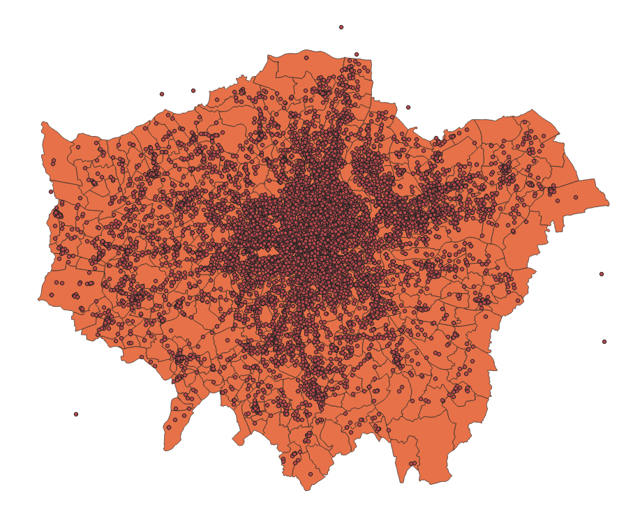

# Cartography and Visualisation

This week’s lecture has given you an in-depth introduction into how we can create a successful map, including understanding map projections, cartographic conventions and issues faced with the analysis of aggregated data at areal units. The practical component of the week puts some of these learnings into practice as we analyse crime rates within London at two different scales.

<!-- ## Lecture slides {#slides-w03} -->
<!-- The slides for this week's lecture can be downloaded here: [[Link]](https://github.com/jtvandijk/GEOG0030/tree/master/data/ppt/w02_geo.pdf). -->

## Reading list {#reading-w03}
#### Essential readings {-}
- Longley, P. *et al.* 2015. Geographic Information Science & Systems, **Chapter 4**: *Georeferencing*. [[Link]](https://ucl.rl.talis.com/link?url=https%3A%2F%2Fapp.knovel.com%2Fhotlink%2Ftoc%2Fid%3AkpGISSE001%2Fgeographic-information-science%3Fkpromoter%3Dmarc&sig=e437927b963cc591dcb65491eccdd3869cc31aef80e1443cb2ba12d8f3bb031a)
- Longley, P. *et al.* 2015. Geographic Information Science & Systems, **Chapter 11**: *Cartography and Map Production*. [[Link]](https://ucl.rl.talis.com/link?url=https%3A%2F%2Fapp.knovel.com%2Fhotlink%2Ftoc%2Fid%3AkpGISSE001%2Fgeographic-information-science%3Fkpromoter%3Dmarc&sig=e437927b963cc591dcb65491eccdd3869cc31aef80e1443cb2ba12d8f3bb031a)
- Wong, D. 2009. Modifiable Areal Unit Problem. *International Encyclopedia of Human Geography* 169-174. [[Link]](https://doi.org/10.1016/B978-008044910-4.00475-2)

#### Suggested readings {-}
- Longley, P. *et al.* 2015. Geographic Information Science & systems, **Chapter 12**: *Geovisualization*. [[Link]](https://ucl.rl.talis.com/link?url=https%3A%2F%2Fapp.knovel.com%2Fhotlink%2Ftoc%2Fid%3AkpGISSE001%2Fgeographic-information-science%3Fkpromoter%3Dmarc&sig=e437927b963cc591dcb65491eccdd3869cc31aef80e1443cb2ba12d8f3bb031a)
- Usery, L. and Seong, J. 2001. All equal-area map projections are created equal, but some are more equal than others. *Cartography and Geographic Information Science* 28(3): 183-194. [[Link]](https://doi.org/10.1559/152304001782153053)

## Crime in London I
Over the next few weeks, we will look to model driving factors behind crime across London from both a statistical and spatial perspective. As [Reid *et al.* (2018)](https://www.oxfordbibliographies.com/view/document/obo-9780195396607/obo-9780195396607-0123.xml) argue:

> Spatial analysis can be employed in both an exploratory and well as a more confirmatory manner with the primary purpose of identifying how certain community or ecological factors (such as population characteristics or the built environment) influence the spatial patterns of crime. 

Against this background, we are actually going to answer a very simple question today: does our perception of crime (and its distribution) in London vary at different scales? Here we are looking to test whether we would make the **ecological fallacy** mistake of assuming patterns at the Ward level are the same at the Borough level by looking to directly account for the impact of the Modifiable Area Unit Problem within our results. To test this, we will use these two administrative geographies to aggregate crime data for London in 2020. Here we will be looking specifically at a specific type of crime: *Theft from a person*.

### Finding our datasets {#w03-finding} 
As we saw last week, accessing data within the UK, and specifically for London, is relatively straight-forward - you simply need to know which data portal contains the dataset you want!    

:::note
**Note**<br/>
The datasets you will create in this practical will be used in other practicals, so make sure to follow every step and export your data into your `output` folder at the end. The practical will also introduce you to point-in-polygon counts. You will be using this type of analysis throughout this module, so it is incredibly important that you understand how they work – even as seemingly simple as they may be!
:::

#### Crime data 
For our crime data, we will use data directly from the **Police Data Portal**, which you can find at https://data.police.uk/. This Data Portal allows you to access and generate tabular data for crime recorded in the U.K. across different the different Police Forces since 2017. 

In total, there are 45 territorial police forces (TPF) and 3 special police forces (SPF) of the United Kingdom. Each TPF covers a specific area in the UK (e.g. the "West Midlands Police Force"), whilst the SPFs are cross-jurisdiction and cover specific types of crime, such as the British Transport Police. Therefore, when we want to download data for a specific area, we need to know which Police Force covers our area interest.

When you look to download crime data for London, for example, there are **two** territorial police forces working within the city and its greater metropolitan area: 

1) **The Metropolitan Police Force (The Met)**, which covers nearly the entire London area, including Greater London

2) **The City of London (CoL) Police**, which covers the City of London. The Met has no jurisdiction in the CoL.

You therefore need to decide if you want to include an analysis of crime in the City of London or not - we will in our current study.

#### Population data 
We know that if we want to study a phenomena like crime and aggregate it to an areal unit, we will need to normalise this by our population. Luckily, we already sorted out our Ward population dataset last week (i.e. `ward_population_2019.shp`). In addition to our **Ward** level dataset, we also want to generate the same type of shapefile for our London **Boroughs**, i.e. a `borough_population_2019.shp`, utilising the same approach as last week, joining our population table data to our Borough shape data. To do this, we need to know where to get both our required datasets from - fortunately, you  already have a Borough shapefile in your `raw/boundaries/2011` folder. Therefore, it is just a case of tracking down the same Mid-Year Estimates (MYE) for London Boroughs as we did for the Wards. 

:::note
**Note** <br/>
Because the boundaries of the London Boroughs have not been changed since 1965, we can get away with using the 2011 `shapefile` instead of having to download a more up to date version. 
:::

### Downloading data {#w03-downloading}
As outlined above, to get going with our analysis, we need to download both the **population** data for our Boroughs and the 2020 **crime** data for our two police forces in London. 

Let us tackle the population data first.

#### Borough population
Through a quick search, we can find our Borough population table data pretty much in the same place as our Ward data - however it is a separate spreadsheet to download.

1. Navigate to the data on the website of the Office for National Statistics: [[Link]](https://www.ons.gov.uk/peoplepopulationandcommunity/populationandmigration/populationestimates/datasets/populationestimatesforukenglandandwalesscotlandandnorthernireland).

2. Download the **Mid-2019: April 2020 local authority district codes** `.xls` file.

3. Open the dataset in your spreadsheet editing software and navigate to the `MYE2-Persons` tab. Now extract: `Code`, `Name`, `Geography` and `All ages` data for all London Boroughs.
You should have a total of **33** Boroughs.

4. Once you have your 33 Boroughs separated from the rest of the data, copy the columns (`Code`, `Name`, `Geography` and `All ages`) and respective data for each Borough into a new `csv`.

5. Remember to format the **field names**. Like last week, also remember to make sure that the `All ages` field is recognised as a **numeric** field. Save as a new `csv` in your `output` folder: `borough_population_2019.csv`.

#### Ward population
As mentioned above, you should already have a `ward_population_2019.shp` file within your `output` data folder. 

#### Crime data
Normally, we would now head to the Police Data Portal and download our crime data. However, the manual processing that is required is too exhaustive to do manually - and far (far!) easier to do using programming. As such you can download a pre-filtered spreadsheet instead. Unzip the download and copy the `csv` into a **new** folder in your `raw` data folder called: `crime`.

#### File download {-}
| File                                                 | Type           | Link |
| :------                                              | :------        | :------ |
| Theft from persons in 2020                           | `csv`    | [Download](https://github.com/jtvandijk/GEOG0030/tree/master/data/zip/crime_theft_2020_london.zip) |

:::note
**Note** <br/>
When mapping the data from the provided longitude and latitude coordinates, it is important to know that these locations represent the approximate location of a crime — not the exact place that it happened. This displacement occurs to preserve anonymity of the individuals involved. The process by how this displacement occurs is standardised. There is a list of anonymous map points to which the exact location of each crime is compared against this master list to find the nearest map point. The co-ordinates of the actual crime are then replaced with the co-ordinates of the map point. Each map point is specifically chosen to avoid associating that point with an exact household. Interestingly enough, the police also convert the data from their recorded BNG eastings and northings into WGS84 latitude and longitude.
:::

### Using QGIS to map our crime data 

#### Setting up a project
1. Start **QGIS**

2. Click on **Project** -> **New**. Save your project as `w3-crime-analysis`. Remember to save your work throughout the practical. 

3. Before we get started with adding data, we will first set the Coordinate Reference System of our Project. Click on **Project** -> **Properties -- CRS**. In the Filter box, type **British National Grid**. Select **OSGB 1936 / British National Grid - EPSG:27700** and click **Apply**. Click **OK**.

Now we have our **Project CRS** set, we are ready to start loading and processing our data.

#### Adding layers
1. Click on **Layer** -> **Add Layer** -> **Add Vector Layer**.

2. With **File** select as your source type, click on the small three dots button and navigate to your `ward_population_2019.shp` in your `output` folder. Click on the `.shp` file of this dataset and click **Open**. Then click **Add**. You may need to close the box after adding the layer.

We now need to create our Borough population shapefile - and to do so, we need to repeat exactly the same process as last week in terms of joining our table data to our shapefile. You should now be able to do this, so we will not provide you with detailed instructions. Remember, you need to:

* Load the respective Borough dataset as a Vector Layer found in your `raw/boundaries/2011` data folder: `London_Borough_Excluding_MHW.shp`.

* Load the respective population dataset that you just created as a **Delimited Text File Layer**. Remember the settings, including no geometry!

* Join the two datasets together using the **Join** tool in the Borough dataset **Properties** box. Remember which fields to use, which to add, and to remove the prefix.

* Export your joined dataset into a new dataset within your `output` folder: `borough_population_2019.shp`.

* Make sure this dataset is loaded into your **Layers** / Added to the map.

* Remove the original Borough and population data layers.

Once this is done, we are ready to load and map our crime data. We will load this data using the **Delimited Text File Layer** option you would have used just now to load the Borough population - but this time, we will be adding point coordinates to map our crime data as points.

1. Click on **Layer** -> **Add Layer** -> **Add Delimited Text File Layer**.

2. With **File** select as your source type, click on the small three dots button and navigate to your `crime_theft_2020.csv` in your `raw/crime` folder. Click on the `.csv` file of this dataset and click **Open**. In **Record and Fields Options** tick `Decimal separator is comma`, `First record has field names`, `Detect field types` and `Discard empty fields`. Under **Geometry Definition**, select `Point coordinates` and set the **X field** to `Longitude` and the **Y field** to `Latitude`. The **Geometry CRS** should be: `EPSG:4326 - WGS84`. Click **Add**.

:::note
**Note**<br/>
You may be wondering whether we are not using the incorrect CRS for our data. As you click **Add**, you should have gotten a a pop-up from QGIS asking about transformations - they are the mathematical algorithms that convert data from one CRS to another. And this is exactly what QGIS is trying to do. QGIS knows that the **Project CRS** is **BNG** but the **Layer** you are trying to add has a **WGS84** CRS. QGIS is asking you what transformation it should use to project the Layer in the Project CRS. This is because one key strength of QGIS is that it can project data **"on the fly"**. What this means is that QGIS will automatically convert all Layers to the Project CRS once it knows which transformation you would like to use so that they will all be rendered in the correct position with respect to each other. However, you must note that this transformation is only **temporary in nature** and as a result, it is not a full **reprojection** of our data. More details on this can be found in QGIS' [user manual section on working with projections](https://docs.qgis.org/3.22/en/docs/user_manual/working_with_projections/working_with_projections.html).
:::

3. For now, let us use the on-the-fly projection and accept QGIS' default value by clicking **OK**. This transformation should be built-in to your QGIS transformation library, whereas some of the more accurate options would need installation.

You should now see your crime dataset displayed on the map.

```{r 03-borough-crime, echo=FALSE, fig.align='center', out.width="90%", fig.cap='Borough map with crime data.'}

```

We can test the 'temporary' nature of the projection by looking at the CRS of the `crime_theft_2020` layer:

4. Right-click on the `crime_theft_2020` layer then select **Properties** -> **Information** and then look at the associated CRS. You should see that the CRS of the layer is still `WGS84`. 
    
We want to make sure our analysis is as accurate and efficient as possible, so it is best to reproject our data into the **same CRS** as our administrative datasets, i.e. British National Grid. This also means we will have the dataset to use in other projects, just in case.

5. Back in the main QGIS window, click on **Vector** -> **Data Management Tools** -> **Reproject Layer**. Fill in the parameters as follows:
    + **Input Layer:** `crime_theft_2020`
    + **Target CRS:** `Project CRS: EPSG: 27700`
    + **Reprojected:** Click on the three buttons and **Save to File** to create a new data file.
    + **Save** it in your `output` folder as `crime_theft_2020_BNG.shp`
    + Click **Run** and then close the tool box.
  
You should now see the new data layer added to your Layers.

:::note
**Note** <br />
QGIS can at times be a little bit buggy so when it creates new data layers in your Layers box, it often automates the name, hence you might see your layer added as `Reprojected`. It does this with other management and analysis tools as well, so something to be aware of.
:::

Before moving on, let us do some housekeeping.

6. Remove the original `crime_theft_2020` dataset, only keeping the reprojected version.

7. Rename the `Reprojected` dataset to `crime_theft_2020`.

Now we have an organised Layers and project, we are ready to start our crime analysis.

#### Counting points-in-polygons 
The next step of our analysis is incredibly simple - as QGIS has an in-built tool for us to use. We will use the `Count Points in Polygons` in the `Analysis` toolset for `Vector` data to count how many crimes have occured in both our **Wards** and our **Boroughs**. We will then have our count statistic which we will need to normalise by our population data to create our **crime rate** final statistic.

Let's get going and first start with calculating the crime rate for the Borough scale:

1. Click on **Vector** -> **Analysis Tools** -> **Count Points in Polygons**.

2. Within the toolbox, select the parameters as follows:
    + **Polygons:** `borough_population_2019`
    + **Points:** `crime_theft_2020` *(Note how both our data layers state the same CRS!)*
    + No weight field or class field
    + **Count field names:** `crimecount`
    + Click on the three dot button and **Save to file:** `output` -> `borough_crime_2020.shp`
    
3. Click **Run** and **Close** the box. You should now see a `Count` layer added to your Layers box. 

4. Click the checkbox next to `crime_theft_2020` to hide the crime points layer for now.

5. Right-click on the `borough_crime_2020` layer and open the **Attribute Table**. You should now see a `crimecount` column next to your `pop2019` column. You can look through the column to see the different levels of crime in the each Borough. You can also sort the column, from small to big, big to small, like you would do in a spreadsheet software.

Whilst it is great that we have ve got our `crimecount`, as we know, what we actually need is a **crime rate** to account for the different population sizes accross the Boroughs. To get our **crime rate** statistic, we are going to do our first bit of table manipulation in QGIS.
     
6. With the **Attribute Table** of your `Count` layer still open, click on the **pencil** icon at the top left corner. This pencil switches on the **Editing** mode. 

The Editing mode allows you to edit both the **Attribute Table** values and the **geometry** of your data. When it comes to the **Attribute Table**, it means you can directly edit existing values in the table **or** create and add new fields to the table. Whilst you can actually do the latter outside of the Editing mode, this Editing mode means you can reverse any edits you make and they are not permanent just in case you make a mistake.
Using the Editing mode is the safest approach to editing your table, however, it might not always be the approach you use when generating new fields.
  
Let us go ahead and add a new field to contain our **Crime Rate**.   

7. Whilst in the Editing mode, click on **New Field** button (or Ctrl+W/CMD+W) and fill in the **Field Parameters** as follows:
    + **Name:** `crime_rate`
    + **Comment:** *leave blank*
    + **Type:** Decimal number
    + **Length:** 10
    + **Precision:** 0
  
8. Click **OK**,

You should now see a new field added to our **Attribute Table**.

:::note
**Note** <br/>
Understanding how to add new fields and their parameters rely on you understanding the different data types we covered last week - and thinking through what sort of data type your field needs to contain. In our case, we will store our data as a decimal to enable our final calculation to produce a decimal (an integer/integer is likely to produce a decimal) but we will set the precision to **0** to have zero places after our decimal place when the data is used. That is because ultimately, we want our crime rate represented as an integer because, realistically, you cannot have half a crime. Calculating a decimal however will allow us to round-up within our calculations.
:::

The empty field has *NULL* populated for each row - so we need to find a way to give our Boroughs some crime rate data. To do this, we will calculate a simple **Crime Rate** using the **Field Calculator** tool provided by QGIS within the **Attribute Table**. We will create a crime rate that details the number of crimes per 10,000 people in the Borough. In most cases, a crime rate per person will create a decimal result less than 1 which not only will not be stored correctly by our `crime_rate` field but, for many people, a **decimal** value is hard to interpret and understand.

9. Whilst still in the Editing mode, click on the **Abacus** button (Ctrl + I / Cmd + I), which is known as the **Field Calculator**. A new pop-up should load up.

10. In the Field Calculator pop-up:
    + Check the **Update existing field** box.
    + Use the drop-down to select the `crime_rate`field.
    + In the Expression editor, add the following expression: **( "crimecount" / "pop2019" ) \* 10000**
    + You can type this in manually or use the `Fields and Values` selector in the box in the middle to add the fields into the editor.
    + Once done, click **OK**.
    
You should then return to the **Attribute Table** and see our newly populated `crime_rate` field - at the moment, we can see the resulting calculations stored as decimals.
  
11. Click on the **Save** button to save these edits. Click again on the **Pencil** button to exit Editing mode - you should see the numbers turn to integers.

:::note
**Note** <br />
On some computers and installations the numbers do not get changed to an `integer`, but remain a `double`. If this happens, create a new field directly in the Field Calculator. instead of ticking the **Update existing field** box you keep the **Create a new field** box ticked. Name the new field `crime_rate_int`, make sure the **Output field type** is set to `Whole number (integer)`, and use the same expression as above to get the crime rate in a new column.
:::

12. Rename your Borough crime rate layer to `Borough Crime Rate`.

13. Great! We now have our Borough crime rate dataset ready for mapping and analysis - we just now need to repeat this process to have our Ward dataset. So: repeat the above processes to create a `crime_rate` column within our Ward dataset ready for mapping and analysis.

#### Mapping our crime data
Now you have both datasets ready, it is time to style the maps. Remember to use the **Properties** box to first symbolise your maps. Think through using the appropriate colour scheme - and perhaps [have a look online for some examples](https://colorbrewer2.org/#type=sequential&scheme=BuGn&n=3) if you do not want to use the defaults. Once you are happy with their symbolisation, we will turn them into proper publishable maps using QGIS's **Print Layout**. If you have ever used ArcMap, this is similar to switch the view of your map canvas to a print layout within the main window - but in QGIS's case, it loads up a new window.

1. From the main QGIS window, click on **Project** -> **New Print Layout**. In the small box that first appears, call your new print layout: `crime_map_borough_ward`.

A new window should appear.

Initially, when opening the print layout provides you with a blank canvas that represents the paper surface when using the print option.

On the **left-hand** side of the window, you will find buttons beside the canvas to add print layout items: the current QGIS map canvas, text labels, images, legends, scale bars, basic shapes, arrows, attribute tables and HTML frames. In this toolbar you also find buttons to navigate, zoom in on an area and pan the view on the layout a well as buttons to select any layout item and to move the contents of the map item.

On the **right-hand** side of the window, you will find two set of panels. The upper one holds the panels Items and Undo History and the lower holds the panels Layout, Item properties and Atlas generation. For our practical today, we're most interested in the bottom panel as **Layout** will control the overall look of our map, whilst **Item properties** will allow us to customise the elements, such as Title or Legend, that we may add to our map.

In the **bottom part** of the window, you can find a status bar with mouse position, current page number, a combo box to set the zoom level and the number of selected items if applicable.

In the **upper part** of the  window, you can find menus and other toolbars. All print layout tools are available in menus and as icons in a toolbar.

:::note
**Note** <br/>
Working with maps in the Print Layout is simple but it can be a little fiddly and, to make more complicated maps, requires you to understand how to use certain aspects of Print Layout, such as locking items. If you get stuck, have a look at the [training manual](https://docs.qgis.org/3.22/en/docs/training_manual/map_composer/map_composer.html) or the detailed [documentation](https://docs.qgis.org/3.22/en/docs/user_manual/print_composer/index.html). 
:::

To start with creating a map, you use the **Add Map** tool to draw a box in which a snapshot of the **current active** map you have displayed in your QGIS main window will be loaded.

1. Click on the **Add Map** tool and draw a box in the first half of our map to load our current map. Note, you can move your map around and resize the box simply by clicking on it as you would in Word etc.

```{r 03-map-print-layout, echo=FALSE, fig.align='center', out.width="90%", fig.cap='Current active map in the **Print Layout**.'}
knitr::include_graphics('images/w03/map_layout.png')
```
    
As you can see, the map currently does not look that great - we could really do with zooming in, as we do not need all of the white space. 

2. With your map selected, head to the **Items Properties** panel and look for the **Scale** parameter. 
    + Here we can manually edit the **scale** of our map to find the right zoom level.
    + Have a go at entering different values and see what level you think suits the size of your map.
    + Keep a note of the scale, as we will need this for the second map we will add to our map layout - our Borough map.
    + Next, in the same panel, if you would like, you can add a frame to your map - this will draw a box (of your selected formatting) around the current map.
    + In the same panel, note down the size of your map - we want to make sure the next map we add is of the same size.
    + Note, if you need to move the position of the map within the box, look for the **Move Item Content** tool on the left-hand side toolbar.
    + Once you are done, finally click on the **Lock Layers** and **Lock Style for layers.**
    
By locking the Layers (and their symbology) in our map, it means we can change our data/map in our main QGIS window without changing the map in the Print Layout - as we will see in a minute when adding our Borough crime rate map. If we do not lock our layers, our map would automatically update to whatever is next displayed in the main QGIS window.

Now we have added our first map to our Map Layout, we want to add a **Legend** for this specific map.

3. Click on the **Add Legend** tool and again, draw a box on your map in which your legend will appear.
    + As you will see, your Legend auto-generates an entry for every layer in our Layers box in the main QGIS application:
```{r 03-map-legend, echo=FALSE, fig.align='center', fig.caption='The automatically generated legend for your map.'}
knitr::include_graphics('images/w03/autolegend.png')
```
    + In **Item Properties**, uncheck **auto-update** - this stops QGIS automatically populating your legend and enables you to customise your legend.
    + First, let us rename our Layer in the legend to: **Ward Crime Rate (per 10,000 people)**.
    + Next, we want to remove all other Layers, using the **-** button
    + We can also customise the Legend further, including type, size and alignment of font - go ahead and style your legend as you would prefer.
    + Move the Legend to an appropriate part of the layout near your Ward crime rate map - resize if necessary.
    
Now we are finished with the Ward map, we want to make sure we do not change any aspect of its layout. To do so, we need to lock both the Map and Legend in the **Items** panel - this prevents us accidentally moving items in our layout. Note, this is different to locking your layers in the **Items Properties** as we did earlier.

4. In the **Items** panel, click the **Lock** check box for both our map and legend.

Once locked, we can now start to add our Borough map.

5. In the main QGIS window, uncheck your `Ward Crime Rate` layer and make sure your `Borough Crime Rate` layer is now visible.

Return to the **Print Layout** window.

6. Repeat the process above of adding a map to the window - this time, you should now see your Borough map loaded in the box (and you should see **no** changes to your Ward map).
    + Place your Borough map next to your Ward map - use the snap grids to help.
    + Set your **Borough** map to the **same zoom level** as your **Ward** map.
    + Make sure your **Borough map** is the **same size** as your **Ward** map.
    + Set your Borough map to the **same extent** as  your **Ward** map (extra neatness!).
    + Add a frame if you want.
    + Lock your layer and its symbology in the **Items Properties** once ready and the lock your layer in the **Items** panel.
    
We now just need to add a second legend for our Borough map. If we had standardised our values across our two maps, then we would only need to use one legend. However, in this case, as there is a difference in the values, we need to have two legends. 

7. Repeat the process as above to add a Legend for our Borough map.
    + Remember to re-title the Legend to make it more legible/informative.
    + Match the same formatting for a clean look.

8. Once complete, **lock these two items** in the **Items** panel as well.

Now we have our two maps ready, we can add our **main map elements**:

* **Title**
* **Orientation**
* **Data Source**

We will not at this time add anything else - an inset map could be nice, but this requires additional data that we do not have at the moment. Any other map elements would also probably make our design look too busy.

9. Using the tools on the left-hand tool bar: 
    + Add a **scale bar**: use the **Item Properties** to adjust the **Style**, **number of segments**, **font**, etc.
    + Add a **north arrow**: draw a box to generate the arrow and then use the **Item Properties** to adjust..
    + Add a **title** at the top of the page, and subtitles above the individual maps.
    + Finally add a box detailing our data sources, you can copy and paste the following:
`Contains National Statistics data © Crown copyright and database right [2015] (Open Government Licence). Contains Ordnance Survey data © Crown copyright and database right [2015]. Crime data obtained from data.police.uk (Open Government Licence).`
  
Once you have added these properties in, you should have something that looks a little like this:  

```{r 03-finale-map, echo=FALSE, fig.align='center', fig.cap='Crime rates in London boroughs and Wards. Note that the numbers in the legend may differ from the numbers in your own legend.'}
knitr::include_graphics('images/w03/london_crime_rate.png') 
```

The only thing outstanding is to export our map to a file. Go to **Layout** -> **Export as Image** and then save it in your maps folder as `London_2020_Crime-Rate.png`. 

## Assignment {#assignment-w03}
1. Looking at the maps you have created, how does your perception of crime (and its distribution) in London vary at different scales?

At the moment, we have looked at the crime rate as an amount, therefore we use a sequential colour scheme that shows, predominantly, where the crime rate is the highest. As an alternative, we could use a diverging colour scheme that could show us where the crime rate is lower and/or higher than a critical mid-point, such as the average crime rate across the Wards or Borough. 

2. Create a map of crime in London, at both the Borough and Ward level, that shows for each administrative geography the percentage difference from the overall mean crime rate.

:::note
**Tips** <br/>

- You will need to start by calculating the average crime rate for both datasets and subsequently calculate the difference from these values for each geography.
- All calculations can be done using the field calculator in QGIS, but will require some thinking about the right expression.
:::

## Before you leave {#byl-w03}
[That is us all done](https://www.youtube.com/watch?v=3wxyN3z9PL4). Remember to save your project and export your Ward and Borough shapefiles to your `output` folder!
