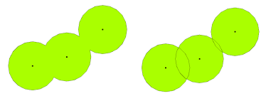

# (PART\*) Core Spatial Analysis {-}

# Analysing Spatial Patterns I: Geometric Operations and Spatial Queries
This week, we will be looking at the use of geometric operations and spatial queries within spatial data processing and analysis. Geometric operations and spatial queries are not really a theoretical topic per se but rather essential building blocks to overall spatial data processing and analysis such as calculating the area covered by an individual polygon in an areal unit dataset to running **buffer** and **point-in-polygon** calculations.

<!-- ## Lecture slides {#slides-w06} -->
<!-- The slides for this week's lecture can be downloaded here: [[Link]](https://github.com/jtvandijk/GEOG0030/tree/master/data/ppt/w06_geo.pdf). -->

## Reading list {#reading-w06}
#### Essential readings {-}
- Lovelace, R., Nowosad, J. and Muenchow, J. 2021. Geocomputation with R, **Chapter 4**: *Spatial data operations*. [[Link]](https://geocompr.robinlovelace.net/spatial-operations.html)
- Lovelace, R., Nowosad, J. and Muenchow, J. 2021. Geocomputation with R, **Chapter 5**: *Geometry operations*. [[Link]](https://geocompr.robinlovelace.net/geometry-operations.html)
- Lovelace, R., Nowosad, J. and Muenchow, J. 2021. Geocomputation with R, **Chapter 6**: *Reprojecting geographic data*. [[Link]](https://geocompr.robinlovelace.net/reproj-geo-data.html)

#### Suggested readings {-}
- Houlden, V. *et al.* 2019. A spatial analysis of proximate greenspace and mental wellbeing in London. *Applied Geography* 109: 102036. [[Link]](https://doi.org/10.1016/j.apgeog.2019.102036)
- Malleson, N. and Andresen, M. 2016. Exploring the impact of ambient population measures on London crime hotspots. *Journal of Criminal Justice* 46: 52-63. [[Link]](https://doi.org/10.1016/j.jcrimjus.2016.03.002)
- Oliver, L., Schuurman, N. and Wall, A. 2007. Comparing circular and network buffers to examine the influence of land use on walking for leisure and errands. *International Journal of Health Geographics* 6: 41. [[Link]](https://doi.org/10.1186/1476-072X-6-41)

## Bike theft in London {#bike-theft-w06}
This week, we will be investigating bike theft in London in 2019 and look to confirm a very simple hypothesis: *that bike theft primarily occurs near tube and train stations.* We will be investigating its distribution across London using the point data provided within our crime dataset. We will then compare this distribution to the location of train and tube stations using specific geometric operations and spatial queries that can compare the geometry of two (or more) datasets. We will also learn how to download data from OpenStreetMap as well as use an interactive version of `tmap` to explore the distribution of the locations of individual bike theft against the locations of these stations.

### Housekeeping {#housekeeping-w06}
Open a new script within your GEOG0030 project and save this script as `wk6-bike-theft-analysis.r`. At the top of your script, add the following metadata (substitute accordingly):

```{r 06-scr-title, warnings=FALSE, message=FALSE, cache=TRUE}
# Analysing bike theft and its relation to stations using geometric analysis
# Date: January 2023
# Author: Justin 
```

Within your script, add the following libraries for loading:
```{r 06-scr-libs-all, warnings=FALSE, message=FALSE, tidy=TRUE}
# libraries
library(tidyverse)
library(sf)
library(tmap)
library(janitor)
library(RColorBrewer)
library(osmdata)
```

```{r 06-set-tmap-setting, warnings=FALSE, message=FALSE, cache=FALSE, tidy=TRUE}
# change tmap mode to plot
tmap_mode("plot")
```

### Loading data {#loading-data-w06}
This week, we will start off using three datasets:

- London Ward boundaries for 2018
- Crime in London for 2019 from [data.police.uk](https://data.police.uk/)
- Train and tube Stations from [Transport for London](https://tfl.gov.uk/)

#### File download {-}
| File                                                 | Type           | Link |
| :------                                              | :------        | :------ |
| Crime in London 2019                                 | `csv`        | [Download](https://github.com/jtvandijk/GEOG0030/tree/master/data/zip/crime_all_2019_london.zip) |
| Train and tube stations in London                    | `kml`        | [Download](https://github.com/jtvandijk/GEOG0030/tree/master/data/zip/tfl_stations.zip) |

Download the files above. Store your `crime_all_2019_london.csv` in your `data/raw/crime` folder. Move your `tfl_stations.kml` download to your `raw` data folder and create a new `transport` folder to contain it. The London Ward boundaries for 2019 should still be in your `data/raw/boundaries` folder.

Let's first load our London Ward shapefile:

```{r 06-load-shp, warnings=FALSE, message=FALSE, cache=TRUE, tidy=TRUE}
# read in our 2018 London Ward boundaries
london_ward_shp <- read_sf("data/raw/boundaries/2018/London_Ward.shp")
``` 

Check the **CRS** of our `london_ward_shp` spatial dataframe:

```{r 06-ward-crs, warnings=FALSE, message=FALSE, cache=TRUE, tidy=TRUE}
# check the CRS for the 2018 London Ward boundaries
st_crs(london_ward_shp)
``` 

Of course it should be of no surprise that our `london_ward_shp` spatial dataframe is in **BNG / ESPG: 27700**, however, it is always good to check. Let's go ahead and read in our `tfl_stations` dataset:

```{r 06-load-stations, warnings=FALSE, message=FALSE, cache=TRUE, tidy=TRUE}
# read in our London stations dataset
london_stations <- read_sf("data/raw/transport/tfl_stations.kml")
``` 

This dataset is provided as a `kml` file, which stands for **Keyhole Markup Language (KML)**.  KML was originally created as a file format used to display geographic data in Google Earth. So we definitely need to check what CRS this dataset is in and decide whether we will need to do some reprojecting.

```{r 06-kml-crs, warnings=FALSE, message=FALSE, cache=TRUE, tidy=TRUE}
# check the CRS for the London stations
st_crs(london_stations)
```

The result informs us that we are going to need to reproject our data in order to use this dataframe with our `london_ward_shp` spatial dataframe. Luckily in **R** and the `sf` library, this reprojection is a relatively straight-forward transformation, requiring only one function: `st_transform()`. The function is very simple to use: you only need to provide the function with the dataset and the code for the new CRS you wish to use with the data:

```{r 06-kml-crs-transform, warnings=FALSE, message=FALSE, cache=TRUE, tidy=TRUE}
# reproject our data from WGS84 to BNG
london_stations <- st_transform(london_stations, 27700)
``` 

We can double-check whether our new variable is in the correct CRS by using the `st_crs()` command:

```{r 06-kml-crs-2, warnings=FALSE, message=FALSE, cache=TRUE, tidy=TRUE}
# check the CRS for the London stations
st_crs(london_stations)
``` 

You should see that our `london_stations` spatial dataframe is now in **BNG / EPSG: 27700**. We are now ready to load our final dataset - our `csv` that contains our crime from 2019.

From this `csv`, we want to do three things:

1. Extract only those crimes that are bicycle thefts, i.e. `crime_type == "bicycle theft"`.
2. Convert our `csv` into a spatial dataframe that shows the locations of our crimes, determined by the latitude and longitudes provided, as points.
3. Transform our data from **WGS84 / 4326** to **BNG / 27700**.

Since we are getting pretty used to looking at code and cleaning data we should be able to chain these operations using the `%>%` operator:

```{r 06-bike-theft, warnings=FALSE, message=FALSE, cache=TRUE}
# read in our crime data csv from our raw data folder
bike_theft_2019 <- read_csv("data/raw/crime/crime_all_2019_london.csv") %>% 
  # clean names with janitor
  clean_names() %>%
  # filter according to crime type and ensure we have no NAs in our dataset
  filter(crime_type == "Bicycle theft" & !is.na(longitude) & !is.na(latitude)) %>% 
  # select just the longitude and latitude columns
  dplyr::select(longitude, latitude) %>%
  # transform into a point spatial dataframe
  # note providing the columns as the coordinates to use
  # plus the CRS, which as our columns are long/lat is WGS84/4236
  st_as_sf(coords = c("longitude", "latitude"), crs = 4236) %>% 
  # convert into BNG
  st_transform(27700)
``` 
We now have our three datasets loaded, it is time for a little data checking. We can see just from our **Environment** window that in total, we have **302** stations and **18,744** crimes to look at in our analysis. We can double-check the (Attribute) tables of our newly created spatial dataframes to see what data we have to work with. 

You can either do this manually by clicking on the variable, or using commands such as `head()`, `summary()` and `names()` to get an understanding of our dataframe structures and the field names present.You can choose your approach, but make sure to look at your data.

As you should remember from the code above, for our bicycle theft data, we actually only have our geometry column because this is all that we extracted from our crime `csv`. For our `london_stations` spatial dataframe, we have a little more information, including the name of the station and its address - as well as its geometry.

Now, let's map all three layers of data onto a single map using `tmap`:

```{r 06-map-all-data, warnings=FALSE, message=FALSE, cache=TRUE, tidy='styler'}
# plot our London Wards first
tm_shape(london_ward_shp) + tm_fill() + 
  # then add bike crime as blue
  tm_shape(bike_theft_2019) + tm_dots(col = "blue") + 
  # then add our stations as red
  tm_shape(london_stations) + tm_dots(col = "red") + 
  # then add a north arrow
  tm_compass(type = "arrow", position = c("right", "bottom")) + 
  # then add a scale bar
  tm_scale_bar(breaks = c(0, 5, 10, 15, 20), position = c("left", "bottom"))
```

Let's think about the distribution of our data: we can already see that our bike theft is obviously highly concentrated in the centre of London although we can certainly see some clusters in the Greater London areas. Let's go ahead and temporally remove the bike theft data from our map for now to see where our tube and train stations are located.

To remove the bike data, simply put a comment sign in front of that piece of code and re-run the code:

```{r 06-map-all-data-no-bike, warnings=FALSE, message=FALSE, cache=TRUE, tidy='styler'}
# plot our London Wards first
tm_shape(london_ward_shp) + tm_fill() + 
  # then add bike crime as blue
  # tm_shape(bike_theft_2019) + tm_dots(col="blue") + 
  # then add our stations as red
  tm_shape(london_stations) + tm_dots(col = "red") + 
  # then add a north arrow
  tm_compass(type = "arrow", position = c("right", "bottom")) + 
  # then add a scale bar
  tm_scale_bar(breaks = c(0, 5, 10, 15, 20), position = c("left", "bottom"))
```

We can see our train and tube stations are only present in primarily the north of London and not really present in the south. This is not quite right and in fact our dataset only contains those train stations used by Transport for London within the tube network rather than all the stations in London. We will need to fix this before conducting our full analysis. But this isn't the only problem with our dataset. We can also see that both our `bike_theft` spatial dataframe and our `london_stations` spatial dataframe extend beyond our London boundaries.

### Data preparation {#data-preparation-w06}
When we want to reduce a dataset to the spatial extent of another, there are two different approaches to conducting this in spatial analysis: a subset or a clip. Each deal with the geometry of the resulting dataset in slightly different ways.

A *clip-type operation* works a bit like a cookie-cutter: it will take the geometry of the input layer (i.e. the layer you want to clip), places a 'cookie-cutter' layer on top (i.e. the layer you want to clip by) and then returns only the parts of the input layer contained within the cookie-cutter. This will mean that the geometry of our resulting layer will be modified, if it contains observation features that extend further than the ;cookie-cutter' extent it will literally 'cut' the geometry of our data.

A subset-type operation is what is known in GIScience-speak as a *select by location query*. In this case, our subset will return the full geometry of each observation feature of the input layer that intersects with our second layer. Any geometry that does not intersect with our second layer will be removed from the geometry of our resulting layer.

:::note
**Note** <br/>
Luckily for us, as we are using point data, we can (theoretically) use either approach because it is not possible to split the geometry of a single point feature. When it comes to polygon and line data, not understanding the differences between the two approaches can lead you into difficulties with your data processing as there will be differences in the feature geometry between the clipped layer and the subset layer.
:::

Each approach is implemented differently in R. To **subset** our data, we only need to use the `base` R library to selection using `[]` brackets:

```{r 06-subset-ldn-bt, warnings=FALSE, message=FALSE, cache=TRUE, tidy=TRUE}
# subset our bike_theft_2019 spatial dataframe by the london_ward_shp spatial dataframe
bike_theft_2019_subset <- bike_theft_2019[london_ward_shp,]
```

Conversely, if we want to **clip** our data, we need to use the `st_intersection()` function from the `sf` library. 

```{r 06-intersect-ldn-bt, warnings=FALSE, message=FALSE, cache=TRUE, tidy=TRUE}
# clip our bike_theft_2019 spatial dataframe by the london_ward_shp spatial dataframe
bike_theft_2019 <- bike_theft_2019 %>% st_intersection(london_ward_shp)
```

:::note
**Note** <br />
Which approach you use with future data is always dependent on the dataset you want to use - and the output you need. For example, is keeping the geometry of your observation features in your dataset important? Out of the two, the **subset** approach is the fastest to use as R is simply comparing the geometries rather than also editing the geometries.
:::

Before we go ahead and sort out our `london_stations` spatial dataframe, we are going to look at how we can **dissolve** our `london_ward_shp` spatial dataframe into a single feature. Reducing a spatial dataframe to a single observation is often required when using R and `sf`'s geometric operations to complete geometric comparisons. Sometimes, also, we simply want to map an outline of an area, such as London, rather than add in the additional spatial complexities of our wards. To achieve just a single 'observation' that represents the **outline geometry** of our dataset, we use the geometric operation `st_union()`. 

:::tip
**Tip** <br/>
You can also use the `st_union()` function to combine two datasets into one. This can be used to **merge** data together that are of the same spatial type.
:::

Let's go ahead and see if we can use this to create our London outline:

```{r 06-union-london, warnings=FALSE, message=FALSE, cache=TRUE, tidy=TRUE}
# use st_union to create a single outline of London from our london_ward_shp spatial dataframe
london_outline <- london_ward_shp %>% st_union()
```

You should see that our `london_outline` spatial data frame only has one observation. You can now go ahead and `plot()` your `london_outline` spatial dataframe from your console and see what it looks like:

```{r 06-plot-london, warnings=FALSE, message=FALSE, cache=TRUE, tidy=TRUE, echo=FALSE}
plot(london_outline)
```

Back to our train and tube stations. We have seen that our current `london_stations` spatial dataframe really does not provide the coverage of train stations in London that we expected. To add in our missing data, we will be using [OpenStreetMap](https://www.openstreetmap.org/#map=6/54.910/-3.432). 

::: note
**Note** <br/>
OpenStreetMap (OSM) is a free editable map of the world,although its spatial coverage is still unequal across the world. In addd
itoin, as you will find if you use the data, the accuracy and quality of the data can often be quite questionable or simply missing attribute details that we would like to have, e.g. types of roads and their speed limits, to complete specific types of spatial analysis. As a result, do not expect OSM to contain every piece of spatial data that you would want.
:::

Whilst there are [various approaches](https://wiki.openstreetmap.org/wiki/Downloading_data) to downloading data from OpenStreetMap, we will use the `osmdata` library to directly extract our required OpenStreetMap (OSM) data into a variable. The `osmdata` library grants access within R to the [Overpass API](https://overpass-turbo.eu) that allows us to run queries on OSM data and then import the data as either `sf` or `sp` objects. These queries are at the heart of these data downloads. 

To use the library (and API), we need to know how to write and run a query, which requires identifying the `key` and `value` that we need within our query to select the correct data. Essentially every map element (whether a point, line or polygon) in OSM is "tagged" with different attribute data. In our case, we are looking for train stations, which fall under the key, `Public Transport`, with a value of `station` as outlined in their [wiki](https://wiki.OpenStreetMap.org/wiki/Key:public_transport). These `keys` and `values` are used in our queries to extract only map elements of that feature type - to find out how a feature is "tagged" in OSM is simply a case of reading through the OSM documentation and [becoming familiar](https://wiki.openstreetmap.org/wiki/Tags) with their `keys` and `values`. 

In addition to this key-value pair, we also need to obtain the **bounding box** of where we want our data to be extracted from, i.e. London, to prevent OSM searching the whole map of the world for our feature (although the API query does have in-built time and spatial coverage limits to stop this from happening).

Let's try to extract elements from OSM that are tagged as `public_transport = station` from OSM into an `osmdata_sf()` object:

```{r 06-osm-export, warnings=FALSE, message=FALSE, cache=TRUE, tidy='styler'}
# extract the coordinates from our London outline using the st_bbox() function
# note we also temporally reproject the london_outline spatial dataframe before obtaining the bbox
# we need our bbox coordinates in WGS84 (not BNG), hence reprojection
p_bbox <- st_bbox(st_transform(london_outline, 4326))

# pass our bounding box coordinates into the OverPassQuery (opq) function
london_stations_osm <- opq(bbox = p_bbox) %>%
  # pipe this into the add_osm_feature data query function to extract our stations
  add_osm_feature(key = "public_transport", value = "station") %>% 
  # pipe this into our osmdata_sf object
  osmdata_sf()
``` 

:::note
**Note** <br/>
In some instances the OSM query will return an error, especially when several people from the same location are executing the exact same query at the same time. If that is the case you can download the `london_stations_osm` object here: [[Download]](https://github.com/jtvandijk/GEOG0030/tree/master/data/zip/london_stations_osm.RData). After downloading, you can copy the file to your working directory and load the object using the `load()` function.
:::

:::tip
**Tip** <br/>
When we download OSM data, and extract it as above, our query will return all elements tagged as our key-value pair into our `osmdata_sf()` OSM data object. This means all elements associated with our tag will be returned: any **points, lines and polygons**. We might think with our `public_transport = station` tag, we would only return point data representing our train and tube stations in London. But if we use the `summary()` function on our `london_stations_osm` OSM data object, we can see that not only is a lot of other data stored in our OSM data object (including the bounding box we used within our query, plus metadata about our query), but our query has returned both **points** and **polygons** stored within this OSM data object as individual spatial data frames. 

To extract only the points of our tube and train stations from our `london_stations_osm` OSM data object, we simply need to extract this from the dataframe and store this under a separate variable. But, whenever you are dealing with OSM data, just remember that your query can return multiple different types of map elements (and their respective geometries), so always be clear in knowing which type of spatial data you will need and remember to extract this from your OSM data object.
:::

Extract train station points from our OSM data object and process/clean ready for analysis:

```{r 06-osm-stations, warnings=FALSE, message=FALSE, cache=TRUE, tidy='styler'}
# extract only the points data from the osmdata object 
london_stations_osm <- london_stations_osm$osm_points %>% 
  # add projection to the point spatial dataframe
  st_set_crs(4326) %>%
  # reproject our dataset to BNG 
  st_transform(27700) %>%  
  # clip to the London outline shapefile  
  st_intersection(london_outline) %>% 
  # select only attributes that seem relevant
  dplyr::select(c("osm_id", "name", "network", "operator", "public_transport", "railway"))

# inspect
plot(london_stations_osm)
```

With the accuracy of OSM a little questionable, we want to complete some data validation tasks to check its quality and to confirm that it at least contains the data we see in our authoritative `london_stations` spatial dataframe. The total number of data points also seems rather high. In fact, a quick search online can tell us that there are [272 tube stations](https://tfl.gov.uk/corporate/about-tfl/what-we-do) in the London network as well as [335 train stations](https://en.wikipedia.org/wiki/List_of_London_railway_stations) in Greater London.

As we can see in our plot above, not all of our stations appear to be of the same value in our `railway` field. If we check the field using our `count()` function, you will see that there are some different values and `NAs` in our dataset:

```{r 06-count-stations, warnings=FALSE, message=FALSE, cache=TRUE, tidy=TRUE}
# inspect values
count(london_stations_osm, railway)
```

As we can see, not everything in our `london_stations_osm` spatial dataframe is a `station` as recorded by OSM and we have a high number of `NAs` which are unlikely to actually represent stations in London. The number of points marked as `station` in the `railway` field are most likely the only points in our dataset that represent actual stations in London. There is still a difference between the official numbers and the OSM extract, but we will go on and use the best information we have from this attribute and our search and remove all other points from our OSM dataset:

```{r 06-osm-stations-clean, warnings=FALSE, message=FALSE, cache=TRUE, tidy=TRUE}
# extract only the points that we think are actual train and tube stations
london_stations_osm <- london_stations_osm %>% filter(railway == "station")
```

We have now cleaned our `london_stations_osm` spatial dataframe to remove all those points within our dataset that are not tagged as `railway == "station"`. Our `london_stations` spatial dataframe is of course an **authoritative** dataset from TfL, so we know at least that this data should be accurate. Therefore, it would be great if we could compare our two datasets to one another spatially to double-check that our `london_stations_osm` spatial dataframe contains all the data within our `london_stations` spatial dataframe.

We can first look at this by comparing their distributions visually on a map. But first, as our `london_stations` spatial dataframe still extends outside of London, we will go ahead and clip this:

```{r 06-intersect-ldn-wd, warnings=FALSE, message=FALSE, cache=TRUE, tidy=TRUE}
# clip London stations
london_stations <- london_stations %>% st_intersection(london_ward_shp)
```

Map our two spatial dataframes to compare their spatial coverage:

```{r 06-map-some-data-23, warnings=FALSE, message=FALSE, cache=TRUE, tidy='styler'}
# plot our London Wards first with a grey background
tm_shape(london_outline) + tm_fill() + 
    # plot OSM station data in black
    tm_shape(london_stations_osm) + tm_dots(col = "black") + 
    # plot TfL station data in red
    tm_shape(london_stations) + tm_dots(col = "red") + 
    # add north arrow
    tm_compass(type = "arrow", position = c("right", "bottom")) + 
    # add scale bar  
    tm_scale_bar(breaks = c(0, 5, 10, 15, 20), position = c("left", "bottom")) +
    # add our OSM contributors statement
    tm_credits("© OpenStreetMap contributors")
```

What we can see is that it looks like our OSM data actual does a much better job at covering all train and tube stations across London but still it is pretty hard to get a sense of comparison from a static map like this whether it contains all of the tube and train stations in our `london_stations` spatial dataframe. An interactive map would enable us to interrogate the spatial coverage of our two station spatial dataframes further. To do so, we use the `tmap_mode()` function and change it from its default `plot()` mode to a `view()` model:

```{r 06-map-some-data-4, warnings=FALSE, message=FALSE, tidy='styler'}
# change tmap mode to view / interactive mapping
tmap_mode("view")

# plot the outline of our London Wards first
tm_shape(london_outline) + tm_borders() + 
    # plot OSM station data in black
    tm_shape(london_stations_osm) + tm_dots(col = "black") + 
    # plot TfL station data in red
    tm_shape(london_stations) + tm_dots(col = "red") +
    # set basemap
    tm_basemap(c(StreetMap = "OpenStreetMap"))
```

Using the interactive map, what we can see is that whilst we **do** have overlap with our datasets, and more importantly, our `london_stations_osm` spatial dataframe seems to contain all of the data within the `london_stations` spatial dataframe, although there are definitely differences in their precise location. Now depending on what level of accuracy we are willing to accept with our assumption that our OSM data contains the **same** data as our Transport for London data, we could leave our comparison here and move forward with our analysis. There are, however, several more steps we could complete to validate this assumption. The easiest first step is to simply reverse the order of our datasets to check that each `london_stations` spatial dataframe point is covered by reversing the drawing order:

```{r 06-map-some-data-5, warnings=FALSE, message=FALSE, tidy='styler'}
# plot the outline of our London Wards first
tm_shape(london_outline) + tm_borders() + 
    # plot TfL station data in red
    tm_shape(london_stations) + tm_dots(col = "red") + 
    # plot OSM station data in black
    tm_shape(london_stations_osm) + tm_dots(col = "black") +
    # set basemap
    tm_basemap(c(StreetMap = "OpenStreetMap"))
```

### Spatial operations I
The comparision looks pretty good but still the question is: can we be sure? Using geometric operations and spatial queries, we can look to find if any of our stations in our `london_stations` spatial dataframe are not present the `london_stations_osm` spatial dataframe. We can use specific geometric operations and/or queries that let us check whether or not all points within our `london_stations` spatial dataframe spatially intersect with our `london_stations_osm` spatial dataframe, i.e. we can complete the opposite of the clip/intersection that we conducted earlier. The issue we face, however is that, as we saw above, our points are slightly offset from one another as the datasets have ultimately given the same stations slightly different locations. This offset means we need to think a little about the geometric operation or spatial query that we want to use.

We will approach this question in two different ways to highlight the differences between geometric operations and spatial queries:

1. We will use **geometric operations** to generate geometries that highlight missing stations from our `london_stations` spatial dataframe (i.e. ones that are not present in the`london_stations_osm` spatial dataframe.)
2. We will use **spatial queries** to provide us with a list of features in our `london_stations` spatial dataframe that do not meet our spatial requirements (i.e. are not present in the`london_stations_osm` spatial dataframe.)

#### Geometric operations
As highlighted above, the offset between our spatial dataframes adds a little complexity to our geometric operations code. To be able to make our direct spatial comparisons across our spatial dataframes, what we first need to do is try to **snap** the geometry of our `london_stations` spatial dataframe to our `london_stations_osm` spatial dataframe for points within a given distance threshold. This will mean that any points in the `london_stations` spatial dataframe that are within a specific distance of the `london_stations_osm` spatial dataframe will have their geometry changed to that of the `london_stations_osm` spatial dataframe.

```{r 06-snap1, echo=FALSE, fig.align='center', cache=TRUE, fig.cap='Snapping points to a line. In our case we snap our points to other points.'}
knitr::include_graphics('images/w06/snap1.png')
```

By placing a threshold on this **snap**, we stop too many points moving about if they are unlikely to be representing the same station (e.g. further than 150m or so away) but this still allows us to create more uniformity across our datasets' geometries (and tries to reduce the uncertainty we add by completing this process).

Snap our our `london_stations` spatial dataframe to our `london_stations_osm` spatial dataframe for points within a 150m distance threshold:

```{r 06-snap-data, warnings=FALSE, message=FALSE, cache=TRUE, tidy=TRUE}
# snap points 
london_stations_snap <- st_snap(london_stations, london_stations_osm, 150)
```

Now we have out snapped geometry, we can look to compare our two datasets to calculate whether or not our `london_stations_osm` spatial dataframe is missing any data from our `london_stations_snap` spatial dataframe. 

To do so, we will use the `st_difference()` function which will return us the geometries of those points in our `london_stations_snap` spatial dataframe that are missing in our our `london_stations_osm` spatial dataframe. However, to use this function successfully we need to convert our our `london_stations_osm` spatial dataframe into a single geometry first.

To simplify our `london_stations_osm` spatial dataframe into a single geometry, we simply use the `st_union()` code we used with our London outline above:

```{r 06-missing-nodes, warnings=FALSE, message=FALSE, cache=TRUE, tidy=TRUE}
# create a single geometry version of our london_stations_osm spatial dataframe 
london_stations_osm_compare <- london_stations_osm %>% st_union()

# compare our two point geometries to identify missing stations
missing_stations <- st_difference(london_stations_snap, london_stations_osm_compare)
```

You should now find that we apparently have **4** missing stations in our `london_stations_osm` spatial dataframe. We can plot these missing stations against our `london_stations_osm` spatial dataframe and confirm whether these stations are indeed missing or not. 

```{r 06-map-some-data-3, warnings=FALSE, message=FALSE, tidy='styler'}
# plot our london_stations_osm spatial dataframe in black
tm_shape(london_stations_osm) + tm_dots(col = "black") + 
  # plot our missing_stations spatial dataframe in green
  tm_shape(missing_stations) + tm_dots(col = "green")  +
    # set basemap
    tm_basemap(c(StreetMap = "OpenStreetMap"))
```

<br/>
When you investigate the  missing stations, you can actually see that our `london_stations_osm` spatial dataframe dataset is actually more accurate than the TfL locations. All 'missing' stations are not in fact missing but simply at a greater offset than 150m. We can safely suggest that we can move forward with only using the `london_stations_osm` spatial dataframe and do not need to follow through with adding any more data to this dataset.

#### Spatial queries
Before we go ahead and move forward with our analysis, we will have a look at how we can implement the above quantification using spatial queries instead of geometric operations. Usually, when we want to find out if two spatial dataframes have the same or similar geometries, we would use one of the following queries:

* `st_equals()`
* `st_intersects()`
* `st_crosses()`
* `st_overlaps()`
* `st_touches()`

Ultimately which query or spatial relationship conceptualisation you would choose would depend on the qualifications you are trying to place on your dataset. In our case, considering our `london_stations` spatial dataframe and our `london_stations_osm` spatial dataframe, we have to consider **the offset between our datasets**. We could, of course, *snap* our spatial dataframe as above but wouldn't it be great if we could skip this step? 

To do so, instead of *snapping* the `london_stations` spatial dataframe to the `london_stations_osm` spatial dataframe, we can use the `st_is_within_distance()` spatial query to ask whether our points in our `london_stations` spatial dataframe are within 150m of our `london_stations_osm` spatial dataframe. This ultimately means we can skip the snapping and `st_difference()` steps and complete our processing in two simple steps.

:::tip
**Tip** <br />
One thing to be aware of when running spatial queries in R and `sf` is that whichever spatial dataframe is the comparison geometry (i.e. spatial dataframe `y` in our queries), this spatial dataframe **must** be a **single geometry** (as we saw above in our `st_difference()` geometric operation). If it is not a single geometry, then the query will be run `x` number of observations * `y` spatial dataframe number of observations times, which is not the output that we want. By converting our comparison spatial dataframe to a single geometry, the query is only run for the number of observations in `x`.

You should also be aware that any of our spatial queries will return **one** of **two potential outputs**: a **list** detailing the **indexes** of all those observation features in `x` that do intersect with `y`, or a **matrix** that contains a `TRUE` or `FALSE` statement about this relationship. To define whether we want a list or a matrix output, we set the `sparse` parameter within our query to `TRUE` or `FALSE` respectively.
:::

Query whether the points in our `london_stations` spatial dataframe are within 150m of our `london_stations_osm` spatial dataframe:

```{r 06-missing-nodes-sq, warnings=FALSE, message=FALSE, cache=TRUE, tidy=TRUE}
# create a single geometry version of our `london_stations_osm` spatial dataframe for comparison
london_stations_osm_compare <- london_stations_osm %>% st_union()

# compare our two point geometries to identify missing stations
london_stations$in_osm_data <- st_is_within_distance(london_stations, london_stations_osm_compare, dist=150, sparse=FALSE)
```

We can go ahead and `count()` the results of our query.

```{r 06-missing-nodes-count, warnings=FALSE, message=FALSE, cache=TRUE, tidy=TRUE}
# count the number of stations within 150m of our the OSM spatial dataframe
count(london_stations, in_osm_data)
```

Great - we can see we have **4** stations missing (4 `FALSE` observations), just like we had in our geometric operations approach. We can double-check this by mapping our two layers together:

```{r 06-map-some-data-143, warnings=FALSE, message=FALSE, cache=TRUE, tidy='styler'}
# plot our london_stations by the in_osm_data column
tm_shape(london_stations) + tm_dots(col = "in_osm_data") + 
  # add our missing_stations spatial dataframe
  tm_shape(missing_stations) + tm_dots(col = "green") +
    # set basemap
    tm_basemap(c(StreetMap = "OpenStreetMap"))
```

You can turn on and off the `missing_stations` layer to compare the locations of these points to the `FALSE` stations within our `london_stations_osm` spatial dataframe, generated by our spatial query. 

#### File export
Now we have done our checks and we know that we can move forward with using our tube and train station file, we should save a copy for usage at a later stage. Save your `london_stations_osm` spatial dataframe under the `transport` folder in your `raw` directory as a shapefile:

```{r 08-scr-write-out, warnings=FALSE, message=FALSE, cache=TRUE, tidy=TRUE, eval=FALSE}
# write out london_stations_osm to a shapefile
st_write(london_stations_osm, "data/raw/transport/osm_stations.shp")
```

### Spatial operations II
We now have our London bike theft and train stations ready for analysis and we just need to complete one last step of processing with this dataset to find out *whether or not bike theft occurs more often near to a train station*. As above, we can use both geometric operations or spatial queries to complete this analysis.

#### Geometric operations
Our first approach using geometric operations will involve the creation of a **buffer** around each train station to then identify which bike thefts occur within 400m of a train or tube station. 

When it comes to buffers, we need to consider two main things: what distance will we use (and are we in the right CRS to use a buffer) and whether we want individual buffers or a single buffer.

```{r 06-buffer-buffer, echo=FALSE, fig.align='center', out.width='500pt', cache=TRUE, fig.cap='A single versus multiple buffer. The single buffer represents a dissolved version of the multiple buffer option. Source: Q-GIS, 2020.'}

```

In terms of CRS, we want to make sure we use a CRS that defines its measurement units in metres. If our CRS does not use metres as its measurement unit, it might be in a base unit of an Arc Degree or something else that creates difficulties when converting between a required metre distance and the measurement unit of that CRS. In our case, we are using British National Grid and, luckily for us, the units of the CRS is metres, so we do not need to worry about this.

In terms of determining whether we can create a single or multiple buffers, we can investigate the documentation of the function `st_buffer()` to find out what additional parameters it takes. What we can find out is that we need to (of course!) provide a distance for our buffer, but whatever figure we supply this will be interpreted within the units of the CRS we are using. Fortunately none of this is our concern: we know we can simply input the figure or 400 into our buffer and this will generate a buffer of 400m. 

```{r 06-buffer-stations, warnings=FALSE, message=FALSE, cache=TRUE, tidy=TRUE}
# generate a 400m buffer around our london_stations_osm dataset, union it to create one buffer
station_400m_buffer <- london_stations_osm %>% st_buffer(dist = 400) %>% st_union()
```

You can then go ahead and plot our buffer to see the results, entering `plot(station_400m_buffer)` within the console:

```{r 06-plot-buffer-stations, warnings=FALSE, message=FALSE, cache=TRUE, echo=FALSE}
# plot buffer
plot(station_400m_buffer)
```

To find out which bike thefts have occurred within 400m of a station, we will use the `st_intersects()` function.

:::tip
**Tip** <br />
Before we move forward, one thing to note is that there is a difference between `st_intersects()` and the `st_intersections()` function we have been used so far. Unlike the `st_intersections()` function which creates a 'clip' of our dataset, i.e. produces a new spatial dataframe containing the clipped geometry, the `st_intersects()` function simply identifies whether "x and y geometry share any space". As explained above, as with all spatial queries, the `st_intersects()` function can produce two different outputs: either a list detailing the **indexes** of all those observation features in `x` that do intersect with `y` or a matrix that contains a `TRUE` or `FALSE` statement about this relationship. As with our previous spatial query, we will continue to use the matrix approach: this means for every single bike theft in London, we will know whether or not it occurred within our chosen distance of a train station. We can then join this as a new column to our `bike_theft_2019` spatial dataframe.
:::

To detect which bike thefts occur within 400m of a train or tube station, we can do:
```{r 06-intersect-test, warnings=FALSE, message=FALSE, cache=TRUE, tidy=TRUE}
# test whether a bike theft intersects with our station buffer and store this as a new column called nr_train_400m
bike_theft_2019$nr_train_400 <- bike_theft_2019 %>% st_intersects(station_400m_buffer, sparse=FALSE)
```

We could go ahead and recode this to create a `1` or `0`, or `YES` or `NO` after processing, but for now we will leave it as `TRUE` or `FALSE`. We can go ahead and now visualise our `bike_theft_2019` based on this column, to see those occurring near to a train station:

```{r 06-intersect-map, warnings=FALSE, message=FALSE, cache=TRUE, tidy='styler'}
# set tmap back to drawing mode 
tmap_mode("plot")

# plot our london outline border
tm_shape(london_outline) + tm_borders() + 
  # plot our bike theft and visualise the nr_train_400m column
  tm_shape(bike_theft_2019) + tm_dots(col = "nr_train_400", palette = "BuGn") +
  # add our train stations on top
  tm_shape(london_stations_osm) + tm_dots(palette = "gray") +
  # add our OSM contributors statement
  tm_credits("© OpenStreetMap contributors")
```

It should be of no surprise that visually we can of course see some defined clusters of our points around the various train stations. We can then utilise this resulting dataset to calculate the percentage of bike thefts have occured at this distance, but first we will look at the spatial query approach to obtaining the same data.

#### Spatial queries
Like earlier, we can use the `st_is_within_distance()` function to identify those bike thefts that fall within 400m of a tube or train station in London.
We will again need to use the **single geometry** version of our `london_stations_osm` spatial dataframe for this comparison with `sparse = FALSE` to create a matrix that we simply join back to our `bike_theft_2019` spatial dataframe as a new column:

```{r 06-check-missing-nodes, warnings=FALSE, message=FALSE, cache=TRUE, tidy=TRUE}
# compare our two point geometries to identify missing stations
bike_theft_2019$nr_train_400_sq <- st_is_within_distance(bike_theft_2019, london_stations_osm_compare, dist=400, sparse=FALSE)
```

We can `count` or map the outputs of our two different approaches to check that we have the same output. If you were to do this you will see that we have achieved the exact same output with fewer lines of code and, as a result, quicker processing. However, unlike with the geometric operations, we do not have a buffer to visualise this distance around a train station, which we might want to do for maps in a report or presentation, for example. Once again, it will be up to you to determine which approach you prefer to use. Some people prefer using the more visual techniques of **geometric operations**, whereas others might find **spatial queries** to answer the same questions.

#### Theft at train and tube locations?
Now we have, for each bike theft in our `bike_theft_2019` spatial dataframe, an attribute of whether it occurs within 400m of a train or tube station. We can quite quickly use the `count()` function to find out just how many thefts these clusters of theft represent.

```{r 06-intersect-count, warnings=FALSE, message=FALSE, cache=TRUE, tidy=TRUE}
# count the number of bike thefts occuring 400m within a station
count(bike_theft_2019, nr_train_400)
```
Over 40 per cent of bike thefts occur within 400m of a train station - that is quite a staggering amount, but if we consider commuter behaviour this occurrence is not be unexpected. After all, if a bike is left at a train station, it is unlikely to be watched by a 'suitable guardian' nor is a simple bike lock likely to deter a thief, making it a 'suitable target'. Overall, our main hypothesis that *bike thefts occur primarily near train and tube stations * is perhaps not quite proven, but so far we have managed to quantify that a substantial amount of bike thefts do occur within 400m of these areas.

In a final step, we will conduct a very familiar procedure: aggregating our data to the ward level. At the moment, we have now calculated for each bike theft whether or not it occurs within 400m of a tube or train station. We can use this to see if specific wards are **hotspots** of bike crimes near stations across London. To do this, we will be using the same process we used in QGIS: counting **the number of points in each of our polygons**, i.e. the number of bike thefts in each ward.

To create a point-in-polygon count within `sf`, we use the `st_intersects()` function again but instead of using the matrix output of `TRUE` or `FALSE` that we have used before, what we actually want to extract from our function is the total number of points it identifies as intersecting with our `london_ward_shp` spatial dataframe. To achieve this, we use the `lengths()` function from the `base` R package to count the number of wards returned within the index list its `sparse` output creates. 

Remember, this `sparse` output creates a list of the bike thefts (by their index) that intersect with each ward. The `lengths()` function will return the length of this list, i.e. how many bike thefts each ward contains or, in other words, a **point-in-polygon** count. This time around therefore we do not set the `sparse` function to `FALSE` but leave it as `TRUE` (its default) by not entering the parameter. As a result, we can calculate the number of bike thefts per ward and the number of bike thefts within 400m of a station per ward and use this to generate a **theft rate** for each ward of the number of bikes thefts that occur near a train station for identification of these **hotspots**.

Calculate the number of bike thefts per ward and the number of bike thefts within 400m of a station per ward using the PIP operation via `st_intersects()`:

```{r 06-intersect-test-2, warnings=FALSE, message=FALSE, cache=TRUE, tidy=TRUE}
# run a point-in-polygon analysis for total number of bike thefts within a ward using st_intersects function
london_ward_shp$total_bike_theft <- lengths(st_intersects(london_ward_shp, bike_theft_2019))

# run a point-in-polygon analysis for number of bike thefts within 400m of train station within a ward using st_intersects function
london_ward_shp$nr_station_bike_theft <- lengths(st_intersects(london_ward_shp, filter(bike_theft_2019, nr_train_400 == TRUE)))
```

As you can see from the code above, we have now calculated our total bike theft and bike theft near a train station for each ward. The final step in our processing therefore is to create our rate of potentially station-related bike theft = bike theft near train station / total bike theft.

:::note
**Note** <br />
We are looking specifically at the phenomena of whether bike theft occurs near to a train or tube station or not. By normalising by the total bike theft, we are creating a rate that shows specifically where there are hotspots of bike theft near train stations. This, however, will be of course influenced by the number of train stations within a ward, the size of the ward, and of course the number of bikes and potentially daytime and residential populations within an area.
:::

Calculate the rate of bike theft within 400m of a train or tube station out of all bike thefts for each ward:
```{r 06-rate-calc, warnings=FALSE, message=FALSE, cache=TRUE, tidy=TRUE}
# calculate the rate of bike thefts within 400m of train or tube station
london_ward_shp$btns_rate <- (london_ward_shp$nr_station_bike_theft/london_ward_shp$total_bike_theft)*100
```

## Assignment {#assignment-w06}
Now we worked through all this, for this week's assignment:

1. Create a proper map of the rate of bike thefts within **400m** of a train or tube station.
2. Re-run the above analysis at four more distances: **100m**, **200m**, **300m**, **500m** and calculate the percentage of bike theft at these different distances. You can choose whether you would like to use the **geometric operations** or **spatial queries** approach. What do you think could explain the substantial differences in counts as we increase away from the train station from 100 to 200m?

## Before you leave {#byl-w06}
And that is how you can conduct basic geometric operations and spatial queries using R and `sf`. Of course: more RGIS in the coming weeks, but [this concludes the tutorial for this week](https://www.youtube.com/watch?v=Ydg4T2MP7Z8).
