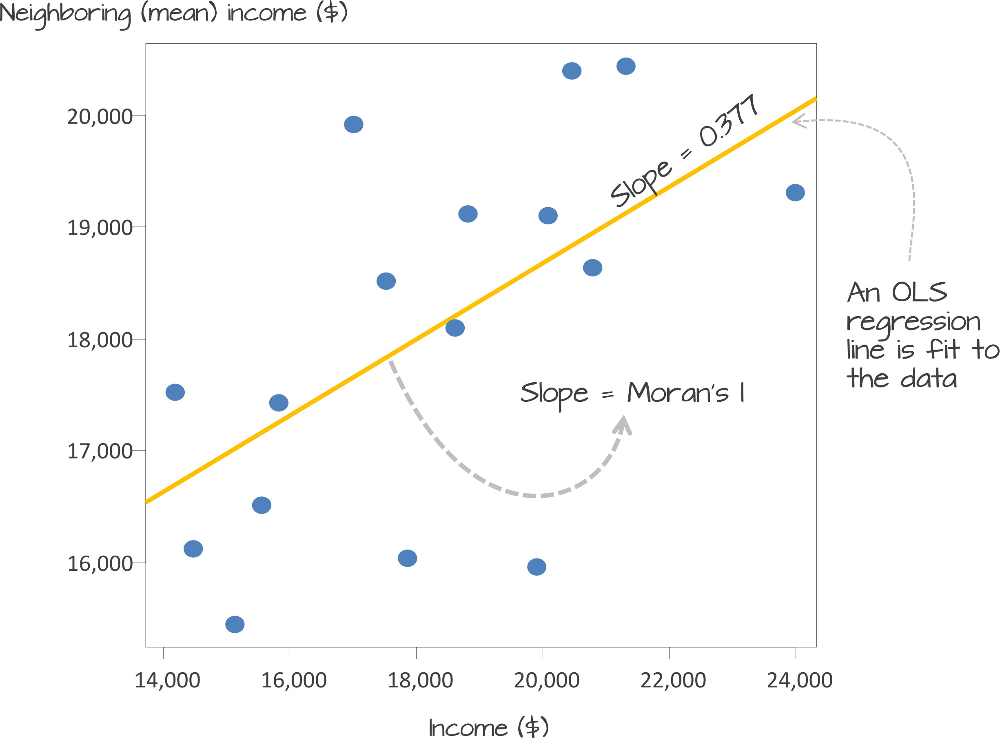

# Analysing Spatial Patterns II: Spatial Autocorrelation 
This week, we will be looking at measuring spatial dependence. Spatial dependence is the idea that the observed value of a variable in one location is  dependent (to some degree) on the observed value of the same value in a nearby location. For spatial analysis, this dependence can be assessed and measured statistically by considering the level of spatial autocorrelation between values of a specific variable, observed in either different locations or between pairs of variables observed at the same location. Spatial autocorrelation occurs when these values are not independent of one another and instead cluster together across geographic space.

## Lecture slides {#slides-w07}
The slides for this week's lecture can be downloaded here: [[Link]](https://github.com/jtvandijk/GEOG0030/tree/master/data/ppt/w07_geo.pdf).

## Reading list {#reading-w07}
#### Essential readings {-}
- Griffith, D. 2017. *Spatial Autocorrelation*. The Geographic Information Science & Technology Body of Knowledge. [[Link]](https://doi.org/10.22224/gistbok/2020.3.10)
- Gimond, M. 2021. Intro to GIS and spatial analysis. **Chapter 13**: *Spatial autocorrelation*. [[Link]](https://mgimond.github.io/Spatial/spatial-autocorrelation.html)
- Livings, M. and Wu, A-M. 2020. *Local Measures of Spatial Association*. The Geographic Information Science & Technology Body of Knowledge. [[Link]](https://doi.org/10.22224/gistbok/2020.3.10)
- Longley, P. *et al*. 2015. Geographic Information Science & systems, **Chapter 13**: *Spatial Analysis*. [[Link]](https://ucl.rl.talis.com/link?url=https%3A%2F%2Fapp.knovel.com%2Fhotlink%2Ftoc%2Fid%3AkpGISSE001%2Fgeographic-information-science%3Fkpromoter%3Dmarc&sig=e437927b963cc591dcb65491eccdd3869cc31aef80e1443cb2ba12d8f3bb031a)

#### Suggested readings {-}
- Brundson, C. and Comber, L. 2018. An Introduction to R for Spatial Analysis and Mapping. **Chapter 7**: *Spatial Attribute Analysis with R*. [[Link]](https://ucl.userservices.exlibrisgroup.com/view/action/uresolver.do?operation=resolveService&package_service_id=10347667960004761&institutionId=4761&customerId=4760)
- Lee, S. 2019. Uncertainty in the effects of the modifiable areal unit problem under different levels of spatial autocorrelation: a simulation study. *International Journal of Geographical Information Science* 33: 1135-1154. [[Link]](https://doi.org/10.1080/13658816.2018.1542699)
- Harris, R. 2020. Exploring the neighbourhood-level correlates of Covid-19 deaths in London using a difference across spatial boundaries method. *Health & Place* 66: 102446. [[Link]](https://doi.org/10.1016/j.healthplace.2020.102446)

## Childhood obesity
This week, we are using a completely new dataset and investigating a different phenomena: **childhood obesity**. We will be investigating its distribution across London at the ward-level. To complete this analysis, we will be using a single data download from the [London Datastore](https://data.london.gov.uk/), which we will need to clean, wrangle and then join to one of our ward shapefiles in order to spatially investigate the distribution of childhood obesity.

### Housekeeping {#housekeeping-w07}
Let's get ourselves ready to start our practical content by first downloading the relevant data and loading this within our script.

Open a new script within your GEOG0030 project and save this script as `wk7-obesity-spatial-analysis.r`. At the top of your script, add the following metadata (substitute accordingly):

```{r 07-scr-title, warnings=FALSE, message=FALSE, cache=TRUE, tidy=TRUE}
# Analysing childhood obesity and its factors
# Date: January 2023
# Author: Justin 
```

Add the following libraries for loading in your script:

```{r 07-scr-libs-all, warnings=FALSE, message=FALSE, cache=FALSE, tidy=TRUE}
# libraries
library(tidyverse)
library(sf)
library(tmap)
library(janitor)
library(spdep)
library(RColorBrewer)
```

### Loading data {#loading-data-w07}
We are going to only need **two** datasets for this week: our London ward boundaries from 2011 and the Greater London Authority (GLA) Ward Atlas and Profiles. The GLA Ward Atlas and Profiles provide a range of demographic and related data for each ward in Greater London and were specifically designed to provide an overview of the ward's population by collating and presenting a range of data on the population, diversity, households, life expectancy, housing, crime, benefits, land use, deprivation, and employment.

Indicators in the Atlas/Profile include:

* Age and sex
* Land area, projections and population density
* Household composition, religion, ethnicity
* Birth rates (general fertility rate), death rates (standardised mortality ratio), life expectancy
* Average house prices, properties sold, housing by council tax band, tenure, property size (bedrooms), dwelling build period and type, mortgage and landlord home repossession
* Employment and economic activity, Incapacity Benefit, Housing Benefit, Household income, Income Support and JobSeekers Allowance claimant rates, dependent children receiving child-tax credits by lone parents and out-of-work families, child poverty
* GCSE results, A-level / Level 3 results (average point scores), pupil absence
* Child obesity 
* Crime rates (by type of crime), fires, ambulance call outs, road casualties 
* Happiness and well-being, land use, public transport accessibility (PTALs), access to public greenspace, access to nature, air emissions / quality, car use, bicycle travel
* Indices of Deprivation
* Election turnout

The main dataset utilises the **2011 Ward Boundaries as its spatial representation**, therefore we need to use the 2011 boundaries. We already have our 2011 London Ward boundaries within our `raw` data folder, so we only need to download our Ward Atlas.

1. Navigate to the ward Atlas dataset in the London Data Store: [[Link]](https://data.london.gov.uk/dataset/ward-profiles-and-atlas).
2. Download the `ward-atlas-data.csv`. You might find that instead of downloading the file, your browser will open up a new window. You have two options:
    + Copy and paste all contents of the page into a text editor such as Notepad and save your pasted contents as `ward-atlas-data.csv` in your **raw** data folder in a new `atlas` folder. Make sure to add the `.csv` to the end of your file name to save your text file as a `csv`. 
    + Click back to the dataset page, right-click on the `ward-atlas-data.csv` name and select **Download Linked File** from your computer's options. Move this into your `raw` data folder in a new `atlas` folder.

```{r 07-download-gif, echo=FALSE, out.width = "450pt", fig.align='center', cache=TRUE, fig.cap='Download linked file.'}
knitr::include_graphics('images/w07/download_shot.gif')
```

Let's first load our London ward shapefile from our `raw/boundaries/2011` folder:

```{r 07-load-shp, warnings=FALSE, message=FALSE, cache=TRUE, tidy=TRUE}
# read in our London ward boundaries
london_ward_shp <- read_sf("data/raw/boundaries/2011/London_Ward_CityMerged.shp")
``` 

We can both `View()` and `plot()` the data in our console to check what our data looks like. We are happy with the dataframe (its field names) and what its looking like as a shapefile, so we do not need to do any cleaning on this dataset. We can now turn to our **London Ward Atlas** dataset and load the `csv` dataset into R:

```{r 07-load-csv, warnings=FALSE, message=FALSE, cache=TRUE, tidy=TRUE}
# read in our ward atlas data csv from our raw data folder
all_ward_data <- read_csv("data/raw/atlas/ward-atlas-data.csv")
``` 

If you go ahead and view the data, you will see we have a lot of information about our Wards in the dataset. We have a total of **946 variables** four our 629 wards. We cannot exactly analyse all of these variables, so we will need to extract only the variables we need.

:::note
**Note** <br/>
If you run into an error along the lines of `Error in nchar(x, "width") : invalid multibyte string, element 1`, there is an issue with the character encoding of the file. If this is the case, please download a [UTF-8 encoded](https://en.wikipedia.org/wiki/UTF-8#:~:text=UTF%2D8%20is%20a%20variable,Transformation%20Format%20%E2%80%93%208%2Dbit.&text=Code%20points%20with%20lower%20numerical,are%20encoded%20using%20fewer%20bytes.) copy of the file here: [[Link]](https://github.com/jtvandijk/GEOG0030/tree/master/data/zip/ward-atlas-data.zip)
:::

### Data preparation {#data-preparation-w07}
To clean our data and extract the variables for our analysis, we need to identify those most useful to our research. Of course, we need to find a variable that matches our phenomena of investigation: child obesity. We will also keep several additional variables in case one would want to move beyond studying the distribution of child obesity, e.g. by looking at explanatory factors such as: 

1. **Individual level factors**: diet and exercise, parents' weights, mode of travel to school / time taken to walk to school.
2. **Household/societal level factors**: area deprivation, household income, household employment

This week, our data wrangling is quite minimal but it is important you follow all the steps to ensure you have the correct final dataframe for our analysis. Overall, you will:

* Select the required columns for our dataframe and analysis.
* Remove the first row which contains data that are part of the column names.
* Remove the last three rows, which contains data for the whole of London, England, and England and Wales.
* Clean and rename our field columns.
* Coerce our variables into the correct data type for our analysis.
* Join our 'atlas data' dataframe to our ward spatial dataframe.

The fields that we need to extract from our dataset include:

* **838**: Childhood Obesity Prevalence; Year 6 (School children aged 10-11); 2011/12 to 2013/14: % obese
* **900**: Indices of Deprivation; IDACI; 2010
* **248**: House Prices; Median House Price; 2014
* **353**: Household Income; Mean Modelled Household income (£); 2012/13
* **373**: Employment; Adults not in Employment - 2011 Census; % of households with no adults in employment with dependent children
* **377**: Qualifications; Qualifications and Students - 2011 Census; % No qualifications
* **859**: Access to green space and nature; % homes with deficiency in access to nature; 2012
* **865**: Public Transport Accessibility; Average PTAL score; 2014

and of course:

* **2**: ...2 - which contains our ward codes.
* **4**: ...4 - which contains our ward names.

Select our 10 fields from our `all_ward_data` dataframe for use in analysis:

```{r 07-clean-csv, warnings=FALSE, message=FALSE, cache=TRUE, tidy=TRUE}
# select our 10 fields for analysis using their index number
obesity_ward_data <- dplyr::select(all_ward_data, 2, 4, 838, 900, 248, 353, 373, 377, 859, 865)
``` 

You should now have a new dataframe with our 10 variables. One issue with our original `csv` is that is contained two rows worth of field names - hence if you look at the first row of our dataframe, it does not make sense. We therefore want to remove this row as well as the last three rows. In addition, it would be good to clean up our names for use. Here we use the `clean_names()` function from the `janitor` library, which cleans our names by removing white space, special characters, capitals etc.

Remove the first line of our dataframe and clean our field names:

```{r 07-clean-csv-2, warnings=FALSE, message=FALSE, cache=TRUE, tidy='styler'}
# remove our first row, remove last three rows, clean the names of our fields
obesity_ward_data <- obesity_ward_data %>% slice(-1) %>% head(-3) %>% clean_names()

# inspect
names(obesity_ward_data)
``` 
The final thing we can do with this dataset before we need to join it to our London Wards spatial dataframe is just tidy up our column names: `x2` and `x4` does not exactly mean much to us and it gives us a chance to shorten the names of the other variables:

```{r 07-rename-df, warnings=FALSE, message=FALSE, cache=TRUE, tidy=TRUE}
# rename field names of ward data to something more useful
names(obesity_ward_data) <- c("ward_code", "ward_name", "y6_obesity_2014", "IDACI_2010", "med_house_price_2014", "mean_hh_income_2013", "per_no_adult_employ_2011", "per_no_qual_2011", "per_deficiency_greenspace_2012", "PTAL_2014")
``` 

Now we have the data we want to map, we need to do a final spot of checking: one of the main issues faced with loading data directly from a `csv` in R without cleaning it first in a spreadsheet programme as we have done before, is that we cannot guarantee that the data will be loaded correctly. Unfortunately with our current dataframe we can see that not all columns are correctly loaded. If you inspect the structure of the dataframe, you will see that several of our variables are of the type `char`.

```{r 07-character-type, warnings=FALSE, message=FALSE, cache=TRUE, tidy=TRUE}
# inspect the structure of the data
str(obesity_ward_data)
``` 

The results from the `str()` function suggest that some variables have been interpreted by R to be characters rather than numeric. This might be because there is some missing data or in some cases, the decimal point can interfere with the data being read as a numeric. Luckily it is easy to change our data type - a bit like right-clicking on our columns in Excel and setting the format of the column to `number`, we will do this using code. If we wanted to apply this to a single column than we would use the code: `as.numeric(dataframe$column)` but as we want to apply this across a few columns, we will be using the `mutate_at()` function from the `dplyr` library. 

```{r 07-rechar-df, warnings=FALSE, message=FALSE, cache=TRUE, tidy=TRUE}
# change data types 
obesity_ward_data <- mutate_at(obesity_ward_data, vars(y6_obesity_2014, mean_hh_income_2013, per_no_adult_employ_2011, per_no_qual_2011, per_deficiency_greenspace_2012, PTAL_2014), function(x) as.numeric(x))
``` 

You will see warnings that `NAs` have been introduced by this coercion in some of our variables. This is something we will need to be aware of later in our analysis, but will not look at right now. Now our final step is to join our final `obesity_ward_data` dataframe to our `london_wards_shp` spatial dataframe so we can complete both statistical and spatial analysis:

```{r 07-join-dfs, warnings=FALSE, message=FALSE, cache=TRUE, tidy='styler'}
# join obesity df to ward sdf for analysis
obesity_ward_sdf <- left_join(london_ward_shp, obesity_ward_data,  
                              by = c("GSS_CODE"="ward_code"))
```

Have a look at your newly created spatial dataframe using the `plot()` function, for instance. If you like, you can also write out the final `csv` using the `write_csv()` function to save a raw copy in your data folder. 

## Statistical distributions
Today, we are interested in looking at spatial autocorrelation: the effect of spatial processes on distributions. We will be using our newly created `obesity_ward_sdf` to look at this in action, whilst also answering questions on the overall distribution and factors of childhood obesity.

Within general data analysis, when it comes to analysing the distribution of your data, you are looking to conduct what is known as **Exploratory Data Analysis** (EDA) which is where we look to summarise the main characteristics of our data. EDA was promoted by prominent statistician [John Tukey](https://en.wikipedia.org/wiki/John_Tukey) to encourage data analysts to explore their data outside of traditional formal modelling and come up with new areas of investigation and hypotheses. Tukey promoted the use of five summary statistics: **the max-min, the median, and the quartiles**, which, in comparison to the mean and standard deviation, provide a more robust understanding of a data's distribution, particularly if the data is skewed.

We looked at how we can use R to extract some of these summary statistics briefly in Week 4, but let's have a look at how we can add further to this EDA, including creating some statistical charts of our data's distribution. 

In your script, below your joining of our dataframes, summarise our `y6_obesity_2014` distribution 

```{r 07-summ-distr, warnings=FALSE, message=FALSE, cache=TRUE, tidy=TRUE}
# summarise our y6_obesity_2014 data
summary(obesity_ward_sdf$y6_obesity_2014)
``` 

This `summary()` function can also be called on the dataset as a whole and will generate summary statistics for each individual numeric variable. You can execute this in your console if you like to get an understanding of all of variables - although we will focus on obesity for much of this practical. We can see that our **median** and **mean** are quite close to one another. We can also see that the quartiles are nearly the same amount apart from the mean, so we can start to think that our data is normally distribution. To confirm this, we can do the next best thing, which is plot our distribution using a **histogram**, using the base R `hist()` command:

```{r 07-hist, warnings=FALSE, message=FALSE, cache=TRUE, tidy=TRUE}
# plot the histogram of our y6_obesity_2014 data
hist(obesity_ward_sdf$y6_obesity_2014)
``` 

We can actually see our data has a slight negative skew, which makes sense given that our median is higher than our mean.

```{r 07-data-distro, echo=FALSE, fig.align='center', cache=TRUE, fig.cap='Cheatsheet on data distributions: negative skew, normal, positive skew.'}
knitr::include_graphics('images/w07/distributions.png')
```

We can further customise our histograms if we want to make them more aesthetically pleasing and update the title and axis labeling:

```{r 07-hist-2, warnings=FALSE, message=FALSE, cache=TRUE, tidy=TRUE}
# pretty histogram
hist(obesity_ward_sdf$y6_obesity_2014, breaks=20, col="grey", main="Distribution of Obesity in Year 6 children, London Wards in 2014", xlab="Percentage of obese Year 6 children in the ward")
``` 

We can also export this histogram and save it as a `png` by storing the histogram code to a variable and saving this variable to a file. The code to do so is a little different: we essentially first "open up" a file, called what we want to name our plot. We then run the code to plot our data, which will place the output "within" the file and then "close' the file down.

```{r 07-hist-3, warnings=FALSE, message=FALSE, cache=TRUE, tidy=TRUE, eval=FALSE}
# open an empty png
png("data/graphs/Y6_obesity_distribution.png")

# pretty histogram
hist(obesity_ward_sdf$y6_obesity_2014, breaks=20, col="grey", main="Distribution of Obesity in Year 6 children, London Wards in 2014", xlab="Percentage of obese Year 6 children in the ward")

# close the png
dev.off()
``` 

Another type of chart we can create just using the base R library is a **boxplot**.

```{r 07-boxplot-img, echo=FALSE, out.width = "650pt", fig.align='center', cache=TRUE, fig.cap='Simple boxplot.'}
knitr::include_graphics('images/w07/boxplot.png')
```

A boxplot shows the core characteristics of the distributions within a dataset, including the interquartile range. Plot the boxplot of our `y6_obesity_2014` variable:

```{r 07-boxplot, warnings=FALSE, message=FALSE, cache=TRUE, tidy=TRUE}
# plot the boxplot of our y6_obesity_2014 data
boxplot(obesity_ward_sdf$y6_obesity_2014)
``` 

:::tip
**Tip** <br/>
There is actually a lot more we can do in terms of visualising our data's distribution and the best way forward would be to become more familiar with the `ggplot2` library. `ggplot2` is the main visualisation for both statistical and, increasingly, spatial graphs, charts and maps.
:::

## Assignment 1 {#assignment-1-w07}
Your first assignment this week is to go ahead and test each of our variables to determine their distribution. Make a note of which ones are normally distributed and which are not (and their skew). Understanding your data's distribution is important if you want to test the relationships between different variables. 

## Spatial distributions
Whilst statistical analysis of distributions focus on tests and charts, when we want to understand the spatial distribution of our phenomena, we have a very simple solution: we make a map. In our case, we are looking at areal unit data and therefore we can use a choropleth map to study our data across the wards: 

```{r 07-facet-map, warnings=FALSE, message=FALSE, cache=TRUE, tidy='styler', eval=TRUE}
# store our variables of interest as a variable
var_fields <- names(obesity_ward_sdf)[10:17]

# map all our variables of interest at once
tm_shape(obesity_ward_sdf) + 
  tm_polygons("gray", border.col = "gray") + 
tm_shape(obesity_ward_sdf) + 
  tm_polygons(col = var_fields) + 
  tm_layout(legend.show = FALSE,
            panel.labels = c("Yr 6 Obesity", "IDACI", "Median House Price", 
                             "Mean Household Income", "Percent No Adult Employment", 
                             "Percent No Qualifications", "Percent Deficient in Greenspace", 
                             "PTAL")) + 
  tm_facets(ncol = 3)
``` 

And specifically, we can create a single output choropleth map for each of our variables to visually understand their distribution:

```{r 07-tmap-check, warnings=FALSE, message=FALSE, cache=FALSE, echo=FALSE}
# ensure tmap mode is set to plot 
tmap_mode("plot")
```

```{r 07-obesity-map, warnings=FALSE, message=FALSE, cache=TRUE, tidy='styler', eval=TRUE}
# child obesity map
tm_shape(london_ward_shp) + 
  tm_polygons("gray", border.col = "gray") + 
tm_shape(obesity_ward_sdf) + 
  tm_polygons(col = "y6_obesity_2014", n = 5, style = "jenks", 
              title = "Percentage of children ", palette="Purples", 
              border.col = "white") + 
  tm_layout(main.title = 'Obesity of Year 6 children in London Wards in 2014', 
            main.title.fontface = 2, fontfamily = "Helvetica", 
            legend.outside = TRUE, 
            legend.outside.position = "right", 
            legend.title.size = 1, 
            legend.title.fontface = 2) + 
  tm_scale_bar(breaks = c(0, 5, 10, 15, 20), position = c("left", "bottom"))
``` 

The thing with spatial distributions is that we can quickly pick up on spatial patterns present within our data just by looking at the data. For example, in our obesity example, we can see there are clusters of high levels of obesity in East London, whilst there are clusters of low levels of obesity in the south east and south west areas of London. Let's analyse these clusters statistically by looking at spatial autocorrelation.

:::note
**Note** <br />
Earlier we encountered that our dataset contains `NAs` in at least one of our columns. In fact, our `yr6_obesity_2014` variable contains `NAs`. To move forward with our analysis, we need to remove those wards that do not contain any obesity information from our spatial dataframe. This will have some issues in terms of how we think about our "neighbours", explained further below, but will allow us to run the code required.
:::

Remove the wards in our `obesity_ward_sdf` that do not contain any obesity information.

```{r 07-removeNAs, warnings=FALSE, message=FALSE, cache=TRUE, tidy=TRUE}
# remove NAs
obesity_ward_sdf <- obesity_ward_sdf %>% filter(!is.na(y6_obesity_2014))
``` 

We can assess the distribution of our data using what is known as spatial autocorrelation tests, which can be conducted on both a global (identify if the data is clustered) and local (identify the precise clusters) scales. Whilst these different tests quantify how clustered, how random, or how dispersed, these distributions are through various approaches, ultimately they provide us with statistical and spatial information that can be used to create quantifiable descriptions of a variable’s distribution and how it vary over space. This can be incredibly useful when looking to explain and discuss a variable, particularly as the clustering present in one variable can be compared to another, which might be useful to make connections between underlying causes or possible solutions to the issues the original variable poses.

As discussed in this week's lecture, we have several types of tests that look to quantify spatial autocorrelation. Of these tests, there are two categories:

* **Global statistical** tests (i.e. those that provide us with a statistic to tell us about autocorrelation in our dataset).
* **Local spatial** tests (i.e. those that provide us with the cluster maps).

Three important tests are outlined in the below table for easy reference:

|Test | Scale | Test | Output | Significance Value |
| :---- | :---| :--------------| :--------------| :---|
| Global Moran's I | Global | Tests how "random" the spatial distribution of values are, producing a correlation coefficient for the relationship between a variable (like income) and its surrounding values. | **Moran's I statistic:** <br> Metric between -1 and 1. <br> -1 = dispersed <br> 0 = CSR <br> 1 = clustered | Yes - $p$-value |
| Local Moran's I | Local | Tests the difference between a unit of analysis and its neighbour(s).  | **Local Moran's I statistic:** <br> 1. Can be used alongside the mean of values to generate cluster type generations. <br>i.e. High-High, High-Low, Low-High, Low-Low, Insignificant. <br> 2. Can also use standard deviation of main local statistic to show just high and low clusters  | Yes - $p$-value |
| Local Getis-Ord | Local |  Identifies statistically significant hot spots and cold spots using the local Getis-Ord Gi* statistic.  | Can use the standard deviation of statistic to identify hot and cold spots | Yes - $p$-value |

In each of these cases, our $p$-values are pseudo $p$-values, generated through simulations such as that outlined in the lecture. Our pseudo $p$-values allow us to interpret our relationships with a level of confidence. If we find that our relationships do not have any significance, then we cannot be confident in presenting them as true results.

### Spatial lag
Underlying our global Moran's I test is the concept of a **spatial lag model**. A spatial lag model plots each value against the mean of its neighbours' values, defined by our selected approach. This creates a scatter plot, from which our Moran's I statistic can be derived. 

An Ordinary Least Squares (OLS) regression is used to fit the data and produce a slope, which determines the Moran's I statistic:

```{r 07-moran-plt, echo=FALSE, fig.align='center', cache=TRUE, fig.cap='A spatial lag model - plotting value against the mean of its neighbours. <br/> Source: [Manuel Gimond](https://mgimond.github.io/Spatial/spatial-autocorrelation.html).'}

```

To determine a $p$-value from our model for global Moran's I, this spatial lag model is computed multiple times (think hundreds, thousands) but uses a random distribution of neighbouring values to determine different slopes for multiple ways our data *could* be distributed, if our data was distributed by random. The output of this test is a sampling distribution of Moran's I values that would confirm a null hypothesis that our values are randomly distributed. These slopes are then compared to compare our *observed* slope versus our *random* slopes and identify whether the slope is within the main distribution of these values or an outlier:

```{r 07-spatial-lag-plt, echo=FALSE, fig.align='center', cache=TRUE, fig.cap='A spatial lag model - plotting value against the mean of its neighbours. <br/> Source: [Manuel Gimond](https://mgimond.github.io/Spatial/spatial-autocorrelation.html).'}
knitr::include_graphics('images/w07/MC_sim_1.png')
```

If our slope is an outlier, i.e. not a value we would expect to compute if the data were randomly distributed, we are more confidently able to confirm our slope is reflective of our data's clustering and is significant. Our *pseudo-*$p$-values are then computed from our simulation results:

<center>\(\frac{N_{extreme} + 1}{N + 1}\)</center>
<br>

Where \({N_{extreme}}\) is the number of simulated Moran's I values that were more extreme that our observed statistic and \({N}\) is the total number of simulations. In the example above, from [Manuel Gimond](https://mgimond.github.io/Spatial/spatial-autocorrelation.html), only 1 out the 199 simulations was more extreme than the observed local Moran's I statistic. Therefore \({N_{extreme}}\) = 1 , so $p$ is equal to (1+1) / (199 + 1) = 0.01. This means that "there is a 1% probability that we would be wrong in rejecting the null hypothesis". This approach is known as a **Monte Carlo simulation** or permutation bootstrap test.

### Defining neighbours
For any spatial autocorrelation test that you want to conduct, you will always need one critical piece of information: *how do we define 'neighbours' in our dataset to enable the value comparison.* Every observation in a dataset will need to have a set of neighbours to which its value is compared. To enable this, we need to determine how many or what type of neighbours should be taken into account for each observation when conducting a spatial autocorrelation test.

These 'neighbouring' observations can be defined in a multitude of ways, based either on geometry or proximity, and include:

* **Contiguity** neighbours: Queen / Rook (*plus order*)
* **Fixed Distance** neighbours: Euclidean Distance (e.g. within 2km)
* **(K) Nearest Neighbours**: Certain *n* number of closest neighbours

```{r 07-neighbours, echo=FALSE, fig.align='center', cache=TRUE, fig.cap='Different approaches of conceptualising neighbours for spatial autocorrelation measurement: contiguity, fixed distance and nearest neighbours. Source: [Manuel Gimond](https://mgimond.github.io/Spatial/spatial-autocorrelation.html).'}
knitr::include_graphics('images/w07/iffn.png')
```

Depending on the variable you are measuring, the appropriateness of these different types of neighbourhood calculation techniques can change. As a result, how you define neighbours within your dataset will have an impact on the validity and accuracy of spatial analysis. Whatever approach you choose therefore needs to be grounded in particular theory that aims to represent the process and variable investigated. 

:::note
**Note** <br />
Have a look at Esri's Help Documentation on [Selecting a conceptualization of spatial relationships: Best practices](https://pro.arcgis.com/en/pro-app/latest/tool-reference/spatial-statistics/modeling-spatial-relationships.htm#GUID-729B3B01-6911-41E9-AA99-8A4CF74EEE27) when you come to need to define neighbours yourself for your own analysis.
:::

For our analysis into childhood obesity, we will primarily use the **Queen contiguity**. This approach is "*effective when polygons are similar in size and distribution, and when spatial relationships are a function of polygon proximity (the idea that if two polygons share a boundary, spatial interaction between them increases)*" ([Esri, 2021](https://pro.arcgis.com/en/pro-app/latest/tool-reference/spatial-statistics/modeling-spatial-relationships.htm#GUID-729B3B01-6911-41E9-AA99-8A4CF74EEE27)).

### Spatial weights matrix
Before we can calculate Moran’s I and any similar statistics, we need to first define our **spatial weights matrix**. This is known mathematically as \(W_{ij}\) and this will tell our code which unit neighbours which, according to our neighbour definition. For each neighbour definition, there is a different approach to implementing code to calculate the \(W_{ij}\) spatial weights matrix. 

Here, we will look at three approaches:

1. Creating a Queen \(W_{ij}\) spatial weights matrix
2. Creating a Rook \(W_{ij}\) spatial weights matrix
3. Creating a Fixed Distance \(W_{ij}\) spatial weights matrix

For either approach, we use a single line of code to create the relevant \(W_{ij}\) spatial weights matrix:

```{r 07-defining-neighbours, warnings=FALSE, message=FALSE, cache=FALSE, tidy=TRUE}
# create a neighbours list based on the Queen neighbour definition
ward_neighbours_queen <- obesity_ward_sdf %>% poly2nb(., queen=T)

# create a neighbours list based on the Rook neighbour definition
ward_neighbours_rook <- obesity_ward_sdf %>% poly2nb(., queen=F)

# creates centroid and joins neighbours within 0 and 3000 'units' of the CRS, i.e. metres
ward_neighbours_fd <- dnearneigh(st_geometry(st_centroid(obesity_ward_sdf)),0, 3000)
``` 

Creating our neighbours list through a single line of code, as above, does not really tell us much about the differences between these conceptualisations. It would be useful to the links between neighbours for our three definitions and visualise their distribution across space. To be able to do this, we will use a few lines of code to generate a visualisation based on mapping the defined connections between the centroids of our wards.

:::note
**Note** <br />
A centroid, in its most simplest form is the central point of an areal unit. How this central point is defined can be weighted by different approaches to understanding geometries or by using an additional variable. In our case, our centroids will reflect in the 'central' point of our wards, determined by its geometric boundaries.
:::

We can calculate the centroids of our wards using one of the **geometric** tools from the `sf` library: `sf_centroid()`:

```{r 07-calc-centroids, warnings=FALSE, message=FALSE, cache=FALSE, tidy=TRUE}
# calculate the centroids of all of the Wards in London
ward_centroid <- obesity_ward_sdf %>% st_centroid()
``` 

You can `plot()` the `ward_centroid` using the console to see what they look like as spatial data. Now we have our ward centroids, we can go ahead and plot the centroids and the defined neighbour connections between them from each of our neighbour definitions. To do so, we will use the `plot()` function, provide the relationships via our `ward_neighbours_X` list and then the geometry associated with these lists from our `ward_centroid()`:

```{r 07-plotting-neighbours-1, warnings=FALSE, message=FALSE, cache=TRUE, tidy=TRUE}
# plot neighbours: Queen
plot(ward_neighbours_queen, st_geometry(ward_centroid), col="red", pch=20, cex=0.5)
``` 

```{r 07-plotting-neighbours-2, warnings=FALSE, message=FALSE, cache=TRUE, tidy=TRUE}
# plot neighbours: Rook
plot(ward_neighbours_rook, st_geometry(ward_centroid), col="blue", pch=20, cex=0.5)
``` 

```{r 07-plotting-neighbours-3, warnings=FALSE, message=FALSE, cache=TRUE, tidy=TRUE}
# plot neighbours: Fixed Distance
plot(ward_neighbours_fd, st_geometry(ward_centroid), col="green", pch=20, cex=0.5)
``` 

When comparing these different maps, we can see that there is definitely a difference in the number of neighbours when we use our different approaches. It seems our fixed distance neighbour conceptualisation has much connections in the center of London versus areas on the outskirts. We can see that our contiguity approaches provide a more equally distributed connection map, with our Queen conceptualisation having a few more links that our Rook.

We can also type the different neighbours objects into the console to find out the total number of "non-zero links" (i.e. total number of connections) present within the conceptualisation. You should see that Queen has 3560 non-zero links, Rook has 3474 and Fixed Difference has 8238. Whilst this code simply explores these conceptualisations it helps us understand further how our different neighbourhood conceptualisations can ultimately impact our overall analysis.

With our neighbours now defined, we will go ahead and create our final (two) spatial weights objects that will be needed for our spatial autocorrelation code. At the moment, we currently have our neighbours defined as a "list" but we need to convert it to a "neighbours" object using the `nb2listw()` function:

```{r 07-creating-neighbours, warnings=FALSE, message=FALSE, cache=FALSE, tidy=TRUE}
# create a neighbours list
ward_spatial_weights_queen <- ward_neighbours_queen %>% nb2listw(., style="C")

# creates a neighbours list 
ward_spatial_weights_fd <- ward_neighbours_fd %>% nb2listw(., style = 'B')
``` 

:::note
**Note** <br />
If you did not remove the `NAs` in our obesity column than the following code will not run. Make sure you have done this. If not, do it now and re-run your spatial weights matrix generation code again.
:::

### Global Moran's I
With a Global Moran’s I we test how “random” the spatial distribution of these values is, producing a global Moran's statistic from the lag approach explained earlier. 

The global Moran’s I statistic is a metric between -1 and 1:

* -1 is a completely even spatial distribution of values
* 0 is a “random” distribution
* 1 is a “non-random” distribution of clearly defined clusters

Before we run our global Moran's I test, we will first create a spatial lag model plot which looks at each of the values plotted against their spatially lagged values. The graph will show quickly whether we are likely to expect our test to return a positive, zero or negative statistic:

```{r 07-scatter-plot-MI, warnings=FALSE, message=FALSE, cache=TRUE, tidy=TRUE}
obesity_MI_sp <- moran.plot(obesity_ward_sdf$y6_obesity_2014, listw = ward_spatial_weights_queen)
``` 

We can see that there is a positive relationship between our `y6_obesity_2014` variable and the spatially lagged `y6_obesity_2014` variable, therefore we are expecting our global Moran's I test to produce a statistic reflective of the slope visible in our scatter plot. Now we can run the global Moran's I spatial autocorrelation test and print the result:

```{r 07-run-GMI, warnings=FALSE, message=FALSE, cache=FALSE, tidy=TRUE}
# run the global Moran's I test on our y6_obesity_2014 data
obesity_GMI <- obesity_ward_sdf %>% pull(y6_obesity_2014) %>% as.vector() %>% moran.test(., ward_spatial_weights_queen)

# print global Moran's I result
obesity_GMI
``` 

The Moran’s I statistic calculated should be 0.53. With 1 = clustered, 0 = no pattern, -1 = dispersed, this means we can confirm that childhood obesity in London is positively autocorrelated. In other words, childhood obesity does spatially cluster. We can also consider the pseudo $p$-value as a measure of the statistical significance of the model - at < 2.2e-16, which confirm our result is (psuedo) significant.

:::note
**Note** <br/>
Before we run our local spatial autocorrelation tests, let's just take a second to think through what our results have shown. From our global statistical tests, we can confirm that:

* There is clustering in our dataset.
* Similar values are clustering.
* High values are clustering.

We can conclude already that areas of high levels of childhood obesity tend to cluster in the same area. What we do not know yet is **where** these clusters are occurring. To help with this, we need to run our **local** models to identify where these clusters are located.
:::

### Local Moran's I
A local Moran's I test deconstructs the global Moran’s I down to its components and then constructs a localized measure of autocorrelation, which can show different cluster types. To run a local Moran's I test, the code again is similar to above:

```{r 07-local-MI-1, warnings=FALSE, message=FALSE, cache=FALSE, tidy=TRUE}
# run the local Moran's I test on our y6_obesity_2014 data
obesity_LMI <- obesity_ward_sdf %>% pull(y6_obesity_2014) %>% as.vector() %>% localmoran(., ward_spatial_weights_queen)

# print the first 5 lines of the local Moran's I statistic output
head(obesity_LMI)
``` 

As you should see, we do not get given a single statistic as per with our global tests, but rather a table of five different statistics that are all related back to each of the wards in our dataset.

If we look at the help page for the `localmoran` function (run `?localmoran` in your console) we can find out what each of these statistics mean:

| Name | Description |
| :----- | :---------------|
| Ii | Local Moran's I statistic |
| E.Ii | Expectation of local Moran's I statistic |
| Var.Ii | Variance of local Moran's I statistic |
| Z.Ii | Standard deviation of local Moran's I statistic |
| Pr() | $p$-value of local Moran's I statistic |

We therefore have a local Moran's I statistic for each of our wards, as well as a significance value plus a few other pieces of information that can help us create some maps showing our clusters. To be able to do this, we need to join our local Moran's I output back into our `obesity_ward_sdf` spatial dataframe, which will then allow us to map these results. 

To create this join, we first **coerce** our local Moran's I output into a dataframe that we then join to our `obesity_ward_sdf` spatial dataframe using the `mutate()` function from the `dplyr` library. In our case, we do not need to provide an **attribute** to join these two dataframes together as we use the computer's logic to join the data in the order in which it was created:

```{r 07-local-MI-join, warnings=FALSE, message=FALSE, cache=FALSE, tidy=TRUE}
# coerce obesity_LMI into dataframe
obesity_LMI <- as.data.frame(obesity_LMI)

# update the names for easier reference
names(obesity_LMI) <- c("LMI_Ii", "LMI_eIi", "LMI_varIi", "LMI_zIi", "LMI_sigP")

# join to obesity_ward_sdf
obesity_ward_sdf <- obesity_ward_sdf %>% mutate(obesity_LMI)
``` 

We now have the data we need to plot our local spatial autocorrelation maps. We will first plot the most simple maps to do with our local Moran's I test: the local Moran's I statistic as well as the $p$-values of the local Moran's I statistic.

Map the local Moran's I statistic: 

```{r 07-map-LMI, warnings=FALSE, message=FALSE, cache=TRUE, tidy='styler'}
# map our local Moran's I statistic 
tm_shape(obesity_ward_sdf) + 
  tm_polygons("LMI_Ii", style = "pretty", midpoint = 0, title = "Local Moran's I statistic") + 
  tm_layout(main.title= "Spatial Autocorrelation of Childhood Obesity in London", 
            main.title.fontface = 2, fontfamily = "Helvetica", 
            legend.outside = TRUE, 
            legend.outside.position = "right", 
            legend.title.size = 1, 
            legend.title.fontface = 2) + 
  tm_compass(type = "arrow", position = c("right", "bottom")) + 
  tm_scale_bar(breaks = c(0, 5, 10, 15, 20), position = c("left", "bottom"))
``` 

From the map, it is possible to observe the variations in autocorrelation across space. We can interpret that there seems to be a geographic pattern to the autocorrelation. However, it is not possible to understand if these are clusters of high or low values. To be able to interpret this confidently, we also need to know the significance of the patterns we see in our map and therefore need to map the $p$-value of local Moran's I statistic.

Map the $p$-value of local Moran's I statistic:

```{r 07-map-LMI-p, warnings=FALSE, message=FALSE, cache=TRUE, tidy='styler'}
# significance breaks
breaks <- c(0, 0.05, 0.1, 1)

# colours for our local Moran's I statistic
colours <- c('white', "#a6bddb", "#2b8cbe" )

# map our local Moran's I statistic 
tm_shape(obesity_ward_sdf) + 
  tm_polygons("LMI_sigP", style = "fixed", breaks = breaks, 
              palette = rev(colours), title = "p-value of Local Moran's I stat") + 
  tm_layout(main.title = "Spatial Autocorrelation of Childhood Obesity in London", 
            main.title.fontface = 2, fontfamily = "Helvetica", 
            legend.outside = TRUE, 
            legend.outside.position = "right", 
            legend.title.size = 1, 
            legend.title.fontface = 2) + 
  tm_compass(type = "arrow", position = c("right", "bottom")) + 
  tm_scale_bar(breaks = c(0, 5, 10, 15, 20), position = c("left", "bottom"))
``` 

Using our significance map, we can interpret the above clusters present in our local Moran's I statistic more confidently. As evident, we do have several clusters that are statistically significant to the $p$-value < 0.05. 

Ideally we would combine these two outputs to see what values cluster together and which clusters are significant. We can do this with a cluster map of our **local Moran's I statistic (Ii)** which will show areas of different types of clusters, including:

* **HIGH-HIGH**: A ward of high obesity that is also surrounded by other wards of high obesity.
* **HIGH-LOW**: A ward of high obesity that is surrounded by wards of low obesity.
* **LOW-HIGH**: A ward of low obesity that is surrounded by wards of high obesity.
* **LOW-LOW**: A ward of low obesity that is also surrounded by other wards of low obesity.
* Those areas that have no significant cluster or relationship to the wards around them.

Our HIGH-HIGH and LOW-LOW will show our clusters, whereas the other two cluster types reveal anomalies in our variable. To create a map that shows this, we need to quantify the relationship each of our wards have with the wards around them to determine their cluster type. We do this using their observed value and their local Moran's I statistic and their deviation around their respective means:
  
* *If a ward's observed value is higher than the observed mean and it's local Moran's I statistic is higher than the LMI mean*, it is designated as **HIGH-HIGH**.
* *If a ward's observed value is lower than the observed mean and it's local Moran's I statistic is lower than the LMI mean*, it is designated as **LOW-LOW**.
* *If a ward's observed value is lower than the observed mean but it's local Moran's I statistic is higher than the LMI mean*, it is designated as **LOW-HIGH**.
* *If a ward's observed value is higher than the observed mean but it's local Moran's I statistic is lower than the LMI mean*, it is designated as **HIGH-LOW**.
* *If a ward's LMI was found not to be significant*, the ward will be mapped as **not significant**.

For example, this means that if we know our ward’s observed value is less than the mean value of our overall `y6_obesity_2014 variable`, then it means it is of course a low value for obesity in comparison to the entirety of London. If it’s local Moran’s I statistic is also lower than the mean value of the rest of the LMI_Ii statistics, it also means it is located in a neighbourhood of low values. As a result, if this relationship is significant (determined by the pseudo $p$-value from our local Moran’s I calculation), we can call this a “LOW-LOW” cluster.

To achieve this cluster map, we need to take several additional steps:

* The first will tell us, for each ward, whether its observed value is higher or lower than the mean observed.
* The second will tell us, for each ward, whether its LMI value is higher or lower than the mean LMI.
* The third will use the values of these two columns to assign each ward with a cluster type.

Determine the cluster type of each ward by comparing observed and LMI values against their respective means and the significance value:
 
```{r 07-LMI-cluster-type, warnings=FALSE, message=FALSE, cache=FALSE, tidy='styler'}
# compare local value for obesity with mean value
obesity_ward_sdf <- obesity_ward_sdf %>% mutate(obs_diff = (y6_obesity_2014 - mean(obesity_ward_sdf$y6_obesity_2014)))

# compare local LMI value with mean LMI value
obesity_ward_sdf <- obesity_ward_sdf %>% mutate(LMI_diff = (obesity_LMI$LMI_Ii - mean(obesity_LMI$LMI_Ii)))

# set a significance threshold 
signif <- 0.05

# generate column with cluster type, using values above
obesity_ward_sdf <- obesity_ward_sdf %>% 
  mutate(cluster_type = case_when(obs_diff > 0 & LMI_diff > 0 & LMI_sigP < signif ~ "High-High",
                                  obs_diff < 0 & LMI_diff < 0 & LMI_sigP < signif ~ "Low-Low",
                                  obs_diff < 0 & LMI_diff > 0 & LMI_sigP < signif ~ "Low-High",
                                  obs_diff > 0 & LMI_diff < 0 & LMI_sigP < signif ~ "High-Low",
                                  LMI_sigP > signif ~ "No Significance"))

```

Now we have a column detailing our cluster types, we can create a cluster map that details our four cluster types as well as those that are not significant. Creating a categorical map in R and using `tmap` is a little tricky and we will need to do some preparing of our colour palettes to ensure our data is mapped correctly. To do this, we first need to figure out how many cluster types we have in our `cluster_type` field:

```{r 07-LMI-cs, warnings=FALSE, message=FALSE, cache=TRUE, tidy=TRUE}
# count the different values within our `cluster_type` variable 
count(obesity_ward_sdf, cluster_type)
```

We can see we actually have all four cluster types present within our dataset - alongside the `No Significance` value. We therefore need to ensure our palette includes four colours for these two cluster types, plus a white colour for `No Significance`:

```{r 07-plot-LMI-hscs, warnings=FALSE, message=FALSE, cache=TRUE, tidy='styler'}
# create a colour palette
pal <- c("#d7191c", "#fdae61", "#abd9e9", "#2c7bb6","#F5F5F5")

# plot the clusters
tm_shape(obesity_ward_sdf) +
  tm_polygons(col = "cluster_type", palette = pal, title = "Cluster Type") +
  tm_layout(main.title = "Cluster Map of Childhood Obesity in London, 2014",
            main.title.fontface = 2, fontfamily = "Helvetica", legend.outside = TRUE,
            legend.outside.position = "right",
            legend.title.size = 1,
            legend.title.fontface = 2) +
  tm_compass(type = "arrow", position = c("right", "bottom")) +
  tm_scale_bar(breaks = c(0, 5, 10, 15, 20), position = c("left", "bottom"))
``` 

And there we have it: within one map we can visualise both the relationship of our wards to their respective neighbourhoods and the significance of this relationship from our local Moran's I test. This type of map is called a LISA map and is a great way of showing how a variable is actually clustering.

### Getis-Ord-Gi*
The final test we will run today is the local Getis-Ord, which will produce the Gi* statistic. This statistic will identify hot- and coldspots by looking at the neighbours within a defined proximity to identify where either high or low values cluster spatially and recognising statistically significant hotspots as those areas of high values where other areas within a neighbourhood range also share high values too (and vice versa for coldspots).

Run the local Gi* statistic spatial autocorrelation test and print the result:

```{r 07-local-GO, warnings=FALSE, message=FALSE, cache=TRUE, tidy=TRUE}
# run the local Gi* test on our y6_obesity_2014 data, note we again use the fd weights
obesity_LGO <- obesity_ward_sdf %>% pull(y6_obesity_2014) %>% as.vector() %>% localG(., ward_spatial_weights_fd) 

# join the local Gi* statistic to `obesity_ward_sdf` spatial dataframe
obesity_ward_sdf <- obesity_ward_sdf %>% mutate(obesity_LGO_G = as.numeric(obesity_LGO))

# inspect
obesity_ward_sdf
``` 

By printing the results of our test, we can see that the local Getis-Ord test is a bit different from a local Moran's I test as it only contains a single value: the z-score. The z-score is a standardised value relating to whether high values or low values are clustering together, which we call the Gi* statistic. We can join this output, a list of our Gi* values, to our `obesity_ward_sdf` spatial dataframe and map the result:

```{r 07-join-local-GO, warnings=FALSE, message=FALSE, cache=TRUE, tidy=TRUE}

```

```{r 07-map-local-GO, warnings=FALSE, message=FALSE, cache=TRUE, tidy='styler'}
# create a colour palette
GIColours <- rev(brewer.pal(8, "RdBu"))

# plot the clusters
tm_shape(obesity_ward_sdf) + 
  tm_polygons("obesity_LGO_G", style = "pretty", palette=GIColours,
              midpoint=0, title = "Local Gi* statistic") +
  tm_layout(main.title = 'Hot/Cold Spot Map of Childhood Obesity in London, 2014', 
            main.title.fontface = 2, fontfamily = "Helvetica",
            legend.outside = TRUE, 
            legend.outside.position = "right", 
            legend.title.size = 1, 
            legend.title.fontface = 2) + 
  tm_compass(type = "arrow", position = c("right", "bottom")) +
  tm_scale_bar(breaks = c(0, 5, 10, 15, 20), position = c("left", "bottom"))
``` 

Our map shows quite clearly hot and cold spots of obesity across London. How does this compare with our local Moran's I? Do we see the same clusters?

:::tip
**Tip** <br/>
If we want to only map the statistically significant clusters, we need to use these [z-scores](https://en.wikipedia.org/wiki/Standard_score) to filter out only statistically significant clusters. When using a 95 percent confidence level your values should be between `-1.96` and `+1.96` standard deviations.
:::

## Assignment 2 {#assignment-2-w07}
Through conducting our spatial autocorrelation tests, we can visually confirm the presence of clusters in our `y6_obesity_2014` variable and provide a significance value associated with these tests. This provides us with a way to explain our distributions **quantitatively** during the analysis of our results.

Now you have the code, you will be able to repeat this analysis on any variable in the future. For this week's assignment, we therefore want you to find out whether our `IDACI_2010` variable contains spatial clustering.

In order to do this, you have to:

1. Create a choropleth map showing the distribution of the variable values.
2. Calculate a global spatial autocorrelation statistic and explain what it shows.
3. Create a local Moran's I map showing the four cluster types.
4. Create a local Getis-Ord hotspot map.
5. Compare these results to the output of our `y6_obesity_2014` values. Do both variables have clusters? Do we see similar clusters in similar locations? What might this tell us about the relationship between deprivation and obesity in children in London?
6. Run the analysis using a different neighbour definition. What happens? Do the results change?

## Want more? [Optional] {#wm-w07}
### More spatial autocorrelation
If you are interested in moving beyond spatial autocorrelation, for instance how to account for spatial autocorrelation in statistical models (e.g. with Geographically Weighted Regression or Spatial Regression), have a look at the workbook [Mapping and Modelling Geographic Data in R](https://profrichharris.github.io/MandM/themap.html) by Bristol-based Professor [Richard Harris](https://www.bristol.ac.uk/people/person/Richard-Harris-871b21a9-0f5f-4bc8-9a99-8ace550d9903/). Start with [The Spatial Variable](https://profrichharris.github.io/MandM/themap.html) section, move to the [Measuring spatial autocorrelation](https://profrichharris.github.io/MandM/autocorrelation.html) section before looking at the [Geographically Weighted Statistics](https://profrichharris.github.io/MandM/gwstats.html) and [Spatial Regression](https://profrichharris.github.io/MandM/spregress.html) sections.

## Before you leave {#byl-w07}
And that is how you can measure spatial dependence in your dataset through different spatial autocorrelation measures. Next week we will focus on the last topic within our set of core spatial analysis methods and techniques, but [this week we have covered enough](https://www.youtube.com/watch?v=fCZVL_8D048)!
