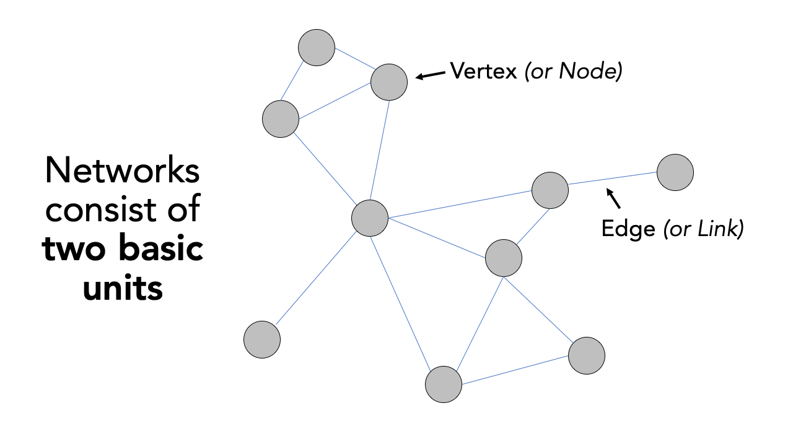

# Transport Network Analysis
In this final week we will cover a different type of data: network data. We will take a look at how we can use network data to measure accessibility using the `dodgr` R library. We will calculate the network distances between combinations of locations (i.e. a set of origins and a set of destinations). These distances can then, for instance, be used to calculate the number of a resource (e.g. fast-food outlets) within a certain distance of a Point of Interest (e.g. a school or population-weighted centroid). 

## Lecture slides {#slides-w10}
The slides for this week's lecture can be downloaded here: [[Link]](https://github.com/jtvandijk/GEOG0030/tree/master/data/ppt/w10_geo.pdf).

## Reading list {#reading-w10}
#### Essential readings {-}
- Geurs, K., Van Wee, B. 2004. Accessibility evaluation of land-use and transport strategies: review and research directions. *Journal of Transport Geography* 12(2): 127-140. [[Link]](https://doi.org/10.1016/j.jtrangeo.2003.10.005)
- Higgins, C., Palm, M. DeJohn, A. *et al.* 2022. Calculating place-based transit accessibility: Methods, tools and algorithmic dependence. *Journal of Transport and Land Use* 15(1): 95-116. [[Link]](https://doi.org/10.5198/jtlu.2022.2012)
- Neutens, T. Schwanen, T. and Witlox, F. 2011. The prism of everyday life: Towards a new research agenda for time geography. *Transport Reviews* 31(1): 25-47. [[Link]](https://doi.org/10.1080/01441647.2010.484153)
- Schwanen, T. and De Jong, T. 2008. Exploring the juggling of responsibilities with space-time accessibility analysis. *Urban Geography* 29(6): 556-580. [[Link]](https://doi.org/10.2747/0272-3638.29.6.556)

#### Suggested readings {-}
- Van Dijk, J., Krygsman, S. and De Jong, T. 2015. Toward spatial justice: The spatial equity effects of a toll road in Cape Town, South Africa. *Journal of Transport and Land Use* 8(3): 95-114. [[Link]](https://doi.org/10.5198/jtlu.2015.555)
- Van Dijk, J. and De Jong, T. 2017. Post-processing GPS-tracks in reconstructing travelled routes in a GIS-environment: network subset selection and attribute adjustment. *Annals of GIS* 23(3): 203-217. [[Link]](https://doi.org/10.1080/19475683.2017.1340340)

## Transport Network Analysis 
The term network analysis covers a wide range of analysis techniques ranging from complex network analysis to social network analysis, and from link analysis to transport network analysis. What the techniques have in common is that they are based on the concept of a **network**. A network or network graph is constituted by a collection of vertices that are connected to one another by edges. Note, vertices may also be called nodes or points, whilst edges may be called links or lines. Within social network analysis, you may find the terms actors (the vertices) and ties or relations (the edges) also used. 

```{r network-graph-picca, echo=FALSE, cache=TRUE, fig.align='center', fig.cap='Visualising networks with vertices and edges.'}

```

Understanding that networks are formed through the connections of vertices and edges, we can think of many naturally and man made occurring networks that also have a precise geography to them (i.e. their distribution can be mapped directly within geographic space), such as rivers connected with tributaries, animal tracks, electricity pylons and cables, and our road and street networks that form crucial parts of our infrastructure. The latter, in particular, have been a substantial focus of those working within spatial analysis over the last two decades, particularly with routing applications now dominating much of our day-to-day technology, from personal route-planning and ride-share apps to large-scale logistics and infrastructure applications, including the delivery operations behind all of our online shopping and even [Scotland's Trunk Road Gritters](https://www.arcgis.com/apps/webappviewer/index.html?id=2de764a9303848ffb9a4cac0bd0b1aab).

Alongside this development of routing applications, GIS analysts, geographers and public health specialists have also identified the utility of network analysis within geographic space to calculate distance-based measurement and coverage buffers that can be used as part of accessibility studies that look to understand the provision of a specific resource (e.g. greenspaces, hospitals, and fast-food stores) to a certain area of population.

### Accessibility in Portsmouth
For this week's practical, we will be using Portsmouth in the UK as our area of interest for our analysis. One prominent topic within the city is the issue of public health and childhood obesity. According to figures released in March 2020 by Public Health England, more than one in three school pupils are overweight or obese by the time they finish primary school within the city - higher than the national average of one in four. One potential contributor to the health crisis is the ease and availability of fast-food outlets in the city. In the following, we will measure the accessibility of fast-food outlets within specific walking distances of all school in Portsmouth starting at 400m, then 800m and finally a 1km walking distance. We will then aggregate these results to the Lower Super Output Area (LSOA) and overlay these results with some socio-economic variable.

To execute this analysis, we will need to first calculate the distances between our schools and fast-food outlets. This involves calculating the shortest distance a child would walk between a school and a fast-food outlet, using roads or streets. We will use the `dodgr` R package to conduct this transport network analysis.    

:::note
**Note**<br/>
All calculations within the `dodgr` library currently need to be run in WGS84/4236. This is why we will not transform the CRS of our data in this practical.
:::

### Acquiring network data {#loading-data-w10}
The first dataset we need to download will help with the visualisation of our results: boundary data that contains an outline of Portsmouth.

| File                                    | File Type         | Link |
| :------                                     | :------      | :------ |
| Major towns and cities boundaries 2015      | `shp`        | [Download](https://github.com/jtvandijk/GEOG0030/tree/master/data/zip/major_towns.zip) |

We can now load the required libraries as well as the major towns and cities boundaries `shapefile`.

```{r load-ports, warnings=FALSE, message=FALSE, cache=FALSE, tidy=TRUE}
# libraries
library(tidyverse)
library(sf)
library(tmap)
library(osmdata)
library(dodgr)

# load major towns and cities, filter Portsmouth
portsmouth_city <- st_read("data/raw/outline/Major_Towns_and_Cities__December_2015__Boundaries.shp", stringsAsFactors = FALSE) %>% filter(tcity15nm == "Portsmouth")
```

To create our network and Origin-Destination dataset, we will need data on schools, fast-food outlets, and a streetnetwork. Today we will be using [OpenStreetMap](https://www.openstreetmap.org) for this again. Whilst there are [various approaches](https://wiki.openstreetmap.org/wiki/Downloading_data) to downloading data from OpenStreetMap, we will again use the `osmdata` library to directly extract our required OpenStreetMap (OSM) data into a variable. The `osmdata` library grants access within R to the [Overpass API](https://overpass-turbo.eu/) that allows us to run queries on OSM data and then import the data as spatial objects. These queries are at the heart of these data downloads.

To download our road network dataset, we first define a variable to store our bounding box coordinates, `p_bbox()`. We then use this within our OSM query to extract specific types of road segments within that bounding box - the results of our query are then stored in an `osmdata` object. We will select all OSM features with the `highway` tag that are likely to be used by pedestrians (e.g. not `motorways`).

```{r download_osm, warnings=FALSE, message=FALSE, cache=TRUE, tidy=TRUE}
# define our bbox coordinates for Portsmouth
p_bbox <- c(-1.113197,50.775781,-1.026508,50.859941)

# pass bounding box coordinates into the OverPassQuery (opq) function
# only download features that are not classified as motorway
osmdata <- opq(bbox = p_bbox ) %>%
  add_osm_feature(key = "highway", value = c("primary", "secondary", "tertiary", "residential", "path", "footway", "unclassified", "living_street", "pedestrian")) %>% 
  osmdata_sf()
```

:::note
**Note** <br />
In some instances the OSM query will return an error, especially when several people from the same location are executing the exact same query. If this happens, you can just read through the instructions and download a prepared copy of the data that contains **all** required OSM Portsmouth data instead: [[Link]](https://github.com/jtvandijk/GEOG0030/tree/master/data/zip/osm_portmouth.zip).

You can load these downloaded data as follows into R:
```{r load_osm_from_file, warnings=FALSE, message=FALSE, cache=FALSE, eval=FALSE, tidy=TRUE}
load('../path/to/file/ports_ff.RData')
load('../path/to/file/ports_roads_edges.RData')
load('../path/to/file/ports_schools.RData')
```

After loading your data, you can continue with the analysis in the [Measuring Accessiblity](#osm) section below, starting with the creation of a network graph with the 'foot weighting' profile.
:::

The `osmdata` object contains the bounding box of your query, a time-stamp of the query, and then the spatial data as `osm_points`, `osm_lines`, `osm_multilines` and `osm_polgyons`. Some of the spatial features maybe empty, depending on what you asked your query to return. Our next step therefore is to extract our spatial data from our `osmdata` object to create our road network data set. This is in fact incredibly easy, using the traditional `$` R approach to access these spatial features from our object. 

Deciding what to extract is probably the more complicated aspect of this - mainly as you need to understand how to represent your road network, and this will usually be determined by the library/functions you will be using it within. Today, we want to extract the **edges** of the network, i.e. the lines that represent the roads, as well as the **nodes** of the network, i.e. the points that represent the locations at which the roads start, end, or intersect. For our points, we will only keep the `osm_id` data field, just in case we need to refer to this later. For our lines, we will keep a little more information that we might want to use within our transport network analysis, including the type of road, the maximum speed, and whether the road is one-way or not. 

```{r roadnetwork, warnings=FALSE, message=FALSE, cache=TRUE, tidy=TRUE}
# extract the points, with their osm_id.
ports_roads_nodes <- osmdata$osm_points[, "osm_id"]

# extract the lines, with their osm_id, name, type of highway, max speed and oneway attributes 
ports_roads_edges <- osmdata$osm_lines[, c("osm_id", "name", "highway", "maxspeed", "oneway")]
```

To check our data set, we can quickly plot the edges of our road network using the `plot()` function:

```{r networkplot, warnings=FALSE, message=FALSE, cache=TRUE, tidy=TRUE}
plot(ports_roads_edges, max.plot=1)
```

Because we are focusing on walking, we will overwrite the `oneway` variable by suggesting that none of the road segments are restricted to one-way traffic which may affect our analysis as well as the general connectivity of the network.

```{r roadnetwork-no-oneway, warnings=FALSE, message=FALSE, cache=TRUE, tidy=TRUE}
# overwrite one-way default
ports_roads_edges$oneway <- "no"
```

Now we have the network edges, we can turn this into a graph-representation that allows for the calculation of network-based accessibility statistics. 

### Measuring accessibility {#osm}
Before we can construct our full network graph for the purpose of accessibility analysis, we need to also provide our **Origin** and **Destination** points, i.e. the data points we wish to calculate the distances between. According to the `dodgr` documentation, these points need to be in either a vector or matrix format, containing the two coordinates for each point for the origins and for the destinations.

As for our Portsmouth scenario we are interested in calculating the shortest distances between schools and fast-food outlets, we need to try and download these datasets - again we will turn to OpenStreetMap. Following a similar structure to our query above, we will use our knowledge of OpenStreetMap `keys` and `values` to extract the points of Origins (schools) and Destinations (fast-food outlets) we are interested in:

```{r schools_ff_osm, warnings=FALSE, message=FALSE, cache=TRUE, tidy=TRUE}
# download schools from OSM
schools <- opq(bbox = p_bbox) %>%
  add_osm_feature(key = 'amenity', value = 'school') %>% 
  osmdata_sf()

# download fast-food outlets 
ff_outlets <- opq(bbox = p_bbox) %>%
  add_osm_feature(key = 'amenity', value = 'fast_food') %>%
  osmdata_sf()
```

We also need to then extract the relevant data from the `osmdata` object:

```{r schools_ff_points, warnings=FALSE, message=FALSE, cache=TRUE, tidy=TRUE}
# extract school points
ports_schools <- schools$osm_points[ , c("osm_id", "name")]

# extract fast-food outlet points
ports_ff <- ff_outlets$osm_points[ , c("osm_id", "name")]
```

We now have our road network data and our Origin-Destination (OD) points in place and we can now move to construct our network graph and run our transport network analysis.

:::note
**Note** <br />
In this analysis, we are highly reliant on the use of OpenStreetMap to provide data for both our Origins and Destinations. Whilst in the UK OSM provides substantial coverage, its quality is not always guaranteed. As a result, to improve on our current methodology in future analysis, we should investigate into a more official school data set or at least validate the number of schools against City Council records. The same applies to our fast-food outlets.
:::

With any network analysis, the main data structure is a **graph**, constructed by our nodes and edges. To create a graph for use within `dodgr`, we pass our `ports_roads_edges()` into the `weight_streetnet()` function. The `dodgr` library also contains weighting profiles, that you can customise, for use within your network analysis. These weighting profiles contain weights based on the type of road, determined by the type of transportation the profile aims to model. Here we will use the weighting profile **foot**, as we are looking to model walking accessibility.

```{r network_graph, warnings=FALSE, message=FALSE, warnings=FALSE, message=FALSE, cache=TRUE, tidy=TRUE}
# create network graph with the foot weighting profile
graph <- weight_streetnet(ports_roads_edges, wt_profile = "foot")
```

Once we have our graph, we can then use this to calculate our network distances between our OD points. One thing to keep in mind is that potentially not all individual components in the network that we extracted are connected, for instance, because the bounding box cut off the access road of a [cul-de-sac](https://en.wikipedia.org/wiki/Dead_end_(street)). To make sure that our entire extracted network is connected, we now extract the **largest connected component** of the graph. You can use `table(graph$component)` to examine the sizes of all individual subgraphs. You will notice that most subgraphs consist of a very small number of edges.

:::tip
**Tip** <br />
The `dodgr` package documentation explains that components are numbered in order of decreasing size, with `$component = 1` always denoting the largest component. Always inspect the resulting subgraph to make sure that its coverage is adequate for analysis.
:::

```{r network_graph_extract, warnings=FALSE, message=FALSE, warnings=FALSE, message=FALSE, cache=TRUE, tidy=TRUE}
# extract the largest connected graph component
graph_connected <- graph[graph$component == 1, ]

# inspect number of remaining road segments
nrow(graph_connected)

# inspect on a plot
plot(dodgr_to_sf(graph_connected), max.plot=1)
```

:::note
**Note** <br/>
OpenStreetMap is a living dataset, meaning that changes are made on a continuous basis; as such it may very well possible that the number of remaining road segments as shown above may be slightly different when you run this analysis. 
:::

Now we have our connected subgraph, will can use the `dodgr_distances()` function to calculate the network distances between every possible Origin and Destination. In the `dodgr_distances()` function, we first pass our `graph`, then our Origin points (schools), in the `from` argument, and then our Destination points (fast-food outlets), in the `to` argument. One thing to note is our addition of the `st_coordinates()` function as we pass our two point data sets within the `from` and `to` functions as we need to supplement our Origins and Destinations in a matrix format. For all Origins and Destinations, `dodgr_distances()` will map the points to the **closest network points**, and return corresponding shortest-path distances. 

```{r distance_calc, warnings=FALSE, message=FALSE, cache=TRUE, tidy=TRUE}
# create a distance matrix between schools and fast-food stores
sch_to_ff_calc <- dodgr_distances(graph_connected, from=st_coordinates(ports_schools), to= st_coordinates(ports_ff), shortest = TRUE, pairwise = FALSE, quiet=FALSE)
```

The result of this computation is a distance-matrix that contains the network distances between all Origins (i.e. schools) and all Destinations (i.e. fast-food outlets). Let's inspect the first row of our output. Do you understand what the values mean?

```{r data_check, warnings=FALSE, message=FALSE, cache=TRUE, tidy=TRUE}
# inspect
head(sch_to_ff_calc, n=1)
```

Our output shows the calculations for the first school and the distances between the school and every fast-food outlet. Because we manually overwrote the values for all one-way streets as well as that we extracted the larges connected graph only, we currently should not have any `NA` values.

:::tip
**Tip** <br/>
The `dodgr` [vignette](https://cran.r-project.org/web/packages/dodgr/vignettes/dodgr.html#4_Distance_Matrices:_dodgr_dists()) notes that
a distance matrix obtained from running `dodgr_distances` on `graph_connected` should generally contain no `NA` values, although some points may still be effectively unreachable due to one-way connections (or streets). Thus, routing on the largest connected component of a directed graph ought to be expected to yield the minimal number of `NA` values, which may sometimes be more than zero. Note further that spatial routing points (expressed as from and/or to arguments) will in this case be mapped to the nearest vertices of `graph_connected`, rather than the potentially closer nearest points of the full graph.
:::

The next step of processing all depends on what you are trying to assess. Here we want to understand which schools have a higher accessibility of fast-food outlets compared to others, quantified by how many outlets are within walking distance of specific distances. We will therefore look to count how many outlets are with walking distance from each school and store this as a new column within our `ports_school` data frame. 

```{r count_aggregation, warnings=FALSE, message=FALSE, cache=TRUE, tidy=TRUE}
# fastfood outlets within 400m
ports_schools$ff_within_400m <- rowSums(sch_to_ff_calc <= 400)

# fastfood outlets within 800m
ports_schools$ff_within_800m <- rowSums(sch_to_ff_calc <= 800)

# fastfood outlets within 1000m
ports_schools$ff_within_1km <- rowSums(sch_to_ff_calc <= 1000)
```

We can then look at our outputs quickly again using the `plot()` function.

```{r schools_plot, warnings=FALSE, message=FALSE, cache=TRUE, tidy=TRUE}
# set CRS for Portsmouth schools
ports_schools <- st_set_crs(ports_schools, 4326)

# plot results
plot(ports_schools)
```

Just from this simple plot, we can see across our distances some clear geographical patterns in accessibility of fast-food outlets for schools. We can improve this plot by making a proportional symbols map that show the different counts of fast-food outlets for each school in Portsmouth with a background of the Portsmouth City outline that you loaded at the beginning of this practical.

```{r 07-bubble-maps, warnings=FALSE, message=FALSE, cache=FALSE, tidy='styler'}
# create proportional symbol map
tmap_mode("plot")
tm_shape(portsmouth_city) + 
  tm_fill(palette = "grey") +
tm_shape(ports_schools) + 
  tm_bubbles(size = "ff_within_400m", col = "skyblue4", 
             style = "pretty", scale = 1, border.col = "white", 
             title.size = "Total Count") +
  tm_layout(legend.position = c("left", "top"), legend.text.size = 1,
            main.title = "Fast-food outlets within 400m of a school", 
            main.title.size = 1) + 
  tm_compass(type = "arrow", position = c("right", "top")) + 
  tm_scale_bar(position = c("left", "bottom")) +
  tm_credits("© OpenStreetMap contributors")
```

The map shows that areas with greater access/exposure to fast-food outlets appear to be within the city centre and in the south, whereas those schools in the north have less exposure. However, with additional contextual information one would also be able to see that these two areas correlate quite well with the more commercial areas within Portsmouth, the high street and an area known as Gunwharf Quays. This suggests there are complexities in understanding accessibility as well as trying to apply specific policies such as banning new fast-food takeaways within a 400m range of school, particularly if these schools are in commercial areas.

### Tutorial task {#task-w10}
Now you have calculated the number of fast-food outlets within specific distances from every school in Portsmouth, your task is to estimate the accessibility of fast-food outlets at the LSOA scale and compare this to the [2019 Index of Multiple Deprivation](https://www.gov.uk/government/statistics/english-indices-of-deprivation-2019). 

:::note
**Note** <br/>
This skills and steps required for this analysis are not just based on this week's practical, but you will have to combine all your knowledge of coding and spatial analysis you have gained over the past weeks.
:::

One way of doing this, is by taking some of the following steps:

1. Download and extract the 2011 LSOA boundaries of Portsmouth.
2. Download the [2019 Index of Multiple Deprivation](https://www.gov.uk/government/statistics/english-indices-of-deprivation-2019) scores.
3. Decide on an accessibility measure, such as:
    + The average number of fast-food restaurants within `x` meters of a school within each LSOA.
    + The average distance a fast-food restaurant is from a school within each LSOA.
    + The (average) shortest distance a fast-food restaurant is from a school within each LSOA.
    + The minimum shortest distance a fast-food outlet is from a school within each LSOA.
4. Create a choropleth map of aggregate accessibility to visualise the results.
5. Join the 2019 Index of Multiple Deprivation data to your LSOA dataset.
6. For each IMD decile, calculate the average for your chosen aggregate measure and produce a table. 

Using your approach what do you think: are fast-food restaurants, on average, more accessible for students at schools that are located within LSOAs with a lower IMD decile when compared to students at schools that are located within LSOAs with a higher IMD decile?

## Want more? [Optional] {#wm-w10}
We have now conducted some basic accessibility analysis, however, there is some additional fundamental challenges to  consider in the context of transport network and accessibility analysis:

1. How do the different weight profiles of the `dodgr` package work? How would one go about creating your own weight profile? How would using a different weight profiles affect the results of your analysis?
2. Why do we have unconnected segments in the extracted transport network? How would you inspect these unconnected segments? Would they need to be connected? If so, how would one do this?
3. Why you think all Origins and Destinations are mapped onto the closest network points? Is this always the best option? What alternative methods could you think of and how would you implement these?

:::tip
**Tip** <br/>
If you really want a deep into accessibility analysis, there is a great resource that got published only recently: [Introduction to urban accessibility: a practical guide in R](https://ipeagit.github.io/intro_access_book/en/index.en.html).
:::

## Before you leave {#byl-w10}
Having finished this tutorial on transport network analysis and, hopefully, having been able to independently conduct some further area-profiling using IMD deciles, [you have now reached the end of this week's content](https://www.youtube.com/watch?v=fFw7q-BLxLA) as well as the end of Geocomputation!
