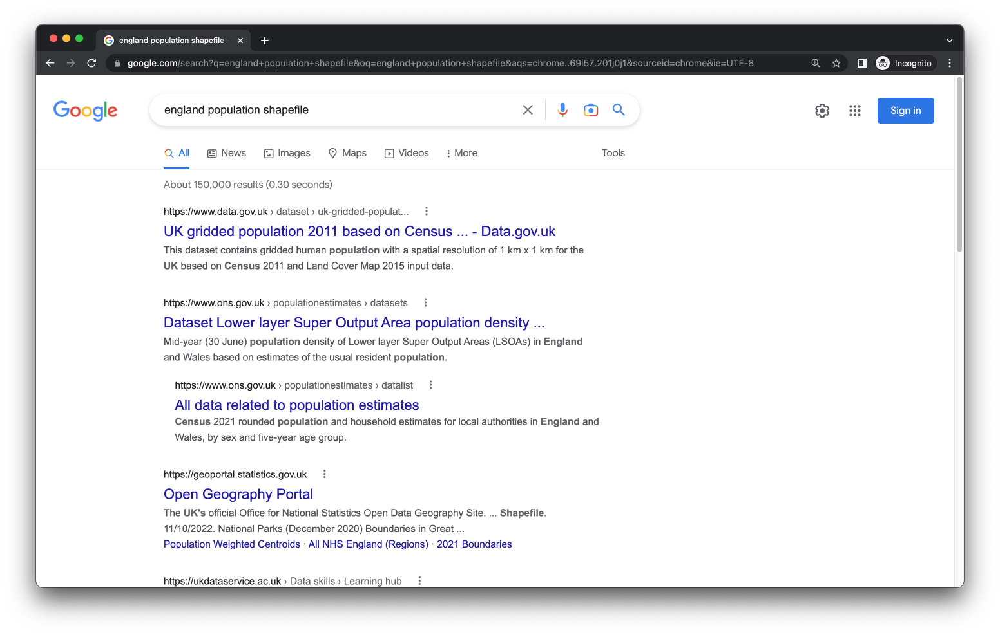
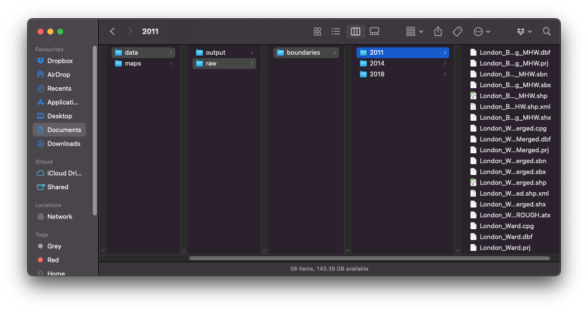
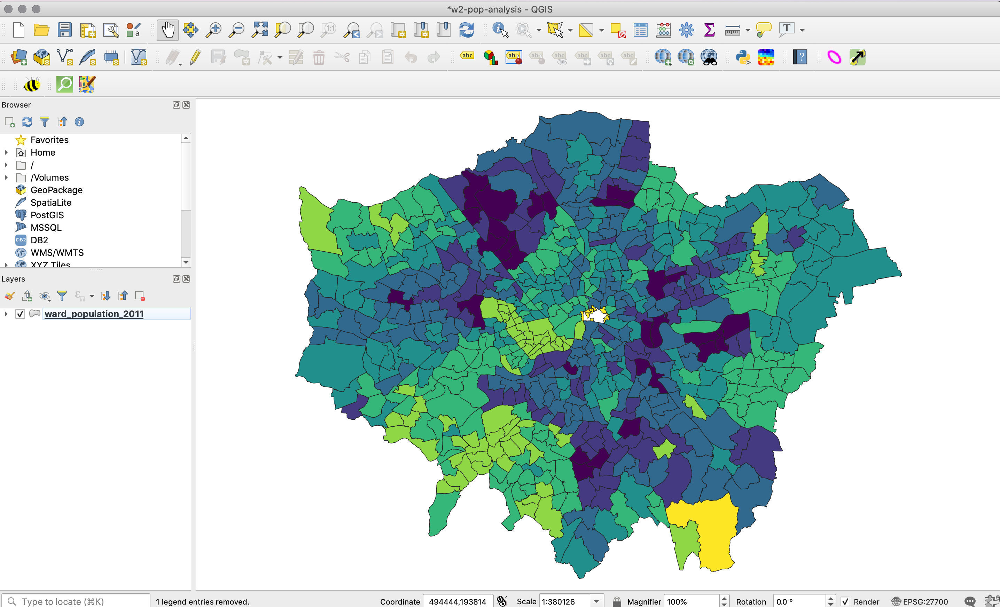
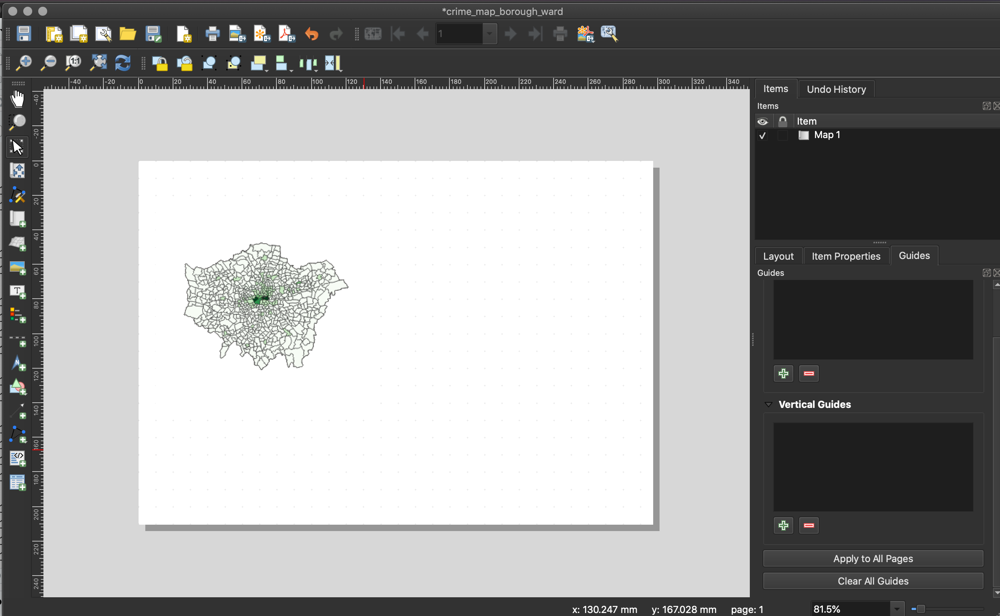
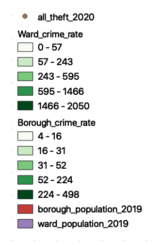
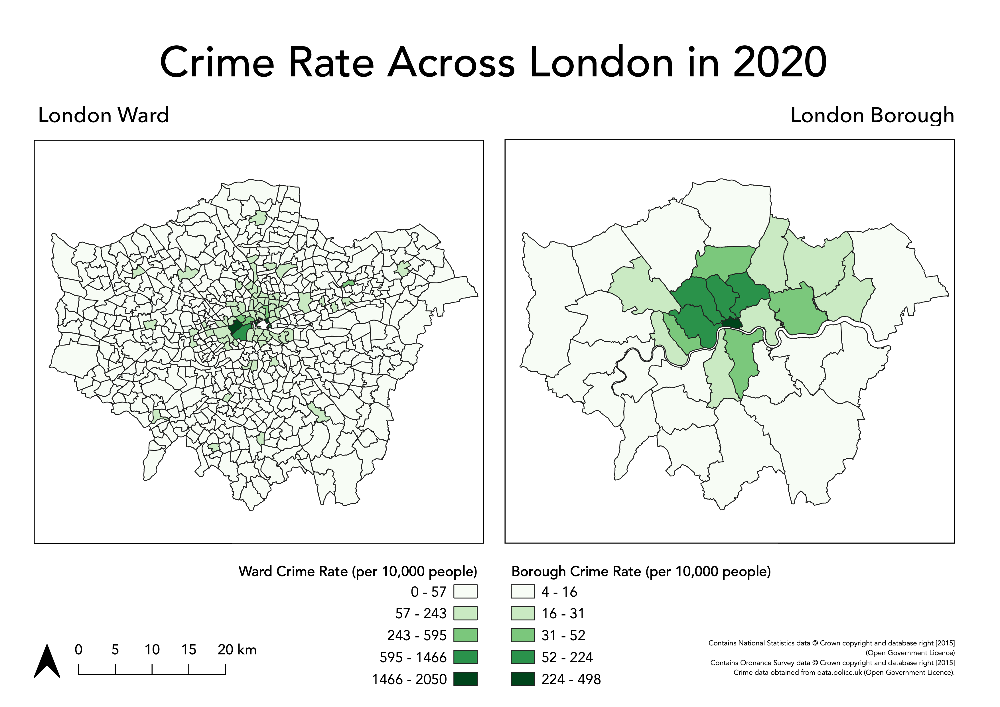

--- 
title: "GEOG0030: Geocomputation"
author: Justin van Dijk
date: "Last modified: `r Sys.Date()`"
site: bookdown::bookdown_site
output: bookdown::gitbook
documentclass: book
link-citations: yes
github-repo: "jtvandijk/GEOG0030"
description: "GEOG0030: Geocomputation handbook."
url: 'https\://jtvandijk.github.io/GEOG0030'
---
# Module Overview {-}

# Module Introduction {-}

```{r 00-welcome, echo=FALSE, out.width = '100%', fig.align='center', cache=TRUE}
knitr::include_graphics('images/general/geocomputation_welcome.png') 
```
*Last modified: `r Sys.Date()`*

## Welcome {-}
Welcome to **Geocomputation**. This module will introduce you both to the principles of spatial analysis as well as provide you with a comprehensive introduction to the use of programming. Over the next ten weeks, you will learn about the theory, methods and tools of spatial analysis through relevant case studies. We will start by using QGIS before moving to the R programming language. You will learn how to find, manage and clean spatial, demographic and socioeconomic datasets, and then analyse them using core spatial and statistical analysis techniques. 

## Moodle {-}
[Moodle](https://moodle.ucl.ac.uk/) is the central point of contact for GEOG0030 and it is where all important information will be communicated such as key module and assessment information. This workbook contains links to all reading material as well as the content of all computer tutorials

## Module overview {-}
The topics covered over the next ten weeks are:

| Week          | Section          | Topic |
| :---          |:---------        |:------------------ |
| 1             | Foundational Concepts | [Geocomputation: An Introduction](geocomputation-an-introduction.html) |
| 2             | Foundational Concepts | [GIScience and GIS software](giscience-and-gis-software.html) | 
| 3             | Foundational Concepts | [Cartography and Visualisation](cartography-and-visualisation.html) | 
| 4             | Foundational Concepts | [Programming for Data Analysis](programming-for-data-analysis.html) |
| 5             | Foundational Concepts | [Programming for Spatial Analysis](programming-for-spatial-analysis.html) |
|               | **Reading week** | **Reading week** |
| 6             | Core Spatial Analysis | [Analysing Spatial Patterns I: Geometric Operations and Spatial Queries](analysing-spatial-patterns-i-geometric-operations-and-spatial-queries.html) |
| 7             | Core Spatial Analysis | [Analysing Spatial Patterns II: Spatial Autocorrelation](analysing-spatial-patterns-ii-spatial-autocorrelation.html) |
| 8             | Core Spatial Analysis | [Analysing Spatial Patterns III: Point Pattern Analysis](analysing-spatial-patterns-iii-point-pattern-analysis.html) |
| 9             | Advanced Spatial Analysis | [Rasters, Zonal Statistics and Interpolation](rasters-zonal-statistics-and-interpolation.html) | 
| 10            | Advanced Spatial Analysis | [Transport Network Analysis](transport-network-analysis.html) | 

## Troubleshooting {-}
Spatial analysis can yield fascinating insights into geographical relationships, albeit at times it can be challenging, particularly when we combine this with learning how to program at the same time. You will most likely encounter many error messages, experience software crashes, and spend hours to identify bugs in your code. However, the rewards of learning how to programmatically solve complex spatial problems will be very much worth it in the end.

If you need specific assistance with this course please:

- Ask a question at the end of a lecture or during the computer practical.
- Attend the Department's **Coding Therapy sessions** that are run on a weekly basis.
- Check the [Moodle](https://moodle.ucl.ac.uk/) assessment tab for queries relating to this module's assessment.

If after pursuing all these avenues you still need help, you can book into our office hours. You can use an office hour to discuss a geographical concept in relation to the material, assessment or for any personal matters relevant to the completion of the module.

## Acknowledgements {-}
This year's workbook is updated and compiled using:

* The [GEOG0030: Geocomputation 2021-2021](https://jo-wilkin.github.io/GEOG0030/coursebook/index.html) workbook as created and compiled by Dr Jo Wilkin.
* The [GEOG0030: Geocomputation 2021-2022](https://jtvandijk.github.io/GEOG0030_20212022/) workbook.

The datasets used in this workbook contain:

* Crime data obtained from [data.police.uk](https://data.police.uk/) (Open Government Licence)
* National Statistics data © Crown copyright and database right [2015] (Open Government Licence) 
* Ordnance Survey data © Crown copyright and database right [2015]
* Public Health England © Crown copyright 2021

<!--chapter:end:index.Rmd-->

# Foundational Concepts {-}
# Geocomputation: An Introduction
This week’s lecture provided you with a thorough introduction on Geocomputation, outlining how and why it is different to a traditional GIScience course. We set the scene for the remainder of the module and explained how the foundational concepts that you will learn in the first half of term sit within the overall module. This week we start easy by setting up our work environment and set up the software that we will  need over the coming weeks.

<!-- ## Lecture slides {#slides-w01} -->
<!-- The slides for this week's lecture can be downloaded here: [[Link]](https://github.com/jtvandijk/GEOG0030/tree/master/data/ppt/w02_geo.pdf). -->

## Reading list {#reading-w01}
#### Essential readings {-}
- Brundson, C. and Comber, A. 2020. Opening practice: Supporting reproducibility and critical spatial data science. *Journal of Geographical Systems* 23: 477–496.  [[Link]](https://doi.org/10.1007/s10109-020-00334-2) 
- Longley, P. *et al.* 2015. Geographic Information Science & Systems, **Chapter 1**: *Geographic Information: Science, Systems, and Society*. [[Link]](https://ucl.rl.talis.com/link?url=https%3A%2F%2Fapp.knovel.com%2Fhotlink%2Ftoc%2Fid%3AkpGISSE001%2Fgeographic-information-science%3Fkpromoter%3Dmarc&sig=e437927b963cc591dcb65491eccdd3869cc31aef80e1443cb2ba12d8f3bb031a)
- Singleton, A. and Arribas-Bel, D. 2019. Geographic Data Science. *Geographical Analysis*. [[Link]](https://doi.org/10.1111/gean.12194)

#### Suggested readings {-}
- Miller, H. and Goodchild, M. 2015. Data-driven geography. *GeoJournal* 80: 449–461. [[Link]](https://doi.org/10.1007/s10708-014-9602-6)
- Goodchild, M. 2009. Geographic information systems and science: Today and tomorrow. *Annals of GIS* 15(1): 3-9. [[Link]](https://doi.org/10.1080/19475680903250715)

## Getting started
Over the next few weeks, we will be taking a closer look at many of the foundational concepts that will ultimately enable you to confidently and competently analyse spatial data using both programming and GIS software.  You will further learn how to plan, structure and conduct your own spatial analysis using programming – whilst making decisions on how to best present your work, which is a crucial aspect of any type of investigation but of particular relevance to your dissertation.

To help with this, we highly recommend that you try to stay organised with your work, including taking notes and making yourself a coding handbook. We would also suggest to list the different datasets you come across - and importantly, the scales and different projections you use them at - more on this over the next weeks. Finally, you should also make notes about the different spatial analysis techniques you come across, including the different properties they assess and parameters they require to run.

## Software 
This course primarily uses the [R](https://www.r-project.org/) programming language, although we start by using [QGIS](https://qgis.org/en/site/) in the next two weeks to give you a basic foundation in the principles of spatial analysis.

:::note
**Note**<br/>
Please follow the instructions below to install both [R](https://www.r-project.org/) and [QGIS](https://qgis.org/en/site/) onto your own personal computer. If you cannot install the software on your personal computer or you are not planning to bring your own laptop to the computer practicals, please refer to the [UCL Desktop and RStudio Server](#ucl) section below. Please make sure that you have access to a working installation of QGIS and R (including relevant packages) **before** the first hands-on practical session next week.
:::

### QGIS Installation
QGIS is an open-source graphic user interface GIS with many community developed add-on packages (or plugins) that provide additional functionality to the software. You can download and install QGIS on your personal machine by going to the QGIS website: [[Link]](https://qgis.org/en/site/forusers/download.html). 

:::note
**Note**<br/>
We recommend installing the **Long Term Release** (*QGIS 3.22 LTR*) as this version should be the most stable version. For Windows users: the QGIS installation may be a little slow.
:::

After installation, start QGIS to see if the installation was successful and no errors are shown after start up.

### R and RStudio Installation 
R is both a programming language and software environment - in the form of RStudio- originally designed for statistical computing and graphics. R’s great strength is that it is open-source, can be used on any computer operating system, and is free for anyone to use and contribute to. Because of this, it is rapidly becoming the statistical language of choice for many academics and has a very large user community with people constantly contributing new packages to carry out all manner of statistical, graphical, and importantly for us, geographical tasks.

Installing R takes a few relatively simple steps involving two programmes. First there is the R programme itself. Follow these steps to get it installed on your computer:

1. Navigate in your browser to your nearest CRAN mirror: [[Link]](https://cran.ma.imperial.ac.uk/)
2. If you use a Windows computer, click on *Download R for Windows*. Then click on *base*.  Download and install **R 4.2.x for Windows**. If you use a Mac computer, click on *Download R for macOS* and download and install **R-4.2.x.pkg**

That is it! You now have installed the latest version of R on your own machine. However, to make working with R a little bit easier we also need to install something called an Integrated Development Environment (IDE). We will use RStudio:

1. Navigate to the official webpage of RStudio: [[Link]](https://posit.co/download/rstudio-desktop/#download)
2. Download and install RStudio Desktop on your computer (**free version!**)

After this, start RStudio to see if the installation was successful and no errors are shown after start up.

### UCL Desktop and RStudio Server {#ucl}
As an alternative to installing QGIS and R with RStudio onto your personal device, there are some other options. Firstly, both programmes are available through [Desktop@UCL Anywhere](https://www.ucl.ac.uk/isd/services/computers/remote-access/desktopucl-anywhere) as well as all UCL computers on campus. In case of R, there is also an RStudio server version available which you can access through your web browser: [[Link]](https://rstudio.data-science.rc.ucl.ac.uk/)

You should be able to log in with your normal UCL username and password. After logging in, you should see the RStudio interface appear. 

```{r 01-rstudio-interface, echo=FALSE, fig.align='center', fig.cap='The RStudio Server interface.'}
knitr::include_graphics('images/w01/rstudio_interface.png')
```

:::note
**Note**<br>
If it is the first time you log on to RStudio server you may only see the RStudio interface appear once you have clicked on the *start a new session* button. More importantly: if you are not on campus, RStudio server will only work with an active Virtual Private Network (VPN) connection that links your personal computer into UCL’s network. Details on setting up a VPN connection can be found in UCL's VPN connection guides: [[Link]](https://www.ucl.ac.uk/isd/services/get-connected/ucl-virtual-private-network-vpn) 
:::

### R package installation 
Now we have installed or have access to QGIS and R, we need to customise R. Many useful R function come in packages, these are free libraries of code written and made available by other by R users. This includes packages specifically developed for data cleaning, data wrangling, visualisation, mapping, and spatial analysis. To save us some time, we will install all R packages that we will need over the next ten weeks in one go. Without going into detail on the RStudio (Server) interface, copy and paste the following code into the *console*. You can execute the code by hitting **Enter**. This may take a while.

```{r 01-install-libaries, echo=TRUE, warnings=TRUE, message=TRUE, eval=FALSE, tidy=TRUE}
# install all packages that we need
install.packages(c('tidyverse','sf','tmap','osmdata','RColorBrewer','janitor','spdep','dbscan','raster','spatstat','gstat','dodgr'))
```

Once you have installed the packages, we need to check whether we can in fact load them into our R session. Copy and paste the following code into the **console**, and executed by hitting **Enter** again.

```{r 01-load-libaries, echo=TRUE, warnings=TRUE, message=TRUE, eval=FALSE, verbose=TRUE, tidy=TRUE}
# load all packages
library(tidyverse)
library(sf)
library(tmap)
library(osmdata)
library(RColorBrewer)
library(janitor)
library(spdep)
library(dbscan)
library(raster)
library(spatstat)
library(gstat)
library(dodgr)
```

You will see some information printed to your console but as long as you do not get a message that is similar to `Error: package or namespace load failed for <packagename>` or `Error: package '<packagename' could not be loaded` all should be fine.

:::note
**Note**<br>
Even if you have used R or RStudio Server before and already installed some of the packages in the above list, do re-install all packages to make sure you have the  latest versions. Legacy installations that have not been updated may lay lead to problems when going through the tutorials.
:::

### A note on ArcGIS
[ArcGIS Pro](https://www.esri.com/en-us/arcgis/products/arcgis-pro/overview) (previously ArcMap) is the main commercial GIS software that you may have already used - or seen/heard about through other modules or even job adverts. We do not use ArcGIS Pro in our Practicals for several reasons:

- Computing requirements for ArcGIS Pro are substantial and it **only** operates on the Windows Operating System. For Mac users, using ArcGIS Pro (and ArcMap) would require using either a Virtual Machine or running a copy of Windows OS on a separate partition of your hard drive.
- It is **proprietary** software, which means you need a license to use the software. For those of us in education, the University covers the cost of this license, but when you leave, you will need to pay for a personal license (around £100 for non-commercial use) to continue using the software and repeat any analysis you have used the software for.
- Whilst ArcPro can use pure [Python](https://www.python.org/) (and even R) as a programming language within it through scripts and notebooks, it primarily relies on its own **ArcPy** and **ArcGIS API for Python**  packages to run the in-built tools and analytical functions. To use these packages, you still need a license which makes it difficult to share your code with others *if* they do not have their own ArcGIS license.

Recent developments in the ArcPro software, however, does make it an attractive tool for spatial data science and quantitative geography - it has cross-user functionality, from data analysts who like to use a tool called Notebooks for their code development, to those focused more on cartography and visualisation with in-built bridges to Adobe's Creative Suite. We therefore do not want to put you off looking into ArcGIS in the future, but for this course, we want to ensure the reproducibility of your work.

:::note
**Note**<br/> This also means that the analysis you will be doing for your coursework assignment must be completed in R and QGIS. Specific guidance on the coursework assignment and permitted software will be made available at the end of Reading Week.
:::

## Before you leave {#byl-w01}
You should now be all ready to go with the computer practicals the coming week. [That is it for this week](https://www.youtube.com/watch?v=d8Fmu3RLEOY)!

<!--chapter:end:01-introduction.Rmd-->

# GIScience and GIS software

This week’s lecture introduced you to foundational concepts associated with GIScience and GIS software, with particular emphasis on the representation of spatial data and sample design. Out of all our foundational concepts you will come across in the next four weeks, this is probably the most substantial to get to grips with and has both significant theoretical and practical aspects to its learning. The practical component of the week puts some of these learnings into practice, starting with a short digitisation excercise followed by a simple visualisation of London's population over time.

<!-- ## Lecture slides {#slides-w02} -->
<!-- The slides for this week's lecture can be downloaded here: [[Link]](https://github.com/jtvandijk/GEOG0030/tree/master/data/ppt/w02_geo.pdf). -->

## Reading list {#reading-w02}
#### Essential readings {-}
- Longley, P. *et al.* 2015. Geographic Information Science & Systems, **Chapter 2**: *The Nature of Geographic Data*. [[Link]](https://ucl.rl.talis.com/link?url=https%3A%2F%2Fapp.knovel.com%2Fhotlink%2Ftoc%2Fid%3AkpGISSE001%2Fgeographic-information-science%3Fkpromoter%3Dmarc&sig=e437927b963cc591dcb65491eccdd3869cc31aef80e1443cb2ba12d8f3bb031a)
- Longley, P. *et al.* 2015. Geographic Information Science & Systems, **Chapter 3**: *Representing Geography*. [[Link]](https://ucl.rl.talis.com/link?url=https%3A%2F%2Fapp.knovel.com%2Fhotlink%2Ftoc%2Fid%3AkpGISSE001%2Fgeographic-information-science%3Fkpromoter%3Dmarc&sig=e437927b963cc591dcb65491eccdd3869cc31aef80e1443cb2ba12d8f3bb031a)
- Longley, P. *et al.* 2015. Geographic Information Science & Systems, **Chapter 7**: *Geographic Data Modeling*. [[Link]](https://ucl.rl.talis.com/link?url=https%3A%2F%2Fapp.knovel.com%2Fhotlink%2Ftoc%2Fid%3AkpGISSE001%2Fgeographic-information-science%3Fkpromoter%3Dmarc&sig=e437927b963cc591dcb65491eccdd3869cc31aef80e1443cb2ba12d8f3bb031a)

#### Suggested readings {-}
- Goodchild, M. and Haining, R. 2005. GIS and spatial data analysis: Converging perspectives. *Papers in Regional Science* 83(1): 363–385. [[Link]](https://doi.org/10.1007/s10110-003-0190-y)
- Schurr, C., Müller, M. and Imhof, N. 2020. Who makes geographical knowledge? The gender of Geography’s gatekeepers. *The Professional Geographer* 72(3): 317-331. [[Link]](https://doi.org/10.1080/00330124.2020.1744169)
- Yuan, M. 2001. Representing complex geographic phenomena in GIS. *Cartography and Geographic Information Science* 28(2): 83-96. [[Link]](https://doi.org/10.1559/152304001782173718)

## Simple digitisation of spatial features
To get spatial features in a digital form, they need to be digitised. Let’s take what should be a straight-forward example of digitising the River Thames in London.

```{r 02-digitise, echo=FALSE, fig.align='center', cache=TRUE, out.width="90%", fig.cap='The Thames.'}
knitr::include_graphics('images/w02/river_thames.png')
```

We are going to use a very simple online tool that allows us to create digital data and export the data we create as raw files.

1. Head to [geojson.io](http://geojson.io/#map=12/51.5170/-0.1030).
2. In the bottom left-hand corner, select *Satellite Streets* as your map option.
3. Next, click on the `Draw Linestring` tool which you can find on the right hand side of the screen. You can hover over the icons to get the names of each tool.
4. Now digitise the river Thames. Simply click from a starting point on the left- or right-hand side of the map, and digitise the river.
5. Once you are done, double-click your final point to end your line.
6. You can  click on the line and select *Info* in the pop-up screen to find out how long the line is. 
7. You can export your data using the *Save* menu.

#### Questions {-}

- How easy did you find it to digitise the data and what decisions did you make in your own "sample scheme"? 
- How close together are your clicks between lines? 
- Did you sacrifice detail over expediency or did you spend perhaps a little too long trying to capture ever small bend in the river? 
- How well do you think your line represents the River Thames?

## Population change in London
The second part of this practical will introduces you to **attribute joins** followed by creating a [choropleth map](https://en.wikipedia.org/wiki/Choropleth_map). You will be using different types of *joins* throughout this module, and probably the rest of your career, so it is incredibly important that you understand how they work.

:::note
**Note**<br/>
The datasets you will create in this practical will be used in next week's practical, so make sure to follow every step and save your data carefully.
:::

When using spatial data, there is generally a very specific workflow that you will need to go through and, believe it or not, the majority of this is not actually focused on analysing your data. Along with the idea that 80% of data is geographic data, the second most often-quoted GIS-related unreferenced 'fact' is that anyone working with spatial data will spend 80% of their time simply finding, retrieving, managing and processing the data before any analysis can be done.

One of the reasons behind this need for a substantial amount of processing is that the data you often need to use is almost never  in the format that you require for analysis. For example, for our investigation, there is not a 'ready-made' spatial population dataset (i.e. population `shapefile`) we can download to explore population change across England:

```{r 02-google-shp, echo=FALSE, fig.align='center', cache=TRUE, out.width="90%", fig.cap='Alas a quick Google search shows that finding a shapefile of England\'s population is not straightforward.'}

```

Instead, we need to go and find the raw datasets and create the data layers that we want. As a result, before beginning any spatial analysis project, it is best-practice to think through what end product you will ultimately need for your analysis.

A typical spatial analysis workflow usually looks something like this:

- **Identify** the data you need to complete your analysis i.e. answer your research questions. This includes thinking through the scale, coverage and currency of your dataset.
- **Find** the data that matches your requirements, e.g. is it openly and easily available?
- **Download** the data and store it in the correct location.
- **Clean** the data. This may be done before or after ingesting your data into your chosen software programme.
- **Load** the data into your chosen software programme.
- **Transform and process** the data. This may require re-projection, creating joins between datasets, calculating new fields and applying selections.
- **Analyse** your data using appropriate methods.
- **Visualise** your data and results with graphs and maps.
- **Communicate** your results.

As you can see, the analysis and visualisation part comes quite late in the overall spatial analysis workflow - and instead, the workflow is very top-heavy with data management. However, very often in GIS-related courses you will be given pre-processed datasets. Because data management is an essential part of your workflow, we are clean (the majority of) our data from the get-go. This will help you understand the processes that you will need to go through in the future as you search for and download your own data, as well as deal with the data first-hand before loading it into our GIS software.

### Setting the scene {#w02-scene}
For this practical, we will investigate how the population in London has changed over time. Understanding population change - over time and space - is spatial analysis at its most fundamental. We can understand a lot just from where population is growing or decreasing, including thinking through the impacts of these changes on the provision of housing, education, health and transport infrastructure. 

We can also see first-hand the impact of wider socio-economic processes, such as urbanisation. Today we will look at population in London in 2011, 2015, and 2019 at the *Ward* scale that we can use within our future analysis projects, starting next week. 

:::note
**Note**<br/>
We will use the population dataset to *normalise* other datasets. Why? When we record events created by humans, there is often a population bias: simply, more people in an area will by probability lead to a higher occurrence of said event, such as crime. We will look at this in greater detail next week.
:::

### Finding data {#w02-finding}
In the UK, finding authoritative data on population and *Administrative Geography* boundaries is increasingly straight-forward. Over the last decade, the UK government has opened up many of its datasets as part of an **Open Data** precedent that began in 2010 with the creation of [data.gov.uk](data.gov.uk) and the Open Government Licence (the terms and conditions for using data).

[Data.gov.uk](www.data.gov.uk) is the UK government’s central database that contains open data that the central government, local authorities and public bodies publish. This includes, for example, aggregated census and health data – and even government spending. In addition to this central database, there are other authoritative databases run by the government and/or respective public bodies that contain either a specific type of data (e.g. census data, crime data) or a specific collection of datasets (e.g. health data from the NHS, data about London). Some portals are less up-to-date than others, so it is wise to double-check with the ‘originators’ of the data to see if there are more recent versions.

For our practical, we will access data from two portals:

1. For our administrative boundaries, we will download the **spatial** data from the *London Datastore* (which is exactly what it sounds like).
2. For population, we will download **attribute** data from the *Office of National Statistics (ONS)*.

### Housekeeping {#w01-housekeeping}
Before we download our data, it is important to establish an organised file systems that we will use throughout the module:

1. Create a `GEOG0030` folder in your `Documents` folder on your computer.
2. Within your `GEOG0030` folder, create the following subfolders: 

| Folder name | Purpose      |
| :----        | :----------- |
| `data`      | To store both raw data sets and final outputs. |
| `maps`      | To save the maps you produce during your tutorials. |

3. Within your `data` folder, create the following subfolders: 

| Folder name | Purpose      |
| :---        | :----------- |
| `raw`       | To store all your raw data files that have not yet been processed. |
| `output`    | To store all your final data files that have been processed and analysed, potentially ready to be mapped. |

### Downloading data {#w02-downloading}
We will start by downloading the administrative geography boundaries:

1. Navigate to the relevant page on the London Datastore: [[Link]](https://data.london.gov.uk/dataset/statistical-gis-boundary-files-london).
2. Download all three zipfiles to your computer: `statistical-gis-boundaries-london.zip`, `London-wards-2014.zip` and `London-wards-2018.zip`.

The first dataset contains all levels of London’s administrative boundaries. In descending size order: Borough, Ward, Middle layer Super Output Area (MSOA), Lower layer Super Output Area (LSOA), and Output Area (OA) based on the 2011 Census. The second dataset contains an *updated* version of the Ward boundaries, as of 2014. The third dataset contains yet another *updated* version of the Ward boundaries, as of 2018. As we will be looking at population data for 2015 and 2019, it is best practice to use those boundaries that are most reflective of the ‘geography’ at the time; therefore, we will use these 2014 / 2018 Ward boundaries for our 2015 / 2019 population dataset, respectively. 

:::note
**Note** <br/>
Once downloaded, you will need to unzip all files before you can use them. To unzip the file, you can use the built-in functionality of your computer’s operating system. For Windows: right click on the zip file, select **Extract All**, and then follow the instructions. For Mac OS: double-click on the the zip file and it should unzip automatically.
:::

Once unzipped, you will find two folders: *Esri* and *MapInfo.* These folders contain the same data but in different data formats: **Esri shapefile** and **MapInfo TAB**. 

:::note
**Note** <br/>
MapInfo is another proprietary GIS software, which has historically been used in public sectors services in the UK and abroad, although has generally been replaced by either Esri’s ecosystem or open-source software GIS.
:::

Now open your `GEOG0030/data/raw/` folder and create a new folder called `boundaries`. Within this folder, create three new folders: `2011`, `2014` and `2018`. Copy the entire contents of `Esri` folder of each year into their respective year folder. 

We do not want to add the additional `Esri` folder as a step in our filesystem, i.e. your file paths should read: `GEOG0030/data/raw/boundaries/2011` for the 2011 boundaries, `GEOG0030/data/raw/boundaries/2014` for the 2014 boundaries, and `GEOG0030/data/raw/boundaries/2018` for the 2018 boundaries.

```{r 02-setup, echo=FALSE, fig.align='center', out.width="90%", fig.cap='Your setup should look something like this.'}

```

We now have our administrative geography files ready for use. 

:::note
**Note** <br/>
Administrative geographies are a way of dividing the country into smaller sub-divisions or areas that correspond with the area of responsibility of local authorities and government bodies. These administrative sub-divisions and their associated geography have several important uses, including assigning electoral constituencies, defining jurisdiction of courts, planning public healthcare provision, as well as what we are concerned with: used as a mechanism for collecting census data and assigning the resulting datasets to a specific administrative unit. These geographies are updated as populations evolve and as a result, the boundaries of the administrative geographies are subject to either periodic or occasional change. The UK has quite a complex administrative geography, particularly due to having several countries within one overriding administration and then multiple ways of dividing the countries according to specific applications. More details on the administrative geographies of the UK can be found on the website of the [Office for National Statistics](https://www.ons.gov.uk/methodology/geography/ukgeographies/administrativegeography).
:::

For our population datasets, we will use the ONS mid-year estimates (MYE). These population datasets are estimates that are based on the 2011 census count and then updated with estimated population growth. They are released once a year, with a delay of a year. Today we will use the data for 2011, 2015, and 2019.

1. Navigate to the *Ward* level datasets: [[Link]](https://www.ons.gov.uk/peoplepopulationandcommunity/populationandmigration/populationestimates/datasets/wardlevelmidyearpopulationestimatesexperimental)
2. When you navigate to this page, you will find multiple choices of data to download. We will need to download the estimates for **2011, 2015** and **2019**. Click to download each of the zipfiles. Choose the **revised** versions for 2015 and the (Census-based) 2011 Wards edition for 2011. 
3. In your `GEOG0030/data/raw/` folder, create a new folder called `population`, unzip your downloaded files, and copy the three spreadsheets to the newly created `population` folder. 
4. Rename the files you donwloaded to: `MYE_ward_2011.xls`, `MYE_ward_2015.xls`, and `MYE_ward_2019.xlsx`.

Now it is time to do some quite extensive data cleaning and preparation.

### Cleaning data {#w02-cleaning}
When you open up any of the Ward spreadsheets in Excel =, you will notice that there are several worksheets contained in this workbook. However, we are only interested in the total population tab. We therefore need to copy over the data from the 2011, 2015 and 2019 datasets into separate `csv` files.

#### London population in 2011
1. Open the 2011 Ward spreadsheet in Excel.
2. Click on the `Mid-2011 Persons` tab and have a look at the data. As you should be able to see, we have a set of different fields (e.g. `Ward Code`, `Ward Name`), including population counts. Because we do not need all the data in the spreadsheet, we will extract only the data we need for our analysis. This means we need the total population (`All Ages`) data, alongside some identifying information that distinguishes each record from one another. Here we can see that both `Ward Code` and `Ward Name` suit this requirement. We can also think that the `Local Authority` column might be of use, so we also keep this information.
3. Create a new Excel spreadsheet Excel and from the `Mid-2011 Persons` spreadsheet, copy over all cells from columns **A** to **D** and rows **4 to 636** into this new spreadsheet. Row 636 denotes the end of the *Greater London* Wards (i.e. the end of the *Westminster Local Authority*) which are kept (in most scenarios) at the top of the spreadsheet as their **Ward Codes** are the first in sequential order. 
4. Before we go any further, we need to format our data. First, we want to rename our fields to remove the spaces and superscript formatting. Re-title the fields as follows: `ward_code`, `ward_name`, `local_authority` and `pop2011`. 
5. One further bit of formatting that you must do before saving your data is to format our population field. At the moment, you will see that there are commas separating the thousands within our values. If we leave these commas in our values, QGIS will read them as decimal points, creating decimal values of our population. There are many points at which we could solve this issue, but the easiest point is now - we will strip our population values of the commas and set them to integer (whole numbers) values. To format the `pop2011` column, select the entire column and right-click on the `D` cell.  Click on **Format Cells** and set the Cells to **Number** with **0** decimal places. You should see that the commas are now removed from your population values.
6. Save your spreadsheet into your `output` folder as `ward_population_2011.csv`.

#### London population in 2015
1. Open the 2015 Ward spreadsheet in Excel. 
2. As you will see again, there are plenty of worksheets available and we want to select the `Mid-2015 Persons` tab. We now need to copy over the data from our 2015 dataset to a new spreadsheet again. However,  at first instance, you will notice that the City of London (CoL) Wards are missing from this dataset. Then if you scroll to the end of the London Local Authorities, i.e. to the bottom of Westminster, what you should notice is that the final row for the Westminster data is in fact row 575 - this suggests we are missing the data fror some Local Authorities (LAs). We need to determine which ones are missing and try to find them in the 2015 spreadsheet. With this in mind, start by copying over all cells from columns **A** to **D** and rows **5 to 575** into a new spreadsheet. 
3. If you were to compare the names of the London Boroughs that we have now copied with the full list, you would notice that we are missing *City of London*, *Hackney*, *Kensington and Chelsea*, and *Tower Hamlets*. If we head back to the original 2015 raw dataset, we can actually find this data (as well as the City of London) further down in the spreadsheet. It seems like these LAs had their codes revised in the 2014 revision and are no longer in the same order as the 2011 dataset.
4. Locate the data for the *City of London*, *Hackney*, *Kensington and Chelsea* and *Tower Hamlets* and copy this over into our new spreadsheet. Double-check that you now have in total **637** Wards within your dataset.
5. Remember to rename the fields as above, but change your population field to **pop2015**. Also, remember to reformat the values in your `pop2015` column.
6. Once complete, save your spreadsheet into your `output` folder as `ward_population_2015.csv`.

#### London population in 2019
1. Open the 2019 Ward spreadsheet in Excel. This time we are interested in the `Mid-2019 Persons` tab.
2. This time the data that we are interested in can be found in columns `A`, `B`, `D` and `G`. Because the columns that we want are not positioned next to one another, start by hiding columns `C`, `E` and `F`. You can do this by right-clicking on the colums you want to hide and selecting **Hide**.
3. Next, copy the data from **row 5 to the final row for the Westminster data** for columns `A`, `B`, `D` and `G` over into a new spreadsheet.
4. If you look at the total rows that we have copied over, we have even fewer Wards than the 2015 dataset. This time we are not only missing data for *City of London*, *Hackney*, *Kensington and Chelsea*, *Tower Hamlets* but also for *Bexley*, *Croydon*, *Redbridge*, and *Southwark*.
5. Copy over the remaining Wards for these Local Authorities/Boroughs.
6. Once you've copied them over - you should now have **640** Wards. Delete columns `C`, `E` and `F` and rename the remaining fields as you have done previously. Also, remember to reformat the values in your `pop2019` column.
7. Once complete, save your spreadsheet into your `output` folder as `ward_population_2019.csv`.

You should now have your three population `csv` datasets in your `output` folder. We are now (finally) ready to start using our data within QGIS.

### Using QGIS to map our population data

#### Setting up a project
We will now use QGIS to create population maps for the Wards in London across our three time periods. To achieve this, we need to **join our table data to our spatial datasets** and then map our populations for our visual analysis. 

Because, as we have seen above, we have issues with the number of Wards and changes in boundaries across our three years, we will not (for now) complete any quantitative analysis of these population changes - this would require significant additional processing that we do not have time for today. 

:::note
**Note** <br/>
Data interoperability is a key issue that you will face in spatial analysis, particularly when it comes to Administrative Geographies. 
:::

1. Start **QGIS**.
Let's start a new project.
2. Click on **Project** -> **New**. Save your project as `w2-pop-analysis`. Remember to save your work throughout the practical. 
3. Before we get started with adding data, we will first set the Coordinate Reference System of our Project. Click on **Project** -> **Properties -- CRS**. In the Filter box, type **British National Grid**. Select **OSGB 1936 / British National Grid - EPSG:27700** and click Apply. Click **OK**.

:::note
**Note**<br/>
We will explain CRSs and using CRSs in GIS software in more detail next week.
:::
    
#### Adding layers
We will first focus on loading and joining the 2011 datasets. 

1. Click on **Layer** -> **Add Layer** -> **Add Vector Layer**.

2. With **File** select as your source type, click on the small three dots button and navigate to your 2011 boundary files.

3. Here, we will select the `London_Ward.shp` dataset. Click on the `.shp` file of this dataset and click **Open**. Then click **Add**. You may need to close the box after adding the layer.

We can take a moment just to look at our Ward data - and recognise the shape of London. Can you see the City of London in the dataset? It has the smallest Wards in the entire London area. With the dataset loaded, we can now explore it in a little more detail. We want to check out two things about our data: first, its **Properties** and secondly, its **Attribute Table**. 

4. Right-click on the `London_Ward` layer and open the **Attribute Table** and look at how the attributes are stored and presented in the table. Explore the different buttons in the Attribute Table and see if you can figure out what they mean. Once done, close the Attribute Table.
5. Right-click on the `London_Ward` layer and select **Properties**. Click through the different tabs and see what they contain. Keep the **Properties** box open.

Before adding our population data, we can make a quick map of the Wards in London - we can add labels and change the *symbolisation* of our Wards.

6. In the **Properties** box, click on the **Symbology** tab - this is where we can change how our data layer looks. For example, here we can change the line and fill colour of our Wards utilising either the default options available or clicking on **Simple Fill** and changing these properties directly. Keep the overall **styling** to a **Single Symbol** for now - we will get back to this once we have added the population data. You can also click on the **Labels** tab - and set the Labels option to **Single labels**. 

7. QGIS will default to the **NAME** column within our data. You can change the properties of these labels using the options available. Change the font to **Futura** and size **8** and under the add a small buffer to the labels by selecting **Draw text bufer** under the **Buffer** tab. You can click **Apply** to see what your labels look like. Please note that the background colour may differ.

```{r 02-busy-labels, echo=FALSE, fig.align='center', fig.cap='It looks incredibly busy.'}
knitr::include_graphics('images/w02/wardlabels.png')
```

8. Click **OK** once you are done changing the Symbology and Label style of your data to return to the main window. 

:::note
**Note**<br/>
The main strength of a GUI GIS system is that is really helps us understand how we can visualise spatial data. Even with just these two shapefiles loaded, we can understand two key concepts of using spatial data within GIS.

The first, and this is only really relevant to GUI GIS systems, is that each layer can either be turned on or off, to make it visible or not (try clicking the tick box to the left of each layer). This is probably a feature you are used to working with if you have played with interactive web mapping applications before!

The second concept is the order in which your layers are drawn – and this is relevant for both GUI GIS and when using plotting libraries such as `ggplot2` or `tmap` in RStudio. Your layers will be drawn depending on the order in which your layers are either tabled (as in a GUI GIS) or ‘called’ in your function in code.

Being aware of this need for 'order' is important when we shift to using RStudio and `tmap` to plot our maps, as if you do not layer your data correctly in your code, your map will end up not looking as you hoped!

For us using QGIS right now, the layers will be drawn from bottom to top. At the moment, we only have one layer loaded, so we do not need to worry about our order right now - but as we add in our 2015 and 2018 Ward files, it is useful to know about this order as we will need to display them individually to export them at the end.
:::

#### Conducting an attribute join
We are now going to join our 2011 population data to our 2011 shapefile. First, we need to add the 2011 population data to our project. 

1. Click on **Layer** -> **Add Layer** -> **Add Delimited Text Layer**.

2. Click on the three dots button again and navigate to your **2011 population data** in your `working` folder. Your file format should be set to `csv`. You should have the following boxes clicked under the **Record and Field options** menu: `Decimal separator is comma`, `First record has field names`, `Detect field types` and `Discard empty fields`. QGIS does many of these by default, but do double-check!

3. Set the Geometry to *No geometry (attribute only table)* under the **Geometry Definition** menu. Then click **Add** and **Close**. You should now see a table added to your `Layers` box.

We can now join this table data to our spatial data using an **Attribute Join**.

:::note
**Note**<br>
An attribute join is one of two types of data joins you will use in spatial analysis (the other is a spatial join, which we will look at later on in the module). An attribute join essentially allows you to join two datasets together, as long as they share a common attribute to facilitate the ‘matching’ of rows:

```{r 02-join-those-attributes, echo=FALSE, fig.align='center', fig.caps='Figure from Esri documentation on Attribute Joins.'}
knitr::include_graphics('images/w02/attribute_joins.png')
```

Essentially you need a **single identifying ID** field for your records within both datasets: this can be a code, a name or any other string of information. In spatial analysis, we always **join our table data to our shape data** (One way to think about it as attaching the table data to each shape). 

As a result, your target layer is always the shapefile (or spatial data) whereas your join layer is the table data. These are known as the left- and right-side tables when working with code. 

**To make a join work, you need to make sure your ID field is correct across both datasets**, i.e. no typos or spelling mistakes. Computers can only follow instructions, so they do not know that *St. Thomas* in one dataset is that same as *St Thomas* in another, or even *Saint Thomas*! It will be looking for an exact match! 

As a result, whilst in our datasets we have kept both the name and code for both the boundary data and the population data, **when creating the join, we will always prefer to use the CODE over their names**. Unlike names, codes reduce the likelihood of error and mismatch because they do not rely on understanding spelling! 

Common errors, such as adding in spaces or using `0` instead `O` (and vice versa) can still happen – but it is less likely. 
:::

To make our join work, we need to check that we have a matching **UID** across both our datasets. We therefore need to look at the tables of both datasets and check what attributes we have that could be used for this possible match.

4. Open up the Attribute Tables of each layer and check what fields we have that could be used for the join. We can see that both our respective "code" fields have the same codes (`ward_code` and `GSS_code`) so we can use these to create our joins.

5. Right-click on your `London_Ward` layer -> **Properties** and then click on the **Joins** tab. 
- Click on the **+** button. Make sure the **Join Layer** is set to `ward_population_2011`.
- Set the **Join field** to `ward_code`.
- Set the **Target field** to `GSS_code`.
- Click the **Joined Fields** box and click to only select the `pop2011` field.
- Click on the **Custom Field Name Prefix** and **remove** the pre-entered text to leave it blank.
- Click on **OK**.
- Click on **Apply** in the main Join tab and then click **OK** to return to the main QGIS window.

We can now check to see if our join has worked by opening up our `London_Ward` **Attribute Table** and looking to see if our Wards now have a **Population** field attached to it.

6. Right-click on the `London_Ward` layer and open the **Attribute Table** and check that the population data column has been added to the table.

As long as it has joined, you can move forward with the next steps. If your join has not worked, try the steps again - and if you are still struggling, do let us know.

:::note
**Note**<br />
Now, the join that you have created between your Ward and population datasets in only held in QGIS's memory. If you were to close the programme now, you would lose this join and have to repeat it the next time you opened QGIS. To prevent this from happening, we need to export our dataset to a new shapefile - and then re-add this to the map.
:::

Let's do this now:

7. Right-click on your `London_Ward` shapefile and click **Export** -> **Save Features As...**. The format should be set to an ESRI shapefile.
- Then click on the three dots buttons and navigate to your `output` folder and enter: `ward_population_2011` as your file name.
- Check that the **CRS** is **British National Grid**.
- Leave the remaining fields as selected, but check that the **Add saved file to map** is checked. Click **OK**.

You should now see our new shapefile add itself to our map. You can now remove the original `London_Ward` and `ward_population_2011` datasets from our Layers box (Right-click on the layers and opt for **Remove Layer...**).

The final thing we would like to do with this dataset is to style our dataset by our newly added population field to show population distribution around London.

8. To do this, again right-click on the **Layer** -> **Properties** -> **Symbology**.
- This time, we want to style our data using a **Graduated** symbology.
- Change this option in the tab and then choose `pop2011` as your column. 
- We can then change the color ramp to suit our aesthetic preferences - *Viridis* seems to be the cool colour scheme at the moment, and we will choose to invert our ramp as well. 
- The final thing we need to do is **classify** our data - what this simply means is to decide how to group the values in our dataset together to create the graduated representation. 
- We will be looking at this in later weeks, but for now, we will use the **Natural Breaks** option. 
- Click on the drop-down next to Mode, select **Natural Breaks**, change it to **7** classes and then click **Classify**.
- Finally click **Apply** to style your dataset.

:::note
**Note**<br/>
Understanding what classification is appropriate to visualise your data is an important step within spatial analysis and visualisation, and something you will learn more about in the following weeks. Overall, they should be determined by understanding your data's distribution and match your visualisation accordingly.

Feel free to explore using the different options with your dataset at the moment – the results are almost instantaneous using QGIS, which makes it a good playground to see how certain parameters or settings can change your output.
:::

You should now be looking at something like this:

```{r 02-ward-result, echo=FALSE, fig.align='center', fig.cap='Your result.'}

```

You will be able to see that we have **some** missing data - and this is for several Wards within the City of London.  This is because census data is **only recorded for 8 out of the 25 Wards** and therefore we have no data for the remaining Wards. As a result, these Wards are left blank, i.e. white, to represent a `NODATA` value. 

:::note
**Note** <br/>
One thing to flag is that `NODATA` means no data - whereas `0`, particularly in a scenario like this, would be an actual numeric value. It is important to remember this when processing and visualising data, to make sure you do not represent a `NODATA` value incorrectly.
:::

### Exporting map for visual analysis
To export your map select only the map layers you want to export and then opt for **Project** -> **Import/Export** -> **Export to Image** and save your final map in your `maps` folder. You may want to create a folder for these maps titled `w02`.

Next week, we will look at how to style our maps using the main map conventions (adding North Arrows, Scale Bars and Legends) but for now a simple picture will do. 

## Assignment {#assignment-w02}
You now need to **repeat the entire process** for your 2015 and 2019 datasets. Remember, you need to:

- Load the respective Ward dataset as a Vector Layer.
- Load the respective Population dataset as a Delimited Text File Layer (remember the settings!).
- Join the two datasets together using the Join tool in the Ward dataset Properties box.
- Export your joined dataset into a new dataset within your `output` folder.
- Style your data appropriately.
- Export your maps as an image to your `maps` folder.

To make visual comparisons against our three datasets, theoretically we would need to standardise the breaks at which our classification schemes are set at. To set all three datasets to the same breaks, you can do the following:

- Right-click on the `ward_population_2019` dataset and navigate to the `Symbology` tab. Double-click on the Values for the smallest classification group and set the Lower value to 141 (this is the lowest figure across our datasets, found in the 2015 data). Click **OK**, then click **Apply**, then click **OK** to return to the main QGIS screen.
-  Right-click again on the `ward_population_2019` dataset but this time, click on **Styles** -> **Copy Styles** -> **Symbology**.
- Now right-click on the `ward_population_2015` file, but this time after clicking on **Styles** -> **Paste Style** -> **Symbology**. You should now see the classification breaks in the 2015 dataset change to match those in the 2019 data.
- Repeat this for the 2011 dataset as well.
- The final thing you need to do is to now change the classification column in the `Symbology` tab for the 2015 and 2011 datasets back to their original columns and press **Apply**. You will see when you first load up their Symbology options this is set to *pop2019*, which of course does not exist within this dataset.

## Before you leave {#byl-w02}
Save your project so you can go back to it if you need to, other than that [that is it for this week](https://www.youtube.com/watch?v=Wmc8bQoL-J0)!

<!--chapter:end:02-GIScience.Rmd-->

# Cartography and Visualisation

This week’s lecture has given you an in-depth introduction into how we can create a successful map, including understanding map projections, cartographic conventions and issues faced with the analysis of aggregated data at areal units. The practical component of the week puts some of these learnings into practice as we analyse crime rates within London at two different scales.

<!-- ## Lecture slides {#slides-w03} -->
<!-- The slides for this week's lecture can be downloaded here: [[Link]](https://github.com/jtvandijk/GEOG0030/tree/master/data/ppt/w02_geo.pdf). -->

## Reading list {#reading-w03}
#### Essential readings {-}
- Longley, P. *et al.* 2015. Geographic Information Science & Systems, **Chapter 4**: *Georeferencing*. [[Link]](https://ucl.rl.talis.com/link?url=https%3A%2F%2Fapp.knovel.com%2Fhotlink%2Ftoc%2Fid%3AkpGISSE001%2Fgeographic-information-science%3Fkpromoter%3Dmarc&sig=e437927b963cc591dcb65491eccdd3869cc31aef80e1443cb2ba12d8f3bb031a)
- Longley, P. *et al.* 2015. Geographic Information Science & Systems, **Chapter 11**: *Cartography and Map Production*. [[Link]](https://ucl.rl.talis.com/link?url=https%3A%2F%2Fapp.knovel.com%2Fhotlink%2Ftoc%2Fid%3AkpGISSE001%2Fgeographic-information-science%3Fkpromoter%3Dmarc&sig=e437927b963cc591dcb65491eccdd3869cc31aef80e1443cb2ba12d8f3bb031a)
- Wong, D. 2009. Modifiable Areal Unit Problem. *International Encyclopedia of Human Geography* 169-174. [[Link]](https://doi.org/10.1016/B978-008044910-4.00475-2)

#### Suggested readings {-}
- Longley, P. *et al.* 2015. Geographic Information Science & systems, **Chapter 12**: *Geovisualization*. [[Link]](https://ucl.rl.talis.com/link?url=https%3A%2F%2Fapp.knovel.com%2Fhotlink%2Ftoc%2Fid%3AkpGISSE001%2Fgeographic-information-science%3Fkpromoter%3Dmarc&sig=e437927b963cc591dcb65491eccdd3869cc31aef80e1443cb2ba12d8f3bb031a)
- Usery, L. and Seong, J. 2001. All equal-area map projections are created equal, but some are more equal than others. *Cartography and Geographic Information Science* 28(3): 183-194. [[Link]](https://doi.org/10.1559/152304001782153053)

## Crime in London
Over the next few weeks, we will look to model driving factors behind crime across London from both a statistical and spatial perspective. As [Reid *et al.* (2018)](https://www.oxfordbibliographies.com/view/document/obo-9780195396607/obo-9780195396607-0123.xml) argue:

> Spatial analysis can be employed in both an exploratory and well as a more confirmatory manner with the primary purpose of identifying how certain community or ecological factors (such as population characteristics or the built environment) influence the spatial patterns of crime. 

Against this background, we are actually going to answer a very simple question today: does our perception of crime (and its distribution) in London vary at different scales? Here we are looking to test whether we would make the **ecological fallacy** mistake of assuming patterns at the Ward level are the same at the Borough level by looking to directly account for the impact of the Modifiable Area Unit Problem within our results. To test this, we will use these two administrative geographies (**Borough** and **Ward**) to aggregate crime data for London in 2020. Here we will be looking specifically at a specific type of crime: *Theft from a person*.

### Finding our datasets {#w03-finding} 
As we saw last week, accessing data within the UK, and specifically for London, is relatively straight-forward - you simply need to know which data portal contains the dataset you want!    

:::note
**Note**<br/>
The datasets you will create in this practical will be used in other practicals, so make sure to follow every step and export your data into your `output` folder at the end. The practical will also introduce you to point-in-polygon counts. You will be using this type of analysis throughout this module, so it is incredibly important that you understand how they work – even as seemingly simple as they may be!
:::

#### Crime data 
For our crime data, we will use data directly from the **Police Data Portal**, which you can find at https://data.police.uk/. This Data Portal allows you to access and generate tabular data for crime recorded in the U.K. across different the different Police Forces since 2017. 

In total, there are 45 territorial police forces (TPF) and 3 special police forces (SPF) of the United Kingdom. Each TPF covers a specific area in the UK (e.g. the "West Midlands Police Force"), whilst the SPFs are cross-jurisdiction and cover specific types of crime, such as the British Transport Police. Therefore, when we want to download data for a specific area, we need to know which Police Force covers our area interest.

When you look to download crime data for London, for example, there are **two** territorial police forces working within the city and its greater metropolitan area: 

1) **The Metropolitan Police Force (The Met)**, which covers nearly the entire London area, including Greater London

2) **The City of London (CoL) Police**, which covers the City of London. The Met has no jurisdiction in the CoL.

You therefore need to decide if you want to include an analysis of crime in the City of London or not - we will in our current study.

#### Population data 
We know that if we want to study a phenomena like crime and aggregate it to an areal unit, we will need to normalise this by our population. Luckily, we already sorted out our Ward population dataset last week (i.e. `ward_population_2019.shp`). In addition to our **Ward** level dataset, we also want to generate the same type of shapefile for our London **Boroughs**, i.e. a `borough_population_2019.shp`, utilising the same approach as last week, joining our population table data to our Borough shape data. To do this, we need to know where to get both our required datasets from - fortunately, you  already have a Borough shapefile in your `raw/boundaries/2011` folder. Therefore, it is just a case of tracking down the same Mid-Year Estimates (MYE) for London Boroughs as we did for the Wards. 

:::note
**Note** <br/>
Because the boundaries of the London Boroughs have not been changed since 1965, we can get away with using the 2011 `shapefile` instead of having to download a more up to date version. 
:::

### Downloading data {#w03-downloading}
As outlined above, to get going with our analysis, we need to download both the **population** data for our Boroughs and the 2020 **crime** data for our two police forces in London. 

Let us tackle the population data first.

#### Borough population
Through a quick search, we can find our Borough population table data pretty much in the same place as our Ward data - however it is a separate spreadsheet to download.

1. Navigate to the data on the website of the Office for National Statistics: [[Link]](https://www.ons.gov.uk/peoplepopulationandcommunity/populationandmigration/populationestimates/datasets/populationestimatesforukenglandandwalesscotlandandnorthernireland).

2. Download the **Mid-2019: April 2020 local authority district codes** `.xls` file.

3. Open the dataset in your spreadsheet editing software and navigate to the `MYE2-Persons` tab. Now extract: `Code`, `Name`, `Geography` and `All ages` data for all London Boroughs.
You should have a total of **33** Boroughs.

4. Once you have your 33 Boroughs separated from the rest of the data, copy the columns (`Code`, `Name`, `Geography` and `All ages`) and respective data for each Borough into a new `csv`.

5. Remember to format the **field names**. Like last week, also remember to make sure that the `All ages` field is recognised as a **numeric** field. Save as a new `csv` in your `output` folder: `borough_population_2019.csv`.

#### Ward population
As mentioned above, you should have a `ward_population_2019.shp` file within your `output` data folder. 

#### Crime data
Normally, we would now head to the Police Data Portal and download our crime data. However, the manual processing that is required is too exhaustive to do manually - and far (far!) easier to do using programming. As such you can download a pre-filtered spreadsheet instead. Unzip the download and copy the `csv` into a **new** folder in your `raw` data folder called: `crime`.

#### File download {-}
| File                                                 | Type           | Link |
| :------                                              | :------        | :------ |
| Theft from persons in 2020                           | `csv`    | [Download](https://github.com/jtvandijk/GEOG0030/tree/master/data/zip/crime_theft_2020_london.zip) |

:::note
**Note** <br/>
When mapping the data from the provided longitude and latitude coordinates, it is important to know that these locations represent the approximate location of a crime — not the exact place that it happened. This displacement occurs to preserve anonymity of the individuals involved. The process by how this displacement occurs is standardised. There is a list of anonymous map points to which the exact location of each crime is compared against this master list to find the nearest map point. The co-ordinates of the actual crime are then replaced with the co-ordinates of the map point. Each map point is specifically chosen to avoid associating that point with an exact household. Interestingly enough, the police also convert the data from their recorded BNG eastings and northings into WGS84 latitude and longitude.
:::

### Using QGIS to map our crime data 

#### Setting up a project
1. Start **QGIS**

2. Click on **Project** -> **New**. Save your project as `w3-crime-analysis`. Remember to save your work throughout the practical. 

3. Before we get started with adding data, we will first set the Coordinate Reference System of our Project. Click on **Project** -> **Properties -- CRS**. In the Filter box, type **British National Grid**. Select **OSGB 1936 / British National Grid - EPSG:27700** and click **Apply**. Click **OK**.

Now we have our **Project CRS** set, we are ready to start loading and processing our data.

#### Adding layers
1. Click on **Layer** -> **Add Layer** -> **Add Vector Layer**.

2. With **File** select as your source type, click on the small three dots button and navigate to your `ward_population_2019.shp` in your `output` folder. Click on the `.shp` file of this dataset and click **Open**. Then click **Add**. You may need to close the box after adding the layer.

We now need to create our Borough population shapefile - and to do so, we need to repeat exactly the same process as last week in terms of joining our table data to our shapefile. You should now be able to do this, so we will not provide you with detailed instructions. Remember, you need to:

* Load the respective Borough dataset as a Vector Layer found in your `raw/boundaries/2011` data folder: `London_Borough_Excluding_MHW.shp`.

* Load the respective population dataset that you just created as a **Delimited Text File Layer**. Remember the settings, including no geometry!

* Join the two datasets together using the **Join** tool in the Borough dataset **Properties** box. Remember which fields to use, which to add, and to remove the prefix.

* Export your joined dataset into a new dataset within your `output` folder: `borough_population_2019.shp`.

* Make sure this dataset is loaded into your **Layers** / Added to the map.

* Remove the original Borough and population data layers.

Once this is done, we are ready to load and map our crime data. We will load this data using the **Delimited Text File Layer** option you would have used just now to load the Borough population - but this time, we will be adding point coordinates to map our crime data as points.

1. Click on **Layer** -> **Add Layer** -> **Add Delimited Text File Layer**.

2. With **File** select as your source type, click on the small three dots button and navigate to your `crime_theft_2020.csv` in your `raw/crime` folder. Click on the `.csv` file of this dataset and click **Open**. In **Record and Fields Options** tick `Decimal separator is comma`, `First record has field names`, `Detect field types` and `Discard empty fields`. Under **Geometry Definition**, select `Point coordinates` and set the **X field** to `Longitude` and the **Y field** to `Latitude`. The **Geometry CRS** should be: `EPSG:4326 - WGS84`. Click **Add**.

:::note
**Note**<br/>
You may be wondering whether we are not using the incorrect CRS for our data. As you click **Add**, you should have gotten a a pop-up from QGIS asking about transformations - they are the mathematical algorithms that convert data from one CRS to another. And this is exactly what QGIS is trying to do. QGIS knows that the **Project CRS** is **BNG** but the **Layer** you are trying to add has a **WGS84** CRS. QGIS is asking you what transformation it should use to project the Layer in the Project CRS. This is because one key strength of QGIS is that it can project data **"on the fly"**. What this means is that QGIS will automatically convert all Layers to the Project CRS once it knows which transformation you would like to use so that they will all be rendered in the correct position with respect to each other. However, you must note that this transformation is only **temporary in nature** and as a result, it is not a full **reprojection** of our data. More details on this can be found in QGIS' [user manual section on working with projections](https://docs.qgis.org/3.22/en/docs/user_manual/working_with_projections/working_with_projections.html).
:::

3. For now, let us use the on-the-fly projection and accept QGIS' default value by clicking **OK**. This transformation should be built-in to your QGIS transformation library, whereas some of the more accurate options would need installation.

You should now see your crime dataset displayed on the map.

```{r 03-borough-crime, echo=FALSE, fig.align='center', out.width="90%", fig.cap='Borough map with crime data.'}
knitr::include_graphics('images/w03/crime_unproj.png')
```

We can test the 'temporary' nature of the projection by looking at the CRS of the `crime_theft_2020` layer:

4. Right-click on the `crime_theft_2020` layer then select **Properties** -> **Information** and then look at the associated CRS. You should see that the CRS of the layer is still `WGS84`. 
    
We want to make sure our analysis is as accurate and efficient as possible, so it is best to reproject our data into the **same CRS** as our administrative datasets, i.e. British National Grid. This also means we will have the dataset to use in other projects, just in case.

5. Back in the main QGIS window, click on **Vector** -> **Data Management Tools** -> **Reproject Layer**. Fill in the parameters as follows:
    + **Input Layer:** `crime_theft_2020`
    + **Target CRS:** `Project CRS: EPSG: 27700`
    + **Reprojected:** Click on the three buttons and **Save to File** to create a new data file.
    + **Save** it in your `output` folder as `crime_theft_2020_BNG.shp`
    + Click **Run** and then close the tool box.
  
You should now see the new data layer added to your Layers.

:::note
**Note** <br />
QGIS can at times be a little bit buggy so when it creates new data layers in your Layers box, it often automates the name, hence you might see your layer added as `Reprojected`. It does this with other management and analysis tools as well, so something to be aware of.
:::

Before moving on, let us do some housekeeping.

6. Remove the original `crime_theft_2020` dataset, only keeping the reprojected version.

7. Rename the `Reprojected` dataset to `crime_theft_2020`.

Now we have an organised Layers and project, we are ready to start our crime analysis.

#### Counting points-in-polygons 
The next step of our analysis is incredibly simple - as QGIS has an in-built tool for us to use. We will use the `Count Points in Polygons` in the `Analysis` toolset for `Vector` data to count how many crimes have occured in both our **Wards** and our **Boroughs**. We will then have our count statistic which we will need to normalise by our population data to create our **crime rate** final statistic.

Let's get going and first start with calculating the crime rate for the Borough scale:

1. Click on **Vector** -> **Analysis Tools** -> **Count Points in Polygons**.

2. Within the toolbox, select the parameters as follows:
    + **Polygons:** `borough_population_2019`
    + **Points:** `crime_theft_2020` *(Note how both our data layers state the same CRS!)*
    + No weight field or class field
    + **Count field names:** `crimecount`
    + Click on the three dot button and **Save to file:** `output` -> `borough_crime_2020.shp`
    
3. Click **Run** and **Close** the box. You should now see a `Count` layer added to your Layers box. 

4. Click the checkbox next to `crime_theft_2020` to hide the crime points layer for now.

5. Right-click on the `borough_crime_2020` layer and open the **Attribute Table**. You should now see a `crimecount` column next to your `pop2019` column. You can look through the column to see the different levels of crime in the each Borough. You can also sort the column, from small to big, big to small, like you would do in a spreadsheet software.

Whilst it is great that we have ve got our `crimecount`, as we know, what we actually need is a **crime rate** to account for the different population sizes accross the Boroughs. To get our **crime rate** statistic, we are going to do our first bit of table manipulation in QGIS.
     
6. With the **Attribute Table** of your `Count` layer still open, click on the **pencil** icon at the top left corner. This pencil switches on the **Editing** mode. 

The Editing mode allows you to edit both the **Attribute Table** values **and** the **geometry** of your data. When it comes to the **Attribute Table**, it means you can directly edit existing values in the table **or** create and add new fields to the table. Whilst you can actually do the latter outside of the Editing mode, this Editing mode means you can reverse any edits you make and they are not permanent just in case you make a mistake.
Using the Editing mode is the **safest** approach to editing your table, however, it might not always be the approach you use when generating new fields.
  
Let us go ahead and add a new field to contain our **Crime Rate**.   

7. Whilst in the Editing mode, click on **New Field** button (or Ctrl+W/CMD+W) and fill in the **Field Parameters** as follows:
    + **Name:** `crime_rate`
    + **Comment:** *leave blank*
    + **Type:** Decimal number
    + **Length:** 10
    + **Precision:** 0
  
8. Click **OK**,

You should now see a new field added to our **Attribute Table**.

:::note
**Note** <br/>
Understanding how to add new fields and their parameters rely on you understanding the different data types we covered last week - and thinking through what sort of data type your field needs to contain. In our case, we will store our data as a decimal to enable our final calculation to produce a decimal (an integer/integer is likely to produce a decimal) but we will set the precision to **0** to have zero places after our decimal place when the data is used. That is because ultimately, we want our crime rate represented as an integer because, realistically, you cannot have half a crime. Calculating a decimal however will allow us to round-up within our calculations.
:::

The empty field has *NULL* populated for each row - so we need to find a way to give our Boroughs some crime rate data. To do this, we will calculate a simple **Crime Rate** using the **Field Calculator** tool provided by QGIS within the **Attribute Table**. We will create a crime rate that details the number of crimes per 10,000 people in the Borough. In most cases, a crime rate per person will create a decimal result less than 1 which not only will not be stored correctly by our `crime_rate` field but, for many people, a **decimal** value is hard to interpret and understand.

9. Whilst still in the Editing mode, click on the **Abacus** button (Ctrl + I / Cmd + I), which is known as the **Field Calculator**. A new pop-up should load up.

10. In the Field Calculator pop-up:
    + Check the **Update existing field** box.
    + Use the drop-down to select the `crime_rate`field.
    + In the Expression editor, add the following expression: **( "crimecount" / "pop2019" ) \* 10000**
    + You can type this in manually or use the `Fields and Values` selector in the box in the middle to add the fields into the editor.
    + Once done, click **OK**.
    
You should then return to the **Attribute Table** and see our newly populated `crime_rate` field - at the moment, we can see the resulting calculations stored as decimals.
  
11. Click on the **Save** button to save these edits. Click again on the **Pencil** button to exit Editing mode - you should see the numbers turn to integers.

:::note
**Note** <br />
On some computers and installations the numbers do not get changed to an `integer`, but remain a `double`. If this happens, create a new field directly in the Field Calculator. instead of ticking the **Update existing field** box you keep the **Create a new field** box ticked. Name the new field `crime_rate_int`, make sure the **Output field type** is set to `Whole number (integer)`, and use the same expression as above to get the crime rate in a new column.
:::

12. Rename your Borough crime rate layer to `Borough Crime Rate`.

13. Great! We now have our Borough crime rate dataset ready for mapping and analysis - we just now need to repeat this process to have our Ward dataset. So: repeat the above processes to create a `crime_rate` column within our Ward dataset ready for mapping and analysis.

#### Mapping our crime data
Now you have both datasets ready, it is time to style the maps. Remember to use the **Properties** box to first symbolise your maps. Think through using the appropriate colour scheme - and perhaps [have a look online for some examples](https://colorbrewer2.org/#type=sequential&scheme=BuGn&n=3) if you do not want to use the defaults. Once you are happy with their symbolisation, we will turn them into proper publishable maps using QGIS's **Print Layout**. If you have ever used ArcMap, this is similar to switch the view of your map canvas to a print layout within the main window - but in QGIS's case, it loads up a new window.

1. From the main QGIS window, click on **Project** -> **New Print Layout**. In the small box that first appears, call your new print layout: `crime_map_borough_ward`.

A new window should appear.

Initially, when opening the print layout provides you with a blank canvas that represents the paper surface when using the print option.

On the **left-hand** side of the window, you will find buttons beside the canvas to add print layout items: the current QGIS map canvas, text labels, images, legends, scale bars, basic shapes, arrows, attribute tables and HTML frames. In this toolbar you also find buttons to navigate, zoom in on an area and pan the view on the layout a well as buttons to select any layout item and to move the contents of the map item.

On the **right-hand** side of the window, you will find two set of panels. The upper one holds the panels Items and Undo History and the lower holds the panels Layout, Item properties and Atlas generation. For our practical today, we're most interested in the bottom panel as **Layout** will control the overall look of our map, whilst **Item properties** will allow us to customise the elements, such as Title or Legend, that we may add to our map.

In the **bottom part** of the window, you can find a status bar with mouse position, current page number, a combo box to set the zoom level, the number of selected items if applicable and, in the case of atlas generation, the number of features.

In the **upper part** of the  window, you can find menus and other toolbars. All print layout tools are available in menus and as icons in a toolbar.

Working with maps in the Print Layout is simple but it can be a little fiddly and, to make more complicated maps, requires you to understand how to use certain aspects of Print Layout, such as locking items.

To start with creating a map, you use the **Add Map** tool to draw a box in which a snapshot of the **current active** map you have displayed in your QGIS main window will be loaded.

1. Click on the **Add Map** tool and draw a box in the first half of our map to load our current map. Note, you can move your map around and resize the box simply by clicking on it as you would in Word etc.

```{r 03-map-print-layout, echo=FALSE, fig.align='center', out.width="90%", fig.cap='Current active map in the **Print Layout**.'}

```
    
As you can see, the map currently does not look that great - we could really do with zooming in, as we do not need all of the white space. 

2. With your map selected, head to the **Items Properties** panel and look for the **Scale** parameter. 
    + Here we can manually edit the **scale** of our map to find the right zoom level.
    + Have a go at entering different values and see what level you think suits the size of your map.
    + Keep a note of the scale, as we will need this for the second map we will add to our map layout - our Borough map.
    + Next, in the same panel, if you would like, you can add a frame to your map - this will draw a box (of your selected formatting) around the current map.
    + In the same panel, note down the size of your map - we want to make sure the next map we add is of the same size.
    + Note, if you need to move the position of the map within the box, look for the **Move Item Content** tool on the left-hand side toolbar.
    + Once you are done, finally click on the **Lock Layers** and **Lock Style for layers.**
    
By locking the Layers (and their symbology) in our map, it means we can change our data/map in our main QGIS window without changing the map in the Print Layout - as we will see in a minute when adding our Borough crime rate map. If we do not lock our layers, our map would automatically update to whatever is next displayed in the main QGIS window.

Now we have added our first map to our Map Layout, we want to add a **Legend** for this specific map.

3. Click on the **Add Legend** tool and again, draw a box on your map in which your legend will appear.
    + As you will see, your Legend auto-generates an entry for every layer in our Layers box in the main QGIS application:
```{r 03-map-legend, echo=FALSE, fig.align='center', fig.caption='The automatically generated legend for your map.'}

```
    + In **Item Properties**, uncheck **auto-update** - this stops QGIS automatically populating your legend and enables you to customise your legend.
    + First, let us rename our Layer in the legend to: **Ward Crime Rate (per 10,000 people)**.
    + Next, we want to remove all other Layers, using the **-** button
    + We can also customise the Legend further, including type, size and alignment of font - go ahead and style your legend as you would prefer.
    + Move the Legend to an appropriate part of the layout near your Ward crime rate map - resize if necessary.
    
Now we are finished with the Ward map, we want to make sure we do not change any aspect of its layout. To do so, we need to lock both the Map and Legend in the **Items** panel - this prevents us accidentally moving items in our layout. Note, this is different to locking your layers in the **Items Properties** as we did earlier.

4. In the **Items** panel, click the **Lock** check box for both our map and legend.

Once locked, we can now start to add our Borough map.

5. In the main QGIS window, uncheck your `Ward Crime Rate` layer and make sure your `Borough Crime Rate` layer is now visible.

Return to the **Print Layout** window.

6. Repeat the process above of adding a map to the window - this time, you should now see your Borough map loaded in the box (and you should see **no** changes to your Ward map).
    + Place your Borough map next to your Ward map - use the snap grids to help.
    + Set your **Borough** map to the **same zoom level** as your **Ward** map.
    + Make sure your **Borough map** is the **same size** as your **Ward** map.
    + Set your Borough map to the **same extent** as  your **Ward** map (extra neatness!).
    + Add a frame if you want.
    + Lock your layer and its symbology in the **Items Properties** once ready and the lock your layer in the **Items** panel.
    
We now just need to add a second legend for our Borough map. If we had standardised our values across our two maps, then we would only need to use one legend. However, in this case, as there is a difference in the values, we need to have two legends. 

7. Repeat the process as above to add a Legend for our Borough map.
    + Remember to re-title the Legend to make it more legible/informative.
    + Match the same formatting for a clean look.

8. Once complete, **lock these two items** in the **Items** panel as well.

Now we have our two maps ready, we can add our **main map elements**:

* **Title**
* **Orientation**
* **Data Source**

We will not at this time add anything else - an inset map could be nice, but this requires additional data that we do not have at the moment. Any other map elements would also probably make our design look too busy.

9. Using the tools on the left-hand tool bar: 
    + Add a **scale bar**: use the **Item Properties** to adjust the **Style**, **number of segments**, **font**, etc.
    + Add a **north arrow**: draw a box to generate the arrow and then use the **Item Properties** to adjust..
    + Add a **title** at the top of the page, and subtitles above the individual maps.
    + Finally add a box detailing our data sources, you can copy and paste the following:
`Contains National Statistics data © Crown copyright and database right [2015] (Open Government Licence). Contains Ordnance Survey data © Crown copyright and database right [2015]. Crime data obtained from data.police.uk (Open Government Licence).`
  
Once you have added these properties in, you should have something that looks a little like this:  

```{r 03-finale-map, echo=FALSE, fig.align='center', fig.cap='Crime rates in London boroughs and Wards. Note that the numbers in the legend may differ from the numbers in your own legend.'}
 
```

The only thing outstanding is to export our map to a file. Go to **Layout** -> **Export as Image** and then save it in your maps folder as `London_2020_Crime-Rate.png`. 

## Assignment {#assignment-w03}
1. Looking at the maps you have created, how does your perception of crime (and its distribution) in London vary at different scales?

At the moment, we have looked at the crime rate as an amount, therefore we use a sequential colour scheme that shows, predominantly, where the crime rate is the highest. As an alternative, we could use a diverging colour scheme that could show us where the crime rate is lower and/or higher than a critical mid-point, such as the average crime rate across the Wards or Borough. 

2. Create a map of crime in London, at both the Borough and Ward level, that shows for each administrative geography the percentage difference from the overall mean crime rate.

#### Tips {-}
- You will need to start by calculating the average crime rate for both datasets and subsequently calculate the difference from these values for each geography.
- All calculations can be done using the field calculator in QGIS, but will require some thinking about the right expression.

## Before you leave {#byl-w03}
[That is us all done](https://www.youtube.com/watch?v=3wxyN3z9PL4). Remember to save your project and export your Ward and Borough shapefiles to your `output` folder!

<!--chapter:end:03-cartography.Rmd-->

