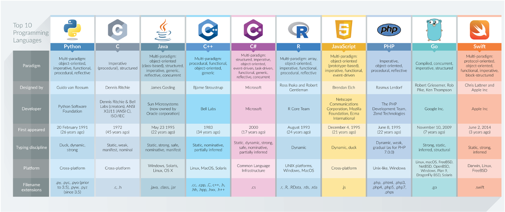
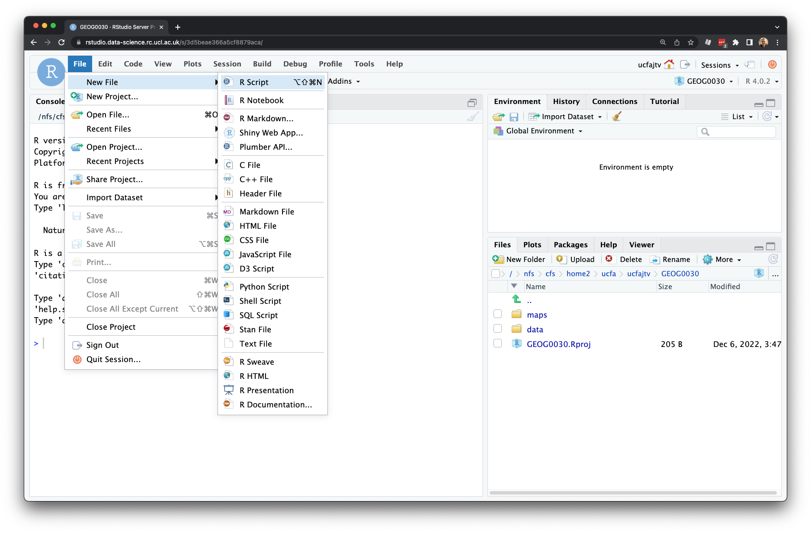
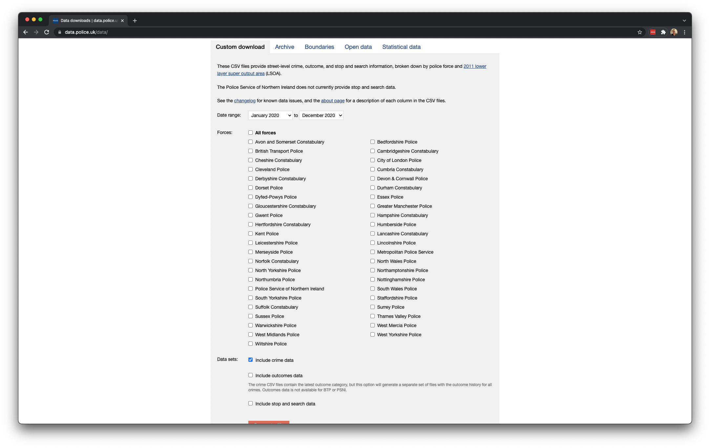
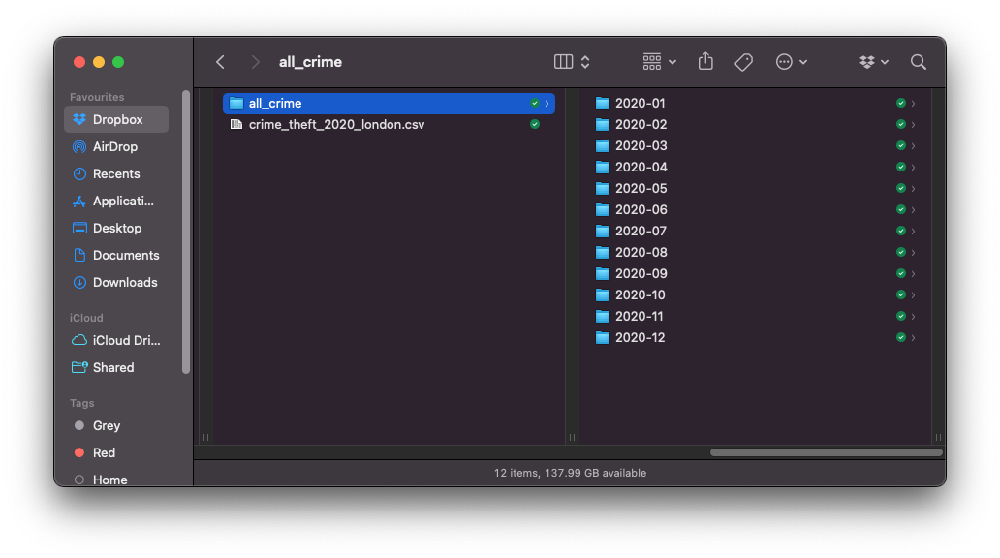

--- 
title: "GEOG0030: Geocomputation"
author: Justin van Dijk
date: "Last modified: `r Sys.Date()`"
site: bookdown::bookdown_site
output: bookdown::gitbook
documentclass: book
link-citations: yes
github-repo: "jtvandijk/GEOG0030"
description: "GEOG0030: Geocomputation handbook."
url: 'https\://jtvandijk.github.io/GEOG0030'
always_allow_html: true
---
# Module Overview {-}

# Module Introduction {-}

```{r 00-welcome, echo=FALSE, out.width = '100%', fig.align='center', cache=TRUE}
knitr::include_graphics('images/general/geocomputation_welcome.png') 
```
*Last modified: `r Sys.Date()`*

## Welcome {-}
Welcome to **Geocomputation**. This module will introduce you both to the principles of spatial analysis as well as provide you with a comprehensive introduction to the use of programming. Over the next ten weeks, you will learn about the theory, methods and tools of spatial analysis through relevant case studies. We will start by using QGIS before moving to the R programming language. You will learn how to find, manage and clean spatial, demographic and socioeconomic datasets, and then analyse them using core spatial and statistical analysis techniques. 

## Moodle {-}
[Moodle](https://moodle.ucl.ac.uk/) is the central point of contact for GEOG0030 and it is where all important information will be communicated such as key module and assessment information. This workbook contains links to all reading material as well as the content of all computer tutorials

## Module overview {-}
The topics covered over the next ten weeks are:

| Week          | Section          | Topic |
| :---          |:---------        |:------------------ |
| 1             | Foundational Concepts | [Geocomputation: An Introduction](geocomputation-an-introduction.html) |
| 2             | Foundational Concepts | [GIScience and GIS software](giscience-and-gis-software.html) | 
| 3             | Foundational Concepts | [Cartography and Visualisation](cartography-and-visualisation.html) | 
| 4             | Foundational Concepts | [Programming for Data Analysis](programming-for-data-analysis.html) |
| 5             | Foundational Concepts | [Programming for Spatial Analysis](programming-for-spatial-analysis.html) |
|               | **Reading week** | **Reading week** |
| 6             | Core Spatial Analysis | [Analysing Spatial Patterns I: Geometric Operations and Spatial Queries](analysing-spatial-patterns-i-geometric-operations-and-spatial-queries.html) |
| 7             | Core Spatial Analysis | [Analysing Spatial Patterns II: Spatial Autocorrelation](analysing-spatial-patterns-ii-spatial-autocorrelation.html) |
| 8             | Core Spatial Analysis | [Analysing Spatial Patterns III: Point Pattern Analysis](analysing-spatial-patterns-iii-point-pattern-analysis.html) |
| 9             | Advanced Spatial Analysis | [Rasters, Zonal Statistics and Interpolation](rasters-zonal-statistics-and-interpolation.html) | 
| 10            | Advanced Spatial Analysis | [Transport Network Analysis](transport-network-analysis.html) | 

## Troubleshooting {-}
Spatial analysis can yield fascinating insights into geographical relationships, albeit at times it can be challenging, particularly when we combine this with learning how to program at the same time. You will most likely encounter many error messages, experience software crashes, and spend hours to identify bugs in your code. However, the rewards of learning how to programmatically solve complex spatial problems will be very much worth it in the end.

If you need specific assistance with this course please:

- Ask a question at the end of a lecture or during the computer practical.
- Attend the Department's **Coding Therapy sessions** that are run on a weekly basis.
- Check the [Moodle](https://moodle.ucl.ac.uk/) assessment tab for queries relating to this module's assessment.

If after pursuing all these avenues you still need help, you can book into our office hours. You can use an office hour to discuss a geographical concept in relation to the material, assessment or for any personal matters relevant to the completion of the module.

## Acknowledgements {-}
This year's workbook is updated and compiled using:

* The [GEOG0030: Geocomputation 2021-2021](https://jo-wilkin.github.io/GEOG0030/coursebook/index.html) workbook as created and compiled by Dr Jo Wilkin.
* The [GEOG0030: Geocomputation 2021-2022](https://jtvandijk.github.io/GEOG0030_20212022/) workbook.

The datasets used in this workbook contain:

* Crime data obtained from [data.police.uk](https://data.police.uk/) (Open Government Licence)
* National Statistics data © Crown copyright and database right [2015] (Open Government Licence) 
* Ordnance Survey data © Crown copyright and database right [2015]
* Public Health England © Crown copyright 2021

<!--chapter:end:index.Rmd-->

# Foundational Concepts {-}
# Geocomputation: An Introduction
This week’s lecture provided you with a thorough introduction on Geocomputation, outlining how and why it is different to a traditional GIScience course. We set the scene for the remainder of the module and explained how the foundational concepts that you will learn in the first half of term sit within the overall module. This week we start easy by setting up our work environment and set up the software that we will  need over the coming weeks.

<!-- ## Lecture slides {#slides-w01} -->
<!-- The slides for this week's lecture can be downloaded here: [[Link]](https://github.com/jtvandijk/GEOG0030/tree/master/data/ppt/w02_geo.pdf). -->

## Reading list {#reading-w01}
#### Essential readings {-}
- Brundson, C. and Comber, A. 2020. Opening practice: Supporting reproducibility and critical spatial data science. *Journal of Geographical Systems* 23: 477–496.  [[Link]](https://doi.org/10.1007/s10109-020-00334-2) 
- Longley, P. *et al.* 2015. Geographic Information Science & Systems, **Chapter 1**: *Geographic Information: Science, Systems, and Society*. [[Link]](https://ucl.rl.talis.com/link?url=https%3A%2F%2Fapp.knovel.com%2Fhotlink%2Ftoc%2Fid%3AkpGISSE001%2Fgeographic-information-science%3Fkpromoter%3Dmarc&sig=e437927b963cc591dcb65491eccdd3869cc31aef80e1443cb2ba12d8f3bb031a)
- Singleton, A. and Arribas-Bel, D. 2019. Geographic Data Science. *Geographical Analysis*. [[Link]](https://doi.org/10.1111/gean.12194)

#### Suggested readings {-}
- Miller, H. and Goodchild, M. 2015. Data-driven geography. *GeoJournal* 80: 449–461. [[Link]](https://doi.org/10.1007/s10708-014-9602-6)
- Goodchild, M. 2009. Geographic information systems and science: Today and tomorrow. *Annals of GIS* 15(1): 3-9. [[Link]](https://doi.org/10.1080/19475680903250715)

## Getting started
Over the next few weeks, we will be taking a closer look at many of the foundational concepts that will ultimately enable you to confidently and competently analyse spatial data using both programming and GIS software.  You will further learn how to plan, structure and conduct your own spatial analysis using programming – whilst making decisions on how to best present your work, which is a crucial aspect of any type of investigation but of particular relevance to your dissertation.

To help with this, we highly recommend that you try to stay organised with your work, including taking notes and making yourself a coding handbook. We would also suggest to list the different datasets you come across - and importantly, the scales and different projections you use them at - more on this over the next weeks. Finally, you should also make notes about the different spatial analysis techniques you come across, including the different properties they assess and parameters they require to run.

## Software 
This course primarily uses the [R](https://www.r-project.org/) programming language, although we start by using [QGIS](https://qgis.org/en/site/) in the next two weeks to give you a basic foundation in the principles of spatial analysis.

:::note
**Note**<br/>
Please follow the instructions below to install both [R](https://www.r-project.org/) and [QGIS](https://qgis.org/en/site/) onto your own personal computer. If you cannot install the software on your personal computer or you are not planning to bring your own laptop to the computer practicals, please refer to the [UCL Desktop and RStudio Server](#ucl) section below. Please make sure that you have access to a working installation of QGIS and R (including relevant packages) **before** the first hands-on practical session next week.
:::

### QGIS Installation
QGIS is an open-source graphic user interface GIS with many community developed add-on packages (or plugins) that provide additional functionality to the software. You can download and install QGIS on your personal machine by going to the QGIS website: [[Link]](https://qgis.org/en/site/forusers/download.html). 

:::note
**Note**<br/>
We recommend installing the **Long Term Release** (*QGIS 3.22 LTR*) as this version should be the most stable version. For Windows users: the QGIS installation may be a little slow.
:::

After installation, start QGIS to see if the installation was successful and no errors are shown after start up.

### R and RStudio Installation 
R is both a programming language and software environment - in the form of RStudio- originally designed for statistical computing and graphics. R’s great strength is that it is open-source, can be used on any computer operating system, and is free for anyone to use and contribute to. Because of this, it is rapidly becoming the statistical language of choice for many academics and has a very large user community with people constantly contributing new packages to carry out all manner of statistical, graphical, and importantly for us, geographical tasks.

Installing R takes a few relatively simple steps involving two programmes. First there is the R programme itself. Follow these steps to get it installed on your computer:

1. Navigate in your browser to your nearest CRAN mirror: [[Link]](https://cran.ma.imperial.ac.uk/)
2. If you use a Windows computer, click on *Download R for Windows*. Then click on *base*.  Download and install **R 4.2.x for Windows**. If you use a Mac computer, click on *Download R for macOS* and download and install **R-4.2.x.pkg**

That is it! You now have installed the latest version of R on your own machine. However, to make working with R a little bit easier we also need to install something called an Integrated Development Environment (IDE). We will use RStudio:

1. Navigate to the official webpage of RStudio: [[Link]](https://posit.co/download/rstudio-desktop/#download)
2. Download and install RStudio Desktop on your computer (**free version!**)

After this, start RStudio to see if the installation was successful and no errors are shown after start up.

### UCL Desktop and RStudio Server {#ucl}
As an alternative to installing QGIS and R with RStudio onto your personal device, there are some other options. Firstly, both programmes are available through [Desktop@UCL Anywhere](https://www.ucl.ac.uk/isd/services/computers/remote-access/desktopucl-anywhere) as well as all UCL computers on campus. In case of R, there is also an RStudio server version available which you can access through your web browser: [[Link]](https://rstudio.data-science.rc.ucl.ac.uk/)

You should be able to log in with your normal UCL username and password. After logging in, you should see the RStudio interface appear. 

```{r 01-rstudio-interface, echo=FALSE, fig.align='center', out.width="90%", fig.cap='The RStudio Server interface.'}
knitr::include_graphics('images/w01/rstudio_interface.png')
```

:::note
**Note**<br>
If it is the first time you log on to RStudio server you may only see the RStudio interface appear once you have clicked on the *start a new session* button. More importantly: if you are not on campus, RStudio server will only work with an active Virtual Private Network (VPN) connection that links your personal computer into UCL’s network. Details on setting up a VPN connection can be found in UCL's VPN connection guides: [[Link]](https://www.ucl.ac.uk/isd/services/get-connected/ucl-virtual-private-network-vpn) 
:::

### R package installation 
Now we have installed or have access to QGIS and R, we need to customise R. Many useful R function come in packages, these are free libraries of code written and made available by other by R users. This includes packages specifically developed for data cleaning, data wrangling, visualisation, mapping, and spatial analysis. To save us some time, we will install all R packages that we will need over the next ten weeks in one go. Now copy and paste the following code into the **console**. You can execute the code by hitting **Enter**. This may take a while.

```{r 01-install-libaries, echo=TRUE, warnings=TRUE, message=TRUE, eval=FALSE, tidy=TRUE}
# install all packages that we need
install.packages(c('tidyverse','sf','tmap','osmdata','RColorBrewer','janitor','spdep','dbscan','raster','spatstat','gstat','dodgr'))
```

Once you have installed the packages, we need to check whether we can in fact load them into our R session. Copy and paste the following code into the **console**, and executed by hitting **Enter** again.

```{r 01-load-libaries, echo=TRUE, warnings=TRUE, message=TRUE, eval=FALSE, verbose=TRUE, tidy=TRUE}
# load all packages
library(tidyverse)
library(sf)
library(tmap)
library(osmdata)
library(RColorBrewer)
library(janitor)
library(spdep)
library(dbscan)
library(raster)
library(spatstat)
library(gstat)
library(dodgr)
```

You will see some information printed to your console but as long as you do not get a message that is similar to `Error: package or namespace load failed for <packagename>` or `Error: package '<packagename' could not be loaded` all should be fine.

:::note
**Note**<br>
Even if you have used R or RStudio Server before and already installed some of the packages in the above list, do re-install all packages to make sure you have the  latest versions. Legacy installations that have not been updated may lay lead to problems when going through the tutorials.
:::

### A note on ArcGIS
[ArcGIS Pro](https://www.esri.com/en-us/arcgis/products/arcgis-pro/overview) (previously ArcMap) is the main commercial GIS software that you may have already used - or seen/heard about through other modules or even job adverts. We do not use ArcGIS Pro in our Practicals for several reasons:

- Computing requirements for ArcGIS Pro are substantial and it **only** operates on the Windows Operating System. For Mac users, using ArcGIS Pro (and ArcMap) would require using either a Virtual Machine or running a copy of Windows OS on a separate partition of your hard drive.
- It is **proprietary** software, which means you need a license to use the software. For those of us in education, the University covers the cost of this license, but when you leave, you will need to pay for a personal license (around £100 for non-commercial use) to continue using the software and repeat any analysis you have used the software for.
- Whilst ArcPro can use pure [Python](https://www.python.org/) (and even R) as a programming language within it through scripts and notebooks, it primarily relies on its own **ArcPy** and **ArcGIS API for Python**  packages to run the in-built tools and analytical functions. To use these packages, you still need a license which makes it difficult to share your code with others *if* they do not have their own ArcGIS license.

Recent developments in the ArcPro software, however, does make it an attractive tool for spatial data science and quantitative geography - it has cross-user functionality, from data analysts who like to use a tool called Notebooks for their code development, to those focused more on cartography and visualisation with in-built bridges to Adobe's Creative Suite. We therefore do not want to put you off looking into ArcGIS in the future, but for this course, we want to ensure the reproducibility of your work.

:::note
**Note**<br/> This also means that the analysis you will be doing for your coursework assignment must be completed in R and QGIS. Specific guidance on the coursework assignment and permitted software will be made available at the end of Reading Week.
:::

## Before you leave {#byl-w01}
You should now be all ready to go with the computer practicals the coming week. [That is it for this week](https://www.youtube.com/watch?v=d8Fmu3RLEOY)!

<!--chapter:end:01-introduction.Rmd-->

# GIScience and GIS software

This week’s lecture introduced you to foundational concepts associated with GIScience and GIS software, with particular emphasis on the representation of spatial data and sample design. Out of all our foundational concepts you will come across in the next four weeks, this is probably the most substantial to get to grips with and has both significant theoretical and practical aspects to its learning. The practical component of the week puts some of these learnings into practice, starting with a short digitisation excercise followed by a simple visualisation of London's population over time.

<!-- ## Lecture slides {#slides-w02} -->
<!-- The slides for this week's lecture can be downloaded here: [[Link]](https://github.com/jtvandijk/GEOG0030/tree/master/data/ppt/w02_geo.pdf). -->

## Reading list {#reading-w02}
#### Essential readings {-}
- Longley, P. *et al.* 2015. Geographic Information Science & Systems, **Chapter 2**: *The Nature of Geographic Data*. [[Link]](https://ucl.rl.talis.com/link?url=https%3A%2F%2Fapp.knovel.com%2Fhotlink%2Ftoc%2Fid%3AkpGISSE001%2Fgeographic-information-science%3Fkpromoter%3Dmarc&sig=e437927b963cc591dcb65491eccdd3869cc31aef80e1443cb2ba12d8f3bb031a)
- Longley, P. *et al.* 2015. Geographic Information Science & Systems, **Chapter 3**: *Representing Geography*. [[Link]](https://ucl.rl.talis.com/link?url=https%3A%2F%2Fapp.knovel.com%2Fhotlink%2Ftoc%2Fid%3AkpGISSE001%2Fgeographic-information-science%3Fkpromoter%3Dmarc&sig=e437927b963cc591dcb65491eccdd3869cc31aef80e1443cb2ba12d8f3bb031a)
- Longley, P. *et al.* 2015. Geographic Information Science & Systems, **Chapter 7**: *Geographic Data Modeling*. [[Link]](https://ucl.rl.talis.com/link?url=https%3A%2F%2Fapp.knovel.com%2Fhotlink%2Ftoc%2Fid%3AkpGISSE001%2Fgeographic-information-science%3Fkpromoter%3Dmarc&sig=e437927b963cc591dcb65491eccdd3869cc31aef80e1443cb2ba12d8f3bb031a)

#### Suggested readings {-}
- Goodchild, M. and Haining, R. 2005. GIS and spatial data analysis: Converging perspectives. *Papers in Regional Science* 83(1): 363–385. [[Link]](https://doi.org/10.1007/s10110-003-0190-y)
- Schurr, C., Müller, M. and Imhof, N. 2020. Who makes geographical knowledge? The gender of Geography’s gatekeepers. *The Professional Geographer* 72(3): 317-331. [[Link]](https://doi.org/10.1080/00330124.2020.1744169)
- Yuan, M. 2001. Representing complex geographic phenomena in GIS. *Cartography and Geographic Information Science* 28(2): 83-96. [[Link]](https://doi.org/10.1559/152304001782173718)

## Simple digitisation of spatial features
To get spatial features in a digital form, they need to be digitised. Let’s take what should be a straight-forward example of digitising the River Thames in London.

```{r 02-digitise, echo=FALSE, fig.align='center', cache=TRUE, out.width="90%", fig.cap='The Thames.'}
knitr::include_graphics('images/w02/river_thames.png')
```

We are going to use a very simple online tool that allows us to create digital data and export the data we create as raw files.

1. Head to [geojson.io](http://geojson.io/#map=12/51.5170/-0.1030).
2. In the bottom left-hand corner, select *Satellite Streets* as your map option.
3. Next, click on the `Draw Linestring` tool which you can find on the right hand side of the screen. You can hover over the icons to get the names of each tool.
4. Now digitise the river Thames. Simply click from a starting point on the left- or right-hand side of the map, and digitise the river.
5. Once you are done, double-click your final point to end your line.
6. You can  click on the line and select *Info* in the pop-up screen to find out how long the line is. 
7. You can export your data using the *Save* menu.

#### Questions {-}

- How easy did you find it to digitise the data and what decisions did you make in your own "sample scheme"? 
- How close together are your clicks between lines? 
- Did you sacrifice detail over expediency or did you spend perhaps a little too long trying to capture ever small bend in the river? 
- How well do you think your line represents the River Thames?

## Population change in London
The second part of this practical will introduces you to **attribute joins** followed by creating a [choropleth map](https://en.wikipedia.org/wiki/Choropleth_map). You will be using different types of *joins* throughout this module, and probably the rest of your career, so it is incredibly important that you understand how they work.

:::note
**Note**<br/>
The datasets you will create in this practical will be used in next week's practical, so make sure to follow every step and save your data carefully.
:::

When using spatial data, there is generally a very specific workflow that you will need to go through and, believe it or not, the majority of this is not actually focused on analysing your data. Along with the idea that 80% of data is geographic data, the second most often-quoted GIS-related unreferenced 'fact' is that anyone working with spatial data will spend 80% of their time simply finding, retrieving, managing and processing the data before any analysis can be done.

One of the reasons behind this need for a substantial amount of processing is that the data you often need to use is almost never  in the format that you require for analysis. For example, for our investigation, there is not a 'ready-made' spatial population dataset (i.e. population `shapefile`) we can download to explore population change across England:

```{r 02-google-shp, echo=FALSE, fig.align='center', cache=TRUE, out.width="90%", fig.cap='Alas a quick Google search shows that finding a shapefile of England\'s population is not straightforward.'}
knitr::include_graphics('images/w02/datasearch.png')
```

Instead, we need to go and find the raw datasets and create the data layers that we want. As a result, before beginning any spatial analysis project, it is best-practice to think through what end product you will ultimately need for your analysis.

A typical spatial analysis workflow usually looks something like this:

- **Identify** the data you need to complete your analysis i.e. answer your research questions. This includes thinking through the scale, coverage and currency of your dataset.
- **Find** the data that matches your requirements, e.g. is it openly and easily available?
- **Download** the data and store it in the correct location.
- **Clean** the data. This may be done before or after ingesting your data into your chosen software programme.
- **Load** the data into your chosen software programme.
- **Transform and process** the data. This may require re-projection, creating joins between datasets, calculating new fields and applying selections.
- **Analyse** your data using appropriate methods.
- **Visualise** your data and results with graphs and maps.
- **Communicate** your results.

As you can see, the analysis and visualisation part comes quite late in the overall spatial analysis workflow - and instead, the workflow is very top-heavy with data management. However, very often in GIS-related courses you will be given pre-processed datasets. Because data management is an essential part of your workflow, we are clean (the majority of) our data from the get-go. This will help you understand the processes that you will need to go through in the future as you search for and download your own data, as well as deal with the data first-hand before loading it into our GIS software.

### Setting the scene {#w02-scene}
For this practical, we will investigate how the population in London has changed over time. Understanding population change - over time and space - is spatial analysis at its most fundamental. We can understand a lot just from where population is growing or decreasing, including thinking through the impacts of these changes on the provision of housing, education, health and transport infrastructure. 

We can also see first-hand the impact of wider socio-economic processes, such as urbanisation. Today we will look at population in London in 2011, 2015, and 2019 at the *Ward* scale that we can use within our future analysis projects, starting next week. 

:::note
**Note**<br/>
We will use the population dataset to *normalise* other datasets. Why? When we record events created by humans, there is often a population bias: simply, more people in an area will by probability lead to a higher occurrence of said event, such as crime. We will look at this in greater detail next week.
:::

### Finding data {#w02-finding}
In the UK, finding authoritative data on population and *Administrative Geography* boundaries is increasingly straight-forward. Over the last decade, the UK government has opened up many of its datasets as part of an **Open Data** precedent that began in 2010 with the creation of [data.gov.uk](data.gov.uk) and the Open Government Licence (the terms and conditions for using data).

[Data.gov.uk](www.data.gov.uk) is the UK government’s central database that contains open data that the central government, local authorities and public bodies publish. This includes, for example, aggregated census and health data – and even government spending. In addition to this central database, there are other authoritative databases run by the government and/or respective public bodies that contain either a specific type of data (e.g. census data, crime data) or a specific collection of datasets (e.g. health data from the NHS, data about London). Some portals are less up-to-date than others, so it is wise to double-check with the ‘originators’ of the data to see if there are more recent versions.

For our practical, we will access data from two portals:

1. For our administrative boundaries, we will download the **spatial** data from the *London Datastore* (which is exactly what it sounds like).
2. For population, we will download **attribute** data from the *Office of National Statistics (ONS)*.

### Housekeeping {#w01-housekeeping}
Before we download our data, it is important to establish an organised file systems that we will use throughout the module:

1. Create a `GEOG0030` folder in your `Documents` folder on your computer.
2. Within your `GEOG0030` folder, create the following subfolders: 

| Folder name | Purpose      |
| :----        | :----------- |
| `data`      | To store both raw data sets and final outputs. |
| `maps`      | To save the maps you produce during your tutorials. |

3. Within your `data` folder, create the following subfolders: 

| Folder name | Purpose      |
| :---        | :----------- |
| `raw`       | To store all your raw data files that have not yet been processed. |
| `output`    | To store all your final data files that have been processed and analysed, potentially ready to be mapped. |

### Downloading data {#w02-downloading}
We will start by downloading the administrative geography boundaries:

1. Navigate to the relevant page on the London Datastore: [[Link]](https://data.london.gov.uk/dataset/statistical-gis-boundary-files-london).
2. Download all three zipfiles to your computer: `statistical-gis-boundaries-london.zip`, `London-wards-2014.zip` and `London-wards-2018.zip`.

The first dataset contains all levels of London’s administrative boundaries. In descending size order: Borough, Ward, Middle layer Super Output Area (MSOA), Lower layer Super Output Area (LSOA), and Output Area (OA) based on the 2011 Census. The second dataset contains an *updated* version of the Ward boundaries, as of 2014. The third dataset contains yet another *updated* version of the Ward boundaries, as of 2018. As we will be looking at population data for 2015 and 2019, it is best practice to use those boundaries that are most reflective of the ‘geography’ at the time; therefore, we will use these 2014 / 2018 Ward boundaries for our 2015 / 2019 population dataset, respectively. 

:::note
**Note** <br/>
Once downloaded, you will need to unzip all files before you can use them. To unzip the file, you can use the built-in functionality of your computer’s operating system. For Windows: right click on the zip file, select **Extract All**, and then follow the instructions. For Mac OS: double-click on the the zip file and it should unzip automatically.
:::

Once unzipped, you will find two folders: *Esri* and *MapInfo.* These folders contain the same data but in different data formats: **Esri shapefile** and **MapInfo TAB**. 

:::note
**Note** <br/>
MapInfo is another proprietary GIS software, which has historically been used in public sectors services in the UK and abroad, although has generally been replaced by either Esri’s ecosystem or open-source software GIS.
:::

Now open your `GEOG0030/data/raw/` folder and create a new folder called `boundaries`. Within this folder, create three new folders: `2011`, `2014` and `2018`. Copy the entire contents of `Esri` folder of each year into their respective year folder. 

We do not want to add the additional `Esri` folder as a step in our filesystem, i.e. your file paths should read: `GEOG0030/data/raw/boundaries/2011` for the 2011 boundaries, `GEOG0030/data/raw/boundaries/2014` for the 2014 boundaries, and `GEOG0030/data/raw/boundaries/2018` for the 2018 boundaries.

```{r 02-setup, echo=FALSE, fig.align='center', out.width="90%", fig.cap='Your setup should look something like this.'}
knitr::include_graphics('images/w02/file_management.png')
```

We now have our administrative geography files ready for use. 

:::note
**Note** <br/>
Administrative geographies are a way of dividing the country into smaller sub-divisions or areas that correspond with the area of responsibility of local authorities and government bodies. These administrative sub-divisions and their associated geography have several important uses, including assigning electoral constituencies, defining jurisdiction of courts, planning public healthcare provision, as well as what we are concerned with: used as a mechanism for collecting census data and assigning the resulting datasets to a specific administrative unit. These geographies are updated as populations evolve and as a result, the boundaries of the administrative geographies are subject to either periodic or occasional change. The UK has quite a complex administrative geography, particularly due to having several countries within one overriding administration and then multiple ways of dividing the countries according to specific applications. More details on the administrative geographies of the UK can be found on the website of the [Office for National Statistics](https://www.ons.gov.uk/methodology/geography/ukgeographies/administrativegeography).
:::

For our population datasets, we will use the ONS mid-year estimates (MYE). These population datasets are estimates that are based on the 2011 census count and then updated with estimated population growth. They are released once a year, with a delay of a year. Today we will use the data for 2011, 2015, and 2019.

1. Navigate to the *Ward* level datasets: [[Link]](https://www.ons.gov.uk/peoplepopulationandcommunity/populationandmigration/populationestimates/datasets/wardlevelmidyearpopulationestimatesexperimental)
2. When you navigate to this page, you will find multiple choices of data to download. We will need to download the estimates for **2011, 2015** and **2019**. Click to download each of the zipfiles. Choose the **revised** versions for 2015 and the (Census-based) 2011 Wards edition for 2011. 
3. In your `GEOG0030/data/raw/` folder, create a new folder called `population`, unzip your downloaded files, and copy the three spreadsheets to the newly created `population` folder. 
4. Rename the files you donwloaded to: `MYE_ward_2011.xls`, `MYE_ward_2015.xls`, and `MYE_ward_2019.xlsx`.

Now it is time to do some quite extensive data cleaning and preparation.

### Cleaning data {#w02-cleaning}
When you open up any of the Ward spreadsheets in Excel =, you will notice that there are several worksheets contained in this workbook. However, we are only interested in the total population tab. We therefore need to copy over the data from the 2011, 2015 and 2019 datasets into separate `csv` files.

#### London population in 2011
1. Open the 2011 Ward spreadsheet in Excel.
2. Click on the `Mid-2011 Persons` tab and have a look at the data. As you should be able to see, we have a set of different fields (e.g. `Ward Code`, `Ward Name`), including population counts. Because we do not need all the data in the spreadsheet, we will extract only the data we need for our analysis. This means we need the total population (`All Ages`) data, alongside some identifying information that distinguishes each record from one another. Here we can see that both `Ward Code` and `Ward Name` suit this requirement. We can also think that the `Local Authority` column might be of use, so we also keep this information.
3. Create a new Excel spreadsheet Excel and from the `Mid-2011 Persons` spreadsheet, copy over all cells from columns **A** to **D** and rows **4 to 636** into this new spreadsheet. Row 636 denotes the end of the *Greater London* Wards (i.e. the end of the *Westminster Local Authority*) which are kept (in most scenarios) at the top of the spreadsheet as their **Ward Codes** are the first in sequential order. 
4. Before we go any further, we need to format our data. First, we want to rename our fields to remove the spaces and superscript formatting. Re-title the fields as follows: `ward_code`, `ward_name`, `local_authority` and `pop2011`. 
5. One further bit of formatting that you must do before saving your data is to format our population field. At the moment, you will see that there are commas separating the thousands within our values. If we leave these commas in our values, QGIS will read them as decimal points, creating decimal values of our population. There are many points at which we could solve this issue, but the easiest point is now - we will strip our population values of the commas and set them to integer (whole numbers) values. To format the `pop2011` column, select the entire column and right-click on the `D` cell.  Click on **Format Cells** and set the Cells to **Number** with **0** decimal places. You should see that the commas are now removed from your population values.
6. Save your spreadsheet into your `output` folder as `ward_population_2011.csv`.

#### London population in 2015
1. Open the 2015 Ward spreadsheet in Excel. 
2. As you will see again, there are plenty of worksheets available and we want to select the `Mid-2015 Persons` tab. We now need to copy over the data from our 2015 dataset to a new spreadsheet again. However,  at first instance, you will notice that the City of London (CoL) Wards are missing from this dataset. Then if you scroll to the end of the London Local Authorities, i.e. to the bottom of Westminster, what you should notice is that the final row for the Westminster data is in fact row 575 - this suggests we are missing the data fror some Local Authorities (LAs). We need to determine which ones are missing and try to find them in the 2015 spreadsheet. With this in mind, start by copying over all cells from columns **A** to **D** and rows **5 to 575** into a new spreadsheet. 
3. If you were to compare the names of the London Boroughs that we have now copied with the full list, you would notice that we are missing *City of London*, *Hackney*, *Kensington and Chelsea*, and *Tower Hamlets*. If we head back to the original 2015 raw dataset, we can actually find this data (as well as the City of London) further down in the spreadsheet. It seems like these LAs had their codes revised in the 2014 revision and are no longer in the same order as the 2011 dataset.
4. Locate the data for the *City of London*, *Hackney*, *Kensington and Chelsea* and *Tower Hamlets* and copy this over into our new spreadsheet. Double-check that you now have in total **637** Wards within your dataset.
5. Remember to rename the fields as above, but change your population field to **pop2015**. Also, remember to reformat the values in your `pop2015` column.
6. Once complete, save your spreadsheet into your `output` folder as `ward_population_2015.csv`.

#### London population in 2019
1. Open the 2019 Ward spreadsheet in Excel. This time we are interested in the `Mid-2019 Persons` tab.
2. This time the data that we are interested in can be found in columns `A`, `B`, `D` and `G`. Because the columns that we want are not positioned next to one another, start by hiding columns `C`, `E` and `F`. You can do this by right-clicking on the colums you want to hide and selecting **Hide**.
3. Next, copy the data from **row 5 to the final row for the Westminster data** for columns `A`, `B`, `D` and `G` over into a new spreadsheet.
4. If you look at the total rows that we have copied over, we have even fewer Wards than the 2015 dataset. This time we are not only missing data for *City of London*, *Hackney*, *Kensington and Chelsea*, *Tower Hamlets* but also for *Bexley*, *Croydon*, *Redbridge*, and *Southwark*.
5. Copy over the remaining Wards for these Local Authorities/Boroughs.
6. Once you've copied them over - you should now have **640** Wards. Delete columns `C`, `E` and `F` and rename the remaining fields as you have done previously. Also, remember to reformat the values in your `pop2019` column.
7. Once complete, save your spreadsheet into your `output` folder as `ward_population_2019.csv`.

You should now have your three population `csv` datasets in your `output` folder. We are now (finally) ready to start using our data within QGIS.

### Using QGIS to map our population data

#### Setting up a project
We will now use QGIS to create population maps for the Wards in London across our three time periods. To achieve this, we need to **join our table data to our spatial datasets** and then map our populations for our visual analysis. 

Because, as we have seen above, we have issues with the number of Wards and changes in boundaries across our three years, we will not (for now) complete any quantitative analysis of these population changes - this would require significant additional processing that we do not have time for today. 

:::note
**Note** <br/>
Data interoperability is a key issue that you will face in spatial analysis, particularly when it comes to Administrative Geographies. 
:::

1. Start **QGIS**.
Let's start a new project.
2. Click on **Project** -> **New**. Save your project as `w2-pop-analysis`. Remember to save your work throughout the practical. 
3. Before we get started with adding data, we will first set the Coordinate Reference System of our Project. Click on **Project** -> **Properties -- CRS**. In the Filter box, type **British National Grid**. Select **OSGB 1936 / British National Grid - EPSG:27700** and click Apply. Click **OK**.

:::note
**Note**<br/>
We will explain CRSs and using CRSs in GIS software in more detail next week.
:::
    
#### Adding layers
We will first focus on loading and joining the 2011 datasets. 

1. Click on **Layer** -> **Add Layer** -> **Add Vector Layer**.

2. With **File** select as your source type, click on the small three dots button and navigate to your 2011 boundary files.

3. Here, we will select the `London_Ward.shp` dataset. Click on the `.shp` file of this dataset and click **Open**. Then click **Add**. You may need to close the box after adding the layer.

We can take a moment just to look at our Ward data - and recognise the shape of London. Can you see the City of London in the dataset? It has the smallest Wards in the entire London area. With the dataset loaded, we can now explore it in a little more detail. We want to check out two things about our data: first, its **Properties** and secondly, its **Attribute Table**. 

4. Right-click on the `London_Ward` layer and open the **Attribute Table** and look at how the attributes are stored and presented in the table. Explore the different buttons in the Attribute Table and see if you can figure out what they mean. Once done, close the Attribute Table.
5. Right-click on the `London_Ward` layer and select **Properties**. Click through the different tabs and see what they contain. Keep the **Properties** box open.

Before adding our population data, we can make a quick map of the Wards in London - we can add labels and change the *symbolisation* of our Wards.

6. In the **Properties** box, click on the **Symbology** tab - this is where we can change how our data layer looks. For example, here we can change the line and fill colour of our Wards utilising either the default options available or clicking on **Simple Fill** and changing these properties directly. Keep the overall **styling** to a **Single Symbol** for now - we will get back to this once we have added the population data. You can also click on the **Labels** tab - and set the Labels option to **Single labels**. 

7. QGIS will default to the **NAME** column within our data. You can change the properties of these labels using the options available. Change the font to **Futura** and size **8** and under the add a small buffer to the labels by selecting **Draw text bufer** under the **Buffer** tab. You can click **Apply** to see what your labels look like. Please note that the background colour may differ.

```{r 02-busy-labels, echo=FALSE, fig.align='center', fig.cap='It looks incredibly busy.'}
knitr::include_graphics('images/w02/wardlabels.png')
```

8. Click **OK** once you are done changing the Symbology and Label style of your data to return to the main window. 

:::note
**Note**<br/>
The main strength of a GUI GIS system is that is really helps us understand how we can visualise spatial data. Even with just these two shapefiles loaded, we can understand two key concepts of using spatial data within GIS.

The first, and this is only really relevant to GUI GIS systems, is that each layer can either be turned on or off, to make it visible or not (try clicking the tick box to the left of each layer). This is probably a feature you are used to working with if you have played with interactive web mapping applications before!

The second concept is the order in which your layers are drawn – and this is relevant for both GUI GIS and when using plotting libraries such as `ggplot2` or `tmap` in RStudio. Your layers will be drawn depending on the order in which your layers are either tabled (as in a GUI GIS) or ‘called’ in your function in code.

Being aware of this need for 'order' is important when we shift to using RStudio and `tmap` to plot our maps, as if you do not layer your data correctly in your code, your map will end up not looking as you hoped!

For us using QGIS right now, the layers will be drawn from bottom to top. At the moment, we only have one layer loaded, so we do not need to worry about our order right now - but as we add in our 2015 and 2018 Ward files, it is useful to know about this order as we will need to display them individually to export them at the end.
:::

#### Conducting an attribute join
We are now going to join our 2011 population data to our 2011 shapefile. First, we need to add the 2011 population data to our project. 

1. Click on **Layer** -> **Add Layer** -> **Add Delimited Text Layer**.

2. Click on the three dots button again and navigate to your **2011 population data** in your `working` folder. Your file format should be set to `csv`. You should have the following boxes clicked under the **Record and Field options** menu: `Decimal separator is comma`, `First record has field names`, `Detect field types` and `Discard empty fields`. QGIS does many of these by default, but do double-check!

3. Set the Geometry to *No geometry (attribute only table)* under the **Geometry Definition** menu. Then click **Add** and **Close**. You should now see a table added to your `Layers` box.

We can now join this table data to our spatial data using an **Attribute Join**.

:::note
**Note**<br>
An attribute join is one of two types of data joins you will use in spatial analysis (the other is a spatial join, which we will look at later on in the module). An attribute join essentially allows you to join two datasets together, as long as they share a common attribute to facilitate the ‘matching’ of rows:

```{r 02-join-those-attributes, echo=FALSE, fig.align='center', fig.caps='Figure from Esri documentation on Attribute Joins.'}
knitr::include_graphics('images/w02/attribute_joins.png')
```

Essentially you need a **single identifying ID** field for your records within both datasets: this can be a code, a name or any other string of information. In spatial analysis, we always **join our table data to our shape data** (One way to think about it as attaching the table data to each shape). 

As a result, your target layer is always the shapefile (or spatial data) whereas your join layer is the table data. These are known as the left- and right-side tables when working with code. 

**To make a join work, you need to make sure your ID field is correct across both datasets**, i.e. no typos or spelling mistakes. Computers can only follow instructions, so they do not know that *St. Thomas* in one dataset is that same as *St Thomas* in another, or even *Saint Thomas*! It will be looking for an exact match! 

As a result, whilst in our datasets we have kept both the name and code for both the boundary data and the population data, **when creating the join, we will always prefer to use the CODE over their names**. Unlike names, codes reduce the likelihood of error and mismatch because they do not rely on understanding spelling! 

Common errors, such as adding in spaces or using `0` instead `O` (and vice versa) can still happen – but it is less likely. 
:::

To make our join work, we need to check that we have a matching **UID** across both our datasets. We therefore need to look at the tables of both datasets and check what attributes we have that could be used for this possible match.

4. Open up the Attribute Tables of each layer and check what fields we have that could be used for the join. We can see that both our respective "code" fields have the same codes (`ward_code` and `GSS_code`) so we can use these to create our joins.

5. Right-click on your `London_Ward` layer -> **Properties** and then click on the **Joins** tab. 
- Click on the **+** button. Make sure the **Join Layer** is set to `ward_population_2011`.
- Set the **Join field** to `ward_code`.
- Set the **Target field** to `GSS_code`.
- Click the **Joined Fields** box and click to only select the `pop2011` field.
- Click on the **Custom Field Name Prefix** and **remove** the pre-entered text to leave it blank.
- Click on **OK**.
- Click on **Apply** in the main Join tab and then click **OK** to return to the main QGIS window.

We can now check to see if our join has worked by opening up our `London_Ward` **Attribute Table** and looking to see if our Wards now have a **Population** field attached to it.

6. Right-click on the `London_Ward` layer and open the **Attribute Table** and check that the population data column has been added to the table.

As long as it has joined, you can move forward with the next steps. If your join has not worked, try the steps again - and if you are still struggling, do let us know.

:::note
**Note**<br />
Now, the join that you have created between your Ward and population datasets in only held in QGIS's memory. If you were to close the programme now, you would lose this join and have to repeat it the next time you opened QGIS. To prevent this from happening, we need to export our dataset to a new shapefile - and then re-add this to the map.
:::

Let's do this now:

7. Right-click on your `London_Ward` shapefile and click **Export** -> **Save Features As...**. The format should be set to an ESRI shapefile.
- Then click on the three dots buttons and navigate to your `output` folder and enter: `ward_population_2011` as your file name.
- Check that the **CRS** is **British National Grid**.
- Leave the remaining fields as selected, but check that the **Add saved file to map** is checked. Click **OK**.

You should now see our new shapefile add itself to our map. You can now remove the original `London_Ward` and `ward_population_2011` datasets from our Layers box (Right-click on the layers and opt for **Remove Layer...**).

The final thing we would like to do with this dataset is to style our dataset by our newly added population field to show population distribution around London.

8. To do this, again right-click on the **Layer** -> **Properties** -> **Symbology**.
- This time, we want to style our data using a **Graduated** symbology.
- Change this option in the tab and then choose `pop2011` as your column. 
- We can then change the color ramp to suit our aesthetic preferences - *Viridis* seems to be the cool colour scheme at the moment, and we will choose to invert our ramp as well. 
- The final thing we need to do is **classify** our data - what this simply means is to decide how to group the values in our dataset together to create the graduated representation. 
- We will be looking at this in later weeks, but for now, we will use the **Natural Breaks** option. 
- Click on the drop-down next to Mode, select **Natural Breaks**, change it to **7** classes and then click **Classify**.
- Finally click **Apply** to style your dataset.

:::note
**Note**<br/>
Understanding what classification is appropriate to visualise your data is an important step within spatial analysis and visualisation, and something you will learn more about in the following weeks. Overall, they should be determined by understanding your data's distribution and match your visualisation accordingly.

Feel free to explore using the different options with your dataset at the moment – the results are almost instantaneous using QGIS, which makes it a good playground to see how certain parameters or settings can change your output.
:::

You should now be looking at something like this:

```{r 02-ward-result, echo=FALSE, fig.align='center', fig.cap='Your result.'}
knitr::include_graphics('images/w02/ward_2011.png')
```

You will be able to see that we have **some** missing data - and this is for several Wards within the City of London.  This is because census data is **only recorded for 8 out of the 25 Wards** and therefore we have no data for the remaining Wards. As a result, these Wards are left blank, i.e. white, to represent a `NODATA` value. 

:::note
**Note** <br/>
One thing to flag is that `NODATA` means no data - whereas `0`, particularly in a scenario like this, would be an actual numeric value. It is important to remember this when processing and visualising data, to make sure you do not represent a `NODATA` value incorrectly.
:::

### Exporting map for visual analysis
To export your map select only the map layers you want to export and then opt for **Project** -> **Import/Export** -> **Export to Image** and save your final map in your `maps` folder. You may want to create a folder for these maps titled `w02`.

Next week, we will look at how to style our maps using the main map conventions (adding North Arrows, Scale Bars and Legends) but for now a simple picture will do. 

## Assignment {#assignment-w02}
You now need to **repeat the entire process** for your 2015 and 2019 datasets. Remember, you need to:

- Load the respective Ward dataset as a Vector Layer.
- Load the respective Population dataset as a Delimited Text File Layer (remember the settings!).
- Join the two datasets together using the Join tool in the Ward dataset Properties box.
- Export your joined dataset into a new dataset within your `output` folder.
- Style your data appropriately.
- Export your maps as an image to your `maps` folder.

To make visual comparisons against our three datasets, theoretically we would need to standardise the breaks at which our classification schemes are set at. To set all three datasets to the same breaks, you can do the following:

- Right-click on the `ward_population_2019` dataset and navigate to the `Symbology` tab. Double-click on the Values for the smallest classification group and set the Lower value to 141 (this is the lowest figure across our datasets, found in the 2015 data). Click **OK**, then click **Apply**, then click **OK** to return to the main QGIS screen.
-  Right-click again on the `ward_population_2019` dataset but this time, click on **Styles** -> **Copy Styles** -> **Symbology**.
- Now right-click on the `ward_population_2015` file, but this time after clicking on **Styles** -> **Paste Style** -> **Symbology**. You should now see the classification breaks in the 2015 dataset change to match those in the 2019 data.
- Repeat this for the 2011 dataset as well.
- The final thing you need to do is to now change the classification column in the `Symbology` tab for the 2015 and 2011 datasets back to their original columns and press **Apply**. You will see when you first load up their Symbology options this is set to *pop2019*, which of course does not exist within this dataset.

## Before you leave {#byl-w02}
Save your project so you can go back to it if you need to, other than that [that is it for this week](https://www.youtube.com/watch?v=Wmc8bQoL-J0)!

<!--chapter:end:02-GIScience.Rmd-->

# Cartography and Visualisation

This week’s lecture has given you an in-depth introduction into how we can create a successful map, including understanding map projections, cartographic conventions and issues faced with the analysis of aggregated data at areal units. The practical component of the week puts some of these learnings into practice as we analyse crime rates within London at two different scales.

<!-- ## Lecture slides {#slides-w03} -->
<!-- The slides for this week's lecture can be downloaded here: [[Link]](https://github.com/jtvandijk/GEOG0030/tree/master/data/ppt/w02_geo.pdf). -->

## Reading list {#reading-w03}
#### Essential readings {-}
- Longley, P. *et al.* 2015. Geographic Information Science & Systems, **Chapter 4**: *Georeferencing*. [[Link]](https://ucl.rl.talis.com/link?url=https%3A%2F%2Fapp.knovel.com%2Fhotlink%2Ftoc%2Fid%3AkpGISSE001%2Fgeographic-information-science%3Fkpromoter%3Dmarc&sig=e437927b963cc591dcb65491eccdd3869cc31aef80e1443cb2ba12d8f3bb031a)
- Longley, P. *et al.* 2015. Geographic Information Science & Systems, **Chapter 11**: *Cartography and Map Production*. [[Link]](https://ucl.rl.talis.com/link?url=https%3A%2F%2Fapp.knovel.com%2Fhotlink%2Ftoc%2Fid%3AkpGISSE001%2Fgeographic-information-science%3Fkpromoter%3Dmarc&sig=e437927b963cc591dcb65491eccdd3869cc31aef80e1443cb2ba12d8f3bb031a)
- Wong, D. 2009. Modifiable Areal Unit Problem. *International Encyclopedia of Human Geography* 169-174. [[Link]](https://doi.org/10.1016/B978-008044910-4.00475-2)

#### Suggested readings {-}
- Longley, P. *et al.* 2015. Geographic Information Science & systems, **Chapter 12**: *Geovisualization*. [[Link]](https://ucl.rl.talis.com/link?url=https%3A%2F%2Fapp.knovel.com%2Fhotlink%2Ftoc%2Fid%3AkpGISSE001%2Fgeographic-information-science%3Fkpromoter%3Dmarc&sig=e437927b963cc591dcb65491eccdd3869cc31aef80e1443cb2ba12d8f3bb031a)
- Usery, L. and Seong, J. 2001. All equal-area map projections are created equal, but some are more equal than others. *Cartography and Geographic Information Science* 28(3): 183-194. [[Link]](https://doi.org/10.1559/152304001782153053)

## Crime in London I
Over the next few weeks, we will look to model driving factors behind crime across London from both a statistical and spatial perspective. As [Reid *et al.* (2018)](https://www.oxfordbibliographies.com/view/document/obo-9780195396607/obo-9780195396607-0123.xml) argue:

> Spatial analysis can be employed in both an exploratory and well as a more confirmatory manner with the primary purpose of identifying how certain community or ecological factors (such as population characteristics or the built environment) influence the spatial patterns of crime. 

Against this background, we are actually going to answer a very simple question today: does our perception of crime (and its distribution) in London vary at different scales? Here we are looking to test whether we would make the **ecological fallacy** mistake of assuming patterns at the Ward level are the same at the Borough level by looking to directly account for the impact of the Modifiable Area Unit Problem within our results. To test this, we will use these two administrative geographies to aggregate crime data for London in 2020. Here we will be looking specifically at a specific type of crime: *Theft from a person*.

### Finding our datasets {#w03-finding} 
As we saw last week, accessing data within the UK, and specifically for London, is relatively straight-forward - you simply need to know which data portal contains the dataset you want!    

:::note
**Note**<br/>
The datasets you will create in this practical will be used in other practicals, so make sure to follow every step and export your data into your `output` folder at the end. The practical will also introduce you to point-in-polygon counts. You will be using this type of analysis throughout this module, so it is incredibly important that you understand how they work – even as seemingly simple as they may be!
:::

#### Crime data 
For our crime data, we will use data directly from the **Police Data Portal**, which you can find at https://data.police.uk/. This Data Portal allows you to access and generate tabular data for crime recorded in the U.K. across different the different Police Forces since 2017. 

In total, there are 45 territorial police forces (TPF) and 3 special police forces (SPF) of the United Kingdom. Each TPF covers a specific area in the UK (e.g. the "West Midlands Police Force"), whilst the SPFs are cross-jurisdiction and cover specific types of crime, such as the British Transport Police. Therefore, when we want to download data for a specific area, we need to know which Police Force covers our area interest.

When you look to download crime data for London, for example, there are **two** territorial police forces working within the city and its greater metropolitan area: 

1) **The Metropolitan Police Force (The Met)**, which covers nearly the entire London area, including Greater London

2) **The City of London (CoL) Police**, which covers the City of London. The Met has no jurisdiction in the CoL.

You therefore need to decide if you want to include an analysis of crime in the City of London or not - we will in our current study.

#### Population data 
We know that if we want to study a phenomena like crime and aggregate it to an areal unit, we will need to normalise this by our population. Luckily, we already sorted out our Ward population dataset last week (i.e. `ward_population_2019.shp`). In addition to our **Ward** level dataset, we also want to generate the same type of shapefile for our London **Boroughs**, i.e. a `borough_population_2019.shp`, utilising the same approach as last week, joining our population table data to our Borough shape data. To do this, we need to know where to get both our required datasets from - fortunately, you  already have a Borough shapefile in your `raw/boundaries/2011` folder. Therefore, it is just a case of tracking down the same Mid-Year Estimates (MYE) for London Boroughs as we did for the Wards. 

:::note
**Note** <br/>
Because the boundaries of the London Boroughs have not been changed since 1965, we can get away with using the 2011 `shapefile` instead of having to download a more up to date version. 
:::

### Downloading data {#w03-downloading}
As outlined above, to get going with our analysis, we need to download both the **population** data for our Boroughs and the 2020 **crime** data for our two police forces in London. 

Let us tackle the population data first.

#### Borough population
Through a quick search, we can find our Borough population table data pretty much in the same place as our Ward data - however it is a separate spreadsheet to download.

1. Navigate to the data on the website of the Office for National Statistics: [[Link]](https://www.ons.gov.uk/peoplepopulationandcommunity/populationandmigration/populationestimates/datasets/populationestimatesforukenglandandwalesscotlandandnorthernireland).

2. Download the **Mid-2019: April 2020 local authority district codes** `.xls` file.

3. Open the dataset in your spreadsheet editing software and navigate to the `MYE2-Persons` tab. Now extract: `Code`, `Name`, `Geography` and `All ages` data for all London Boroughs.
You should have a total of **33** Boroughs.

4. Once you have your 33 Boroughs separated from the rest of the data, copy the columns (`Code`, `Name`, `Geography` and `All ages`) and respective data for each Borough into a new `csv`.

5. Remember to format the **field names**. Like last week, also remember to make sure that the `All ages` field is recognised as a **numeric** field. Save as a new `csv` in your `output` folder: `borough_population_2019.csv`.

#### Ward population
As mentioned above, you should already have a `ward_population_2019.shp` file within your `output` data folder. 

#### Crime data
Normally, we would now head to the Police Data Portal and download our crime data. However, the manual processing that is required is too exhaustive to do manually - and far (far!) easier to do using programming. As such you can download a pre-filtered spreadsheet instead. Unzip the download and copy the `csv` into a **new** folder in your `raw` data folder called: `crime`.

#### File download {-}
| File                                                 | Type           | Link |
| :------                                              | :------        | :------ |
| Theft from persons in 2020                           | `csv`    | [Download](https://github.com/jtvandijk/GEOG0030/tree/master/data/zip/crime_theft_2020_london.zip) |

:::note
**Note** <br/>
When mapping the data from the provided longitude and latitude coordinates, it is important to know that these locations represent the approximate location of a crime — not the exact place that it happened. This displacement occurs to preserve anonymity of the individuals involved. The process by how this displacement occurs is standardised. There is a list of anonymous map points to which the exact location of each crime is compared against this master list to find the nearest map point. The co-ordinates of the actual crime are then replaced with the co-ordinates of the map point. Each map point is specifically chosen to avoid associating that point with an exact household. Interestingly enough, the police also convert the data from their recorded BNG eastings and northings into WGS84 latitude and longitude.
:::

### Using QGIS to map our crime data 

#### Setting up a project
1. Start **QGIS**

2. Click on **Project** -> **New**. Save your project as `w3-crime-analysis`. Remember to save your work throughout the practical. 

3. Before we get started with adding data, we will first set the Coordinate Reference System of our Project. Click on **Project** -> **Properties -- CRS**. In the Filter box, type **British National Grid**. Select **OSGB 1936 / British National Grid - EPSG:27700** and click **Apply**. Click **OK**.

Now we have our **Project CRS** set, we are ready to start loading and processing our data.

#### Adding layers
1. Click on **Layer** -> **Add Layer** -> **Add Vector Layer**.

2. With **File** select as your source type, click on the small three dots button and navigate to your `ward_population_2019.shp` in your `output` folder. Click on the `.shp` file of this dataset and click **Open**. Then click **Add**. You may need to close the box after adding the layer.

We now need to create our Borough population shapefile - and to do so, we need to repeat exactly the same process as last week in terms of joining our table data to our shapefile. You should now be able to do this, so we will not provide you with detailed instructions. Remember, you need to:

* Load the respective Borough dataset as a Vector Layer found in your `raw/boundaries/2011` data folder: `London_Borough_Excluding_MHW.shp`.

* Load the respective population dataset that you just created as a **Delimited Text File Layer**. Remember the settings, including no geometry!

* Join the two datasets together using the **Join** tool in the Borough dataset **Properties** box. Remember which fields to use, which to add, and to remove the prefix.

* Export your joined dataset into a new dataset within your `output` folder: `borough_population_2019.shp`.

* Make sure this dataset is loaded into your **Layers** / Added to the map.

* Remove the original Borough and population data layers.

Once this is done, we are ready to load and map our crime data. We will load this data using the **Delimited Text File Layer** option you would have used just now to load the Borough population - but this time, we will be adding point coordinates to map our crime data as points.

1. Click on **Layer** -> **Add Layer** -> **Add Delimited Text File Layer**.

2. With **File** select as your source type, click on the small three dots button and navigate to your `crime_theft_2020.csv` in your `raw/crime` folder. Click on the `.csv` file of this dataset and click **Open**. In **Record and Fields Options** tick `Decimal separator is comma`, `First record has field names`, `Detect field types` and `Discard empty fields`. Under **Geometry Definition**, select `Point coordinates` and set the **X field** to `Longitude` and the **Y field** to `Latitude`. The **Geometry CRS** should be: `EPSG:4326 - WGS84`. Click **Add**.

:::note
**Note**<br/>
You may be wondering whether we are not using the incorrect CRS for our data. As you click **Add**, you should have gotten a a pop-up from QGIS asking about transformations - they are the mathematical algorithms that convert data from one CRS to another. And this is exactly what QGIS is trying to do. QGIS knows that the **Project CRS** is **BNG** but the **Layer** you are trying to add has a **WGS84** CRS. QGIS is asking you what transformation it should use to project the Layer in the Project CRS. This is because one key strength of QGIS is that it can project data **"on the fly"**. What this means is that QGIS will automatically convert all Layers to the Project CRS once it knows which transformation you would like to use so that they will all be rendered in the correct position with respect to each other. However, you must note that this transformation is only **temporary in nature** and as a result, it is not a full **reprojection** of our data. More details on this can be found in QGIS' [user manual section on working with projections](https://docs.qgis.org/3.22/en/docs/user_manual/working_with_projections/working_with_projections.html).
:::

3. For now, let us use the on-the-fly projection and accept QGIS' default value by clicking **OK**. This transformation should be built-in to your QGIS transformation library, whereas some of the more accurate options would need installation.

You should now see your crime dataset displayed on the map.

```{r 03-borough-crime, echo=FALSE, fig.align='center', out.width="90%", fig.cap='Borough map with crime data.'}
knitr::include_graphics('images/w03/crime_unproj.png')
```

We can test the 'temporary' nature of the projection by looking at the CRS of the `crime_theft_2020` layer:

4. Right-click on the `crime_theft_2020` layer then select **Properties** -> **Information** and then look at the associated CRS. You should see that the CRS of the layer is still `WGS84`. 
    
We want to make sure our analysis is as accurate and efficient as possible, so it is best to reproject our data into the **same CRS** as our administrative datasets, i.e. British National Grid. This also means we will have the dataset to use in other projects, just in case.

5. Back in the main QGIS window, click on **Vector** -> **Data Management Tools** -> **Reproject Layer**. Fill in the parameters as follows:
    + **Input Layer:** `crime_theft_2020`
    + **Target CRS:** `Project CRS: EPSG: 27700`
    + **Reprojected:** Click on the three buttons and **Save to File** to create a new data file.
    + **Save** it in your `output` folder as `crime_theft_2020_BNG.shp`
    + Click **Run** and then close the tool box.
  
You should now see the new data layer added to your Layers.

:::note
**Note** <br />
QGIS can at times be a little bit buggy so when it creates new data layers in your Layers box, it often automates the name, hence you might see your layer added as `Reprojected`. It does this with other management and analysis tools as well, so something to be aware of.
:::

Before moving on, let us do some housekeeping.

6. Remove the original `crime_theft_2020` dataset, only keeping the reprojected version.

7. Rename the `Reprojected` dataset to `crime_theft_2020`.

Now we have an organised Layers and project, we are ready to start our crime analysis.

#### Counting points-in-polygons 
The next step of our analysis is incredibly simple - as QGIS has an in-built tool for us to use. We will use the `Count Points in Polygons` in the `Analysis` toolset for `Vector` data to count how many crimes have occured in both our **Wards** and our **Boroughs**. We will then have our count statistic which we will need to normalise by our population data to create our **crime rate** final statistic.

Let's get going and first start with calculating the crime rate for the Borough scale:

1. Click on **Vector** -> **Analysis Tools** -> **Count Points in Polygons**.

2. Within the toolbox, select the parameters as follows:
    + **Polygons:** `borough_population_2019`
    + **Points:** `crime_theft_2020` *(Note how both our data layers state the same CRS!)*
    + No weight field or class field
    + **Count field names:** `crimecount`
    + Click on the three dot button and **Save to file:** `output` -> `borough_crime_2020.shp`
    
3. Click **Run** and **Close** the box. You should now see a `Count` layer added to your Layers box. 

4. Click the checkbox next to `crime_theft_2020` to hide the crime points layer for now.

5. Right-click on the `borough_crime_2020` layer and open the **Attribute Table**. You should now see a `crimecount` column next to your `pop2019` column. You can look through the column to see the different levels of crime in the each Borough. You can also sort the column, from small to big, big to small, like you would do in a spreadsheet software.

Whilst it is great that we have ve got our `crimecount`, as we know, what we actually need is a **crime rate** to account for the different population sizes accross the Boroughs. To get our **crime rate** statistic, we are going to do our first bit of table manipulation in QGIS.
     
6. With the **Attribute Table** of your `Count` layer still open, click on the **pencil** icon at the top left corner. This pencil switches on the **Editing** mode. 

The Editing mode allows you to edit both the **Attribute Table** values and the **geometry** of your data. When it comes to the **Attribute Table**, it means you can directly edit existing values in the table **or** create and add new fields to the table. Whilst you can actually do the latter outside of the Editing mode, this Editing mode means you can reverse any edits you make and they are not permanent just in case you make a mistake.
Using the Editing mode is the safest approach to editing your table, however, it might not always be the approach you use when generating new fields.
  
Let us go ahead and add a new field to contain our **Crime Rate**.   

7. Whilst in the Editing mode, click on **New Field** button (or Ctrl+W/CMD+W) and fill in the **Field Parameters** as follows:
    + **Name:** `crime_rate`
    + **Comment:** *leave blank*
    + **Type:** Decimal number
    + **Length:** 10
    + **Precision:** 0
  
8. Click **OK**,

You should now see a new field added to our **Attribute Table**.

:::note
**Note** <br/>
Understanding how to add new fields and their parameters rely on you understanding the different data types we covered last week - and thinking through what sort of data type your field needs to contain. In our case, we will store our data as a decimal to enable our final calculation to produce a decimal (an integer/integer is likely to produce a decimal) but we will set the precision to **0** to have zero places after our decimal place when the data is used. That is because ultimately, we want our crime rate represented as an integer because, realistically, you cannot have half a crime. Calculating a decimal however will allow us to round-up within our calculations.
:::

The empty field has *NULL* populated for each row - so we need to find a way to give our Boroughs some crime rate data. To do this, we will calculate a simple **Crime Rate** using the **Field Calculator** tool provided by QGIS within the **Attribute Table**. We will create a crime rate that details the number of crimes per 10,000 people in the Borough. In most cases, a crime rate per person will create a decimal result less than 1 which not only will not be stored correctly by our `crime_rate` field but, for many people, a **decimal** value is hard to interpret and understand.

9. Whilst still in the Editing mode, click on the **Abacus** button (Ctrl + I / Cmd + I), which is known as the **Field Calculator**. A new pop-up should load up.

10. In the Field Calculator pop-up:
    + Check the **Update existing field** box.
    + Use the drop-down to select the `crime_rate`field.
    + In the Expression editor, add the following expression: **( "crimecount" / "pop2019" ) \* 10000**
    + You can type this in manually or use the `Fields and Values` selector in the box in the middle to add the fields into the editor.
    + Once done, click **OK**.
    
You should then return to the **Attribute Table** and see our newly populated `crime_rate` field - at the moment, we can see the resulting calculations stored as decimals.
  
11. Click on the **Save** button to save these edits. Click again on the **Pencil** button to exit Editing mode - you should see the numbers turn to integers.

:::note
**Note** <br />
On some computers and installations the numbers do not get changed to an `integer`, but remain a `double`. If this happens, create a new field directly in the Field Calculator. instead of ticking the **Update existing field** box you keep the **Create a new field** box ticked. Name the new field `crime_rate_int`, make sure the **Output field type** is set to `Whole number (integer)`, and use the same expression as above to get the crime rate in a new column.
:::

12. Rename your Borough crime rate layer to `Borough Crime Rate`.

13. Great! We now have our Borough crime rate dataset ready for mapping and analysis - we just now need to repeat this process to have our Ward dataset. So: repeat the above processes to create a `crime_rate` column within our Ward dataset ready for mapping and analysis.

#### Mapping our crime data
Now you have both datasets ready, it is time to style the maps. Remember to use the **Properties** box to first symbolise your maps. Think through using the appropriate colour scheme - and perhaps [have a look online for some examples](https://colorbrewer2.org/#type=sequential&scheme=BuGn&n=3) if you do not want to use the defaults. Once you are happy with their symbolisation, we will turn them into proper publishable maps using QGIS's **Print Layout**. If you have ever used ArcMap, this is similar to switch the view of your map canvas to a print layout within the main window - but in QGIS's case, it loads up a new window.

1. From the main QGIS window, click on **Project** -> **New Print Layout**. In the small box that first appears, call your new print layout: `crime_map_borough_ward`.

A new window should appear.

Initially, when opening the print layout provides you with a blank canvas that represents the paper surface when using the print option.

On the **left-hand** side of the window, you will find buttons beside the canvas to add print layout items: the current QGIS map canvas, text labels, images, legends, scale bars, basic shapes, arrows, attribute tables and HTML frames. In this toolbar you also find buttons to navigate, zoom in on an area and pan the view on the layout a well as buttons to select any layout item and to move the contents of the map item.

On the **right-hand** side of the window, you will find two set of panels. The upper one holds the panels Items and Undo History and the lower holds the panels Layout, Item properties and Atlas generation. For our practical today, we're most interested in the bottom panel as **Layout** will control the overall look of our map, whilst **Item properties** will allow us to customise the elements, such as Title or Legend, that we may add to our map.

In the **bottom part** of the window, you can find a status bar with mouse position, current page number, a combo box to set the zoom level and the number of selected items if applicable.

In the **upper part** of the  window, you can find menus and other toolbars. All print layout tools are available in menus and as icons in a toolbar.

:::note
**Note** <br/>
Working with maps in the Print Layout is simple but it can be a little fiddly and, to make more complicated maps, requires you to understand how to use certain aspects of Print Layout, such as locking items. If you get stuck, have a look at the [training manual](https://docs.qgis.org/3.22/en/docs/training_manual/map_composer/map_composer.html) or the detailed [documentation](https://docs.qgis.org/3.22/en/docs/user_manual/print_composer/index.html). 
:::

To start with creating a map, you use the **Add Map** tool to draw a box in which a snapshot of the **current active** map you have displayed in your QGIS main window will be loaded.

1. Click on the **Add Map** tool and draw a box in the first half of our map to load our current map. Note, you can move your map around and resize the box simply by clicking on it as you would in Word etc.

```{r 03-map-print-layout, echo=FALSE, fig.align='center', out.width="90%", fig.cap='Current active map in the **Print Layout**.'}
knitr::include_graphics('images/w03/map_layout.png')
```
    
As you can see, the map currently does not look that great - we could really do with zooming in, as we do not need all of the white space. 

2. With your map selected, head to the **Items Properties** panel and look for the **Scale** parameter. 
    + Here we can manually edit the **scale** of our map to find the right zoom level.
    + Have a go at entering different values and see what level you think suits the size of your map.
    + Keep a note of the scale, as we will need this for the second map we will add to our map layout - our Borough map.
    + Next, in the same panel, if you would like, you can add a frame to your map - this will draw a box (of your selected formatting) around the current map.
    + In the same panel, note down the size of your map - we want to make sure the next map we add is of the same size.
    + Note, if you need to move the position of the map within the box, look for the **Move Item Content** tool on the left-hand side toolbar.
    + Once you are done, finally click on the **Lock Layers** and **Lock Style for layers.**
    
By locking the Layers (and their symbology) in our map, it means we can change our data/map in our main QGIS window without changing the map in the Print Layout - as we will see in a minute when adding our Borough crime rate map. If we do not lock our layers, our map would automatically update to whatever is next displayed in the main QGIS window.

Now we have added our first map to our Map Layout, we want to add a **Legend** for this specific map.

3. Click on the **Add Legend** tool and again, draw a box on your map in which your legend will appear.
    + As you will see, your Legend auto-generates an entry for every layer in our Layers box in the main QGIS application:
```{r 03-map-legend, echo=FALSE, fig.align='center', fig.caption='The automatically generated legend for your map.'}
knitr::include_graphics('images/w03/autolegend.png')
```
    + In **Item Properties**, uncheck **auto-update** - this stops QGIS automatically populating your legend and enables you to customise your legend.
    + First, let us rename our Layer in the legend to: **Ward Crime Rate (per 10,000 people)**.
    + Next, we want to remove all other Layers, using the **-** button
    + We can also customise the Legend further, including type, size and alignment of font - go ahead and style your legend as you would prefer.
    + Move the Legend to an appropriate part of the layout near your Ward crime rate map - resize if necessary.
    
Now we are finished with the Ward map, we want to make sure we do not change any aspect of its layout. To do so, we need to lock both the Map and Legend in the **Items** panel - this prevents us accidentally moving items in our layout. Note, this is different to locking your layers in the **Items Properties** as we did earlier.

4. In the **Items** panel, click the **Lock** check box for both our map and legend.

Once locked, we can now start to add our Borough map.

5. In the main QGIS window, uncheck your `Ward Crime Rate` layer and make sure your `Borough Crime Rate` layer is now visible.

Return to the **Print Layout** window.

6. Repeat the process above of adding a map to the window - this time, you should now see your Borough map loaded in the box (and you should see **no** changes to your Ward map).
    + Place your Borough map next to your Ward map - use the snap grids to help.
    + Set your **Borough** map to the **same zoom level** as your **Ward** map.
    + Make sure your **Borough map** is the **same size** as your **Ward** map.
    + Set your Borough map to the **same extent** as  your **Ward** map (extra neatness!).
    + Add a frame if you want.
    + Lock your layer and its symbology in the **Items Properties** once ready and the lock your layer in the **Items** panel.
    
We now just need to add a second legend for our Borough map. If we had standardised our values across our two maps, then we would only need to use one legend. However, in this case, as there is a difference in the values, we need to have two legends. 

7. Repeat the process as above to add a Legend for our Borough map.
    + Remember to re-title the Legend to make it more legible/informative.
    + Match the same formatting for a clean look.

8. Once complete, **lock these two items** in the **Items** panel as well.

Now we have our two maps ready, we can add our **main map elements**:

* **Title**
* **Orientation**
* **Data Source**

We will not at this time add anything else - an inset map could be nice, but this requires additional data that we do not have at the moment. Any other map elements would also probably make our design look too busy.

9. Using the tools on the left-hand tool bar: 
    + Add a **scale bar**: use the **Item Properties** to adjust the **Style**, **number of segments**, **font**, etc.
    + Add a **north arrow**: draw a box to generate the arrow and then use the **Item Properties** to adjust..
    + Add a **title** at the top of the page, and subtitles above the individual maps.
    + Finally add a box detailing our data sources, you can copy and paste the following:
`Contains National Statistics data © Crown copyright and database right [2015] (Open Government Licence). Contains Ordnance Survey data © Crown copyright and database right [2015]. Crime data obtained from data.police.uk (Open Government Licence).`
  
Once you have added these properties in, you should have something that looks a little like this:  

```{r 03-finale-map, echo=FALSE, fig.align='center', fig.cap='Crime rates in London boroughs and Wards. Note that the numbers in the legend may differ from the numbers in your own legend.'}
knitr::include_graphics('images/w03/london_crime_rate.png') 
```

The only thing outstanding is to export our map to a file. Go to **Layout** -> **Export as Image** and then save it in your maps folder as `London_2020_Crime-Rate.png`. 

## Assignment {#assignment-w03}
1. Looking at the maps you have created, how does your perception of crime (and its distribution) in London vary at different scales?

At the moment, we have looked at the crime rate as an amount, therefore we use a sequential colour scheme that shows, predominantly, where the crime rate is the highest. As an alternative, we could use a diverging colour scheme that could show us where the crime rate is lower and/or higher than a critical mid-point, such as the average crime rate across the Wards or Borough. 

2. Create a map of crime in London, at both the Borough and Ward level, that shows for each administrative geography the percentage difference from the overall mean crime rate.

:::tip
**Tips** <br/>

- You will need to start by calculating the average crime rate for both datasets and subsequently calculate the difference from these values for each geography.
- All calculations can be done using the field calculator in QGIS, but will require some thinking about the right expression.
:::

## Before you leave {#byl-w03}
[That is us all done](https://www.youtube.com/watch?v=3wxyN3z9PL4). Remember to save your project and export your Ward and Borough shapefiles to your `output` folder!

<!--chapter:end:03-cartography.Rmd-->

# Programming for Data Analysis
This week’s content introduces you to the foundational concepts associated with Programming for Data Analysis. We will cover some general principles of programming as well how we can use R and RStudio effectively for data analysis by continuing to look at crime in London.

<!-- ## Lecture slides {#slides-w04} -->
<!-- The slides for this week's lecture can be downloaded here: [[Link]](https://github.com/jtvandijk/GEOG0030/tree/master/data/ppt/w02_geo.pdf). -->


## Reading list {#reading-w04}
#### Essential readings {-}
- Hadley, W. 2017. R for Data Science. **Chapter 4**: *Workflow: basics*. [[Link]](https://r4ds.had.co.nz/workflow-basics.html)
- Hadley, W. 2017. R for Data Science. **Chapter 5**: *Data transformation*. [[Link]](https://r4ds.had.co.nz/transform.html)
- Hadley, W. 2017. R for Data Science. **Chapter 6**: *Workflow: scripts*. [[Link]](https://r4ds.had.co.nz/workflow-scripts.html)
- Lovelace, R., Nowosad, J. and Muenchow, J. 2021. Geocomputation with R, **Chapter 1**: Introduction. [[Link]](https://geocompr.robinlovelace.net/intro.html)

#### Suggested readings {-}
- Arribas-Bel, D. *et al*. 2021. Open data products - A framework for creating valuable analysis ready data. *Journal of Geographical Systems* 23: 497-514. [[Link]](https://doi.org/10.1007/s10109-021-00363-5)

## Programming
Programming is our most fundamental way of interacting with a computer - it was how computers were first built and operated - and for a long time, the Command Line Interface (CLI) was our primary way of using computers before our Graphical User Interface (GUI) Operating Systems (OS) and software became mainstream. Nowadays, the majority of us use our computers through clicking instead of typing. However, programming and computer code underpin every single application that we use on our computers.

Programming is used for endless purposes and applications, ranging from software engineering and application development, to creating websites and managing databases at substantial scales. To help with this diversity of applications, multiple types of programming languages have developed - Wikipedia, for example, has a list of **50 different types** of languages, although there is some overlap between many of these and some are used for incredibly niche activities.

In general, the main programming languages that people focus on learning at the moment include:

```{r 04-programming-languages, echo=FALSE, out.width="90%", fig.align='center', fig.cap='Top 10 programming languages and their applications according to DZone in 2017.'}

```

## Programming in R
We will be using R and RStudio in this module as the main tool to complete specific tasks we need to do for our data analysis. There are a lot of alternative tools out there that you can use to achieve the same outcomes (as you have seen with QGIS, and no doubt had experience of using some statistics/spreadsheet software) but we choose to use this tool because it provides us with many advantages over these other tools.

What is important to understand is that R and RStudio are two different things:

- R is our programming language, which we need to understand in terms of general principles, syntax and structure.
- RStudio is our [Integrated Development Environment (IDE)](https://en.wikipedia.org/wiki/Integrated_development_environment), which we need to understand in terms of functionality and workflow. An IDE is simply a complicated way of saying "a place where I write and build scripts and execute my code".

As you may know already, R is a free and open-source programming language, that originally was created to focus on statistical analysis. In conjunction with the development of R as a language, the same community created the RStudio IDE to execute this statistical programming. Together, R and RStudio have grown into an incredibly success partnership of analytical programming language and analysis software - and is widely used for academic research as well as in the commercial sector. As a result, it has a huge and active contributor community which constantly adds functionality to the language and software, making it an incredibly useful tool for many purposes and applications beyond statistical analysis.

Unlike traditional statistical analysis programmes you may have used such as [Microsoft Excel](https://www.microsoft.com/en-us/microsoft-365/excel) or even [ArcGIS Online](https://www.arcgis.com/home/index.html), within the RStudio IDE, the user has to type commands to get it to execute tasks such as loading in a dataset or performing a calculation. We primarily do this by building up a script, that provides a record of what you have done, whilst also enabling the straightforward repetition of tasks. 

We can also use the **R Console** to execute simple instructions that do not need repeating such as installing libraries or quickly viewing data (we will get to this in a second). In addition, R, its various graphic-oriented "packages" and RStudio are capable of making graphs, charts and maps through just a few lines of code (you might notice a **Plots** window to your right in your RStudio window)  - which can then be easily modified and tweaked by making slight changes to the script if mistakes are spotted. 

Unfortunately, command-line computing can also be off-putting at first. It is easy to make mistakes that are not always obvious to detect and thus debug. Nevertheless, there are good reasons to stick with R and RStudio. These include:

* It is broadly intuitive with a strong focus on publishable-quality graphics.
* It is 'intelligent' and offers in-built good practice; it tends to stick to statistical conventions and present data in sensible ways.
* It is **free**, cross-platform, customisable and extendable with a whole swathe of packages/libraries ('add ons') including those for discrete choice, multilevel and longitudinal regression, mapping, spatial statistics, spatial regression, and geostatistics.
* It is well respected and used at the world's largest technology companies (including Google, Microsoft and Facebook, and at hundreds of other companies).
* It offers a **transferable skill** that shows to potential employers experience both of statistics and of computing.

The intention of the practical elements of this week is to provide a thorough introduction to RStudio to get you started:

1. The basic programming principles behind R.
2. Loading in data from `csv` files, filtering and subsetting it into smaller chunks and joining them together.
3. Calculating a number of statistics for data exploration and checking.
4. Creating basic and more complex plots in order to visualise the distributions values within a dataset.

What you should remember is that R has a steep learning curve, but the benefits of using it are well worth the effort. The best way to really learn R is to take the basic code provided in tutorials and experiment with changing parameters - such as the colour of points in a graph - to really get 'under the hood' of the software. 

### The RStudio interface
You should all have access to some form of R on your personal computer, or through [Desktop@UCL Anywhere](https://www.ucl.ac.uk/isd/services/computers/remote-access/desktopucl-anywhere) or the [RStudio Server](https://rstudio.data-science.rc.ucl.ac.uk/auth-sign-in). If not, please refer to the [Geocomputation: An Introduction](#geocomputation-an-introduction.html#software) section. Go ahead and open RStudio and we will first take a quick tour of the various components of the RStudio environment interface and how and when to use them.

RStudio has various windows that you use for different purposes - and you can customise its layout dependent on your preference. When you first open RStudio, it should look a little something like this:

```{r 04-rstudio-interface-script, echo=FALSE, out.width="90%", fig.align='center', fig.cap='RStudio on RStudio Server.'}
knitr::include_graphics('images/w04/rstudio_interface.png')
```

The main windows (panel/pane) to keep focused on for now are:

* **Console**: where we write "one-off" code, such as installing libraries/packages, as well as running quick views or plots of our data.
* **Files**: where our files are stored on our computer system, also helpful for general file management.
* **Environment**: where our variables are recorded; we can find out **a lot** about our variables by looking at the environment window, including data structure, data type(s) and the fields and 'attributes' of our variables.
* **Plots**: where the outputs of our graphs, charts and maps are shown
* **Help**: where you can search for help, e.g. by typing in a function to find out its parameters.

You may also have your **Script Window** open, which is where we build up and write code, to a) keep a record of our work, b) enable us to repeat and re-run code again, often with different parameters. We will not use this window until we get to the final practical instructions.

We will see how we use these windows as we progress through this tutorial and understand in more detail what we mean by words such as 'attributes' (do not get confused here with the **Attribute Table** for QGIS) and data structures.

## RStudio console
We will first start off with using **RStudio's console** to test out some of R's in-built functionality by creating a few variables as well as a dummy dataset that we will be able to analyse - and to get familiar with writing code.

:::note
**Note**<br/>
You might need to click on the console window to get it to expand; you can then drag it to take up a larger space in your RStudio window.
:::

In your RStudio console, you should see a prompt sign `>` on the left hand side. This is where we can directly interact with R. Anything that appears as red in the command line means it is an error (or a warning) so you will likely need to correct your code. If you just a `>` it means you can type in your next line, a `+` means that you have not finished the previous line of code. As will become clear, `+` signs often appear if you do not close brackets or you did not properly finish your command in a way that R expected.

In your console, let us go ahead and conduct some quick maths. At their most basic, all programming languages can be used like calculators.

### Command Input
Type in `10 * 12` into the console.

```{r 04-math1, warnings=FALSE, message=FALSE, tidy=TRUE}
# conduct some maths
10 * 12
```

Once you press return, you should see the answer of 120 returned below.

### Storing variables
Rather than use 'raw' or 'standalone' numbers and values, we primarily want to use variables that store these values (or groups of them) under a memorable name for easy reference later. In R terminology this is called **creating an object** and this object becomes stored as a **variable**. The `<-` symbol is used to assign the value to the variable name you have given. Let us create two variables for experimenting with. 

Type in `ten <- 10` into the console and execute.
```{r 04-math2, warnings=FALSE, message=FALSE, tidy=TRUE}
# store a variable
ten <- 10
```

You have just created your first variable. You will see nothing is returned in the console, but if you check your environment window it has now appeared as a new variable that contains the associated value.

Type in `twelve <- 12` into the console and execute.
```{r 04-math3, warnings=FALSE, message=FALSE, tidy=TRUE}
# store a variable
twelve <- 12
```

Once again, you will see nothing returned to the console but do check your environment window for your variable. We have now stored two numbers into our environment and given them variable names for easy reference. R stores these objects as variables in your computer's RAM so they can be processed quickly. Without saving your environment (we will come onto this below), these variables would be lost if you close R. Now we have our variables, we can go ahead and execute the same simple multiplication:

Type in `ten * twelve` into the console and execute.

```{r 04-math4, warnings=FALSE, message=FALSE, tidy=TRUE}
# conduct some maths  using our variables
ten * twelve
```

You should see the output in the console of **120**. Whilst this maths may look trivial, it is, in fact, extremely powerful as it shows how these  **variables** can be treated in the same way as the values they contain.

Next, type in `ten * twelve * 8` into the console and execute.
```{r 04-math5, warnings=FALSE, message=FALSE, tidy=TRUE}
# conduct some more maths with variables and raw values
ten * twelve * 8
```

You should get an answer of 960. As you can see, we can mix **variables** with **raw values** without any problems. 

We can also store the output of variable calculations as a new variable. Type `output <- ten * twelve * 8` into the console and execute.

```{r 04-math6, warnings=FALSE, message=FALSE, tidy=TRUE}
# conduct some maths and store it as output
output <- ten * twelve * 8
```

Because we are storing the output of our maths to a new variable, the answer is not returned to the screen.

### Accessing and returning variables

We can ask our computer to return this `output` by simply typing it into the console. You should see we get the same value as the earlier equation.

```{r 04-math7, warnings=FALSE, message=FALSE, tidy=TRUE}
# return the variable
output
```

### Variables of different data types
We can also store variables of different data types, not just numbers but text as well. 

Type in `str_variable <- "This is our first string variable"` into the console and execute.

```{r 04-var1, warnings=FALSE, message=FALSE, tidy=TRUE}
# store a variable
str_variable <- "This is our 1st string variable"
```

We have just stored our sentence made from a combination of characters, including letters and numbers. A variable that stores "words" (that may be sentences, or codes, or file names), is known as a string. A string is always denoted by the use of quotation marks (`""` or `''`). 

Type in `str_variable` into the console and execute.

```{r 04-var2, warnings=FALSE, message=FALSE, tidy=TRUE}
# return the variable
str_variable
```

You should see our entire sentence returned,enclosed in quotation marks (`""`). Again, by simply entering our variable into the console, we have asked R to return our variable to us.

### Calling functions on our variables 
We can also **call** a function on our variable. This use of **call** is a very specific programming term and generally what you use to say "use" a function. What it simply means is that we will use a specific function to do something to our variable. For example, we can also ask R to **print** our variable, which will give us the same output as accessing it directly via the console.

Type in `print(str_variable)` into the console and execute.
```{r 04-var3, warnings=FALSE, message=FALSE, tidy=TRUE}
# print str_variable to the screen
print(str_variable)
```

We have just used our first function: `print()`. This function actively finds the variable and then returns this to our screen. You can type `?print` into the console to find out more about the `print()` function. 

```{r 04-var4, warnings=FALSE, message=FALSE, eval=FALSE, tidy=FALSE}
# gain access to the documentation for our print function
?print
```

This can be used with any function to get access to their documentation which is essential to know how to use the function correctly and understand its output. 

:::note
**Note** <br />
In many cases, a function will take more than one argument or parameter, so it is important to know what you need to provide the function with in order for it to work. For now, we are using functions that only need one *required* argument although most functions will also have several *optional* or *default* parameters.
:::

### Returning functions 
When a function provides an output, such as this, it is known as **returning**. Not all functions will return an output to your screen, so often we require a `print()` statement or another type of returning function to check whether the function was successful or not. More on this later.

### Examining our variables using functions
Within the base R language, there are various functions that have been written to help us examine and find out information about our variables. For example, we can use the `typeof()` function to check what data type our variable is.

Type in `typeof(str_variable)` into the console and execute.
```{r 04-var5, warnings=FALSE, message=FALSE}
# call the typeof() function on str_variable to return the data type of our variable
typeof(str_variable)
```

You should see the answer: *character*. As evident, our `str_variable` is a character data type. We can try testing this out on one of our earlier variables too.

Type in `typeof(ten)` into the console and execute.

```{r 04-var6, warnings=FALSE, message=FALSE, tidy=TRUE}
# call the typeof() function on ten variable to return the data type of our variable
typeof(ten)
```

You should see the answer: *double*. As evident, our `ten` is a double data type.

For high-level objects that involve (more complicated) data structures, such as when we load a `csv` into R as a **data frame**, we are also able to check what **class** our object is:

Type in `class(str_variable)` into the console and execute.

```{r 04-var7, warnings=FALSE, message=FALSE, tidy=TRUE}
# call the class() function on str_variable to return the class of our object
class(str_variable)
```

In this case, you will get the same answer because in R both its class and type are the same: a *character.* In other programming languages, you might have had *string* returned instead, but this effectively means the same thing.

Type in `class(ten)` into the console and execute.

```{r 04-var8, warnings=FALSE, message=FALSE, tidy=TRUE}
# call the class() function on ten to return the class of our object
class(ten)
```

In this case, you will get a different answer  because the class of this variable is numeric. This is because the class of numeric objects can contain either doubles (decimals) or integers (whole numbers). We can test this by asking whether our `ten` variable is an integer or not.

Type in `is.integer(ten)` into the console and execute.

```{r 04-var9, warnings=FALSE, message=FALSE, tidy=TRUE}
# test our ten variable by asking if it is an integer
is.integer(ten)
```

You should see we get the answer `FALSE`: as we know from our earlier `typeof()` function our variable ten is stored as a double and therefore cannot be an integer.

:::note
**Note** <br />
Whilst knowing how to distinguish between different data types might not seem important now, the difference of a double versus an integer can quite easily lead to unexpected errors.
:::

We can also ask how long our variable is. in this case, we will find out how many different sets of characters (strings) are stored in our variable, `str_variable`.

Type in `length(str_variable)` into the console and execute.

```{r 04-var10, warnings=FALSE, message=FALSE, tidy=TRUE}
# call the length() function on str_variable to return the length of our variable
length(str_variable)
```

You should get the answer `1` because we only have one *set* of characters. We can also ask how long each set of characters is within our variable, i.e. ask how long the string contained by our variable is.

Type in `nchar(str_variable)` into the console and execute.

```{r 04-var11, warnings=FALSE, message=FALSE, tidy=TRUE}
# call the nchar() function on str_variable to return the length of each of our elements within our variable
nchar(str_variable)
```

You should get an answer of `31`.

### Creating a two-element object 
Let us go ahead and test these two 'length' functions a little further by creating a new variable to store two string sets within our object, i.e. our variable will hold two elements.

Type in `two_str_variable <- c("This is our second variable", "It has two parts to it")` into the console and execute.

```{r 04-var12, warnings=FALSE, message=FALSE, tidy=TRUE}
# store a new variable with two items using the c() function
two_str_variable <- c("This is our second string variable", "It has two parts to it")
```

In this piece of code, we have created a new variable using the `c()` function in R, that stands for *combine values into a vector or list*.  We have provided that function with two sets of strings, using a *comma* to separate our two strings - all contained within the function's brackets (`()`). You should now see a new variable in your environment window which tells us it is a) chr: characters, b) contains two items, and c) lists those items.

Let us now try both our `length()` and `nchar()` on our new variable and see what the results are.

```{r 04-var13, warnings=FALSE, message=FALSE, tidy=TRUE}
# call the length() function 
length(two_str_variable)

# call the nchar() function
nchar(two_str_variable)
```

You should notice that the `length()` function now returned a **2** and the `nchar()` function returned two values of **34 and 22**.

There is one final function that we often want to use with our variables when we are first exploring them, which is `attributes()`. Because our current variables are very simple, they do not have any attributes but it is a really useful function, which we will come across later on.

```{r 04-var14, warnings=FALSE, message=FALSE, tidy=TRUE}
# call the attributes() function 
attributes(two_str_variable)
```

:::note
**Note**<br>
In addition to make notes about the functions you are coming across in the workshop, you should notice that with each line of code in the examples, an additional **comment** is used to explain what the code does. Comments are denoted using the hash symbol `#`. This comments out that particular line so that R ignores it when the code is run. These comments will help you in future when you return to scripts a week or so after writing the code as well as help others understand what is going on when sharing your code. It is good practice to get into writing comments **as you code** and not leave it to do retrospectively. Whilst we are using the console, using comments is not necessary but as we start to build up a script later on, you will find them essential to help understand your workflow in the future.
:::

## Simple analysis
The objects we created and played with above are very simple but the real power of R comes when we can begin to execute functions on more complex objects. R accepts four main types of data structures: **vectors**, **matrices**, **data frames**, and **lists**. These data structures are essential because they allow us to apply common statistical functions. 
We are going to explore these data structures with some of dummy data on the total number of pages and publication dates of the various editions of **Geographic Information Systems and Science** (GISS) book by Longley *et al.* and use these for a brief analysis:

| Book Edition | Year of Publication | Total Number of Pages
| :------ | :----: | :---: |
| 1st | 2001 | 454 |
| 2nd | 2005 | 517 |
| 3rd | 2011 | 560 |
| 4th | 2015 | 477 |

### Housekeeping
First, let us clear up our workspace and remove our current variables. Type `rm(ten, twelve, output, str_variable, two_str_variable)` into the console and execute.

```{r 04-da1, warnings=FALSE, message=FALSE, tidy=TRUE}
# clear our workspace
rm(ten, twelve, output, str_variable, two_str_variable)
```

You should now see we no longer have any variables in our window. We just used the `rm()` function to remove these variables from our environment and free up some RAM. Keeping a clear workspace is another recommendation of good practice moving forward. Of course, we do not want to get rid of any variables we might need to use later but removing any variables we no longer need (such as test variables) will help you understand and manage your code and your working environment.

### Atomic vectors
The first complex data object we will create is a vector. A vector is the most common and basic data structure in R. Vectors are a collection of elements that are mostly of either character, logical integer or numeric data types. Technically, vectors can be one of two types:

* **Atomic vectors** (all elements are of the same data type)
* **Lists** (elements can be of different data types)

Although in practice the term "vector" most commonly refers to the atomic types and not to lists. Let us create our first official "complex" vector, detailing the different total page numbers for GISS. Type `giss_page_no <- c(454, 517, 560, 477)` into the console and execute.

```{r 04-page-no, warnings=FALSE, message=FALSE, tidy=TRUE}
# store our total number of pages, in chronological order, as a variable
giss_page_no <- c(454, 517, 560, 477)
```

Type `print(giss_page_no)` into the console and execute to check the results.

```{r 04-page-no-show, warnings=FALSE, message=FALSE, tidy=TRUE}
# print our giss_page_no variable
print(giss_page_no)
```

We can see we have our total number of pages collected together in a single vector. We could if we want, execute some statistical functions on our vector object.

```{r 04-mean-giss, warnings=FALSE, message=FALSE, tidy=TRUE}
# calculate the arithmetic mean on our variable
mean(giss_page_no)
# calculate the median on our variable
median(giss_page_no)
# calculate the range numbers of our variable
range(giss_page_no)
```

We have now completed our first set of descriptive statistics in R. Let us see how we can build on our vector object by adding in a second vector object that details the relevant years of our book. Note that the total number of pages are entered in a specific order to correspond to these publishing dates (i.e. chronological) and therefore we will need to enter the publication year in the same order.

Type `giss_year <- c(2001, 2005, 2011, 2015)` into the console and execute.
```{r 04-year, warnings=FALSE, message=FALSE, tidy=TRUE}
# store our publication years, in chronological order, as a variable
giss_year <- c(2001, 2005, 2011, 2015)
```

Type `print(giss_year)` into the console and execute.

```{r 04-year-show, warnings=FALSE, message=FALSE, tidy=TRUE}
# print our giss_year variable
print(giss_year)
```

Of course, on their own, the two vectors do not mean much but we can use the same `c()` function that we used earlier to combine the two together to create a matrix.

### Matrices
In R, a matrix is simply an extension of the numeric or character vectors. They are not a separate type of object per se but simply a vector that has two dimensions. That is they contain both **rows** and **columns**. As with atomic vectors, the elements of a matrix must be of the **same data type**. As both our page numbers and our years are numeric, we can add them together to create a matrix using the `matrix()` function.

Type `giss_year_nos <- matrix(c(giss_year, giss_page_no), ncol=2)` into the console and execute.

```{r 04-matrix, warnings=FALSE, message=FALSE, tidy=TRUE}
# create a new matrix from our two vectors with two columns
giss_year_nos <- matrix(c(giss_year, giss_page_no), ncol=2)
# note the inclusion of a new argument to our matrix: ncol=2
# this stands for "number of columns" and we want two
```

Type `print(giss_year_nos)` into the console and execute to check the result.

```{r 04-all-show, warnings=FALSE, message=FALSE, tidy=TRUE}
print(giss_year_nos)
```

The thing about matrices is that, for us, they do not have a huge amount of use. If we were to look at this matrix in isolation from what we know it represents, we would not really know what to do with it. As a result, we tend to primarily use **Data Frames** in R as they offer the opportunity to add **field names** to our columns to help with their interpretation.

:::note
**Note**<br>
The function we just used above, `matrix()`, was the first function that we used that took more than one argument. 
In this case, the arguments the matrix needed to run were: 

1. What data or dataset should be stored in the matrix.
2. How many columns (`ncol=`) do we need to store our data in.

For any function, there will be **mandatory** arguments (i.e. it will not run without these) or **optional** arguments (i.e. it will run without these, as the default to this argument has been set usually to `FALSE`, `0` or `NULL`). These are normally documented in the documentation, including details on the format the function expects these arguments to be in. 

Understanding how to find out what object and data type a variable is essential therefore to knowing whether it can be used within a function or whether we will need to transform our variable into a different data structure to be used for that specific function. 
:::

### Dataframes
A data frame is an extremely important data type in R. It is pretty much the **de-facto** data structure for most tabular data and the data structure we use for statistics. It also is the underlying structure to the table data (what we would call the **attribute table** in Q-GIS) that we associate with spatial data, more on this next week.

A data frame is a special type of list where every element of the list will have the same length (i.e. data frame is a "rectangular" list), Essentially, a data frame is constructed from columns (which represent a list) and rows (which represents a corresponding element on each list). Each column will have the same amount of entries - even if, for that row, for example, the entry is simply `NULL`.

Data frames can have additional attributes such as `rownames()`, which can be useful for annotating data, like `subject_id` or `sample_id` or `UID`. In statistics, they are often not used but in spatial analysis, these IDs can be essential to join data together. Some additional information on data frames:

* They are usually created by `read.csv()` and `read.table()`, i.e. when importing the data into R.
* You can also create a new data frame with `data.frame()` function, e.g. a matrix can be converted to a data frame.
* You can find out the number of rows and columns with `nrow()` and `ncol()`, respectively.
* Rownames are often automatically generated and look like X1, X2, …, Xn. Consistency in numbering of rownames may not be honoured when rows are reshuffled or subset.

Let us go ahead and create a new data frame from our matrix.

Type `giss_df <- data.frame(giss_year_nos)` into the console and execute.

```{r 04-data-frame, warnings=FALSE, message=FALSE, tidy=TRUE}
# create a new dataframe from our matrix
giss_df <- data.frame(giss_year_nos)
```

We now have a data frame, we can use the `View()` function in R. Still in your **console**, type: `View(giss_df)`

```{r 04-view-data-frame, warnings=FALSE, message=FALSE, eval=FALSE , tidy=TRUE}
# view our data frame
View(giss_df)
```

You should now see a table pop-up as a new tab on your script window. It is now starting to look like the table we are trying to create, but we need to do something about the fieldnames. **X1** and **X2** are not very informative.

### Column names
We can rename our data frame column field names by using the `names()` function. Before we do this, have a read of what the `names()` function does. Still in your **console**, type: `?names`

```{r 04-names-help, warnings=FALSE, message=FALSE, eval=FALSE , tidy=TRUE}
# get the help documentation for the names function
?names
```

As you can see, the function will get or set the names of an object, with renaming occurring by using the following syntax: `names(x) <- value`

The value itself needs to be *a character vector of up to the same length as x, or NULL.* We have two columns in our data frame, so we need to parse our `names()` function with a character vector with **two elements**. In the console, we shall enter two lines of code, one after another. First our character vector with our new names, `new_names <- c("year", "page_nos")`, and then the `names()` function containing this vector for renaming, `names(giss_df) <- new_names`:

```{r 04-data-frame-names, warnings=FALSE, message=FALSE, tidy=TRUE}
# create a vector with our new column names
new_names <- c("year", "page_nos")

# rename our columns with our next names
names(giss_df) <- new_names
```

You can go and check your data frame again and see the new names using either `View()` function or by clicking on the tab at the top.

### Adding columns
We are still missing one final column from our data frame: our **edition** of the textbook column. As this is a `character` data type, we would not have been able to add this directly to our matrix. This is because data frames can take different data types, unlike matrices - so let us go ahead and add the **edition** as a new column.

To do so, we follow a similar process of creating a vector with our editions listed in chronological order, but then add this to our data frame by storing this vector as a new column in our data frame. We use the `$` sign with our code that gives us "access" to the data frame's column  - we then specify the column `edition`, which whilst it does not exist at the moment, will be created from our code that assigns our edition variable to this column. 

Type and execute `edition <- c("1st", "2nd", "3rd", "4th")`. Then store this vector as a new column in our data frame under the column name **edition** by typing and executing `giss_df$edition <- edition`:

```{r 04-data-frame-edition, warnings=FALSE, message=FALSE, tidy=TRUE}
# create a vector with our editions
edition <- c("1st", "2nd", "3rd", "4th")

# add this vector as a new column to our data frame
giss_df$edition <- edition
```

Again, you can go and check your data frame and see the new column using either `View()` function or by clicking on the tab at the top or by typing `giss_df` in your console window.

```{r 04-data-frame-edition-final, warnings=FALSE, message=FALSE, tidy=TRUE}
# inspect
giss_df
```

Now we have our data frame, let us find out a little about it. We can first return the dimensions (the size) of our data frame by using the `dim()` function. In your **console**, type `dim(giss_df)` and execute.

```{r 04-data-frame-dim, warnings=FALSE, message=FALSE, tidy=TRUE}
# check our data frame dimensions
dim(giss_df)
```

We can see we have **four rows** and **three columns**.  We can also finally use our `attributes()` function to get the attributes of our data frame. In your **console**, type `attributes(giss_df)` and execute:

```{r 04-data-frame-att, warnings=FALSE, message=FALSE, tidy=TRUE}
# check our data frame attributes
attributes(giss_df)
```

:::tip
**Tips** <br/>

* R is case-sensitive so you need to make sure that you capitalise everything correctly if required.
* The spaces between the words do not matter but the positions of the commas and brackets do. Remember, if you find the prompt, `>`, is replaced with a `+` it is because the command is incomplete. If necessary, hit the escape (`esc`) key and try again.
* It is important to come up with good names for your objects. In the case of the majority of our variables, we used a underscore `_` to separate the words. It is good practice to keep the object names as short as possible but they still need to be easy to read and clear what they are referring to. Be aware: **you cannot start an object name with a number!**
* If you press the up arrow in the command line you will be able to edit the previous lines of code you have inputted.
:::

## Crime in London II
During [Week 1's computer tutorial](#geocomputation-an-introduction.html#r-package-installation), we already installed several R libraries. One of these libraries was called the `tidyverse`. The `tidyverse` is a collection of packages that are specifically designed for data wrangling, management, cleaning, analysis and visualisation within RStudio. Whilst in many cases different packages work all slightly differently, all packages of the `tidyverse` share the underlying design philosophy, grammar, and data structures.

The tidyverse itself is treated and loaded as a single package, but this means if you load the `tidyverse` package within your script (through `library(tidyverse)`), you will directly have access to all the functions that are part of each of the packages that are within the overall `tidyverse.` This means you do not have to load each package separately. For more information have a look at https://www.tidyverse.org/.

There are some specific functions in the `tidyverse` suite of packages that will help us cleaning and preparing our datasets now and in the future, which is one of the main reasons for using this library. Some of the most important and useful functions, from the `tidyr` and `dplyr` packages, are:

| Package   | Function          | Use to |
| :------   | :------           | :------ |
| dplyr	    | select            | select columns |
| dplyr	    | filter            | select rows |
| dplyr	    | mutate            | transform or recode variables |
| dplyr	    | summarise         | summarise data |
| dplyr	    | group by          | group data into subgroups for further processing |
| tidyr	    | pivot_longer      | convert data from wide format to long format |
| tidyr	    | pivot_wider       | convert long format dataset to wide format |

These functions all complete very fundamental tasks that we need to manipulate and wrangle our data.

:::note
**Note** <br />
The code you just ran asked **R** to load all functions of the `tidyverse`. However: these functions are only available for the duration of your R sessions. When you restart your R session, you will have to load these functions again if you want to use them. Another thing to be aware of when it comes to using functions in these additional libraries, is that sometimes these functions share a name with a function form one of the `base` **R** packages. For instance, there exists a `select()` function within in the `stats` package that conducts linear filtering on a time series. However, after we load the `tidyverse` package and we would type `select()` this function will select columns from a data frame. We therefore sometimes need to specify which library we want to use this function from, and this can be done with a simple command (`library::function`) in our code: `stats::select` to filter that time series and `dplyr::select` to select columns in a dataframe
:::

### Starting a project
In the previous section, R may have seemed fairly labour-intensive. We had to enter all our data manually and each line of code had to be written into the command line. Fortunately this is not routinely the case. In RStudio, we can use **scripts** to build up our code that we can run repeatedly and save for future use. Before we start a new script, we first want to set up ourselves ready for the rest of our practicals by **creating a new project**.

To put it succinctly, **projects** in RStudio keep all the files associated with a project together: input data, R scripts, analytical results, figures, etc.. This means we can easily keep track of all data, input and output, whilst still creating standalone scripts for each bit of processing analysis we do. It also makes dealing with **directories** and **paths** a whole lot easier; particularly if you **have followed the folder structure that was advised at the start of the module**.

Click on **File** -> **New Project** -> **Existing Directory** and browse to your **GEOG0030** folder. Click on **Create Project**. You should now see your main window switch to this new project and if you check your **Files** window, you should now see a new **R Project** called **GEOG0030**.

:::note
**Note** <br />
Please ensure that **folder names** and **file names** do not contain spaces or special characters such as `*` `.` `"` `/` `\` `[` `]` `:` `;` `|` `=` `,` `<` `?` `>` `&` `$` `#` `!` `'` `{` `}` `(` `)`. Different operating systems and programming languages deal differently with spaces and special characters and as such including these in your folder names and file names can cause many problems and unexpected errors. As an alternative to using white space you can use an underscore `_` if you like.
:::

### Setting up a script
For the majority of our analysis work, we will type our code **within a script** and not the console. Let us create our first script. Click on **File** -> **New File** -> **R Script**. This should give you a blank document that looks a bit like the command line. The difference is that anything you type here can be saved as a script and re-run at a later date.

```{r 04-rstudio-interface-script-open, echo=FALSE, fig.align='center', out.width="90%", fig.cap='Creating a new script.'}

```

Save your script as: `wk4-csv-processing.r`. Through our name, we know now that our script was created in Week 4 of Geocomputation and the code it will contain is something to do with `csv` processing. This will help us a lot in the future when we come to find code that we need for other projects.

The **first** bit of code you will want to add to any script is to add a **title**. This title should give any reader a quick understanding of what your code achieves. When writing a script it is important to keep notes about what each step is doing. To do this, the hash (`#`) symbol is put before any code. This comments out that particular line so that R ignores it when the script is run.

Let us go ahead and give our script a title - and maybe some additional information:

```{r 04-scr-title, warnings=FALSE, message=FALSE, cache=TRUE}
# Combining Police Data csv's from 2020 into a single csv
# Followed by analysis of data on monthly basis
# Date: January 2023
# Author: Justin 
```

Now we have our title, the **second** bit of code we want to include in our script is to load **our libraries** (i.e. the installed packages we want to use in our script):

```{r 04-scr-lib, warnings=FALSE, message=FALSE, tidy=TRUE}
# libraries
library(tidyverse)
```

By loading simply the `tidyverse` we gain access to several useful functions. However, when developing a script you will realise that you may need to load more libraries as you go along. When you do this, **always add your library to the top of your script**. If you ever share your script, it helps the person you are sharing with to recognise quickly if they need to install any additional packages prior to running the code It also means your libraries do not get lost in the multiple lines of code you are writing.

We are now ready to run these first two lines of code. Remember to save your script.

### Running a script
There are two main ways to run a script in RStudio: all at once or by line/chunk. It can be advantageous to pursue with the second option as you first start out to build your script as it allows you to test your code interactively.

#### To run line-by-line {-}
By clicking:

* Select the line or chunk of code you want to run, then click on **Code** and choose **Run selected lines**.

By key commands:

* Select the line or chunk of code you want to run and then hold **Ctl** or **Cmd** and press **Return**.

#### To run the whole script {-}
By clicking:

* Click on **Run** on the top-right of the scripting window and choose **Run All**.

By key commands:

* Hold **Option** plus **Ctl** or **Cmd** and **R**.

#### Stopping a script from running {-}
If you are running a script that seems to be stuck (for whatever reason) or you notice some of your code is wrong, you will need to interrupt R. To do so, click on **Session** -> **Interrupt R**. If this does not work, you may end up needing to **Terminate R** but this may lose any unsaved progress.

### Crime data
Where last week we provided you with a crime dataset, this week you will download and prepare the dataset yourself. 

1. Start by navigating to [data.police.uk](https://data.police.uk/). And click on **Downloads**.
2. Under the data range select `January 2020` to `December 2020`.
3. Under the **Custom download** tab select `Metropolitan Police Service` and `City of London Police`. Leave all other settings and click on **Generate file**.

```{r 04-download-crimes, echo=FALSE, fig.align='center', out.width="90%", fig.cap='Downloading our crime data.'}

```

4. It may take a few minutes for the download to be generated, so be patient. Once the **Download now** button appears, you can download the 2020 crime dataset.
5. Once downloaded, unzip the file. You will notice that the zip file contains 12 individual folders, one for each month in 2020. Each folder contains two files: one containing the data for the `Metropolitan Police Service` and one for the `City of London Police`. 
6. Create a new folder named `all_crime` in your `data/raw/crime` directory and copy all 12 folders containing our data to this new folder.

```{r 04-organised-crime, echo=FALSE, fig.align='center', fig.cap='Your data folder should now look something like this.'}

```

#### Reading data into R
We are now ready to get started with using the crime data `csv's` currently sat in our `all_crime` folder. To do so, we need to first figure out how to import the `csv` and understand the data structure it will be in after importing. To read in a `csv` into R requires the use of a very simple function from the `tidyverse` library: `read_csv()`.

We can look at the help documentation to understand what we need to provide the function (or rather the optional arguments), but as we just want to load single `csv`, we will go ahead and just use the function with a simple parameter.

```{r 04-data-load-csv, warnings=FALSE, message=FALSE, cache=TRUE, tidy=TRUE}
# read in a single csv from our crime data
crime_csv <- read_csv("data/raw/crime/all_crime/2020-01/2020-01-metropolitan-street.csv")
```

:::note
**Note** <br />
If using a Windows machine, you will need to substitute your forward-slashes (`/`) with two backslashes (`\\`) whenever you are dealing with file paths!
:::

We can explore the `csv` we have just loaded as our new `crime_csv` variable and understand the class, attributes and dimensions of our variable. 

```{r 04-data-csv-class, warnings=FALSE, message=FALSE, cache=TRUE, tidy=TRUE}
# check class 
class(crime_csv)

# check dimensions
dim(crime_csv)
```

We have found out our variable is a data frame, containing **90,979 rows and 12 columns**. We however do not want just the single `csv` and instead what to combine all our `csv's` in our `all_crime` folder into a single data frame - so how do we do this?

This will be the most complicated section of code you will come across today, and we will use some functions that you have not seen before. Copy the following code below into your script, then execute.

```{r 04-combine-csv, warnings=FALSE, message=FALSE, cache=TRUE, tidy=TRUE}
# read in all files and append all rows to a single data frame
all_crime_df <- list.files(path="data/raw/crime/all_crime/", full.names=TRUE, recursive=TRUE) %>%
  lapply(read_csv) %>%
  bind_rows
```

This might take a little time to process (or might not), as we have a lot of data to get through. You should see a new data frame appear in your global environment called `all_crime_df`, for which we now have 1,187,847 observations!

:::note
**Note**<br>
It is a little difficult to explain the code above without going into too much detail and at this stage you are not expected to fully understand what is happening here, but essentially what the code does is:

1. List all the files found in the data path: `data/raw/crime/all_crime/`
2. Read each of these as a `csv` by "applying" the `read_csv()` function to all files.
3. Binding all rows of all individual data frames together in a single data frame.

These three different actions are combined by using something called a pipe (`%>%` or `|>`), which we will explain in more detail in later weeks.
:::

#### Inspecting data in R
We can now have a look at our large dataframe in more detail.

```{r 04-data-frame-analysis, warnings=FALSE, message=FALSE, cache=TRUE, tidy=TRUE}
# understand our all_crime_df cols, rows and print the first five rows
ncol(all_crime_df)
nrow(all_crime_df)
head(all_crime_df)
```

You should now see with have the same number of columns as our previous single `csv`, but with many more rows. You can also see that the `head()` function provides us with the first **five** rows of our data frame. You can conversely use `tail()` to provide the last five rows.

For now in our analysis, we only want to extract the **theft** crime in our data frame - so we will want to filter our data based on the **Crime type** column. However, as we can see, we have a space in our field name for **Crime type** and, in fact, many of the other fields. As we want to avoid having spaces in our field names when coding, we need to rename our fields. Rename the field names, just as we did with our GIS table earlier:

```{r 04-rename-field-names, warnings=FALSE, message=FALSE, cache=TRUE, tidy=TRUE}
# create a new vector containing updated no space / no capital field names
no_space_names <- c("crime_id", "month", "reported_by", "falls_within", "longitude","latitude", "location", "lsoa_code", "lsoa_name", "crime_type", "last_outcome_category", "context")

# rename our df field names using these new names
names(all_crime_df) <- no_space_names
```

We now have our dataframe ready for filtering. To do so, we will use the `filter()` function from the `dplyr` package:

```{r 04-filter-data-frame, warnings=FALSE, message=FALSE, cache=TRUE, tidy=TRUE}
# filter all_crime_df to contain only theft, store as a new variable: all_theft_df
all_theft_df <- dplyr::filter(all_crime_df, crime_type == "Theft from the person")
```

You should now see the new variable appear in your environment with **31,578** observations. 

:::note
**Note** <br />
Although not necessary per se because R uses the function from the package that got loaded latest, it is a good idea to specify that we want to use `filter()` from the `dplyr` package instead of the default `stats` library so to avoid any confusing errors.
:::

We now want to do some further housekeeping and create on final data frame that will allow us to analyse crime in London by month. To do so, we want to count how many thefts occur each month in London. Fortunately, `dplyr` has another function that will do this for us, known simply as `count()`.

When you go ahead and search the documentation to understand the `count()` function, you will see that there is only one function called `count()` at the moment, i.e. the one in the `dplyr` library, so we do not need to use the additional syntax we used above. Let us go ahead and count the number of thefts in London **by month**:

```{r 04-count-theft, warnings=FALSE, message=FALSE, cache=TRUE, tidy=TRUE}
# count in the all_theft_df the number of crimes by month and store as a new dataframe
theft_month_df <- count(all_theft_df, month)
```

We have stored the output of our `count()` function to a new data frame: `theft_month_df`. Go ahead and look at the data frame to see the output: it is a very simple table containing simply the month and `n`, i.e. the number of thefts occurring per month. We can and should go ahead and rename this column to help with our interpretation of the data frame. We will use a quick approach to do this, that uses **selection** of the precise column to rename only the second column: 

```{r 04-rename-df-column, warnings=FALSE, message=FALSE, cache=TRUE, tidy=TRUE}
# rename the second column of our new data frame to crime_totals
names(theft_month_df)[2] <- "crime_totals"
```

This selection is made through the `[2]` element of code added after the `names()` function we have used earlier. We will look more at selection, slicing and indexing during next week's tutorial.

## Assignment {#assignment-w04}
Now we have prepared our dataset, we can conduct some analysis:

1. What was the average number of crimes per month in London in 2020?
2. What was the median number of crimes per month in London in 2020?
3. What were the minimum and maximum values of crime in London in 2020?
4. Besides descriptive statistics, it would be really useful to generate a simple chart. Use the documentation of the `barplot()` function to create the barplot below:

```{r 04-bar-plot, warnings=FALSE, message=FALSE, echo=FALSE, tidy=TRUE}
# barplot
barplot(theft_month_df$crime_totals, main="Theft from persons in London by month in 2020", names.arg = c("Jan", "Feb", "Mar", "Apr", "May", "Jun", "Jul", "Aug", "Sep", "Oct", "Nov", "Dec"))
```

:::note
**Note**<br/>
Do not forget to save your script so you can go back to it at a later time. When you close R and are asked if you want to save your workspace: this is not necessary. Saving the workspace will keep any variables generated during your current session saved and available in a future session, but so will re-running your script.
:::

## Want more? [Optional]
The graphs and figures we have made so far are rather basic. Although possible with the basic R installation, there are easier and better ways to make nice visualisations. For this we can turn to other R packages that have been developed. In fact, there are many hundreds of packages in R each designed for a specific purpose, some of which you can use to create plots in R. One of those packages is called `ggplot2`. The `ggplot2` package is an implementation of the Grammar of Graphics ([Wilkinson 2005](https://en.wikipedia.org/wiki/Leland_Wilkinson)) - a general scheme for data visualisation that breaks up graphs into semantic components such as scales and layers. `ggplot2` can serve as a replacement for the base graphics in R and contains a number of default options that match good visualisation practice. You provide the data, tell `ggplot2` how to map variables to aesthetics, what graphical primitives to use, and it takes care of the details. An excellent introduction to `ggplot2` can be found in the online, freely available book [R for Data Science](https://r4ds.had.co.nz/data-visualisation.html); written by Hadley Wickham, core developer of `ggplot2` and the `tidyverse`. Have a particularly close look at **Chapter 3**: *Data visualisation*: [[Link]](https://r4ds.had.co.nz/data-visualisation.html).

## Before you leave {#byl-w04}
We have managed to take a dataset of over one million records and clean and filter it to create a barplot on theft crime in London. Of course, there is a lot more research and exploratory data analysis that can be done, but this first chart is certainly a step in the right direction. Next week, we will be doing a lot more with our dataset - including a lot more data wrangling and of course spatial analysis, but hopefully this week has shown you want you can achieve with just a few lines of code. [That concludes the tutorial for this week](https://www.youtube.com/watch?v=NKyYr2pbXUM)!

<!--chapter:end:04-statistics.Rmd-->

# Programming for Spatial Analysis
This week we are going to look at how to use R and RStudio as a piece of GIS software. Like last week, we will be completing an analysis on our London theft crime data set. However, rather than solely looking at changing crime rates over time, we will add a spatial component to our analysis: how has crime changed across our wards over the years.

<!-- ## Lecture slides {#slides-w05} -->
<!-- The slides for this week's lecture can be downloaded here: [[Link]](https://github.com/jtvandijk/GEOG0030/tree/master/data/ppt/w05_geo.pdf). -->

## Reading list {#reading-w05}
#### Essential readings {-}
- Longley, P. *et al.* 2015. Geographic Information Science & systems, **Chapter 13**: *Spatial Analysis*. [[Link]](https://rl.talis.com/3/ucl/items/fd38ec78-2bea-4165-aab3-0e9d9093db8e.html?lang=en-gb&login=1)
- Lovelace, R., Nowosad, J. and Muenchow, J. 2021. Geocomputation with R, **Chapter 2**: *Geographic Data in R*. [[Link]](https://geocompr.robinlovelace.net/spatial-class.html)
- Lovelace, R., Nowosad, J. and Muenchow, J. 2021. Geocomputation with R, **Chapter 3**: *Attribute data operations*. [[Link]](https://geocompr.robinlovelace.net/geometric-operations.html)
- Lovelace, R., Nowosad, J. and Muenchow, J. 2021. Geocomputation with R, **Chapter 8**: *Making maps with R*. [[Link]](https://geocompr.robinlovelace.net/adv-map.html)

#### Suggested readings {-}
- Poorthuis, A. and Zook, M. 2020. Being smarter about space: Drawing lessons from spatial science. *Annals of the American Association of Geographers* 110(2): 349-359. [[Link]](https://doi.org/10.1080/24694452.2019.1674630)
- De Smith, M, Goodchild, M. and Longley, P. 2018. Geospatial analsyis. A Comprehensive guide to principles techniques and software tools. **Chapter 9**: *Big Data and geospatial analysis*. [[Link]](https://arxiv.org/pdf/1902.06672.pdf)
- Radil, S. 2016. Spatial analysis of crime. *The Handbook of Measurement Issues in Criminology and Criminal Justice* 536-554. [[Link]](https://doi.org/10.1002/9781118868799.ch24)

## Crime in London III
To analyse crime by ward over time, we will go through several steps of data preparation ('data wrangling') before joining our data to ward polygons. We will start by taking our `all_theft_df` dataframe and wrangle it to produce a dataframe with a for each ward the number of crimes for each month of data. we then join this dataframe to our `ward_population_2019` shapefile (which should still be sitting in your `output` folder) and then produce a **crime rate** for each month, for each ward. Lastly, we will create a map of the crime rate in London for January 2020 using the `tmap` library.

### Data preparation
Before we get started, we first need to head back to our script from last week, run our script - and then write our `all_theft_df` to a `csv` file. If you had saved your environment from last week, keeping your variables in  memory, theoretically you would not need to export the data frame as you should have access to this variable within your new script but it would be good practice to write out the data and then load it back in.

1. Open up your **GEOG0030** RStudio project.
2. Next open your script from last week: `wk4-csv-processing.r`.
3. Run your full script up to and **including** the code that **filters** our large `all_crime_df` to only the `all_theft_df`.
4. Scroll to the bottom of the script and enter the following code and execute:

```{r 05-export-theft-data-frame, warnings=FALSE, message=FALSE, cache=TRUE, eval=FALSE, tidy=TRUE}
# write out the theft_crime_df to a csv within our raw crime data folder
write.csv(all_theft_df,"data/raw/crime/crime_theft_2020_london.csv", row.names = FALSE)
```

:::note
**Note** <br />
If using a Windows machine, you will need to substitute your forward-slashes (`/`) with two backslashes (`\\`) whenever you are dealing with file paths!
:::

You should now see a new `csv` within your raw crime data folder (`data/raw/crime`). You can now save your `wk4-csv-processing.r` script and close the script.

### Spatial analysis set up
Open a new script within your GEOG0030 project and save this script as `wk5-crime-spatial-processing.r`. At the top of your script, add the following metadata (substitute accordingly):

```{r 05-scr-title, warnings=FALSE, message=FALSE, cache=TRUE}
# Analysing crime in 2020 by month and ward
# Date: January 2023
# Author: Justin 
```

Now let us add **all** of the libraries we will be using today to the top of our script:

```{r 05-scr-libs-all, warnings=FALSE, message=FALSE, cache=TRUE, tidy=TRUE}
# libraries
library(tidyverse)
library(sf)
library(tmap)
```
You are already familiar with the `tidyverse` library, but now we adding `sf` to read and load our spatial data as well as `tmap` to visualise our spatial data. We are going to load both of the data sets we need today straight away: the `crime_theft_2020_london.csv` we have just exported and the `ward_population_2019.shp` we created in Week 3.

First, let's load our `crime_theft_2020_london.csv` into a dataframe called `all_theft_df`. 

```{r 05-load-csv, warnings=FALSE, message=FALSE, cache=TRUE, tidy=TRUE}
# read in our crime_theft_2020_london csv from our raw crime data folder
all_theft_df <- read_csv("data/raw/crime/crime_theft_2020_london.csv")
``` 

We can double-check what our `csv` looks like by either viewing our data or simply calling the `head()` function on our dataframe:
 
```{r 05-head-csv, warnings=FALSE, message=FALSE, cache=TRUE, tidy=TRUE}
# check the first five rows of our all_theft dataframe
head(all_theft_df)
``` 

You should see these rows display in your console. Great, the data set looks as we remember, with the different fields, including, importantly for this week, the **LSOA code** which we will use to process and join our data together.

Next, let's add our `ward_population_2019.shp`. We will store this as a variable called `ward_population` and use the `sf` library to load the data:

```{r 05-load-shp, warnings=FALSE, message=FALSE, cache=TRUE, tidy=TRUE}
# read in our ward_population_2019 shp from our output data folder
ward_population <- st_read("data/output/ward_population_2019.shp", stringsAsFactors = FALSE)
``` 
You should now see the `ward_population` variable appear in your environment window.

### Interacting with spatial data
As this is the first time we have loaded spatial data into R, let's go for a little exploration of how we can interact with our spatial data frame. The first thing we want to do when we load spatial data is, of course, map it to if everything is in order. To do this, we can use a really simple command from R’s `base` library: `plot()`. As we do not necessarily want to plot this data everytime we run this script in the future, we can type this command into the console:

```{r 05-plot-wardpop, warnings=FALSE, message=FALSE, cache=TRUE, tidy=TRUE}
# plot our ward_population data
plot(ward_population)
``` 

You should see your `ward_population` plot appear in your **Plots** window - as you will see, your ward data set is plotted 'thematically' by each of the fields within the data set, including our `pop2019` field we created last week. 

:::tip
**Tip** <br>
This `plot()` function is not to be used to make maps but can be used as a quick way of viewing our spatial data.
:::

We can also find out more information about our `ward_population` data. Let's next check out our class of our data. Again, **in the console** type:
```{r 05-class-wardpop, warnings=FALSE, message=FALSE, cache=TRUE, tidy=TRUE}
# find out the class of our ward_population data
class(ward_population)
``` 

We should see our data is an `sf` dataframe, which is great as it means we can utilise our `tidyverse` libraries with our `ward_population`. We can also use the `attributes()` function we looked at last week to find out a little more about the spatial part of our data frame:
```{r 05-att-wardpop, warnings=FALSE, message=FALSE, cache=TRUE, tidy=TRUE}
# find out the attributes of our ward_population data
attributes(ward_population)
``` 

We can see how many rows we have, the names of our rows and a few more pieces of information about our `ward_population` data, for example, we can see that the specific `$sf_column` i.e. our spatial information) in our data set is called `geometry`.

We can investigate this column a little more by **selecting** this column within our console to return. In the **console** type:

```{r 05-geom-wardpop, warnings=FALSE, message=FALSE, cache=TRUE, tidy=TRUE}
# get info about the geometry of our ward_population data
ward_population$geometry
``` 

You should see new information about our `geometry` column display in your console. 

From this selection we can find out the dataset's:

* geometry type
* dimension
* bbox (bounding box)
* CRS (coordinate reference system)

And also the first five geometries of our data set.

This is really useful as one of the first things we want to know about our spatial data is what *coordinate system* it is projected with. As we should know, our `ward_population` data was created and exported within *British National Grid*, therefore seeing the EPSG code of British National Grid - 27700 - as our CRS confirms to us that R has read in our data set correctly.

We could also actually find out this information using the `st_crs()` function from the `sf` library.

```{r 05-crs-wardpop, warnings=FALSE, message=FALSE, cache=TRUE, tidy=TRUE}
# find out the CRS of our ward_population data
st_crs(ward_population)
``` 

You notice that we actually get a lot more information about our CRS beyond simply the code using this function. This function is really important to us as users of spatial data as it allows us to retrieve and set the CRS of our spatial data when the data does not come with a `.proj` file but we do know what projection system should be used.

The final thing we might want to do before we get started with our data analysis is to simply look at the data table part of our data set, i.e. what we called the **Attribute Table** in QGIS, but here it is simply the table part of our data frame. To do so, you can either use the `View()` function in the console or click on the `ward_population` variable within our environment.

### Getting our crime data in shape
Now we have our data loaded, our next step is to process our data to create what we need as our final output for analysis: a spatial dataframe that contains a **theft crime rate** for each ward for each month in 2020. However, if we look at our `all_theft_df`, we do not have a field that contains the wards our crimes have occurred in. We only have two types of spatial or spatially-relevant data in our `all_theft_df`:

1) The approximate WGS84 **latitude** and **longitude**.
2) The **Lower Super Output Area (LSOA)** in which the crime it occurred.

From Week 3's practical, we know we can map our points using the coordinates and then provide a count by using a **point-in-polygon** (PIP) operation. However to do this for each month, we would need to filter our data set for each month and repeat the PIP operation - when we know a little more advanced code, this might end up being quite simple, but for now we will try to see if we can solve it differently.

#### Attribute join
To get the number of crimes that occurred in each ward, all we need to do is figure our which Ward our LSOAs fall within and then we can add this as an additional attribute or rather **column** to our `all_theft_df`.

From a GIScience perspective, there are many ways to do this but the most straight forward is to use something called a **look-up table**. Look-up tables are an extremely common tool in database management and programming, providing a very simple approach to storing additional information about a feature (such as a row within a dataframe) in a separate table that can quite literally be "looked up" when needed for a specific application. 

In our case, we will actually join our look-up table to our current `all_theft_df` to get this information "hard-coded" to our dataframe for ease of use. To be able to do this, we therefore need to find a look-up table that contains a list of **LSOAs** in London and the **wards** in which they are contained. Lucky for us the [Office for National Statistics](https://www.ons.gov.uk/) provides this for us in their Open Geography Portal. They have a table that contains exactly what we're looking for: **Lower Layer Super Output Area (2011) to Ward (2018) Lookup in England and Wales v3**. As the description on the website tells us: "*This file is a best-fit lookup between 2011 lower layer super output areas, electoral wards/divisions and local authority districts in England and Wales as at 31 December 2018.*"

1. Download the look-up table from the ONS: [Link](https://geoportal.statistics.gov.uk/datasets/8c05b84af48f4d25a2be35f1d984b883_0)
2. Move this file in your **data** -> **raw** -> **boundaries** folder and rename to `data/raw/boundaries/lsoa_ward_lookup.csv`.
3. Load the dataset using the `read_csv()` function. Do not worry if you have a few "parsing" failures, the table should still work fine.
    
```{r 05-lookup-csv, warnings=FALSE, message=FALSE, cache=TRUE, tidy=TRUE}
# read in our lsoa_ward_lookup csv from our raw boundaries data folder
lsoa_ward_lookup <- read_csv("data/raw/boundaries/lsoa_ward_lookup.csv")
``` 
Now we have our lookup table, all we are going to do is extract the relevant ward name and code for each of the LSOAs in our `all_theft_df`. To do so, we're going to use one of the `join` functions from the `dplyr` library.

:::note
**Note**<br/>
We have already learnt how to complete **Attribute Joins** in QGIS via the **Joins** tab in the Properties window so it should come of no surprise that we can do exactly the same process within R. To conduct a join between two dataframes (spatial or non-spatial, it does not matter), we use the same principles of selecting a **unique but matching** field within our dataframes to join them together.

Within R, you have two options to complete a data frame join:

* The **first** is to use the `base` R library and its `merge()` function: 
    + By default the data frames are merged on the columns with names they both have, but you can also provide the columns to match separate by using the parameters: `by.x` and `by.y`.
    + Your code would look something like: `merge(x, y, by.x = "xColName", by.y = "yColName")`, with `x` and `y` each representing a dataframe.
    + The rows in the two data frames that match on the specified columns are extracted, and joined together. 
    + If there is more than one match, all possible matches contribute one row each, but you can also tell merge whether you want all rows, including ones without a match, or just rows that match, with the arguments all.x and all.

* The **second** option is to use the `dplyr` library:
    + `dplyr` uses [SQL](https://en.wikipedia.org/wiki/SQL) database syntax for its join functions. 
    + There are **four types** of joins possible with the `dplyr` library.
        + `inner_join()`: includes all rows that exist both within `x` and `y.`
        + `left_join()`: includes all rows in `x.`
        + `right_join()`: includes all rows in `y.`
        + `full_join()`: includes all rows in `x` and `y`.
    + Figuring out which one you need will be on a case by case basis.
    + Again, if the join columns have the same name, all you need is `left_join(x, y)`.
    + If they do not have the same name, you need a `by` argument, such as `left_join(x, y, by = c("xName" = "yName"))`. Left of the equals is the column for the first data frame, right of the equals is the name of the column for the second data frame.
:::    

As we have seen from the list of fields above, we know that we have at least **two** fields that should match across the data sets: our **lsoa codes** and **lsoa names**. We of course need to identify the precise fields that contain these values in each of our data frames, i.e. `LSOA11CD` and `LSOA11NM` in our `lsoa_ward_lookup` dataframe and `lsoa_code` and `lsoa_name` in our `all_theft_df` dataframe, but once we know what fields we can use, we can go ahead and join our two data frames together.

We are going to need to make **multiple** joins between our tables as we have multiple entries of crime for the same LSOA. In addition, we are going to need to use a function that allows us to keep **all rows** in our `all_theft_df` dataframe, but we do not need to keep **all rows** in our `lsoa_ward_lookup` if those wards are not within our data set.

Let's have a look in detail at how the four different types of joins from `dplyr` work:

```{r 05-dplyr, echo=FALSE, out.width = "90%", fig.align='center', fig.cap='Different types of joins.', cache=TRUE}
knitr::include_graphics('images/w05/dplyr-joins.png')
```

It looks like we're going to need to use our `left_join()` function as we want to join matching rows from our `lsoa_ward_lookup` dataframe to our `all_theft_df` dataframe but make sure to keep all rows in the latter. Create a join between our two dataframes and store as a new variable:

```{r 05-ward-lsoa-lookup-csv, warnings=FALSE, message=FALSE, cache=TRUE, tidy=TRUE}
# join lsoa_ward_lookup rows to the all_theft_df on our two lsoa code fields
all_theft_ward_df <- left_join(all_theft_df, lsoa_ward_lookup, by = c("lsoa_code" = "LSOA11CD"))
``` 

Let's go ahead and check our join to make sure that our LSOA codes and names match across our new dataframe.

```{r 05-join-check, warnings=FALSE, message=FALSE, cache=TRUE, tidy=TRUE}
# check our join via the first five rows
head(all_theft_ward_df)
``` 

You should now see that you have with **19** variables: **12** from `all_theft_df`, plus **7** from `lsoa_ward_lookup.` Now we have our joined data set, we can move forward with some more data wrangling. Before we do this, it would be good if we could trim down our dataframe to only the relevant data that we need moving forward.

To be able to 'trim' our data frame, we have two choices in terms of the code we might want to run. First, we could look to drop certain columns from our data frame. Alternatively, we could create a subset of the columns we want to keep from our data frame and store this as a new variable or simply overwrite the currently stored variable. To do either of these types of data transformation, we need to know more about how we can interact with a data frame in terms of **indexing**, **selecting** and **slicing**.

### Data wrangling
Everything we will be doing today as we progress with our data frame cleaning and processing relies on us understanding how to interact with and transform our data frame. This interaction itself relies on knowing about how **indexing** works in R as well as how to **select** and **slice** your data frame to extract the relevant cells, rows or columns and then manipulate them. Whilst there are traditional programming approaches to this using the base R library, `dplyr` is making this type of data wrangling much easier. The following video provides an excellent explanation from both a `base` R perspective as well as using the `dplyr` library. It also includes a good explanation about what our pipe function , `%>%` or `|>` , does.

```{r 05-r-slicing, warnings=FALSE, message=FALSE, echo=FALSE, cache=TRUE}
library(vembedr)
embed_youtube('KXSPxjjS8Fc') %>% use_align('center')
```

As you can see from the video, there are two common approaches to selection and slicing in R, which rely on indexing and/or field names in different ways.

#### Selection with base R
The most basic approach to selecting and slicing within programming relies on the principle of using **indexes** within our data structures. Indexes actually apply to any type of data structure, from single atomic vectors to complicated data frames as we use here. Indexing is the numbering associated with each element of a data structure. For example, if we create a simple vector that stores several strings:

```{r 05-select-1, warnings=FALSE, message=FALSE, cache=TRUE, tidy=TRUE}
# store a simple vector of strings
simple_vector <- c("Aa", "Bb", "Cc", "Dd", "Ee", "Ff", "Gg")
```

R will assign each element (i.e. string) within this simple vector with a number: `Aa` = 1, `Bb` = 2, `Cc` = 3 and so on. Now we can go ahead and select each element by using the base selection syntax which is using square brackets after your element's variable name, as so:

```{r 05-select-1b, warnings=FALSE, message=FALSE, cache=TRUE, tidy=TRUE}
# select the first element of our variable
simple_vector[1]
```

Which should return the first element, our first string containing `Aa`. You could change the number in the square brackets to any number up to 7 and you would return each specific element in our vector. However, say you do not want the first element of our vector but the second to fifth elements. To achieve this, we conduct what is known in programming as a **slicing** operation, where, using the `[]` syntax, we add a colon `:` to tell R where to **start** and where to **end** in creating a selection, known as a **slice**:

```{r 05-slice-1, warnings=FALSE, message=FALSE, cache=TRUE, tidy=TRUE}
# select the second to fifth element of our vector, creating a 'slice' of our vector
simple_vector[2:5]
```

You should now see our 2nd to 5th elements returned. Now what is super cool about selection and slicing is that we can add in a simple **- (minus)** sign to essentially reverse our selection. So for example, we want to return everything **but** the 3rd element:

```{r 05-slice-2, warnings=FALSE, message=FALSE, cache=TRUE, tidy=TRUE}
# select everything but the third element of our vector
simple_vector[-3]
```

And with a slice, we can use the minus to slice **out** parts of our vector, for example, remove the 2nd to the 5th elements (note the use of a minus sign for **both**):

```{r 05-slice-3, warnings=FALSE, message=FALSE, cache=TRUE, tidy=TRUE}
# select the second to fifth element of our vector, creating a 'slice' of our vector
simple_vector[-2:-5]
```

:::note
**Note** <br/>
This use of **square brackets** for selection syntax is common across many programming languages, including Python, but there are often some differences you will need to be aware of if you pursue other languages. For example:

* Python always starts its index from `0`! Whereas we can see here with R, our index starts at `1`.
* R is unable to index the characters within strings. This is something you can do in Python, but in R, we will need to use a function such as `substring()`.
:::

We can also apply these selection techniques to data frames, but we will have a little more functionality as our data frames are made from both **rows** and **columns**. This means when it comes to selections, we can utilise an amended selection syntax that follows a specific format to select individual rows, columns, slices of each, or just a single cell: `[rows, columns]`

There are many ways we can use this syntax, which we will show below using our `lsoa_ward_lookup` data frame. First, before looking through and executing these examples familiarise yourself with the `lsoa_ward_lookup` data frame:

```{r 05-lsoalueg-1, warnings=FALSE, message=FALSE, cache=TRUE, eval=FALSE, tidy=TRUE}
# view lsoa_ward_lookup dataframe
View(lsoa_ward_lookup)
```

To select a single column from your data frame, you can use one of two approaches. First we can follow the syntax above carefully and simply set our column parameter in our syntax above to the number 2:

```{r 05-lsoalueg-2, warnings=FALSE, message=FALSE, cache=TRUE, eval=FALSE, tidy=TRUE}
# select the 2nd column from the data frame
lsoa_ward_lookup[,2]
```

You should see your second column display in your console. Second, we can actually select our column by only typing in the number (no need for the comma). By default, when there is only **one** argument present in the selection brackets, R will select the column from the data frame, not the row:

```{r 05-lsoalueg-3, warnings=FALSE, message=FALSE, cache=TRUE, eval=FALSE, tidy=TRUE}
# select the 2nd column from the data frame
lsoa_ward_lookup[2]
```

To **select a specific row**, we need to add in a comma after our number:

```{r 05-lsoalueg-4, warnings=FALSE, message=FALSE, cache=TRUE, eval=FALSE, tidy=TRUE}
# select the 2nd row from the data frame
lsoa_ward_lookup[2,]
```

You should see your second row appear. Now, to select a specific cell in our data frame, we simply provide both arguments in our selection parameters:

```{r 05-lsoalueg-5, warnings=FALSE, message=FALSE, cache=TRUE, eval=FALSE, tidy=TRUE}
# select the value at the 2nd row and 2nd column in the data frame
lsoa_ward_lookup[2,2]
```

What is also helpful in R is that we can select our columns by their field names by passing these field names to our selection brackets as a string. For a single column:

```{r 05-lsoalueg-6, warnings=FALSE, message=FALSE, cache=TRUE, eval=FALSE, tidy=TRUE}
# select the LSOA11NM column (2nd column) by name
lsoa_ward_lookup["LSOA11NM"]
```

Or for more than one columns, we can supply a combined vector:

```{r 05-lsoalueg-7, warnings=FALSE, message=FALSE, cache=TRUE, eval=FALSE, tidy=TRUE}
# select the LSOA11CD (1st column) and LSOA11NM column (2nd column) by name
lsoa_ward_lookup[c("LSOA11CD", "LSOA11NM")]
```

To retrieve our 2nd - 4th columns in our data frame, we can use:

```{r 05-lsoalueg-8, warnings=FALSE, message=FALSE, cache=TRUE, eval=FALSE, tidy=TRUE}
# select the 2nd to 4th columns from our data frame
lsoa_ward_lookup[2:4]

# select the 2nd to 4th columns from our data frame
 lsoa_ward_lookup[,2:4]
```

We can also apply the negative:

```{r 05-lsoalueg-9, warnings=FALSE, message=FALSE, cache=TRUE, eval=FALSE, tidy=TRUE}
# select everything but the 2nd to 4th columns from our data frame
lsoa_ward_lookup[-2:-4]
```

If you do not want a slide, we can also provide a combined list of the columns we want to extract:

```{r 05-lsoalueg-10, warnings=FALSE, message=FALSE, cache=TRUE, eval=FALSE, tidy=TRUE}
# select the 2nd, 3rd, 4th and 7th columns from our data frame
lsoa_ward_lookup[c(2, 3, 4, 7)]
```

We can apply this slicing approach to our rows:

```{r 05-lsoalueg-11, warnings=FALSE, message=FALSE, cache=TRUE, eval=FALSE, tidy=TRUE}
# select the 2nd to 4th rows from our data frame
lsoa_ward_lookup[2:4,]
```

As well as a negative selection:

```{r 05-lsoalueg-12, warnings=FALSE, message=FALSE, cache=TRUE, eval=FALSE, tidy=TRUE}
# select everything but the 2nd to 4th rows from our data frame
lsoa_ward_lookup[-2:-4,]
```

#### Selection with dplyr
Instead of using the square brackets `[]` syntax, we now have functions that we can use to select or slice our data frames accordingly:

* For columns, we use the `select()` function that enables us to select one or more columns using their column names.
* For rows, we use the `slice()` function that enables us to select one or more rows using their position (i.e. similar to the process above).

For **both** functions, we can also use the negative `-` approach we saw in the base R approach to "reverse a selection", e.g.:

```{r 05-lsoalueg-13, warnings=FALSE, message=FALSE, cache=TRUE, eval=FALSE, tidy=TRUE}
# select column 2
dplyr::select(lsoa_ward_lookup, 2)

# select everything but column 2
dplyr::select(lsoa_ward_lookup, -2)

#select LSOA11CD column, note no ""
dplyr::select(lsoa_ward_lookup, LSOA11CD)

# select everything but column 2, note no ""
dplyr::select(lsoa_ward_lookup, -LSOA11CD)

# select everything but column 2
dplyr::select(lsoa_ward_lookup, -LSOA11CD)
```

In addition to these index-based functions, within `dplyr`, we also have `filter()` that enables us to easily filter rows within our data frame based on specific conditions (such as being a City of London ward). In addition, `dplyr` provides lots of functions that we can use directly with these selections to apply certain data wrangling processes to only specific parts of our data frame, such as `mutate()` or `count()`.

:::note
**Note**<br/>
We will be using quite a few of these functions in the remaining data wrangling section below - plus throughout our module, so it is highly recommend to download the `dplyr` [cheat sheet](https://github.com/rstudio/cheatsheets/raw/master/data-transformation.pdf) to keep track of what functions we are using and why!
:::

As we have seen above, whilst there are two approaches to selection using either `base` R library or the `dplyr` library, we will continue to focus on using functions directly from the `dplyr` library to ensure efficiently and compatibility within our code. Within `dplyr`, as you also saw, whether we want to keep or drop columns, we always use the same function: `select()`.

To use this function, we provide our function with a single or list of the columns we want to keep or if we want to drop them, we use the same approach, but add a `-` before our selection. Let’s see how we can extract just the relevant columns we will need for our future analysis. Note that we will overwrite our `all_theft_ward_df` variable.

In your script, add the following code to extract only the relevant columns we need for our future analysis:

```{r 05-select-rel-columns, warnings=FALSE, message=FALSE, cache=TRUE, tidy=TRUE}
# reduce our data frame using the select function
all_theft_ward_df <- dplyr::select(all_theft_ward_df, crime_id, month, longitude, latitude, lsoa_name, lsoa_code, crime_type, WD18CD, WD18NM)
``` 

You should now see that your `all_theft_ward_df` data frame should only contain nine variables. You can go and view this data frame or call the `head()` function on the data in the console if youlike to check out this new formatting.

### Improving your workflow
Our current workflow looks good, we now have our data frame ready for use in wrangling but we could have done this a little more efficiently by using the pipe function `%>%` (or `|>`). A pipe is used to push the outcome of one function/process into another. When "piped", we do not need to include the first "data frame" (or which data structure you are using) in the next function. The pipe "automates" this and pipes the results of the previous function directly into this function.

It might sound a little confusing at first, but once you start using it, it really can make your code quicker and easier to write and run and it stops us having to create lots of additional variables to store outputs along the way. It also enabled the code we used last week to load/read all the `csvs` at once.

In our workflow, we have so far:

* Joined our two data frames together.
* Removed the columns not needed for our future analysis.

Let's see how we can combine this process into a single line of code:

**Option 1: Original code, added pipe**
```{r 05-speedy-1, warnings=FALSE, message=FALSE, cache=TRUE, tidy=TRUE}
# join, then select
all_theft_ward_df_speedy_1 <- left_join(all_theft_df, lsoa_ward_lookup, by = c("lsoa_code" = "LSOA11CD")) %>% dplyr::select(crime_id, month, longitude, latitude, lsoa_name, lsoa_code, crime_type, WD18CD, WD18NM)
``` 

You should see that we now end up with a data frame akin to our final output above - the same number of observations and variables, all from one line of course. We could also take another approach in writing code, by completing our selection **prior** to our join, which would mean having to write out fewer field names when piping this output into our join:

**Option 2: New code, remove columns first**
```{r 05-speedy-2, warnings=FALSE, message=FALSE, cache=TRUE, tidy=TRUE}
# select, then join
all_theft_ward_df_speedy_2 <- dplyr::select(lsoa_ward_lookup, LSOA11CD, WD18CD, WD18NM) %>% right_join(all_theft_df, by = c( "LSOA11CD" = "lsoa_code"))
``` 

What these two options do show is that there are multiple ways to achieve the same output, using similar code. Pipes help us improve the efficiency of our code. That being said: by adding the pipe, we are not able to check our join prior to the selection, so often it is better to add in improve the efficiency of your code once you are certain that your code has run correctly.

### Aggregate crime by ward
To aggregate our crime by ward for each month in 2020, we need to use a combination of `dplyr` functions. First, we need to **group** our crime by each ward and then count - by month - the number of thefts occurring in each ward. To do so, we will use the `group_by()` function and the `count()` function.

The `group_by()` function creates a "grouped" copy of the table (in memory), then any `dplyr` function used on this grouped table will manipulate each group separately (i.e. our count by month manipulation) and then **combine the results** to a single output.

If we solely run the `group_by()` function, we won't really see this effect on its own, instead we need to add the `count()` function, which counts the number of rows in each group defined by the variables provided within the function, in our case, `month`:

```{r 05-group-ward-count-month, warnings=FALSE, message=FALSE, cache=TRUE, tidy=TRUE}
# group our crimes by ward, then count the number of thefts occurring in each month
theft_count_month_ward <- group_by(all_theft_ward_df, WD18CD) %>% count(month)
``` 

To understand our output, go ahead and `View()` the variable. You should see that we have ended up with a new table that lists each ward (by the `WD18CD` column) twelve times, to detail the number of thefts for each month - with the months represented as a single field. What we would really prefer is to have our crime count detailed as one field for each individual month, i.e. `2020-01` as a single field, then `2020-02`, etc.

To change the *shape* of our data, we are going to need to use `tidyr`'s pivot functions. In the `tidyr` library, we have the choice of two `pivot()` functions: `pivot_longer()` or `pivot_wider()`.

* `pivot_wider()` "widens" data, increasing the number of columns and decreasing the number of rows. 
* `pivot_longer()` "lengthens" data, increasing the number of rows and decreasing the number of columns.

Our data is already pretty long, so that seems to suggest that we should use `pivot_wider()`. We just need to first read through the documentation to figure out what parameters we need to use and how. Type `?pivot_wider` into the console to access the documentation.

```{r 05-pivot-wider, echo=FALSE, out.width="90%", fig.align='center', cache=TRUE, fig.cap='Documentation for the `pivot_wider()` function.'}
knitr::include_graphics('images/w05/pivot_wider.png')
```

If we read through the documentation, we can figure our that our two parameters of interest are the `names_from` and `values_from` fields. We use the `names_from` parameter to set our `month` column as the column from which to derive output fields from, and the `values_from` field as our `n` field (count field) to set our values. As we do not have a field that uniquely identifies each of our rows, we can not use the `id_cols` parameter. We will therefore need to state the parameters in our code to make sure the function reads in our fields for the right parameter:

```{r 05-pivot-theft-month, warnings=FALSE, message=FALSE, cache=TRUE, tidy=TRUE}
# pivot wider
theft_by_ward_month_df <- pivot_wider(theft_count_month_ward, names_from = month, values_from = n)

# inspect
theft_by_ward_month_df
```

One final thing we want to do is clean up the names of our fields to mean a little more to us. Let's transform our numeric dates to text dates (and change our `WD18CD` in the process).

```{r 05-rename-fields-df, warnings=FALSE, message=FALSE, cache=TRUE, tidy=TRUE}
# rename columns
names(theft_by_ward_month_df) <- c('ward_code', 'jan_2020', 'feb_2020', 'mar_2020', 'apr_2020', 'may_2020', 'jun_2020', 'jul_2020', 'aug_2020', 'sept_2020', 'oct_2020', 'nov_2020','dec_2020')
```

Write out the completed theft table to a new `csv` file for future reference:

```{r 05-export-theft-by-ward-month, warnings=FALSE, message=FALSE, cache=TRUE, eval=FALSE, tidy=TRUE}
# write out the theft_crime_df to a csv within our ouput data folder
write.csv(theft_by_ward_month_df, "data/output/theft_by_ward_per_month_2020.csv", row.names = FALSE)
```

### Joining crime data to wards
We are now getting to the final stages of our data processing, we just need to join our completed theft table, `theft_by_ward_month_df` to our `ward_population` spatial data frame and then compute a theft crime rate. This will then allow us to map our theft rates per month by ward, exactly what we set to achieve within this practical. Luckily for us, the join approach we used earlier between our `all_theft_df` and our `lsoa_ward_lookup` is the exact same approach we need for this, even when dealing with spatial data.

Let's go ahead and use the same `left_join()` function to join our two data frames together. In this case, we want to keep all rows in our `ward_population` spatial data frame, so this will be our `x` data frame, whilst the `theft_by_ward_month_df` will be our `y`.

```{r 05-theft-ward-join, warnings=FALSE, message=FALSE, cache=TRUE, tidy=TRUE}
# join theft by month to the correct wards in our ward_population data frame
all_theft_ward_sdf <- left_join(ward_population, theft_by_ward_month_df, by = c("GSS_CODE" = "ward_code"))
``` 

To double-check our join, we want to do one extra step of **quality checks** and check that each of our wards has at least one occurence of crime over the twelve month period. We do this by computing a new column that totals the number of thefts. By identifying any wards that have zero entries (i.e. `NA`s for each month), we can double-check with our original `theft_by_ward_month_df` to see if this is the correct "data" for that ward or if there has been an error in our join. 

We can compute a new column by using the `mutate()` function from the `dplyr` library. We use the `rowsums()` function from the base library to compute the sum of rows and we use the `across()` function from the `dplyr` library to identify the columns for which we want to know the sum.

```{r 05-total-theft-column, warnings=FALSE, message=FALSE, cache=TRUE, tidy=TRUE}
# total number of thefts for each ward, create new column
all_theft_ward_sdf <- all_theft_ward_sdf %>% mutate(theft_total = rowSums(across(8:19), na.rm = T))
``` 

You can now `View()` our updated `all_theft_ward_sdf` spatial data frame and sort out columns to see those with a `theft_total` of 0. What you should see is that we have approximately 20 City of London wards without data, whilst we do indeed have 10 additional wards without data. This seems not unlikely, so we can move forward with our data set as it is, but what we will need to do is adjust the values present within these wards prior to our visualisation analysis: these should not have `NA` as their value but rather `0.` In comparison our City of London wards should only contain `NA`. To make sure our data is as correct as possible prior to visualisation, we will remove our City of London wards that do not have any data (crime or population), and then convert the `NA` in our theft counts to `0`.

```{r 05-tidy-tidy, warnings=FALSE, message=FALSE, cache=TRUE, tidy=TRUE}
# filter out City of London wards with a crime count of 0 or a population of 0
all_theft_ward_sdf <- filter(all_theft_ward_sdf, theft_total > 0 | DISTRICT != "City and County of the City of London") 

# remove the ward of Vintry, which whilst it has a positive crime count, it does not contain a population
all_theft_ward_sdf <- filter(all_theft_ward_sdf, NAME != "Vintry")

# replace all NAs in our data frame with 0
all_theft_ward_sdf[is.na(all_theft_ward_sdf)] = 0
``` 

The final step we need to take before we can map our theft data is, of course, compute a crime rate per month for our `all_theft_ward_sdf` data frame. We have our `pop2019` column within our `all_theft_ward_sdf` data frame - we just need to figure out the code that allows us to apply our calculation that we've used in our previous practicals (i.e. using the Attribute/Field Calculator in QGIS: **value/pop2019 \* 10000**) to each of our datasets.

Once again, after a bit of searching, we can find out that the `mutate()` function comes in handy and we can follow a specific approach in our code that allows us to apply the above equation to all of our columns within our data frame. Now this is certainly a big jump in terms of complexity of our code: we are going to store within our `crime_rate` variable our own function that calculates crime rate on a given value, currently called `x`. We will then apply this function on each relevant cell within our `all_theft_ward_sdf` using the `mutate_at()` function:

```{r 05-crime-rate-calc, warnings=FALSE, message=FALSE, cache=TRUE, tidy=TRUE}
# create a new function called crime rate, which takes an argument, x, and the crime rate calculation
crime_rate = function(x, na.rm = FALSE) ((x/all_theft_ward_sdf$pop2019)*10000)

# apply this calculation to all columns between 8 and 19 within the all_theft_ward_sdf and transform the values
theft_crime_rate_sdf <- mutate_at(all_theft_ward_sdf, vars(8:19), crime_rate)
``` 

Have a look at your new `theft_crime_rate_sdf` spatial data frame. Does it look as you would expect? Now we have our **final** data frame, we can go ahead and make our maps.

### Mapping crime data
For making our maps, we will be using one of two main visualisation libraries that can be used for spatial data: `tmap`. `tmap` is a library written around thematic map visualisation. The package offers a flexible, layer-based, and easy to use approach to create thematic maps, such as choropleths and bubble maps. What is really great about `tmap` is that it comes with one quick plotting method for a map called: `qtm()`.

We can use this function to plot the theft crime rate for one of our months really quickly. Within your script, use the `qtm` function to create a map of theft crime rate in London in January 2020.

:::note
**Note** <br/>
Before continuing do confirm whether your `theft_crime_rate_sdf` is indeed still of class `sf`. In some instances it is possible that this changed when manipulating the attributes. You can simply check this by running `class(theft_crime_rate_sdf)`. If your dataframe is not of class `sf`, you can force it into one by running `theft_crime_rate_sdf <- st_as_sf(theft_crime_rate_sdf))`.
:::

```{r 05-jan-2020-cr, warnings=FALSE, message=FALSE, cache=TRUE, tidy=TRUE}
# quick thematic map for January 2020
qtm(theft_crime_rate_sdf, fill="jan_2020")
``` 

In this case, the `fill` argument is how we tell `tmap` to create a choropleth map based on the values in the column we provide it with. If we simply set it to `NULL`, we would only draw the borders of our polygons. Within our `qtm` function, we can pass quite a few different parameters that would enable us to change specific aesthetics of our map - if you go ahead and look up the documentation for the function, you will see a list of these parameters. We can, for example, set the lines of our ward polygons to white by adding the `borders` parameter:

```{r 05-jan-2020-cr-white, warnings=FALSE, message=FALSE, cache=TRUE, tidy=TRUE}
# quick thematic map for January 2020, include white borders
qtm(theft_crime_rate_sdf, fill="jan_2020", borders = "white")
``` 

The map does not really look great. We can continue to add and change parameters in our `qtm()` function to create a map we are satisfied  with. However, the issue with the `qtm()` function is that it is quite limited in its functionality and mostly used to quickly inspect your data. Instead, when we want to develop more complex maps using the `tmap` library, we want to use their main plotting method which uses a function called `tm_shape()`, which we build on using the [layered grammar of graphics](https://towardsdatascience.com/a-comprehensive-guide-to-the-grammar-of-graphics-for-effective-visualization-of-multi-dimensional-1f92b4ed4149) approach.

:::tip
**Tip**<br/>
When it comes to setting colours within a map or any graphic, we can either pass through a colour as a **word**, a **HEX code** or a pre-defined **palette**. You can find out more [here](http://www.sthda.com/english/wiki/colors-in-r), which is a great quick reference to just some of the possible colours and palettes you will be able to use in R.
:::

The main approach to creating maps in `tmap` is to use the [grammar of graphics](https://towardsdatascience.com/a-comprehensive-guide-to-the-grammar-of-graphics-for-effective-visualization-of-multi-dimensional-1f92b4ed4149) to build up a map based on what is called the `tm_shape()` function. Essentially this function, when populated with a spatial data frame, takes the spatial information of our data (including the projection and geometry of our data) and creates a spatial "object". This object contains some information about our original spatial data frame that we can override (such as the projection) within this function's parameters, but ultimately, by using this function, you are instructing R that this is the object from which to "draw my shape".

To actually draw the shape, we next need to add a layer to specify the type of shape we want R to draw from this information - in our case, our polygon data. We need to add a function therefore that tells R to "draw my spatial object as X" and within this "layer", you can also specific additional information to tell R how to draw your layer. You can then add in additional layers, including other spatial objects (and their related shapes) that you want drawn on your map, plus a specify your layout options through a layout layer.

Let's see how we can build up our first map in `tmap`.

```{r 05-mapping-101, warnings=FALSE, message=FALSE, cache=TRUE, tidy=TRUE, eval=FALSE}
# set our tm_shape equal to our spatial data frame
tm_shape(theft_crime_rate_sdf) +
  # draw out spatial objects as polygons
  tm_polygons()
```

As you should now see, we have now mapped the spatial polygons of our `theft_crime_rate_sdf` spatial data frame. However, this is not the map we want: we want to have our polygons represented by a choropleth map where the colours reflect the theft crime rate in January, rather than the default grey polygons we see before us. To do so, we use the `col=` parameter that is within our `tm_polygons()` shape. 

:::tip
**Tip** <br/>
The `col` parameter within `tm_polygons()` is used to fill our polygons with a specific fill type, of either:

* a single color value (e.g. `red`)
* the name of a data variable that is contained in the spatial data file Either the data variable contains color values, or values (numeric or categorical) that will be depicted by a specific color palette. 
* `MAP_COLORS`. In this case polygons will be colored such that adjacent polygons do not get the same color. 
:::

Let's go ahead and pass our `jan_2020` column within the `col=` parameter and see what we get:

```{r 05-choro-1, warnings=FALSE, message=FALSE, cache=TRUE, tidy=TRUE}
# set our tm_shape equal to our spatial data frame
tm_shape(theft_crime_rate_sdf) +
  # draw out spatial objects as polygons, specifying a data column
  tm_polygons(col = "jan_2020")
```

We are slowly getting there. But there are two things we can notice straight away that do not look right about our data. The first is that our **classification breaks** do not really reflect the variation in our dataset. This is because `tmap` has defaulted to its default break type: **pretty breaks**, whereas, as we know, using an approach such as **natural** breaks, aka **jenks**, may reveal better variation in our data.

Using the documentation for `tm_polygons()`, it looks like the following parameters are relevant to help us create the right classification for our map:

* `n`: state the number of classification breaks you want.
* `style`: state the style of breaks you want, e.g. `fixed`, `sd`, `equal`, `quantile`.
* `breaks`: state the numeric breaks you want to use when using the **fixed** style approach.

Let's say we want to change our choropleth map to have 5 classes, determined via the `jenks` method. We simply need to add the `n` and `style` parameters into our `tm_polygons()` layer:

```{r 05-choro-2, warnings=FALSE, message=FALSE, cache=TRUE, tidy=TRUE}
# set our tm_shape equal to our spatial data frame
tm_shape(theft_crime_rate_sdf) + 
  # draw out spatial objects as polygons, specifying a data column, specifying jenks
  tm_polygons(col = "jan_2020", n = 5, style = "jenks")
``` 

We now have a choropleth that reflects better the distribution of our data, but we can make them a little prettier by rounding the values. To do so, we can change the `style` of the map to `fixed` and then supply a new argument for `breaks` that contains the rounded classification breaks:

```{r 05-choro-3, warnings=FALSE, message=FALSE, cache=TRUE}
# set our tm_shape equal to our spatial data frame
tm_shape(theft_crime_rate_sdf) + 
  # draw out spatial objects as polygons, specifying a data column, specifying fixed breaks
  tm_polygons(col = "jan_2020", n = 5, style = "fixed", breaks = c(0, 5, 16, 40, 118, 434))
``` 

That looks a little better from the classification side of things. We still have one final data-related challenge to solve, before we start to style our map and that is showing the polygons for City of London wards, even though we have no data for them. The easiest way to do so is to simply add a spatial object to our map that symbolises our polygons as grey wards and then draw the crime data on top:

```{r 05-choro-4, message=FALSE, cache=TRUE, warnings=FALSE, tidy=TRUE}
# set out tm_shape equal to our original ward data frame
tm_shape(ward_population) + 
  # draw out spatial objects as polygons, set to grey
  tm_polygons("gray") +
# set our tm_shape equal to our spatial data frame
tm_shape(theft_crime_rate_sdf) + 
  # draw out spatial objects as polygons, specifying a data column, specifying fixed breaks
  tm_polygons(col = "jan_2020", n = 5, style = "fixed", breaks = c(0, 5, 16, 40, 118, 434)) 
``` 

:::note
**Note** <br/>
The order of your layers matters. What happens if you were to switch the layers around, i.e. first add the crime rate layer and then the "grey" ward layer? Why?
:::

### Styling crime data
To style our map takes a further understanding and familiarity with our `tmap` library, but it is only something you will only really learn by having to make your own maps. As a result, we will not go into explaining **exactly** every aspect of map styling but instead provide you with some example code that you can use as well as experiment with to try to see how you can adjust aspects of the map to your preferences.

Fundamentally, the **key functions** to be aware of:

* `tm_layout()`: contains parameters to style titles, fonts, the legend, etc.;
* `tm_compass()`: contains parameters to create and style a North arrow or compass;
* `tm_scale_bar()`: contains parameters to create and style a scale bar.

To be able to start styling our map, we need to interrogate each of these functions and their parameters to trial and error options to ultimately create a map we are happy with:

```{r 05-map-template-1, warnings=FALSE, message=FALSE, cache=TRUE, tidy=TRUE}
# set out tm_shape equal to our original ward data frame
tm_shape(ward_population) + 
  # draw out spatial objects as polygons, set to grey
  tm_polygons("gray", border.col = "gray") + 
# set our tm_shape equal to our spatial data frame
tm_shape(theft_crime_rate_sdf) + 
  # draw out spatial objects as polygons, specifying a data column, 
  # specifying fixed breaks, colour palette, and borders
  tm_polygons(col = "jan_2020", n = 5, style = "fixed", 
              breaks = c(0, 5, 16, 40, 118, 434), 
              palette = "Blues", border.col = "white", 
              title = "Rate per 10,000 people") + 
  # add title
  tm_layout(main.title = 'Theft Crime January 2020', 
            main.title.fontface = 2, 
            fontfamily = "Helvetica", 
            legend.outside = TRUE, 
            legend.position = c("left","top"), 
            legend.title.size = 1, 
            legend.title.fontface = 2) +
  # add North arrow
  tm_compass(type = "arrow", 
             position = c("right", "bottom")) + 
  # add scale bar
  tm_scale_bar(breaks = c(0, 5, 10, 15, 20), 
               position = c("left", "bottom"))
``` 

We will leave it at this, although there is a few more things we would want to do such as adding an additional legend property to state why the City of London wards are grey (`No Data`) as well as add our data source information. 

### Exporting our crime data
Once we are finished making our map, we can go ahead and export it to our `maps` folder. To do so, we need to save our map-making code to as a variable and then use the `tmap_save()` function to save the output of this code to a picture within our maps folder.

```{r 05-export-map, warnings=FALSE, message=FALSE, cache=TRUE, eval=FALSE, tidy=TRUE}
# add map object to variable
jan2020_map <- 
  # set out tm_shape equal to our original ward data frame
  tm_shape(ward_population) + 
  # draw out spatial objects as polygons, set to grey
  tm_polygons("gray", border.col = "gray") + 
# set our tm_shape equal to our spatial data frame
tm_shape(theft_crime_rate_sdf) + 
  # draw out spatial objects as polygons, specifying a data column, 
  # specifying fixed breaks, colour palette, and borders
  tm_polygons(col = "jan_2020", n = 5, style = "fixed", 
              breaks = c(0, 5, 16, 40, 118, 434), 
              palette = "Blues", border.col = "white", 
              title = "Rate per 10,000 people") + 
  # add title
  tm_layout(main.title = "Theft Crime January 2020", 
            main.title.fontface = 2, 
            fontfamily = "Helvetica", 
            legend.outside = TRUE, 
            legend.position = c("left","top"), 
            legend.title.size = 1, 
            legend.title.fontface = 2) +
  # add North arrow
  tm_compass(type = "arrow", 
             position = c("right", "bottom")) + 
  # add scale bar
  tm_scale_bar(breaks = c(0, 5, 10, 15, 20), 
               position = c("left", "bottom"))

# save as image
tmap_save(jan2020_map, filename = "maps/jan2020_theft_crime_map.png")
```

We also want to export the rest of our hard work in terms of data wrangling that we have completed for this practical - so let's go ahead and export our data frames so we can use them in future projects.

```{r 05-export-data-frames, warnings=FALSE, message=FALSE, cache=TRUE, eval=FALSE, tidy=TRUE}
# write out the all_theft_ward_sdf to a shapefile within our working data folder
st_write(theft_crime_rate_sdf,"data/output/theft_rate_by_ward_per_month_2020.shp", row.names = FALSE)
# write out the all_theft_ward_sdf to a shapefile within our working data folder
st_write(all_theft_ward_sdf,"data/output/theft_count_by_ward_per_month_2020.shp", row.names = FALSE)
# write out the all_theft_ward_sdf to a csv within our raw crime data folder
write.csv(all_theft_ward_sdf,"data/output/theft_count_by_ward_per_month_2020.csv", row.names = FALSE)
```

## Assignment {#assignment-w05}
For your assignment for this week, we want you to create a map for a different month of 2020 with a different layout and look. Keep in mind:

- You will need to really think about your classification breaks when you change to map a different data set.
- Play with the different settings, e.g. change the colours of the map, change the legend title name, change the type of North arrow, etc.

If you are up for a challenge: now try to create a map in which you incorporate the maps of two different months together in one figure. Google is your friend!

## Before you leave {#byl-w05}
And that is how you use R as a GIS in its most basic form. More RGIS in the coming weeks, but [this concludes the tutorial for this week](https://www.youtube.com/watch?v=Ydg4T2MP7Z8).

<!--chapter:end:05-spatial.Rmd-->

