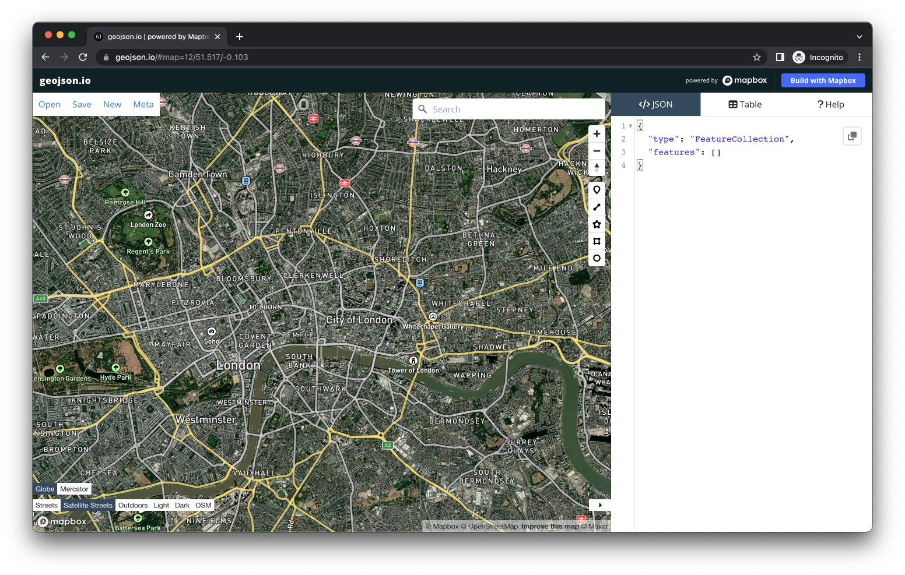

--- 
title: "GEOG0030: Geocomputation"
author: Justin van Dijk
date: "Last modified: `r Sys.Date()`"
site: bookdown::bookdown_site
output: bookdown::gitbook
documentclass: book
link-citations: yes
github-repo: "jtvandijk/GEOG0030"
description: "GEOG0030: Geocomputation handbook."
url: 'https\://jtvandijk.github.io/GEOG0030'
always_allow_html: true
---
# (PART\*) Module Overview {-}

```{r 00-notes, echo=FALSE, warning=FALSE}
# libraries to generate book:
# rmarkdown / core
# bookdown / core
# servr / dev
# formatR / pretty code
# styler / pretty code
```

# Module Introduction {-}

```{r 00-welcome, echo=FALSE, out.width = '100%', fig.align='center', cache=TRUE}
knitr::include_graphics('images/general/geocomputation_welcome.png') 
```
*Last modified: `r Sys.Date()`*

## Welcome {-}
Welcome to **Geocomputation**. This module will introduce you both to the principles of spatial analysis as well as provide you with a comprehensive introduction to the use of programming. Over the next ten weeks, you will learn about the theory, methods and tools of spatial analysis through relevant case studies. We will start by using QGIS before moving to the R programming language. You will learn how to find, manage and clean spatial, demographic and socioeconomic datasets, and then analyse them using core spatial and statistical analysis techniques. 

## Moodle {-}
[Moodle](https://moodle.ucl.ac.uk/) is the central point of contact for GEOG0030 and it is where all important information will be communicated such as key module and assessment information. This workbook contains links to all reading material as well as the content of all computer tutorials

## Module overview {-}
The topics covered over the next ten weeks are:

| Week          | Section          | Topic |
| :---          |:---------        |:------------------ |
| 1             | Foundational Concepts | [Geocomputation: An Introduction](geocomputation-an-introduction.html) |
| 2             | Foundational Concepts | [GIScience and GIS software](giscience-and-gis-software.html) | 
| 3             | Foundational Concepts | [Cartography and Visualisation](cartography-and-visualisation.html) | 
| 4             | Foundational Concepts | [Programming for Data Analysis](programming-for-data-analysis.html) |
| 5             | Foundational Concepts | [Programming for Spatial Analysis](programming-for-spatial-analysis.html) |
|               | **Reading week** | **Reading week** |
| 6             | Core Spatial Analysis | [Analysing Spatial Patterns I: Geometric Operations and Spatial Queries](analysing-spatial-patterns-i-geometric-operations-and-spatial-queries.html) |
| 7             | Core Spatial Analysis | [Analysing Spatial Patterns II: Spatial Autocorrelation](analysing-spatial-patterns-ii-spatial-autocorrelation.html) |
| 8             | Core Spatial Analysis | [Analysing Spatial Patterns III: Point Pattern Analysis](analysing-spatial-patterns-iii-point-pattern-analysis.html) |
| 9             | Advanced Spatial Analysis | [Rasters, Zonal Statistics and Interpolation](rasters-zonal-statistics-and-interpolation.html) | 
| 10            | Advanced Spatial Analysis | [Transport Network Analysis](transport-network-analysis.html) | 

## Troubleshooting {-}
Spatial analysis can yield fascinating insights into geographical relationships, albeit at times it can be challenging, particularly when we combine this with learning how to program at the same time. You will most likely encounter many error messages, experience software crashes, and spend hours to identify bugs in your code. However, the rewards of learning how to programmatically solve complex spatial problems will be very much worth it in the end.

If you need specific assistance with this course please:

- Ask a question at the end of a lecture or during the computer practical.
- Attend the Department's **Coding Therapy sessions** that are run on a weekly basis.
- Check the [Moodle](https://moodle.ucl.ac.uk/) assessment tab for queries relating to this module's assessment.

If after pursuing all these avenues you still need help, you can book into our office hours. You can use an office hour to discuss a geographical concept in relation to the material, assessment or for any personal matters relevant to the completion of the module.

## Acknowledgements {-}
This year's workbook is updated and compiled using:

* The [GEOG0030: Geocomputation 2021-2021](https://jo-wilkin.github.io/GEOG0030/coursebook/index.html) workbook as created and compiled by Dr Jo Wilkin.
* The [GEOG0030: Geocomputation 2021-2022](https://jtvandijk.github.io/GEOG0030_20212022/) workbook.

The datasets used in this workbook contain:

* Crime data obtained from [data.police.uk](https://data.police.uk/) (Open Government Licence)
* National Statistics data © Crown copyright and database right [2015] (Open Government Licence) 
* Ordnance Survey data © Crown copyright and database right [2015]
* Public Health England © Crown copyright 2021

<!--chapter:end:index.Rmd-->

# (PART\*) Foundational Concepts {-}
# Geocomputation: An Introduction
This week’s lecture provided you with a thorough introduction on Geocomputation, outlining how and why it is different to a traditional GIScience course. We set the scene for the remainder of the module and explained how the foundational concepts that you will learn in the first half of term sit within the overall module. This week we start easy by setting up our work environment and set up the software that we will  need over the coming weeks.

<!-- ## Lecture slides {#slides-w01} -->
<!-- The slides for this week's lecture can be downloaded here: [[Link]](https://github.com/jtvandijk/GEOG0030/tree/master/data/ppt/w02_geo.pdf). -->

## Reading list {#reading-w01}
#### Essential readings {-}
- Brundson, C. and Comber, A. 2020. Opening practice: Supporting reproducibility and critical spatial data science. *Journal of Geographical Systems* 23: 477–496.  [[Link]](https://doi.org/10.1007/s10109-020-00334-2) 
- Longley, P. *et al.* 2015. Geographic Information Science & Systems, **Chapter 1**: *Geographic Information: Science, Systems, and Society*. [[Link]](https://ucl.rl.talis.com/link?url=https%3A%2F%2Fapp.knovel.com%2Fhotlink%2Ftoc%2Fid%3AkpGISSE001%2Fgeographic-information-science%3Fkpromoter%3Dmarc&sig=e437927b963cc591dcb65491eccdd3869cc31aef80e1443cb2ba12d8f3bb031a)
- Singleton, A. and Arribas-Bel, D. 2019. Geographic Data Science. *Geographical Analysis*. [[Link]](https://doi.org/10.1111/gean.12194)

#### Suggested readings {-}
- Miller, H. and Goodchild, M. 2015. Data-driven geography. *GeoJournal* 80: 449–461. [[Link]](https://doi.org/10.1007/s10708-014-9602-6)
- Goodchild, M. 2009. Geographic information systems and science: Today and tomorrow. *Annals of GIS* 15(1): 3-9. [[Link]](https://doi.org/10.1080/19475680903250715)

## Getting started
Over the next few weeks, we will be taking a closer look at many of the foundational concepts that will ultimately enable you to confidently and competently analyse spatial data using both programming and GIS software.  You will further learn how to plan, structure and conduct your own spatial analysis using programming – whilst making decisions on how to best present your work, which is a crucial aspect of any type of investigation but of particular relevance to your dissertation.

To help with this, we highly recommend that you try to stay organised with your work, including taking notes and making yourself a coding handbook. We would also suggest to list the different datasets you come across - and importantly, the scales and different projections you use them at - more on this over the next weeks. Finally, you should also make notes about the different spatial analysis techniques you come across, including the different properties they assess and parameters they require to run.

## Software 
This course primarily uses the [R](https://www.r-project.org/) programming language, although we start by using [QGIS](https://qgis.org/en/site/) in the next two weeks to give you a basic foundation in the principles of spatial analysis.

:::note
**Note**<br/>
Please follow the instructions below to install both [R](https://www.r-project.org/) and [QGIS](https://qgis.org/en/site/) onto your own personal computer. If you cannot install the software on your personal computer or you are not planning to bring your own laptop to the computer practicals, please refer to the [UCL Desktop and RStudio Server](#ucl) section below. Please make sure that you have access to a working installation of QGIS and R (including relevant packages) **before** the first hands-on practical session next week.
:::

### QGIS Installation
QGIS is an open-source graphic user interface GIS with many community developed add-on packages (or plugins) that provide additional functionality to the software. You can download and install QGIS on your personal machine by going to the QGIS website: [[Link]](https://qgis.org/en/site/forusers/download.html). 

:::note
**Note**<br/>
We recommend installing the **Long Term Release** (*QGIS 3.22 LTR*) as this version should be the most stable version. For Windows users: the QGIS installation may be a little slow.
:::

After installation, start QGIS to see if the installation was successful and no errors are shown after start up.

### R and RStudio Installation 
R is both a programming language and software environment - in the form of RStudio- originally designed for statistical computing and graphics. R’s great strength is that it is open-source, can be used on any computer operating system, and is free for anyone to use and contribute to. Because of this, it is rapidly becoming the statistical language of choice for many academics and has a very large user community with people constantly contributing new packages to carry out all manner of statistical, graphical, and importantly for us, geographical tasks.

Installing R takes a few relatively simple steps involving two programmes. First there is the R programme itself. Follow these steps to get it installed on your computer:

1. Navigate in your browser to your nearest CRAN mirror: [[Link]](https://cran.ma.imperial.ac.uk/)
2. If you use a Windows computer, click on *Download R for Windows*. Then click on *base*.  Download and install **R 4.2.x for Windows**. If you use a Mac computer, click on *Download R for macOS* and download and install **R-4.2.x.pkg**

That is it! You now have installed the latest version of R on your own machine. However, to make working with R a little bit easier we also need to install something called an Integrated Development Environment (IDE). We will use RStudio:

1. Navigate to the official webpage of RStudio: [[Link]](https://posit.co/download/rstudio-desktop/#download)
2. Download and install RStudio Desktop on your computer (**free version!**)

After this, start RStudio to see if the installation was successful and no errors are shown after start up.

### UCL Desktop and RStudio Server {#ucl}
As an alternative to installing QGIS and R with RStudio onto your personal device, there are some other options. Firstly, both programmes are available through [Desktop@UCL Anywhere](https://www.ucl.ac.uk/isd/services/computers/remote-access/desktopucl-anywhere) as well as all UCL computers on campus. In case of R, there is also an RStudio server version available which you can access through your web browser: [[Link]](https://rstudio.data-science.rc.ucl.ac.uk/)

You should be able to log in with your normal UCL username and password. After logging in, you should see the RStudio interface appear. 

```{r 01-rstudio-interface, echo=FALSE, fig.align='center', out.width="90%", fig.cap='The RStudio Server interface.'}
knitr::include_graphics('images/w01/rstudio_interface.png')
```

:::note
**Note**<br>
If it is the first time you log on to RStudio server you may only see the RStudio interface appear once you have clicked on the *start a new session* button. More importantly: if you are not on campus, RStudio server will only work with an active Virtual Private Network (VPN) connection that links your personal computer into UCL’s network. Details on setting up a VPN connection can be found in UCL's VPN connection guides: [[Link]](https://www.ucl.ac.uk/isd/services/get-connected/ucl-virtual-private-network-vpn) 
:::

### R package installation 
Now we have installed or have access to QGIS and R, we need to customise R. Many useful R function come in packages, these are free libraries of code written and made available by other by R users. This includes packages specifically developed for data cleaning, data wrangling, visualisation, mapping, and spatial analysis. To save us some time, we will install all R packages that we will need over the next ten weeks in one go. Now copy and paste the following code into the **console**. You can execute the code by hitting **Enter**. This may take a while.

```{r 01-install-libaries, echo=TRUE, warnings=TRUE, message=TRUE, eval=FALSE, tidy='TRUE'}
# install all packages that we need
install.packages(c('tidyverse','sf','tmap','osmdata','RColorBrewer','janitor','spdep','dbscan','raster','spatstat','spatstat.core','gstat','dodgr'))
```

Once you have installed the packages, we need to check whether we can in fact load them into our R session. Copy and paste the following code into the **console**, and executed by hitting **Enter** again.

```{r 01-load-libaries, echo=TRUE, warnings=TRUE, message=TRUE, eval=FALSE, verbose=TRUE, tidy=TRUE}
# load all packages
library(tidyverse)
library(sf)
library(tmap)
library(osmdata)
library(RColorBrewer)
library(janitor)
library(spdep)
library(dbscan)
library(raster)
library(spatstat)
library(gstat)
library(dodgr)
```

You will see some information printed to your console but as long as you do not get a message that is similar to `Error: package or namespace load failed for <packagename>` or `Error: package '<packagename' could not be loaded` all should be fine.

:::note
**Note**<br>
Even if you have used R or RStudio Server before and already installed some of the packages in the above list, do re-install all packages to make sure you have the  latest versions. Legacy installations that have not been updated may lay lead to problems when going through the tutorials.
:::

### A note on ArcGIS
[ArcGIS Pro](https://www.esri.com/en-us/arcgis/products/arcgis-pro/overview) (previously ArcMap) is the main commercial GIS software that you may have already used - or seen/heard about through other modules or even job adverts. We do not use ArcGIS Pro in our Practicals for several reasons:

- Computing requirements for ArcGIS Pro are substantial and it **only** operates on the Windows Operating System. For Mac users, using ArcGIS Pro (and ArcMap) would require using either a Virtual Machine or running a copy of Windows OS on a separate partition of your hard drive.
- It is **proprietary** software, which means you need a license to use the software. For those of us in education, the University covers the cost of this license, but when you leave, you will need to pay for a personal license (around £100 for non-commercial use) to continue using the software and repeat any analysis you have used the software for.
- Whilst ArcPro can use pure [Python](https://www.python.org/) (and even R) as a programming language within it through scripts and notebooks, it primarily relies on its own **ArcPy** and **ArcGIS API for Python**  packages to run the in-built tools and analytical functions. To use these packages, you still need a license which makes it difficult to share your code with others *if* they do not have their own ArcGIS license.

Recent developments in the ArcPro software, however, does make it an attractive tool for spatial data science and quantitative geography - it has cross-user functionality, from data analysts who like to use a tool called Notebooks for their code development, to those focused more on cartography and visualisation with in-built bridges to Adobe's Creative Suite. We therefore do not want to put you off looking into ArcGIS in the future, but for this course, we want to ensure the reproducibility of your work.

:::note
**Note**<br/> This also means that the analysis you will be doing for your coursework assignment must be completed in R and QGIS. Specific guidance on the coursework assignment and permitted software will be made available at the end of Reading Week.
:::

## Before you leave {#byl-w01}
You should now be all ready to go with the computer practicals the coming week. [That is it for this week](https://www.youtube.com/watch?v=d8Fmu3RLEOY)!

<!--chapter:end:01-introduction.Rmd-->

# GIScience and GIS software

This week’s lecture introduced you to foundational concepts associated with GIScience and GIS software, with particular emphasis on the representation of spatial data and sample design. Out of all our foundational concepts you will come across in the next four weeks, this is probably the most substantial to get to grips with and has both significant theoretical and practical aspects to its learning. The practical component of the week puts some of these learnings into practice, starting with a short digitisation excercise followed by a simple visualisation of London's population over time.

<!-- ## Lecture slides {#slides-w02} -->
<!-- The slides for this week's lecture can be downloaded here: [[Link]](https://github.com/jtvandijk/GEOG0030/tree/master/data/ppt/w02_geo.pdf). -->

## Reading list {#reading-w02}
#### Essential readings {-}
- Longley, P. *et al.* 2015. Geographic Information Science & Systems, **Chapter 2**: *The Nature of Geographic Data*. [[Link]](https://ucl.rl.talis.com/link?url=https%3A%2F%2Fapp.knovel.com%2Fhotlink%2Ftoc%2Fid%3AkpGISSE001%2Fgeographic-information-science%3Fkpromoter%3Dmarc&sig=e437927b963cc591dcb65491eccdd3869cc31aef80e1443cb2ba12d8f3bb031a)
- Longley, P. *et al.* 2015. Geographic Information Science & Systems, **Chapter 3**: *Representing Geography*. [[Link]](https://ucl.rl.talis.com/link?url=https%3A%2F%2Fapp.knovel.com%2Fhotlink%2Ftoc%2Fid%3AkpGISSE001%2Fgeographic-information-science%3Fkpromoter%3Dmarc&sig=e437927b963cc591dcb65491eccdd3869cc31aef80e1443cb2ba12d8f3bb031a)
- Longley, P. *et al.* 2015. Geographic Information Science & Systems, **Chapter 7**: *Geographic Data Modeling*. [[Link]](https://ucl.rl.talis.com/link?url=https%3A%2F%2Fapp.knovel.com%2Fhotlink%2Ftoc%2Fid%3AkpGISSE001%2Fgeographic-information-science%3Fkpromoter%3Dmarc&sig=e437927b963cc591dcb65491eccdd3869cc31aef80e1443cb2ba12d8f3bb031a)

#### Suggested readings {-}
- Goodchild, M. and Haining, R. 2005. GIS and spatial data analysis: Converging perspectives. *Papers in Regional Science* 83(1): 363–385. [[Link]](https://doi.org/10.1007/s10110-003-0190-y)
- Schurr, C., Müller, M. and Imhof, N. 2020. Who makes geographical knowledge? The gender of Geography’s gatekeepers. *The Professional Geographer* 72(3): 317-331. [[Link]](https://doi.org/10.1080/00330124.2020.1744169)
- Yuan, M. 2001. Representing complex geographic phenomena in GIS. *Cartography and Geographic Information Science* 28(2): 83-96. [[Link]](https://doi.org/10.1559/152304001782173718)

## Simple digitisation of spatial features
To get spatial features in a digital form, they need to be digitised. Let’s take what should be a straight-forward example of digitising the River Thames in London.

```{r 02-digitise, echo=FALSE, fig.align='center', cache=TRUE, out.width="90%", fig.cap='The Thames.'}

```

We are going to use a very simple online tool that allows us to create digital data and export the data we create as raw files.

1. Head to [geojson.io](http://geojson.io/#map=12/51.5170/-0.1030).
2. In the bottom left-hand corner, select *Satellite Streets* as your map option.
3. Next, click on the `Draw Linestring` tool which you can find on the right hand side of the screen. You can hover over the icons to get the names of each tool.
4. Now digitise the river Thames. Simply click from a starting point on the left- or right-hand side of the map, and digitise the river.
5. Once you are done, double-click your final point to end your line.
6. You can  click on the line and select *Info* in the pop-up screen to find out how long the line is. 
7. You can export your data using the *Save* menu.

#### Questions {-}

- How easy did you find it to digitise the data and what decisions did you make in your own "sample scheme"? 
- How close together are your clicks between lines? 
- Did you sacrifice detail over expediency or did you spend perhaps a little too long trying to capture ever small bend in the river? 
- How well do you think your line represents the River Thames?

## Population change in London
The second part of this practical will introduces you to **attribute joins** followed by creating a [choropleth map](https://en.wikipedia.org/wiki/Choropleth_map). You will be using different types of *joins* throughout this module, and probably the rest of your career, so it is incredibly important that you understand how they work.

:::note
**Note**<br/>
The datasets you will create in this practical will be used in next week's practical, so make sure to follow every step and save your data carefully.
:::

When using spatial data, there is generally a very specific workflow that you will need to go through and, believe it or not, the majority of this is not actually focused on analysing your data. Along with the idea that 80% of data is geographic data, the second most often-quoted GIS-related unreferenced 'fact' is that anyone working with spatial data will spend 80% of their time simply finding, retrieving, managing and processing the data before any analysis can be done.

One of the reasons behind this need for a substantial amount of processing is that the data you often need to use is almost never  in the format that you require for analysis. For example, for our investigation, there is not a 'ready-made' spatial population dataset (i.e. population `shapefile`) we can download to explore population change across England:

```{r 02-google-shp, echo=FALSE, fig.align='center', cache=TRUE, out.width="90%", fig.cap='Alas a quick Google search shows that finding a shapefile of England\'s population is not straightforward.'}
knitr::include_graphics('images/w02/datasearch.png')
```

Instead, we need to go and find the raw datasets and create the data layers that we want. As a result, before beginning any spatial analysis project, it is best-practice to think through what end product you will ultimately need for your analysis.

A typical spatial analysis workflow usually looks something like this:

- **Identify** the data you need to complete your analysis i.e. answer your research questions. This includes thinking through the scale, coverage and currency of your dataset.
- **Find** the data that matches your requirements, e.g. is it openly and easily available?
- **Download** the data and store it in the correct location.
- **Clean** the data. This may be done before or after ingesting your data into your chosen software programme.
- **Load** the data into your chosen software programme.
- **Transform and process** the data. This may require re-projection, creating joins between datasets, calculating new fields and applying selections.
- **Analyse** your data using appropriate methods.
- **Visualise** your data and results with graphs and maps.
- **Communicate** your results.

As you can see, the analysis and visualisation part comes quite late in the overall spatial analysis workflow - and instead, the workflow is very top-heavy with data management. However, very often in GIS-related courses you will be given pre-processed datasets. Because data management is an essential part of your workflow, we are clean (the majority of) our data from the get-go. This will help you understand the processes that you will need to go through in the future as you search for and download your own data, as well as deal with the data first-hand before loading it into our GIS software.

### Setting the scene {#w02-scene}
For this practical, we will investigate how the population in London has changed over time. Understanding population change - over time and space - is spatial analysis at its most fundamental. We can understand a lot just from where population is growing or decreasing, including thinking through the impacts of these changes on the provision of housing, education, health and transport infrastructure. 

We can also see first-hand the impact of wider socio-economic processes, such as urbanisation. Today we will look at population in London in 2011, 2015, and 2019 at the *Ward* scale that we can use within our future analysis projects, starting next week. 

:::note
**Note**<br/>
We will use the population dataset to *normalise* other datasets. Why? When we record events created by humans, there is often a population bias: simply, more people in an area will by probability lead to a higher occurrence of said event, such as crime. We will look at this in greater detail next week.
:::

### Finding data {#w02-finding}
In the UK, finding authoritative data on population and *Administrative Geography* boundaries is increasingly straight-forward. Over the last decade, the UK government has opened up many of its datasets as part of an **Open Data** precedent that began in 2010 with the creation of [data.gov.uk](data.gov.uk) and the Open Government Licence (the terms and conditions for using data).

[Data.gov.uk](www.data.gov.uk) is the UK government’s central database that contains open data that the central government, local authorities and public bodies publish. This includes, for example, aggregated census and health data – and even government spending. In addition to this central database, there are other authoritative databases run by the government and/or respective public bodies that contain either a specific type of data (e.g. census data, crime data) or a specific collection of datasets (e.g. health data from the NHS, data about London). Some portals are less up-to-date than others, so it is wise to double-check with the ‘originators’ of the data to see if there are more recent versions.

For our practical, we will access data from two portals:

1. For our administrative boundaries, we will download the **spatial** data from the *London Datastore* (which is exactly what it sounds like).
2. For population, we will download **attribute** data from the *Office of National Statistics (ONS)*.

### Housekeeping {#w01-housekeeping}
Before we download our data, it is important to establish an organised file systems that we will use throughout the module:

1. Create a `GEOG0030` folder in your `Documents` folder on your computer.
2. Within your `GEOG0030` folder, create the following subfolders: 

| Folder name | Purpose      |
| :----        | :----------- |
| `data`      | To store both raw data sets and final outputs. |
| `maps`      | To save the maps you produce during your tutorials. |

3. Within your `data` folder, create the following subfolders: 

| Folder name | Purpose      |
| :---        | :----------- |
| `raw`       | To store all your raw data files that have not yet been processed. |
| `output`    | To store all your final data files that have been processed and analysed, potentially ready to be mapped. |

### Downloading data {#w02-downloading}
We will start by downloading the administrative geography boundaries:

1. Navigate to the relevant page on the London Datastore: [[Link]](https://data.london.gov.uk/dataset/statistical-gis-boundary-files-london).
2. Download all three zipfiles to your computer: `statistical-gis-boundaries-london.zip`, `London-wards-2014.zip` and `London-wards-2018.zip`.

The first dataset contains all levels of London’s administrative boundaries. In descending size order: Borough, Ward, Middle layer Super Output Area (MSOA), Lower layer Super Output Area (LSOA), and Output Area (OA) based on the 2011 Census. The second dataset contains an *updated* version of the Ward boundaries, as of 2014. The third dataset contains yet another *updated* version of the Ward boundaries, as of 2018. As we will be looking at population data for 2015 and 2019, it is best practice to use those boundaries that are most reflective of the ‘geography’ at the time; therefore, we will use these 2014 / 2018 Ward boundaries for our 2015 / 2019 population dataset, respectively. 

:::note
**Note** <br/>
Once downloaded, you will need to unzip all files before you can use them. To unzip the file, you can use the built-in functionality of your computer’s operating system. For Windows: right click on the zip file, select **Extract All**, and then follow the instructions. For Mac OS: double-click on the the zip file and it should unzip automatically.
:::

Once unzipped, you will find two folders: *Esri* and *MapInfo.* These folders contain the same data but in different data formats: **Esri shapefile** and **MapInfo TAB**. 

:::note
**Note** <br/>
MapInfo is another proprietary GIS software, which has historically been used in public sectors services in the UK and abroad, although has generally been replaced by either Esri’s ecosystem or open-source software GIS.
:::

Now open your `GEOG0030/data/raw/` folder and create a new folder called `boundaries`. Within this folder, create three new folders: `2011`, `2014` and `2018`. Copy the entire contents of `Esri` folder of each year into their respective year folder. 

We do not want to add the additional `Esri` folder as a step in our filesystem, i.e. your file paths should read: `GEOG0030/data/raw/boundaries/2011` for the 2011 boundaries, `GEOG0030/data/raw/boundaries/2014` for the 2014 boundaries, and `GEOG0030/data/raw/boundaries/2018` for the 2018 boundaries.

```{r 02-setup, echo=FALSE, fig.align='center', out.width="90%", fig.cap='Your setup should look something like this.'}
knitr::include_graphics('images/w02/file_management.png')
```

We now have our administrative geography files ready for use. 

:::note
**Note** <br/>
Administrative geographies are a way of dividing the country into smaller sub-divisions or areas that correspond with the area of responsibility of local authorities and government bodies. These administrative sub-divisions and their associated geography have several important uses, including assigning electoral constituencies, defining jurisdiction of courts, planning public healthcare provision, as well as what we are concerned with: used as a mechanism for collecting census data and assigning the resulting datasets to a specific administrative unit. These geographies are updated as populations evolve and as a result, the boundaries of the administrative geographies are subject to either periodic or occasional change. The UK has quite a complex administrative geography, particularly due to having several countries within one overriding administration and then multiple ways of dividing the countries according to specific applications. More details on the administrative geographies of the UK can be found on the website of the [Office for National Statistics](https://www.ons.gov.uk/methodology/geography/ukgeographies/administrativegeography).
:::

For our population datasets, we will use the ONS mid-year estimates (MYE). These population datasets are estimates that are based on the 2011 census count and then updated with estimated population growth. They are released once a year, with a delay of a year. Today we will use the data for 2011, 2015, and 2019.

1. Navigate to the *Ward* level datasets: [[Link]](https://www.ons.gov.uk/peoplepopulationandcommunity/populationandmigration/populationestimates/datasets/wardlevelmidyearpopulationestimatesexperimental)
2. When you navigate to this page, you will find multiple choices of data to download. We will need to download the estimates for **2011, 2015** and **2019**. Click to download each of the zipfiles. Choose the **revised** versions for 2015 and the (Census-based) 2011 Wards edition for 2011. 
3. In your `GEOG0030/data/raw/` folder, create a new folder called `population`, unzip your downloaded files, and copy the three spreadsheets to the newly created `population` folder. 
4. Rename the files you donwloaded to: `MYE_ward_2011.xls`, `MYE_ward_2015.xls`, and `MYE_ward_2019.xlsx`.

Now it is time to do some quite extensive data cleaning and preparation.

### Cleaning data {#w02-cleaning}
When you open up any of the Ward spreadsheets in Excel =, you will notice that there are several worksheets contained in this workbook. However, we are only interested in the total population tab. We therefore need to copy over the data from the 2011, 2015 and 2019 datasets into separate `csv` files.

#### London population in 2011
1. Open the 2011 Ward spreadsheet in Excel.
2. Click on the `Mid-2011 Persons` tab and have a look at the data. As you should be able to see, we have a set of different fields (e.g. `Ward Code`, `Ward Name`), including population counts. Because we do not need all the data in the spreadsheet, we will extract only the data we need for our analysis. This means we need the total population (`All Ages`) data, alongside some identifying information that distinguishes each record from one another. Here we can see that both `Ward Code` and `Ward Name` suit this requirement. We can also think that the `Local Authority` column might be of use, so we also keep this information.
3. Create a new Excel spreadsheet Excel and from the `Mid-2011 Persons` spreadsheet, copy over all cells from columns **A** to **D** and rows **4 to 636** into this new spreadsheet. Row 636 denotes the end of the *Greater London* Wards (i.e. the end of the *Westminster Local Authority*) which are kept (in most scenarios) at the top of the spreadsheet as their **Ward Codes** are the first in sequential order. 
4. Before we go any further, we need to format our data. First, we want to rename our fields to remove the spaces and superscript formatting. Re-title the fields as follows: `ward_code`, `ward_name`, `local_authority` and `pop2011`. 
5. One further bit of formatting that you must do before saving your data is to format our population field. At the moment, you will see that there are commas separating the thousands within our values. If we leave these commas in our values, QGIS will read them as decimal points, creating decimal values of our population. There are many points at which we could solve this issue, but the easiest point is now - we will strip our population values of the commas and set them to integer (whole numbers) values. To format the `pop2011` column, select the entire column and right-click on the `D` cell.  Click on **Format Cells** and set the Cells to **Number** with **0** decimal places. You should see that the commas are now removed from your population values.
6. Save your spreadsheet into your `output` folder as `ward_population_2011.csv`.

#### London population in 2015
1. Open the 2015 Ward spreadsheet in Excel. 
2. As you will see again, there are plenty of worksheets available and we want to select the `Mid-2015 Persons` tab. We now need to copy over the data from our 2015 dataset to a new spreadsheet again. However,  at first instance, you will notice that the City of London (CoL) Wards are missing from this dataset. Then if you scroll to the end of the London Local Authorities, i.e. to the bottom of Westminster, what you should notice is that the final row for the Westminster data is in fact row 575 - this suggests we are missing the data fror some Local Authorities (LAs). We need to determine which ones are missing and try to find them in the 2015 spreadsheet. With this in mind, start by copying over all cells from columns **A** to **D** and rows **5 to 575** into a new spreadsheet. 
3. If you were to compare the names of the London Boroughs that we have now copied with the full list, you would notice that we are missing *City of London*, *Hackney*, *Kensington and Chelsea*, and *Tower Hamlets*. If we head back to the original 2015 raw dataset, we can actually find this data (as well as the City of London) further down in the spreadsheet. It seems like these LAs had their codes revised in the 2014 revision and are no longer in the same order as the 2011 dataset.
4. Locate the data for the *City of London*, *Hackney*, *Kensington and Chelsea* and *Tower Hamlets* and copy this over into our new spreadsheet. Double-check that you now have in total **637** Wards within your dataset.
5. Remember to rename the fields as above, but change your population field to **pop2015**. Also, remember to reformat the values in your `pop2015` column.
6. Once complete, save your spreadsheet into your `output` folder as `ward_population_2015.csv`.

#### London population in 2019
1. Open the 2019 Ward spreadsheet in Excel. This time we are interested in the `Mid-2019 Persons` tab.
2. This time the data that we are interested in can be found in columns `A`, `B`, `D` and `G`. Because the columns that we want are not positioned next to one another, start by hiding columns `C`, `E` and `F`. You can do this by right-clicking on the colums you want to hide and selecting **Hide**.
3. Next, copy the data from **row 5 to the final row for the Westminster data** for columns `A`, `B`, `D` and `G` over into a new spreadsheet.
4. If you look at the total rows that we have copied over, we have even fewer Wards than the 2015 dataset. This time we are not only missing data for *City of London*, *Hackney*, *Kensington and Chelsea*, *Tower Hamlets* but also for *Bexley*, *Croydon*, *Redbridge*, and *Southwark*.
5. Copy over the remaining Wards for these Local Authorities/Boroughs.
6. Once you've copied them over - you should now have **640** Wards. Delete columns `C`, `E` and `F` and rename the remaining fields as you have done previously. Also, remember to reformat the values in your `pop2019` column.
7. Once complete, save your spreadsheet into your `output` folder as `ward_population_2019.csv`.

You should now have your three population `csv` datasets in your `output` folder. We are now (finally) ready to start using our data within QGIS.

### Using QGIS to map our population data

#### Setting up a project
We will now use QGIS to create population maps for the Wards in London across our three time periods. To achieve this, we need to **join our table data to our spatial datasets** and then map our populations for our visual analysis. 

Because, as we have seen above, we have issues with the number of Wards and changes in boundaries across our three years, we will not (for now) complete any quantitative analysis of these population changes - this would require significant additional processing that we do not have time for today. 

:::note
**Note** <br/>
Data interoperability is a key issue that you will face in spatial analysis, particularly when it comes to Administrative Geographies. 
:::

1. Start **QGIS**.
Let's start a new project.
2. Click on **Project** -> **New**. Save your project as `w2-pop-analysis`. Remember to save your work throughout the practical. 
3. Before we get started with adding data, we will first set the Coordinate Reference System of our Project. Click on **Project** -> **Properties -- CRS**. In the Filter box, type **British National Grid**. Select **OSGB 1936 / British National Grid - EPSG:27700** and click Apply. Click **OK**.

:::note
**Note**<br/>
We will explain CRSs and using CRSs in GIS software in more detail next week.
:::
    
#### Adding layers
We will first focus on loading and joining the 2011 datasets. 

1. Click on **Layer** -> **Add Layer** -> **Add Vector Layer**.

2. With **File** select as your source type, click on the small three dots button and navigate to your 2011 boundary files.

3. Here, we will select the `London_Ward.shp` dataset. Click on the `.shp` file of this dataset and click **Open**. Then click **Add**. You may need to close the box after adding the layer.

We can take a moment just to look at our Ward data - and recognise the shape of London. Can you see the City of London in the dataset? It has the smallest Wards in the entire London area. With the dataset loaded, we can now explore it in a little more detail. We want to check out two things about our data: first, its **Properties** and secondly, its **Attribute Table**. 

4. Right-click on the `London_Ward` layer and open the **Attribute Table** and look at how the attributes are stored and presented in the table. Explore the different buttons in the Attribute Table and see if you can figure out what they mean. Once done, close the Attribute Table.
5. Right-click on the `London_Ward` layer and select **Properties**. Click through the different tabs and see what they contain. Keep the **Properties** box open.

Before adding our population data, we can make a quick map of the Wards in London - we can add labels and change the *symbolisation* of our Wards.

6. In the **Properties** box, click on the **Symbology** tab - this is where we can change how our data layer looks. For example, here we can change the line and fill colour of our Wards utilising either the default options available or clicking on **Simple Fill** and changing these properties directly. Keep the overall **styling** to a **Single Symbol** for now - we will get back to this once we have added the population data. You can also click on the **Labels** tab - and set the Labels option to **Single labels**. 

7. QGIS will default to the **NAME** column within our data. You can change the properties of these labels using the options available. Change the font to **Futura** and size **8** and under the add a small buffer to the labels by selecting **Draw text bufer** under the **Buffer** tab. You can click **Apply** to see what your labels look like. Please note that the background colour may differ.

```{r 02-busy-labels, echo=FALSE, fig.align='center', fig.cap='It looks incredibly busy.'}
knitr::include_graphics('images/w02/wardlabels.png')
```

8. Click **OK** once you are done changing the Symbology and Label style of your data to return to the main window. 

:::note
**Note**<br/>
The main strength of a GUI GIS system is that is really helps us understand how we can visualise spatial data. Even with just these two shapefiles loaded, we can understand two key concepts of using spatial data within GIS.

The first, and this is only really relevant to GUI GIS systems, is that each layer can either be turned on or off, to make it visible or not (try clicking the tick box to the left of each layer). This is probably a feature you are used to working with if you have played with interactive web mapping applications before!

The second concept is the order in which your layers are drawn – and this is relevant for both GUI GIS and when using plotting libraries such as `ggplot2` or `tmap` in RStudio. Your layers will be drawn depending on the order in which your layers are either tabled (as in a GUI GIS) or ‘called’ in your function in code.

Being aware of this need for 'order' is important when we shift to using RStudio and `tmap` to plot our maps, as if you do not layer your data correctly in your code, your map will end up not looking as you hoped!

For us using QGIS right now, the layers will be drawn from bottom to top. At the moment, we only have one layer loaded, so we do not need to worry about our order right now - but as we add in our 2015 and 2018 Ward files, it is useful to know about this order as we will need to display them individually to export them at the end.
:::

#### Conducting an attribute join
We are now going to join our 2011 population data to our 2011 shapefile. First, we need to add the 2011 population data to our project. 

1. Click on **Layer** -> **Add Layer** -> **Add Delimited Text Layer**.

2. Click on the three dots button again and navigate to your **2011 population data** in your `working` folder. Your file format should be set to `csv`. You should have the following boxes clicked under the **Record and Field options** menu: `Decimal separator is comma`, `First record has field names`, `Detect field types` and `Discard empty fields`. QGIS does many of these by default, but do double-check!

3. Set the Geometry to *No geometry (attribute only table)* under the **Geometry Definition** menu. Then click **Add** and **Close**. You should now see a table added to your `Layers` box.

We can now join this table data to our spatial data using an **Attribute Join**.

:::note
**Note**<br>
An attribute join is one of two types of data joins you will use in spatial analysis (the other is a spatial join, which we will look at later on in the module). An attribute join essentially allows you to join two datasets together, as long as they share a common attribute to facilitate the ‘matching’ of rows:

```{r 02-join-those-attributes, echo=FALSE, fig.align='center', fig.caps='Figure from Esri documentation on Attribute Joins.'}
knitr::include_graphics('images/w02/attribute_joins.png')
```

Essentially you need a **single identifying ID** field for your records within both datasets: this can be a code, a name or any other string of information. In spatial analysis, we always **join our table data to our shape data** (One way to think about it as attaching the table data to each shape). 

As a result, your target layer is always the shapefile (or spatial data) whereas your join layer is the table data. These are known as the left- and right-side tables when working with code. 

**To make a join work, you need to make sure your ID field is correct across both datasets**, i.e. no typos or spelling mistakes. Computers can only follow instructions, so they do not know that *St. Thomas* in one dataset is that same as *St Thomas* in another, or even *Saint Thomas*! It will be looking for an exact match! 

As a result, whilst in our datasets we have kept both the name and code for both the boundary data and the population data, **when creating the join, we will always prefer to use the CODE over their names**. Unlike names, codes reduce the likelihood of error and mismatch because they do not rely on understanding spelling! 

Common errors, such as adding in spaces or using `0` instead `O` (and vice versa) can still happen – but it is less likely. 
:::

To make our join work, we need to check that we have a matching **UID** across both our datasets. We therefore need to look at the tables of both datasets and check what attributes we have that could be used for this possible match.

4. Open up the Attribute Tables of each layer and check what fields we have that could be used for the join. We can see that both our respective "code" fields have the same codes (`ward_code` and `GSS_code`) so we can use these to create our joins.

5. Right-click on your `London_Ward` layer -> **Properties** and then click on the **Joins** tab. 
- Click on the **+** button. Make sure the **Join Layer** is set to `ward_population_2011`.
- Set the **Join field** to `ward_code`.
- Set the **Target field** to `GSS_code`.
- Click the **Joined Fields** box and click to only select the `pop2011` field.
- Click on the **Custom Field Name Prefix** and **remove** the pre-entered text to leave it blank.
- Click on **OK**.
- Click on **Apply** in the main Join tab and then click **OK** to return to the main QGIS window.

We can now check to see if our join has worked by opening up our `London_Ward` **Attribute Table** and looking to see if our Wards now have a **Population** field attached to it.

6. Right-click on the `London_Ward` layer and open the **Attribute Table** and check that the population data column has been added to the table.

As long as it has joined, you can move forward with the next steps. If your join has not worked, try the steps again - and if you are still struggling, do let us know.

:::note
**Note**<br />
Now, the join that you have created between your Ward and population datasets in only held in QGIS's memory. If you were to close the programme now, you would lose this join and have to repeat it the next time you opened QGIS. To prevent this from happening, we need to export our dataset to a new shapefile - and then re-add this to the map.
:::

Let's do this now:

7. Right-click on your `London_Ward` shapefile and click **Export** -> **Save Features As...**. The format should be set to an ESRI shapefile.
- Then click on the three dots buttons and navigate to your `output` folder and enter: `ward_population_2011` as your file name.
- Check that the **CRS** is **British National Grid**.
- Leave the remaining fields as selected, but check that the **Add saved file to map** is checked. Click **OK**.

You should now see our new shapefile add itself to our map. You can now remove the original `London_Ward` and `ward_population_2011` datasets from our Layers box (Right-click on the layers and opt for **Remove Layer...**).

The final thing we would like to do with this dataset is to style our dataset by our newly added population field to show population distribution around London.

8. To do this, again right-click on the **Layer** -> **Properties** -> **Symbology**.
- This time, we want to style our data using a **Graduated** symbology.
- Change this option in the tab and then choose `pop2011` as your column. 
- We can then change the color ramp to suit our aesthetic preferences - *Viridis* seems to be the cool colour scheme at the moment, and we will choose to invert our ramp as well. 
- The final thing we need to do is **classify** our data - what this simply means is to decide how to group the values in our dataset together to create the graduated representation. 
- We will be looking at this in later weeks, but for now, we will use the **Natural Breaks** option. 
- Click on the drop-down next to Mode, select **Natural Breaks**, change it to **7** classes and then click **Classify**.
- Finally click **Apply** to style your dataset.

:::note
**Note**<br/>
Understanding what classification is appropriate to visualise your data is an important step within spatial analysis and visualisation, and something you will learn more about in the following weeks. Overall, they should be determined by understanding your data's distribution and match your visualisation accordingly.

Feel free to explore using the different options with your dataset at the moment – the results are almost instantaneous using QGIS, which makes it a good playground to see how certain parameters or settings can change your output.
:::

You should now be looking at something like this:

```{r 02-ward-result, echo=FALSE, fig.align='center', fig.cap='Your result.'}
knitr::include_graphics('images/w02/ward_2011.png')
```

You will be able to see that we have **some** missing data - and this is for several Wards within the City of London.  This is because census data is **only recorded for 8 out of the 25 Wards** and therefore we have no data for the remaining Wards. As a result, these Wards are left blank, i.e. white, to represent a `NODATA` value. 

:::note
**Note** <br/>
One thing to flag is that `NODATA` means no data - whereas `0`, particularly in a scenario like this, would be an actual numeric value. It is important to remember this when processing and visualising data, to make sure you do not represent a `NODATA` value incorrectly.
:::

### Exporting map for visual analysis
To export your map select only the map layers you want to export and then opt for **Project** -> **Import/Export** -> **Export to Image** and save your final map in your `maps` folder. You may want to create a folder for these maps titled `w02`.

Next week, we will look at how to style our maps using the main map conventions (adding North Arrows, Scale Bars and Legends) but for now a simple picture will do. 

## Assignment {#assignment-w02}
You now need to **repeat the entire process** for your 2015 and 2019 datasets. Remember, you need to:

- Load the respective Ward dataset as a Vector Layer.
- Load the respective Population dataset as a Delimited Text File Layer (remember the settings!).
- Join the two datasets together using the Join tool in the Ward dataset Properties box.
- Export your joined dataset into a new dataset within your `output` folder.
- Style your data appropriately.
- Export your maps as an image to your `maps` folder.

To make visual comparisons against our three datasets, theoretically we would need to standardise the breaks at which our classification schemes are set at. To set all three datasets to the same breaks, you can do the following:

- Right-click on the `ward_population_2019` dataset and navigate to the `Symbology` tab. Double-click on the Values for the smallest classification group and set the Lower value to 141 (this is the lowest figure across our datasets, found in the 2015 data). Click **OK**, then click **Apply**, then click **OK** to return to the main QGIS screen.
-  Right-click again on the `ward_population_2019` dataset but this time, click on **Styles** -> **Copy Styles** -> **Symbology**.
- Now right-click on the `ward_population_2015` file, but this time after clicking on **Styles** -> **Paste Style** -> **Symbology**. You should now see the classification breaks in the 2015 dataset change to match those in the 2019 data.
- Repeat this for the 2011 dataset as well.
- The final thing you need to do is to now change the classification column in the `Symbology` tab for the 2015 and 2011 datasets back to their original columns and press **Apply**. You will see when you first load up their Symbology options this is set to *pop2019*, which of course does not exist within this dataset.

## Before you leave {#byl-w02}
Save your project so you can go back to it if you need to, other than that [that is it for this week](https://www.youtube.com/watch?v=Wmc8bQoL-J0)!

<!--chapter:end:02-GIScience.Rmd-->

# Cartography and Visualisation

This week’s lecture has given you an in-depth introduction into how we can create a successful map, including understanding map projections, cartographic conventions and issues faced with the analysis of aggregated data at areal units. The practical component of the week puts some of these learnings into practice as we analyse crime rates within London at two different scales.

<!-- ## Lecture slides {#slides-w03} -->
<!-- The slides for this week's lecture can be downloaded here: [[Link]](https://github.com/jtvandijk/GEOG0030/tree/master/data/ppt/w02_geo.pdf). -->

## Reading list {#reading-w03}
#### Essential readings {-}
- Longley, P. *et al.* 2015. Geographic Information Science & Systems, **Chapter 4**: *Georeferencing*. [[Link]](https://ucl.rl.talis.com/link?url=https%3A%2F%2Fapp.knovel.com%2Fhotlink%2Ftoc%2Fid%3AkpGISSE001%2Fgeographic-information-science%3Fkpromoter%3Dmarc&sig=e437927b963cc591dcb65491eccdd3869cc31aef80e1443cb2ba12d8f3bb031a)
- Longley, P. *et al.* 2015. Geographic Information Science & Systems, **Chapter 11**: *Cartography and Map Production*. [[Link]](https://ucl.rl.talis.com/link?url=https%3A%2F%2Fapp.knovel.com%2Fhotlink%2Ftoc%2Fid%3AkpGISSE001%2Fgeographic-information-science%3Fkpromoter%3Dmarc&sig=e437927b963cc591dcb65491eccdd3869cc31aef80e1443cb2ba12d8f3bb031a)
- Wong, D. 2009. Modifiable Areal Unit Problem. *International Encyclopedia of Human Geography* 169-174. [[Link]](https://doi.org/10.1016/B978-008044910-4.00475-2)

#### Suggested readings {-}
- Longley, P. *et al.* 2015. Geographic Information Science & systems, **Chapter 12**: *Geovisualization*. [[Link]](https://ucl.rl.talis.com/link?url=https%3A%2F%2Fapp.knovel.com%2Fhotlink%2Ftoc%2Fid%3AkpGISSE001%2Fgeographic-information-science%3Fkpromoter%3Dmarc&sig=e437927b963cc591dcb65491eccdd3869cc31aef80e1443cb2ba12d8f3bb031a)
- Usery, L. and Seong, J. 2001. All equal-area map projections are created equal, but some are more equal than others. *Cartography and Geographic Information Science* 28(3): 183-194. [[Link]](https://doi.org/10.1559/152304001782153053)

## Crime in London I
Over the next few weeks, we will look to model driving factors behind crime across London from both a statistical and spatial perspective. As [Reid *et al.* (2018)](https://www.oxfordbibliographies.com/view/document/obo-9780195396607/obo-9780195396607-0123.xml) argue:

> Spatial analysis can be employed in both an exploratory and well as a more confirmatory manner with the primary purpose of identifying how certain community or ecological factors (such as population characteristics or the built environment) influence the spatial patterns of crime. 

Against this background, we are actually going to answer a very simple question today: does our perception of crime (and its distribution) in London vary at different scales? Here we are looking to test whether we would make the **ecological fallacy** mistake of assuming patterns at the Ward level are the same at the Borough level by looking to directly account for the impact of the Modifiable Area Unit Problem within our results. To test this, we will use these two administrative geographies to aggregate crime data for London in 2020. Here we will be looking specifically at a specific type of crime: *Theft from a person*.

### Finding our datasets {#w03-finding} 
As we saw last week, accessing data within the UK, and specifically for London, is relatively straight-forward - you simply need to know which data portal contains the dataset you want!    

:::note
**Note**<br/>
The datasets you will create in this practical will be used in other practicals, so make sure to follow every step and export your data into your `output` folder at the end. The practical will also introduce you to point-in-polygon counts. You will be using this type of analysis throughout this module, so it is incredibly important that you understand how they work – even as seemingly simple as they may be!
:::

#### Crime data 
For our crime data, we will use data directly from the **Police Data Portal**, which you can find at https://data.police.uk/. This Data Portal allows you to access and generate tabular data for crime recorded in the U.K. across different the different Police Forces since 2017. 

In total, there are 45 territorial police forces (TPF) and 3 special police forces (SPF) of the United Kingdom. Each TPF covers a specific area in the UK (e.g. the "West Midlands Police Force"), whilst the SPFs are cross-jurisdiction and cover specific types of crime, such as the British Transport Police. Therefore, when we want to download data for a specific area, we need to know which Police Force covers our area interest.

When you look to download crime data for London, for example, there are **two** territorial police forces working within the city and its greater metropolitan area: 

1) **The Metropolitan Police Force (The Met)**, which covers nearly the entire London area, including Greater London

2) **The City of London (CoL) Police**, which covers the City of London. The Met has no jurisdiction in the CoL.

You therefore need to decide if you want to include an analysis of crime in the City of London or not - we will in our current study.

#### Population data 
We know that if we want to study a phenomena like crime and aggregate it to an areal unit, we will need to normalise this by our population. Luckily, we already sorted out our Ward population dataset last week (i.e. `ward_population_2019.shp`). In addition to our **Ward** level dataset, we also want to generate the same type of shapefile for our London **Boroughs**, i.e. a `borough_population_2019.shp`, utilising the same approach as last week, joining our population table data to our Borough shape data. To do this, we need to know where to get both our required datasets from - fortunately, you  already have a Borough shapefile in your `raw/boundaries/2011` folder. Therefore, it is just a case of tracking down the same Mid-Year Estimates (MYE) for London Boroughs as we did for the Wards. 

:::note
**Note** <br/>
Because the boundaries of the London Boroughs have not been changed since 1965, we can get away with using the 2011 `shapefile` instead of having to download a more up to date version. 
:::

### Downloading data {#w03-downloading}
As outlined above, to get going with our analysis, we need to download both the **population** data for our Boroughs and the 2020 **crime** data for our two police forces in London. 

Let us tackle the population data first.

#### Borough population
Through a quick search, we can find our Borough population table data pretty much in the same place as our Ward data - however it is a separate spreadsheet to download.

1. Navigate to the data on the website of the Office for National Statistics: [[Link]](https://www.ons.gov.uk/peoplepopulationandcommunity/populationandmigration/populationestimates/datasets/populationestimatesforukenglandandwalesscotlandandnorthernireland).

2. Download the **Mid-2019: April 2020 local authority district codes** `.xls` file.

3. Open the dataset in your spreadsheet editing software and navigate to the `MYE2-Persons` tab. Now extract: `Code`, `Name`, `Geography` and `All ages` data for all London Boroughs.
You should have a total of **33** Boroughs.

4. Once you have your 33 Boroughs separated from the rest of the data, copy the columns (`Code`, `Name`, `Geography` and `All ages`) and respective data for each Borough into a new `csv`.

5. Remember to format the **field names**. Like last week, also remember to make sure that the `All ages` field is recognised as a **numeric** field. Save as a new `csv` in your `output` folder: `borough_population_2019.csv`.

#### Ward population
As mentioned above, you should already have a `ward_population_2019.shp` file within your `output` data folder. 

#### Crime data
Normally, we would now head to the Police Data Portal and download our crime data. However, the manual processing that is required is too exhaustive to do manually - and far (far!) easier to do using programming. As such you can download a pre-filtered spreadsheet instead. Unzip the download and copy the `csv` into a **new** folder in your `raw` data folder called: `crime`.

#### File download {-}
| File                                                 | Type           | Link |
| :------                                              | :------        | :------ |
| Theft from persons in 2020                           | `csv`    | [Download](https://github.com/jtvandijk/GEOG0030/tree/master/data/zip/crime_theft_2020_london.zip) |

:::note
**Note** <br/>
When mapping the data from the provided longitude and latitude coordinates, it is important to know that these locations represent the approximate location of a crime — not the exact place that it happened. This displacement occurs to preserve anonymity of the individuals involved. The process by how this displacement occurs is standardised. There is a list of anonymous map points to which the exact location of each crime is compared against this master list to find the nearest map point. The co-ordinates of the actual crime are then replaced with the co-ordinates of the map point. Each map point is specifically chosen to avoid associating that point with an exact household. Interestingly enough, the police also convert the data from their recorded BNG eastings and northings into WGS84 latitude and longitude.
:::

### Using QGIS to map our crime data 

#### Setting up a project
1. Start **QGIS**

2. Click on **Project** -> **New**. Save your project as `w3-crime-analysis`. Remember to save your work throughout the practical. 

3. Before we get started with adding data, we will first set the Coordinate Reference System of our Project. Click on **Project** -> **Properties -- CRS**. In the Filter box, type **British National Grid**. Select **OSGB 1936 / British National Grid - EPSG:27700** and click **Apply**. Click **OK**.

Now we have our **Project CRS** set, we are ready to start loading and processing our data.

#### Adding layers
1. Click on **Layer** -> **Add Layer** -> **Add Vector Layer**.

2. With **File** select as your source type, click on the small three dots button and navigate to your `ward_population_2019.shp` in your `output` folder. Click on the `.shp` file of this dataset and click **Open**. Then click **Add**. You may need to close the box after adding the layer.

We now need to create our Borough population shapefile - and to do so, we need to repeat exactly the same process as last week in terms of joining our table data to our shapefile. You should now be able to do this, so we will not provide you with detailed instructions. Remember, you need to:

* Load the respective Borough dataset as a Vector Layer found in your `raw/boundaries/2011` data folder: `London_Borough_Excluding_MHW.shp`.

* Load the respective population dataset that you just created as a **Delimited Text File Layer**. Remember the settings, including no geometry!

* Join the two datasets together using the **Join** tool in the Borough dataset **Properties** box. Remember which fields to use, which to add, and to remove the prefix.

* Export your joined dataset into a new dataset within your `output` folder: `borough_population_2019.shp`.

* Make sure this dataset is loaded into your **Layers** / Added to the map.

* Remove the original Borough and population data layers.

Once this is done, we are ready to load and map our crime data. We will load this data using the **Delimited Text File Layer** option you would have used just now to load the Borough population - but this time, we will be adding point coordinates to map our crime data as points.

1. Click on **Layer** -> **Add Layer** -> **Add Delimited Text File Layer**.

2. With **File** select as your source type, click on the small three dots button and navigate to your `crime_theft_2020.csv` in your `raw/crime` folder. Click on the `.csv` file of this dataset and click **Open**. In **Record and Fields Options** tick `Decimal separator is comma`, `First record has field names`, `Detect field types` and `Discard empty fields`. Under **Geometry Definition**, select `Point coordinates` and set the **X field** to `Longitude` and the **Y field** to `Latitude`. The **Geometry CRS** should be: `EPSG:4326 - WGS84`. Click **Add**.

:::note
**Note**<br/>
You may be wondering whether we are not using the incorrect CRS for our data. As you click **Add**, you should have gotten a a pop-up from QGIS asking about transformations - they are the mathematical algorithms that convert data from one CRS to another. And this is exactly what QGIS is trying to do. QGIS knows that the **Project CRS** is **BNG** but the **Layer** you are trying to add has a **WGS84** CRS. QGIS is asking you what transformation it should use to project the Layer in the Project CRS. This is because one key strength of QGIS is that it can project data **"on the fly"**. What this means is that QGIS will automatically convert all Layers to the Project CRS once it knows which transformation you would like to use so that they will all be rendered in the correct position with respect to each other. However, you must note that this transformation is only **temporary in nature** and as a result, it is not a full **reprojection** of our data. More details on this can be found in QGIS' [user manual section on working with projections](https://docs.qgis.org/3.22/en/docs/user_manual/working_with_projections/working_with_projections.html).
:::

3. For now, let us use the on-the-fly projection and accept QGIS' default value by clicking **OK**. This transformation should be built-in to your QGIS transformation library, whereas some of the more accurate options would need installation.

You should now see your crime dataset displayed on the map.

```{r 03-borough-crime, echo=FALSE, fig.align='center', out.width="90%", fig.cap='Borough map with crime data.'}
knitr::include_graphics('images/w03/crime_unproj.png')
```

We can test the 'temporary' nature of the projection by looking at the CRS of the `crime_theft_2020` layer:

4. Right-click on the `crime_theft_2020` layer then select **Properties** -> **Information** and then look at the associated CRS. You should see that the CRS of the layer is still `WGS84`. 
    
We want to make sure our analysis is as accurate and efficient as possible, so it is best to reproject our data into the **same CRS** as our administrative datasets, i.e. British National Grid. This also means we will have the dataset to use in other projects, just in case.

5. Back in the main QGIS window, click on **Vector** -> **Data Management Tools** -> **Reproject Layer**. Fill in the parameters as follows:
    + **Input Layer:** `crime_theft_2020`
    + **Target CRS:** `Project CRS: EPSG: 27700`
    + **Reprojected:** Click on the three buttons and **Save to File** to create a new data file.
    + **Save** it in your `output` folder as `crime_theft_2020_BNG.shp`
    + Click **Run** and then close the tool box.
  
You should now see the new data layer added to your Layers.

:::note
**Note** <br />
QGIS can at times be a little bit buggy so when it creates new data layers in your Layers box, it often automates the name, hence you might see your layer added as `Reprojected`. It does this with other management and analysis tools as well, so something to be aware of.
:::

Before moving on, let us do some housekeeping.

6. Remove the original `crime_theft_2020` dataset, only keeping the reprojected version.

7. Rename the `Reprojected` dataset to `crime_theft_2020`.

Now we have an organised Layers and project, we are ready to start our crime analysis.

#### Counting points-in-polygons 
The next step of our analysis is incredibly simple - as QGIS has an in-built tool for us to use. We will use the `Count Points in Polygons` in the `Analysis` toolset for `Vector` data to count how many crimes have occured in both our **Wards** and our **Boroughs**. We will then have our count statistic which we will need to normalise by our population data to create our **crime rate** final statistic.

Let's get going and first start with calculating the crime rate for the Borough scale:

1. Click on **Vector** -> **Analysis Tools** -> **Count Points in Polygons**.

2. Within the toolbox, select the parameters as follows:
    + **Polygons:** `borough_population_2019`
    + **Points:** `crime_theft_2020` *(Note how both our data layers state the same CRS!)*
    + No weight field or class field
    + **Count field names:** `crimecount`
    + Click on the three dot button and **Save to file:** `output` -> `borough_crime_2020.shp`
    
3. Click **Run** and **Close** the box. You should now see a `Count` layer added to your Layers box. 

4. Click the checkbox next to `crime_theft_2020` to hide the crime points layer for now.

5. Right-click on the `borough_crime_2020` layer and open the **Attribute Table**. You should now see a `crimecount` column next to your `pop2019` column. You can look through the column to see the different levels of crime in the each Borough. You can also sort the column, from small to big, big to small, like you would do in a spreadsheet software.

Whilst it is great that we have ve got our `crimecount`, as we know, what we actually need is a **crime rate** to account for the different population sizes accross the Boroughs. To get our **crime rate** statistic, we are going to do our first bit of table manipulation in QGIS.
     
6. With the **Attribute Table** of your `Count` layer still open, click on the **pencil** icon at the top left corner. This pencil switches on the **Editing** mode. 

The Editing mode allows you to edit both the **Attribute Table** values and the **geometry** of your data. When it comes to the **Attribute Table**, it means you can directly edit existing values in the table **or** create and add new fields to the table. Whilst you can actually do the latter outside of the Editing mode, this Editing mode means you can reverse any edits you make and they are not permanent just in case you make a mistake.
Using the Editing mode is the safest approach to editing your table, however, it might not always be the approach you use when generating new fields.
  
Let us go ahead and add a new field to contain our **Crime Rate**.   

7. Whilst in the Editing mode, click on **New Field** button (or Ctrl+W/CMD+W) and fill in the **Field Parameters** as follows:
    + **Name:** `crime_rate`
    + **Comment:** *leave blank*
    + **Type:** Decimal number
    + **Length:** 10
    + **Precision:** 0
  
8. Click **OK**,

You should now see a new field added to our **Attribute Table**.

:::note
**Note** <br/>
Understanding how to add new fields and their parameters rely on you understanding the different data types we covered last week - and thinking through what sort of data type your field needs to contain. In our case, we will store our data as a decimal to enable our final calculation to produce a decimal (an integer/integer is likely to produce a decimal) but we will set the precision to **0** to have zero places after our decimal place when the data is used. That is because ultimately, we want our crime rate represented as an integer because, realistically, you cannot have half a crime. Calculating a decimal however will allow us to round-up within our calculations.
:::

The empty field has *NULL* populated for each row - so we need to find a way to give our Boroughs some crime rate data. To do this, we will calculate a simple **Crime Rate** using the **Field Calculator** tool provided by QGIS within the **Attribute Table**. We will create a crime rate that details the number of crimes per 10,000 people in the Borough. In most cases, a crime rate per person will create a decimal result less than 1 which not only will not be stored correctly by our `crime_rate` field but, for many people, a **decimal** value is hard to interpret and understand.

9. Whilst still in the Editing mode, click on the **Abacus** button (Ctrl + I / Cmd + I), which is known as the **Field Calculator**. A new pop-up should load up.

10. In the Field Calculator pop-up:
    + Check the **Update existing field** box.
    + Use the drop-down to select the `crime_rate`field.
    + In the Expression editor, add the following expression: **( "crimecount" / "pop2019" ) \* 10000**
    + You can type this in manually or use the `Fields and Values` selector in the box in the middle to add the fields into the editor.
    + Once done, click **OK**.
    
You should then return to the **Attribute Table** and see our newly populated `crime_rate` field - at the moment, we can see the resulting calculations stored as decimals.
  
11. Click on the **Save** button to save these edits. Click again on the **Pencil** button to exit Editing mode - you should see the numbers turn to integers.

:::note
**Note** <br />
On some computers and installations the numbers do not get changed to an `integer`, but remain a `double`. If this happens, create a new field directly in the Field Calculator. instead of ticking the **Update existing field** box you keep the **Create a new field** box ticked. Name the new field `crime_rate_int`, make sure the **Output field type** is set to `Whole number (integer)`, and use the same expression as above to get the crime rate in a new column.
:::

12. Rename your Borough crime rate layer to `Borough Crime Rate`.

13. Great! We now have our Borough crime rate dataset ready for mapping and analysis - we just now need to repeat this process to have our Ward dataset. So: repeat the above processes to create a `crime_rate` column within our Ward dataset ready for mapping and analysis.

#### Mapping our crime data
Now you have both datasets ready, it is time to style the maps. Remember to use the **Properties** box to first symbolise your maps. Think through using the appropriate colour scheme - and perhaps [have a look online for some examples](https://colorbrewer2.org/#type=sequential&scheme=BuGn&n=3) if you do not want to use the defaults. Once you are happy with their symbolisation, we will turn them into proper publishable maps using QGIS's **Print Layout**. If you have ever used ArcMap, this is similar to switch the view of your map canvas to a print layout within the main window - but in QGIS's case, it loads up a new window.

1. From the main QGIS window, click on **Project** -> **New Print Layout**. In the small box that first appears, call your new print layout: `crime_map_borough_ward`.

A new window should appear.

Initially, when opening the print layout provides you with a blank canvas that represents the paper surface when using the print option.

On the **left-hand** side of the window, you will find buttons beside the canvas to add print layout items: the current QGIS map canvas, text labels, images, legends, scale bars, basic shapes, arrows, attribute tables and HTML frames. In this toolbar you also find buttons to navigate, zoom in on an area and pan the view on the layout a well as buttons to select any layout item and to move the contents of the map item.

On the **right-hand** side of the window, you will find two set of panels. The upper one holds the panels Items and Undo History and the lower holds the panels Layout, Item properties and Atlas generation. For our practical today, we're most interested in the bottom panel as **Layout** will control the overall look of our map, whilst **Item properties** will allow us to customise the elements, such as Title or Legend, that we may add to our map.

In the **bottom part** of the window, you can find a status bar with mouse position, current page number, a combo box to set the zoom level and the number of selected items if applicable.

In the **upper part** of the  window, you can find menus and other toolbars. All print layout tools are available in menus and as icons in a toolbar.

:::note
**Note** <br/>
Working with maps in the Print Layout is simple but it can be a little fiddly and, to make more complicated maps, requires you to understand how to use certain aspects of Print Layout, such as locking items. If you get stuck, have a look at the [training manual](https://docs.qgis.org/3.22/en/docs/training_manual/map_composer/map_composer.html) or the detailed [documentation](https://docs.qgis.org/3.22/en/docs/user_manual/print_composer/index.html). 
:::

To start with creating a map, you use the **Add Map** tool to draw a box in which a snapshot of the **current active** map you have displayed in your QGIS main window will be loaded.

1. Click on the **Add Map** tool and draw a box in the first half of our map to load our current map. Note, you can move your map around and resize the box simply by clicking on it as you would in Word etc.

```{r 03-map-print-layout, echo=FALSE, fig.align='center', out.width="90%", fig.cap='Current active map in the **Print Layout**.'}
knitr::include_graphics('images/w03/map_layout.png')
```
    
As you can see, the map currently does not look that great - we could really do with zooming in, as we do not need all of the white space. 

2. With your map selected, head to the **Items Properties** panel and look for the **Scale** parameter. 
    + Here we can manually edit the **scale** of our map to find the right zoom level.
    + Have a go at entering different values and see what level you think suits the size of your map.
    + Keep a note of the scale, as we will need this for the second map we will add to our map layout - our Borough map.
    + Next, in the same panel, if you would like, you can add a frame to your map - this will draw a box (of your selected formatting) around the current map.
    + In the same panel, note down the size of your map - we want to make sure the next map we add is of the same size.
    + Note, if you need to move the position of the map within the box, look for the **Move Item Content** tool on the left-hand side toolbar.
    + Once you are done, finally click on the **Lock Layers** and **Lock Style for layers.**
    
By locking the Layers (and their symbology) in our map, it means we can change our data/map in our main QGIS window without changing the map in the Print Layout - as we will see in a minute when adding our Borough crime rate map. If we do not lock our layers, our map would automatically update to whatever is next displayed in the main QGIS window.

Now we have added our first map to our Map Layout, we want to add a **Legend** for this specific map.

3. Click on the **Add Legend** tool and again, draw a box on your map in which your legend will appear.
    + As you will see, your Legend auto-generates an entry for every layer in our Layers box in the main QGIS application:
```{r 03-map-legend, echo=FALSE, fig.align='center', fig.caption='The automatically generated legend for your map.'}
knitr::include_graphics('images/w03/autolegend.png')
```
    + In **Item Properties**, uncheck **auto-update** - this stops QGIS automatically populating your legend and enables you to customise your legend.
    + First, let us rename our Layer in the legend to: **Ward Crime Rate (per 10,000 people)**.
    + Next, we want to remove all other Layers, using the **-** button
    + We can also customise the Legend further, including type, size and alignment of font - go ahead and style your legend as you would prefer.
    + Move the Legend to an appropriate part of the layout near your Ward crime rate map - resize if necessary.
    
Now we are finished with the Ward map, we want to make sure we do not change any aspect of its layout. To do so, we need to lock both the Map and Legend in the **Items** panel - this prevents us accidentally moving items in our layout. Note, this is different to locking your layers in the **Items Properties** as we did earlier.

4. In the **Items** panel, click the **Lock** check box for both our map and legend.

Once locked, we can now start to add our Borough map.

5. In the main QGIS window, uncheck your `Ward Crime Rate` layer and make sure your `Borough Crime Rate` layer is now visible.

Return to the **Print Layout** window.

6. Repeat the process above of adding a map to the window - this time, you should now see your Borough map loaded in the box (and you should see **no** changes to your Ward map).
    + Place your Borough map next to your Ward map - use the snap grids to help.
    + Set your **Borough** map to the **same zoom level** as your **Ward** map.
    + Make sure your **Borough map** is the **same size** as your **Ward** map.
    + Set your Borough map to the **same extent** as  your **Ward** map (extra neatness!).
    + Add a frame if you want.
    + Lock your layer and its symbology in the **Items Properties** once ready and the lock your layer in the **Items** panel.
    
We now just need to add a second legend for our Borough map. If we had standardised our values across our two maps, then we would only need to use one legend. However, in this case, as there is a difference in the values, we need to have two legends. 

7. Repeat the process as above to add a Legend for our Borough map.
    + Remember to re-title the Legend to make it more legible/informative.
    + Match the same formatting for a clean look.

8. Once complete, **lock these two items** in the **Items** panel as well.

Now we have our two maps ready, we can add our **main map elements**:

* **Title**
* **Orientation**
* **Data Source**

We will not at this time add anything else - an inset map could be nice, but this requires additional data that we do not have at the moment. Any other map elements would also probably make our design look too busy.

9. Using the tools on the left-hand tool bar: 
    + Add a **scale bar**: use the **Item Properties** to adjust the **Style**, **number of segments**, **font**, etc.
    + Add a **north arrow**: draw a box to generate the arrow and then use the **Item Properties** to adjust..
    + Add a **title** at the top of the page, and subtitles above the individual maps.
    + Finally add a box detailing our data sources, you can copy and paste the following:
`Contains National Statistics data © Crown copyright and database right [2015] (Open Government Licence). Contains Ordnance Survey data © Crown copyright and database right [2015]. Crime data obtained from data.police.uk (Open Government Licence).`
  
Once you have added these properties in, you should have something that looks a little like this:  

```{r 03-finale-map, echo=FALSE, fig.align='center', fig.cap='Crime rates in London boroughs and Wards. Note that the numbers in the legend may differ from the numbers in your own legend.'}
knitr::include_graphics('images/w03/london_crime_rate.png') 
```

The only thing outstanding is to export our map to a file. Go to **Layout** -> **Export as Image** and then save it in your maps folder as `London_2020_Crime-Rate.png`. 

## Assignment {#assignment-w03}
1. Looking at the maps you have created, how does your perception of crime (and its distribution) in London vary at different scales?

At the moment, we have looked at the crime rate as an amount, therefore we use a sequential colour scheme that shows, predominantly, where the crime rate is the highest. As an alternative, we could use a diverging colour scheme that could show us where the crime rate is lower and/or higher than a critical mid-point, such as the average crime rate across the Wards or Borough. 

2. Create a map of crime in London, at both the Borough and Ward level, that shows for each administrative geography the percentage difference from the overall mean crime rate.

:::tip
**Tips** <br/>

- You will need to start by calculating the average crime rate for both datasets and subsequently calculate the difference from these values for each geography.
- All calculations can be done using the field calculator in QGIS, but will require some thinking about the right expression.
:::

## Before you leave {#byl-w03}
[That is us all done](https://www.youtube.com/watch?v=3wxyN3z9PL4). Remember to save your project and export your Ward and Borough shapefiles to your `output` folder!

<!--chapter:end:03-cartography.Rmd-->

# Programming for Data Analysis
This week’s content introduces you to the foundational concepts associated with Programming for Data Analysis. We will cover some general principles of programming as well how we can use R and RStudio effectively for data analysis by continuing to look at crime in London.

<!-- ## Lecture slides {#slides-w04} -->
<!-- The slides for this week's lecture can be downloaded here: [[Link]](https://github.com/jtvandijk/GEOG0030/tree/master/data/ppt/w02_geo.pdf). -->


## Reading list {#reading-w04}
#### Essential readings {-}
- Hadley, W. 2017. R for Data Science. **Chapter 4**: *Workflow: basics*. [[Link]](https://r4ds.had.co.nz/workflow-basics.html)
- Hadley, W. 2017. R for Data Science. **Chapter 5**: *Data transformation*. [[Link]](https://r4ds.had.co.nz/transform.html)
- Hadley, W. 2017. R for Data Science. **Chapter 6**: *Workflow: scripts*. [[Link]](https://r4ds.had.co.nz/workflow-scripts.html)
- Lovelace, R., Nowosad, J. and Muenchow, J. 2021. Geocomputation with R, **Chapter 1**: Introduction. [[Link]](https://geocompr.robinlovelace.net/intro.html)

#### Suggested readings {-}
- Arribas-Bel, D. *et al*. 2021. Open data products - A framework for creating valuable analysis ready data. *Journal of Geographical Systems* 23: 497-514. [[Link]](https://doi.org/10.1007/s10109-021-00363-5)

## Programming
Programming is our most fundamental way of interacting with a computer - it was how computers were first built and operated - and for a long time, the Command Line Interface (CLI) was our primary way of using computers before our Graphical User Interface (GUI) Operating Systems (OS) and software became mainstream. Nowadays, the majority of us use our computers through clicking instead of typing. However, programming and computer code underpin every single application that we use on our computers.

Programming is used for endless purposes and applications, ranging from software engineering and application development, to creating websites and managing databases at substantial scales. To help with this diversity of applications, multiple types of programming languages have developed - Wikipedia, for example, has a list of **50 different types** of languages, although there is some overlap between many of these and some are used for incredibly niche activities.

In general, the main programming languages that people focus on learning at the moment include:

```{r 04-programming-languages, echo=FALSE, out.width="90%", fig.align='center', fig.cap='Top 10 programming languages and their applications according to DZone in 2017.'}
knitr::include_graphics('images/w04/programming_languages.png')
```

## Programming in R
We will be using R and RStudio in this module as the main tool to complete specific tasks we need to do for our data analysis. There are a lot of alternative tools out there that you can use to achieve the same outcomes (as you have seen with QGIS, and no doubt had experience of using some statistics/spreadsheet software) but we choose to use this tool because it provides us with many advantages over these other tools.

What is important to understand is that R and RStudio are two different things:

- R is our programming language, which we need to understand in terms of general principles, syntax and structure.
- RStudio is our [Integrated Development Environment (IDE)](https://en.wikipedia.org/wiki/Integrated_development_environment), which we need to understand in terms of functionality and workflow. An IDE is simply a complicated way of saying "a place where I write and build scripts and execute my code".

As you may know already, R is a free and open-source programming language, that originally was created to focus on statistical analysis. In conjunction with the development of R as a language, the same community created the RStudio IDE to execute this statistical programming. Together, R and RStudio have grown into an incredibly success partnership of analytical programming language and analysis software - and is widely used for academic research as well as in the commercial sector. As a result, it has a huge and active contributor community which constantly adds functionality to the language and software, making it an incredibly useful tool for many purposes and applications beyond statistical analysis.

Unlike traditional statistical analysis programmes you may have used such as [Microsoft Excel](https://www.microsoft.com/en-us/microsoft-365/excel) or even [ArcGIS Online](https://www.arcgis.com/home/index.html), within the RStudio IDE, the user has to type commands to get it to execute tasks such as loading in a dataset or performing a calculation. We primarily do this by building up a script, that provides a record of what you have done, whilst also enabling the straightforward repetition of tasks. 

We can also use the **R Console** to execute simple instructions that do not need repeating such as installing libraries or quickly viewing data (we will get to this in a second). In addition, R, its various graphic-oriented "packages" and RStudio are capable of making graphs, charts and maps through just a few lines of code (you might notice a **Plots** window to your right in your RStudio window)  - which can then be easily modified and tweaked by making slight changes to the script if mistakes are spotted. 

Unfortunately, command-line computing can also be off-putting at first. It is easy to make mistakes that are not always obvious to detect and thus debug. Nevertheless, there are good reasons to stick with R and RStudio. These include:

* It is broadly intuitive with a strong focus on publishable-quality graphics.
* It is 'intelligent' and offers in-built good practice; it tends to stick to statistical conventions and present data in sensible ways.
* It is **free**, cross-platform, customisable and extendable with a whole swathe of packages/libraries ('add ons') including those for discrete choice, multilevel and longitudinal regression, mapping, spatial statistics, spatial regression, and geostatistics.
* It is well respected and used at the world's largest technology companies (including Google, Microsoft and Facebook, and at hundreds of other companies).
* It offers a **transferable skill** that shows to potential employers experience both of statistics and of computing.

The intention of the practical elements of this week is to provide a thorough introduction to RStudio to get you started:

1. The basic programming principles behind R.
2. Loading in data from `csv` files, filtering and subsetting it into smaller chunks and joining them together.
3. Calculating a number of statistics for data exploration and checking.
4. Creating basic and more complex plots in order to visualise the distributions values within a dataset.

What you should remember is that R has a steep learning curve, but the benefits of using it are well worth the effort. The best way to really learn R is to take the basic code provided in tutorials and experiment with changing parameters - such as the colour of points in a graph - to really get 'under the hood' of the software. 

### The RStudio interface
You should all have access to some form of R on your personal computer, or through [Desktop@UCL Anywhere](https://www.ucl.ac.uk/isd/services/computers/remote-access/desktopucl-anywhere) or the [RStudio Server](https://rstudio.data-science.rc.ucl.ac.uk/auth-sign-in). If not, please refer to the [Geocomputation: An Introduction](#geocomputation-an-introduction.html#software) section. Go ahead and open RStudio and we will first take a quick tour of the various components of the RStudio environment interface and how and when to use them.

RStudio has various windows that you use for different purposes - and you can customise its layout dependent on your preference. When you first open RStudio, it should look a little something like this:

```{r 04-rstudio-interface-script, echo=FALSE, out.width="90%", fig.align='center', fig.cap='RStudio on RStudio Server.'}
knitr::include_graphics('images/w04/rstudio_interface.png')
```

The main windows (panel/pane) to keep focused on for now are:

* **Console**: where we write "one-off" code, such as installing libraries/packages, as well as running quick views or plots of our data.
* **Files**: where our files are stored on our computer system, also helpful for general file management.
* **Environment**: where our variables are recorded; we can find out **a lot** about our variables by looking at the environment window, including data structure, data type(s) and the fields and 'attributes' of our variables.
* **Plots**: where the outputs of our graphs, charts and maps are shown
* **Help**: where you can search for help, e.g. by typing in a function to find out its parameters.

You may also have your **Script Window** open, which is where we build up and write code, to a) keep a record of our work, b) enable us to repeat and re-run code again, often with different parameters. We will not use this window until we get to the final practical instructions.

We will see how we use these windows as we progress through this tutorial and understand in more detail what we mean by words such as 'attributes' (do not get confused here with the **Attribute Table** for QGIS) and data structures.

## RStudio console
We will first start off with using **RStudio's console** to test out some of R's in-built functionality by creating a few variables as well as a dummy dataset that we will be able to analyse - and to get familiar with writing code.

:::note
**Note**<br/>
You might need to click on the console window to get it to expand; you can then drag it to take up a larger space in your RStudio window.
:::

In your RStudio console, you should see a prompt sign `>` on the left hand side. This is where we can directly interact with R. Anything that appears as red in the command line means it is an error (or a warning) so you will likely need to correct your code. If you just a `>` it means you can type in your next line, a `+` means that you have not finished the previous line of code. As will become clear, `+` signs often appear if you do not close brackets or you did not properly finish your command in a way that R expected.

In your console, let us go ahead and conduct some quick maths. At their most basic, all programming languages can be used like calculators.

### Command Input
Type in `10 * 12` into the console.

```{r 04-math1, warnings=FALSE, message=FALSE, tidy=TRUE}
# conduct some maths
10 * 12
```

Once you press return, you should see the answer of 120 returned below.

### Storing variables
Rather than use 'raw' or 'standalone' numbers and values, we primarily want to use variables that store these values (or groups of them) under a memorable name for easy reference later. In R terminology this is called **creating an object** and this object becomes stored as a **variable**. The `<-` symbol is used to assign the value to the variable name you have given. Let us create two variables for experimenting with. 

Type in `ten <- 10` into the console and execute.
```{r 04-math2, warnings=FALSE, message=FALSE, tidy=TRUE}
# store a variable
ten <- 10
```

You have just created your first variable. You will see nothing is returned in the console, but if you check your environment window it has now appeared as a new variable that contains the associated value.

Type in `twelve <- 12` into the console and execute.
```{r 04-math3, warnings=FALSE, message=FALSE, tidy=TRUE}
# store a variable
twelve <- 12
```

Once again, you will see nothing returned to the console but do check your environment window for your variable. We have now stored two numbers into our environment and given them variable names for easy reference. R stores these objects as variables in your computer's RAM so they can be processed quickly. Without saving your environment (we will come onto this below), these variables would be lost if you close R. Now we have our variables, we can go ahead and execute the same simple multiplication:

Type in `ten * twelve` into the console and execute.

```{r 04-math4, warnings=FALSE, message=FALSE, tidy=TRUE}
# conduct some maths  using our variables
ten * twelve
```

You should see the output in the console of **120**. Whilst this maths may look trivial, it is, in fact, extremely powerful as it shows how these  **variables** can be treated in the same way as the values they contain.

Next, type in `ten * twelve * 8` into the console and execute.
```{r 04-math5, warnings=FALSE, message=FALSE, tidy=TRUE}
# conduct some more maths with variables and raw values
ten * twelve * 8
```

You should get an answer of 960. As you can see, we can mix **variables** with **raw values** without any problems. 

We can also store the output of variable calculations as a new variable. Type `output <- ten * twelve * 8` into the console and execute.

```{r 04-math6, warnings=FALSE, message=FALSE, tidy=TRUE}
# conduct some maths and store it as output
output <- ten * twelve * 8
```

Because we are storing the output of our maths to a new variable, the answer is not returned to the screen.

### Accessing and returning variables

We can ask our computer to return this `output` by simply typing it into the console. You should see we get the same value as the earlier equation.

```{r 04-math7, warnings=FALSE, message=FALSE, tidy=TRUE}
# return the variable
output
```

### Variables of different data types
We can also store variables of different data types, not just numbers but text as well. 

Type in `str_variable <- "This is our first string variable"` into the console and execute.

```{r 04-var1, warnings=FALSE, message=FALSE, tidy=TRUE}
# store a variable
str_variable <- "This is our 1st string variable"
```

We have just stored our sentence made from a combination of characters, including letters and numbers. A variable that stores "words" (that may be sentences, or codes, or file names), is known as a string. A string is always denoted by the use of quotation marks (`""` or `''`). 

Type in `str_variable` into the console and execute.

```{r 04-var2, warnings=FALSE, message=FALSE, tidy=TRUE}
# return the variable
str_variable
```

You should see our entire sentence returned,enclosed in quotation marks (`""`). Again, by simply entering our variable into the console, we have asked R to return our variable to us.

### Calling functions on our variables 
We can also **call** a function on our variable. This use of **call** is a very specific programming term and generally what you use to say "use" a function. What it simply means is that we will use a specific function to do something to our variable. For example, we can also ask R to **print** our variable, which will give us the same output as accessing it directly via the console.

Type in `print(str_variable)` into the console and execute.
```{r 04-var3, warnings=FALSE, message=FALSE, tidy=TRUE}
# print str_variable to the screen
print(str_variable)
```

We have just used our first function: `print()`. This function actively finds the variable and then returns this to our screen. You can type `?print` into the console to find out more about the `print()` function. 

```{r 04-var4, warnings=FALSE, message=FALSE, eval=FALSE, tidy=FALSE}
# gain access to the documentation for our print function
?print
```

This can be used with any function to get access to their documentation which is essential to know how to use the function correctly and understand its output. 

:::note
**Note** <br />
In many cases, a function will take more than one argument or parameter, so it is important to know what you need to provide the function with in order for it to work. For now, we are using functions that only need one *required* argument although most functions will also have several *optional* or *default* parameters.
:::

### Returning functions 
When a function provides an output, such as this, it is known as **returning**. Not all functions will return an output to your screen, so often we require a `print()` statement or another type of returning function to check whether the function was successful or not. More on this later.

### Examining our variables using functions
Within the base R language, there are various functions that have been written to help us examine and find out information about our variables. For example, we can use the `typeof()` function to check what data type our variable is.

Type in `typeof(str_variable)` into the console and execute.
```{r 04-var5, warnings=FALSE, message=FALSE}
# call the typeof() function on str_variable to return the data type of our variable
typeof(str_variable)
```

You should see the answer: *character*. As evident, our `str_variable` is a character data type. We can try testing this out on one of our earlier variables too.

Type in `typeof(ten)` into the console and execute.

```{r 04-var6, warnings=FALSE, message=FALSE, tidy=TRUE}
# call the typeof() function on ten variable to return the data type of our variable
typeof(ten)
```

You should see the answer: *double*. As evident, our `ten` is a double data type.

For high-level objects that involve (more complicated) data structures, such as when we load a `csv` into R as a **data frame**, we are also able to check what **class** our object is:

Type in `class(str_variable)` into the console and execute.

```{r 04-var7, warnings=FALSE, message=FALSE, tidy=TRUE}
# call the class() function on str_variable to return the class of our object
class(str_variable)
```

In this case, you will get the same answer because in R both its class and type are the same: a *character.* In other programming languages, you might have had *string* returned instead, but this effectively means the same thing.

Type in `class(ten)` into the console and execute.

```{r 04-var8, warnings=FALSE, message=FALSE, tidy=TRUE}
# call the class() function on ten to return the class of our object
class(ten)
```

In this case, you will get a different answer  because the class of this variable is numeric. This is because the class of numeric objects can contain either doubles (decimals) or integers (whole numbers). We can test this by asking whether our `ten` variable is an integer or not.

Type in `is.integer(ten)` into the console and execute.

```{r 04-var9, warnings=FALSE, message=FALSE, tidy=TRUE}
# test our ten variable by asking if it is an integer
is.integer(ten)
```

You should see we get the answer `FALSE`: as we know from our earlier `typeof()` function our variable ten is stored as a double and therefore cannot be an integer.

:::note
**Note** <br />
Whilst knowing how to distinguish between different data types might not seem important now, the difference of a double versus an integer can quite easily lead to unexpected errors.
:::

We can also ask how long our variable is. in this case, we will find out how many different sets of characters (strings) are stored in our variable, `str_variable`.

Type in `length(str_variable)` into the console and execute.

```{r 04-var10, warnings=FALSE, message=FALSE, tidy=TRUE}
# call the length() function on str_variable to return the length of our variable
length(str_variable)
```

You should get the answer `1` because we only have one *set* of characters. We can also ask how long each set of characters is within our variable, i.e. ask how long the string contained by our variable is.

Type in `nchar(str_variable)` into the console and execute.

```{r 04-var11, warnings=FALSE, message=FALSE, tidy=TRUE}
# call the nchar() function on str_variable to return the length of each of our elements within our variable
nchar(str_variable)
```

You should get an answer of `31`.

### Creating a two-element object 
Let us go ahead and test these two 'length' functions a little further by creating a new variable to store two string sets within our object, i.e. our variable will hold two elements.

Type in `two_str_variable <- c("This is our second variable", "It has two parts to it")` into the console and execute.

```{r 04-var12, warnings=FALSE, message=FALSE, tidy=TRUE}
# store a new variable with two items using the c() function
two_str_variable <- c("This is our second string variable", "It has two parts to it")
```

In this piece of code, we have created a new variable using the `c()` function in R, that stands for *combine values into a vector or list*.  We have provided that function with two sets of strings, using a *comma* to separate our two strings - all contained within the function's brackets (`()`). You should now see a new variable in your environment window which tells us it is a) chr: characters, b) contains two items, and c) lists those items.

Let us now try both our `length()` and `nchar()` on our new variable and see what the results are.

```{r 04-var13, warnings=FALSE, message=FALSE, tidy=TRUE}
# call the length() function 
length(two_str_variable)

# call the nchar() function
nchar(two_str_variable)
```

You should notice that the `length()` function now returned a **2** and the `nchar()` function returned two values of **34 and 22**.

There is one final function that we often want to use with our variables when we are first exploring them, which is `attributes()`. Because our current variables are very simple, they do not have any attributes but it is a really useful function, which we will come across later on.

```{r 04-var14, warnings=FALSE, message=FALSE, tidy=TRUE}
# call the attributes() function 
attributes(two_str_variable)
```

:::note
**Note**<br>
In addition to make notes about the functions you are coming across in the workshop, you should notice that with each line of code in the examples, an additional **comment** is used to explain what the code does. Comments are denoted using the hash symbol `#`. This comments out that particular line so that R ignores it when the code is run. These comments will help you in future when you return to scripts a week or so after writing the code as well as help others understand what is going on when sharing your code. It is good practice to get into writing comments **as you code** and not leave it to do retrospectively. Whilst we are using the console, using comments is not necessary but as we start to build up a script later on, you will find them essential to help understand your workflow in the future.
:::

## Simple analysis
The objects we created and played with above are very simple but the real power of R comes when we can begin to execute functions on more complex objects. R accepts four main types of data structures: **vectors**, **matrices**, **data frames**, and **lists**. These data structures are essential because they allow us to apply common statistical functions. 
We are going to explore these data structures with some of dummy data on the total number of pages and publication dates of the various editions of **Geographic Information Systems and Science** (GISS) book by Longley *et al.* and use these for a brief analysis:

| Book Edition | Year of Publication | Total Number of Pages
| :------ | :----: | :---: |
| 1st | 2001 | 454 |
| 2nd | 2005 | 517 |
| 3rd | 2011 | 560 |
| 4th | 2015 | 477 |

### Housekeeping
First, let us clear up our workspace and remove our current variables. Type `rm(ten, twelve, output, str_variable, two_str_variable)` into the console and execute.

```{r 04-da1, warnings=FALSE, message=FALSE, tidy=TRUE}
# clear our workspace
rm(ten, twelve, output, str_variable, two_str_variable)
```

You should now see we no longer have any variables in our window. We just used the `rm()` function to remove these variables from our environment and free up some RAM. Keeping a clear workspace is another recommendation of good practice moving forward. Of course, we do not want to get rid of any variables we might need to use later but removing any variables we no longer need (such as test variables) will help you understand and manage your code and your working environment.

### Atomic vectors
The first complex data object we will create is a vector. A vector is the most common and basic data structure in R. Vectors are a collection of elements that are mostly of either character, logical integer or numeric data types. Technically, vectors can be one of two types:

* **Atomic vectors** (all elements are of the same data type)
* **Lists** (elements can be of different data types)

Although in practice the term "vector" most commonly refers to the atomic types and not to lists. Let us create our first official "complex" vector, detailing the different total page numbers for GISS. Type `giss_page_no <- c(454, 517, 560, 477)` into the console and execute.

```{r 04-page-no, warnings=FALSE, message=FALSE, tidy=TRUE}
# store our total number of pages, in chronological order, as a variable
giss_page_no <- c(454, 517, 560, 477)
```

Type `print(giss_page_no)` into the console and execute to check the results.

```{r 04-page-no-show, warnings=FALSE, message=FALSE, tidy=TRUE}
# print our giss_page_no variable
print(giss_page_no)
```

We can see we have our total number of pages collected together in a single vector. We could if we want, execute some statistical functions on our vector object.

```{r 04-mean-giss, warnings=FALSE, message=FALSE, tidy=TRUE}
# calculate the arithmetic mean on our variable
mean(giss_page_no)
# calculate the median on our variable
median(giss_page_no)
# calculate the range numbers of our variable
range(giss_page_no)
```

We have now completed our first set of descriptive statistics in R. Let us see how we can build on our vector object by adding in a second vector object that details the relevant years of our book. Note that the total number of pages are entered in a specific order to correspond to these publishing dates (i.e. chronological) and therefore we will need to enter the publication year in the same order.

Type `giss_year <- c(2001, 2005, 2011, 2015)` into the console and execute.
```{r 04-year, warnings=FALSE, message=FALSE, tidy=TRUE}
# store our publication years, in chronological order, as a variable
giss_year <- c(2001, 2005, 2011, 2015)
```

Type `print(giss_year)` into the console and execute.

```{r 04-year-show, warnings=FALSE, message=FALSE, tidy=TRUE}
# print our giss_year variable
print(giss_year)
```

Of course, on their own, the two vectors do not mean much but we can use the same `c()` function that we used earlier to combine the two together to create a matrix.

### Matrices
In R, a matrix is simply an extension of the numeric or character vectors. They are not a separate type of object per se but simply a vector that has two dimensions. That is they contain both **rows** and **columns**. As with atomic vectors, the elements of a matrix must be of the **same data type**. As both our page numbers and our years are numeric, we can add them together to create a matrix using the `matrix()` function.

Type `giss_year_nos <- matrix(c(giss_year, giss_page_no), ncol=2)` into the console and execute.

```{r 04-matrix, warnings=FALSE, message=FALSE, tidy=TRUE}
# create a new matrix from our two vectors with two columns
giss_year_nos <- matrix(c(giss_year, giss_page_no), ncol=2)
# note the inclusion of a new argument to our matrix: ncol=2
# this stands for "number of columns" and we want two
```

Type `print(giss_year_nos)` into the console and execute to check the result.

```{r 04-all-show, warnings=FALSE, message=FALSE, tidy=TRUE}
print(giss_year_nos)
```

The thing about matrices is that, for us, they do not have a huge amount of use. If we were to look at this matrix in isolation from what we know it represents, we would not really know what to do with it. As a result, we tend to primarily use **Data Frames** in R as they offer the opportunity to add **field names** to our columns to help with their interpretation.

:::note
**Note**<br>
The function we just used above, `matrix()`, was the first function that we used that took more than one argument. 
In this case, the arguments the matrix needed to run were: 

1. What data or dataset should be stored in the matrix.
2. How many columns (`ncol=`) do we need to store our data in.

For any function, there will be **mandatory** arguments (i.e. it will not run without these) or **optional** arguments (i.e. it will run without these, as the default to this argument has been set usually to `FALSE`, `0` or `NULL`). These are normally documented in the documentation, including details on the format the function expects these arguments to be in. 

Understanding how to find out what object and data type a variable is essential therefore to knowing whether it can be used within a function or whether we will need to transform our variable into a different data structure to be used for that specific function. 
:::

### Dataframes
A data frame is an extremely important data type in R. It is pretty much the **de-facto** data structure for most tabular data and the data structure we use for statistics. It also is the underlying structure to the table data (what we would call the **attribute table** in Q-GIS) that we associate with spatial data, more on this next week.

A data frame is a special type of list where every element of the list will have the same length (i.e. data frame is a "rectangular" list), Essentially, a data frame is constructed from columns (which represent a list) and rows (which represents a corresponding element on each list). Each column will have the same amount of entries - even if, for that row, for example, the entry is simply `NULL`.

Data frames can have additional attributes such as `rownames()`, which can be useful for annotating data, like `subject_id` or `sample_id` or `UID`. In statistics, they are often not used but in spatial analysis, these IDs can be essential to join data together. Some additional information on data frames:

* They are usually created by `read.csv()` and `read.table()`, i.e. when importing the data into R.
* You can also create a new data frame with `data.frame()` function, e.g. a matrix can be converted to a data frame.
* You can find out the number of rows and columns with `nrow()` and `ncol()`, respectively.
* Rownames are often automatically generated and look like X1, X2, …, Xn. Consistency in numbering of rownames may not be honoured when rows are reshuffled or subset.

Let us go ahead and create a new data frame from our matrix.

Type `giss_df <- data.frame(giss_year_nos)` into the console and execute.

```{r 04-data-frame, warnings=FALSE, message=FALSE, tidy=TRUE}
# create a new dataframe from our matrix
giss_df <- data.frame(giss_year_nos)
```

We now have a data frame, we can use the `View()` function in R. Still in your **console**, type: `View(giss_df)`

```{r 04-view-data-frame, warnings=FALSE, message=FALSE, eval=FALSE , tidy=TRUE}
# view our data frame
View(giss_df)
```

You should now see a table pop-up as a new tab on your script window. It is now starting to look like the table we are trying to create, but we need to do something about the fieldnames. **X1** and **X2** are not very informative.

### Column names
We can rename our data frame column field names by using the `names()` function. Before we do this, have a read of what the `names()` function does. Still in your **console**, type: `?names`

```{r 04-names-help, warnings=FALSE, message=FALSE, eval=FALSE , tidy=TRUE}
# get the help documentation for the names function
?names
```

As you can see, the function will get or set the names of an object, with renaming occurring by using the following syntax: `names(x) <- value`

The value itself needs to be *a character vector of up to the same length as x, or NULL.* We have two columns in our data frame, so we need to parse our `names()` function with a character vector with **two elements**. In the console, we shall enter two lines of code, one after another. First our character vector with our new names, `new_names <- c("year", "page_nos")`, and then the `names()` function containing this vector for renaming, `names(giss_df) <- new_names`:

```{r 04-data-frame-names, warnings=FALSE, message=FALSE, tidy=TRUE}
# create a vector with our new column names
new_names <- c("year", "page_nos")

# rename our columns with our next names
names(giss_df) <- new_names
```

You can go and check your data frame again and see the new names using either `View()` function or by clicking on the tab at the top.

### Adding columns
We are still missing one final column from our data frame: our **edition** of the textbook column. As this is a `character` data type, we would not have been able to add this directly to our matrix. This is because data frames can take different data types, unlike matrices - so let us go ahead and add the **edition** as a new column.

To do so, we follow a similar process of creating a vector with our editions listed in chronological order, but then add this to our data frame by storing this vector as a new column in our data frame. We use the `$` sign with our code that gives us "access" to the data frame's column  - we then specify the column `edition`, which whilst it does not exist at the moment, will be created from our code that assigns our edition variable to this column. 

Type and execute `edition <- c("1st", "2nd", "3rd", "4th")`. Then store this vector as a new column in our data frame under the column name **edition** by typing and executing `giss_df$edition <- edition`:

```{r 04-data-frame-edition, warnings=FALSE, message=FALSE, tidy=TRUE}
# create a vector with our editions
edition <- c("1st", "2nd", "3rd", "4th")

# add this vector as a new column to our data frame
giss_df$edition <- edition
```

Again, you can go and check your data frame and see the new column using either `View()` function or by clicking on the tab at the top or by typing `giss_df` in your console window.

```{r 04-data-frame-edition-final, warnings=FALSE, message=FALSE, tidy=TRUE}
# inspect
giss_df
```

Now we have our data frame, let us find out a little about it. We can first return the dimensions (the size) of our data frame by using the `dim()` function. In your **console**, type `dim(giss_df)` and execute.

```{r 04-data-frame-dim, warnings=FALSE, message=FALSE, tidy=TRUE}
# check our data frame dimensions
dim(giss_df)
```

We can see we have **four rows** and **three columns**.  We can also finally use our `attributes()` function to get the attributes of our data frame. In your **console**, type `attributes(giss_df)` and execute:

```{r 04-data-frame-att, warnings=FALSE, message=FALSE, tidy=TRUE}
# check our data frame attributes
attributes(giss_df)
```

:::tip
**Tips** <br/>

* R is case-sensitive so you need to make sure that you capitalise everything correctly if required.
* The spaces between the words do not matter but the positions of the commas and brackets do. Remember, if you find the prompt, `>`, is replaced with a `+` it is because the command is incomplete. If necessary, hit the escape (`esc`) key and try again.
* It is important to come up with good names for your objects. In the case of the majority of our variables, we used a underscore `_` to separate the words. It is good practice to keep the object names as short as possible but they still need to be easy to read and clear what they are referring to. Be aware: **you cannot start an object name with a number!**
* If you press the up arrow in the command line you will be able to edit the previous lines of code you have inputted.
:::

## Crime in London II
During [Week 1's computer tutorial](#geocomputation-an-introduction.html#r-package-installation), we already installed several R libraries. One of these libraries was called the `tidyverse`. The `tidyverse` is a collection of packages that are specifically designed for data wrangling, management, cleaning, analysis and visualisation within RStudio. Whilst in many cases different packages work all slightly differently, all packages of the `tidyverse` share the underlying design philosophy, grammar, and data structures.

The tidyverse itself is treated and loaded as a single package, but this means if you load the `tidyverse` package within your script (through `library(tidyverse)`), you will directly have access to all the functions that are part of each of the packages that are within the overall `tidyverse.` This means you do not have to load each package separately. For more information have a look at https://www.tidyverse.org/.

There are some specific functions in the `tidyverse` suite of packages that will help us cleaning and preparing our datasets now and in the future, which is one of the main reasons for using this library. Some of the most important and useful functions, from the `tidyr` and `dplyr` packages, are:

| Package   | Function          | Use to |
| :------   | :------           | :------ |
| dplyr	    | select            | select columns |
| dplyr	    | filter            | select rows |
| dplyr	    | mutate            | transform or recode variables |
| dplyr	    | summarise         | summarise data |
| dplyr	    | group by          | group data into subgroups for further processing |
| tidyr	    | pivot_longer      | convert data from wide format to long format |
| tidyr	    | pivot_wider       | convert long format dataset to wide format |

These functions all complete very fundamental tasks that we need to manipulate and wrangle our data.

:::note
**Note** <br />
The code you just ran asked **R** to load all functions of the `tidyverse`. However: these functions are only available for the duration of your R sessions. When you restart your R session, you will have to load these functions again if you want to use them. Another thing to be aware of when it comes to using functions in these additional libraries, is that sometimes these functions share a name with a function form one of the `base` **R** packages. For instance, there exists a `select()` function within in the `stats` package that conducts linear filtering on a time series. However, after we load the `tidyverse` package and we would type `select()` this function will select columns from a data frame. We therefore sometimes need to specify which library we want to use this function from, and this can be done with a simple command (`library::function`) in our code: `stats::select` to filter that time series and `dplyr::select` to select columns in a dataframe
:::

### Starting a project
In the previous section, R may have seemed fairly labour-intensive. We had to enter all our data manually and each line of code had to be written into the command line. Fortunately this is not routinely the case. In RStudio, we can use **scripts** to build up our code that we can run repeatedly and save for future use. Before we start a new script, we first want to set up ourselves ready for the rest of our practicals by **creating a new project**.

To put it succinctly, **projects** in RStudio keep all the files associated with a project together: input data, R scripts, analytical results, figures, etc.. This means we can easily keep track of all data, input and output, whilst still creating standalone scripts for each bit of processing analysis we do. It also makes dealing with **directories** and **paths** a whole lot easier; particularly if you **have followed the folder structure that was advised at the start of the module**.

Click on **File** -> **New Project** -> **Existing Directory** and browse to your **GEOG0030** folder. Click on **Create Project**. You should now see your main window switch to this new project and if you check your **Files** window, you should now see a new **R Project** called **GEOG0030**.

:::note
**Note** <br />
Please ensure that **folder names** and **file names** do not contain spaces or special characters such as `*` `.` `"` `/` `\` `[` `]` `:` `;` `|` `=` `,` `<` `?` `>` `&` `$` `#` `!` `'` `{` `}` `(` `)`. Different operating systems and programming languages deal differently with spaces and special characters and as such including these in your folder names and file names can cause many problems and unexpected errors. As an alternative to using white space you can use an underscore `_` if you like.
:::

### Setting up a script
For the majority of our analysis work, we will type our code **within a script** and not the console. Let us create our first script. Click on **File** -> **New File** -> **R Script**. This should give you a blank document that looks a bit like the command line. The difference is that anything you type here can be saved as a script and re-run at a later date.

```{r 04-rstudio-interface-script-open, echo=FALSE, fig.align='center', out.width="90%", fig.cap='Creating a new script.'}
knitr::include_graphics('images/w04/new-script.png')
```

Save your script as: `wk4-csv-processing.r`. Through our name, we know now that our script was created in Week 4 of Geocomputation and the code it will contain is something to do with `csv` processing. This will help us a lot in the future when we come to find code that we need for other projects.

The **first** bit of code you will want to add to any script is to add a **title**. This title should give any reader a quick understanding of what your code achieves. When writing a script it is important to keep notes about what each step is doing. To do this, the hash (`#`) symbol is put before any code. This comments out that particular line so that R ignores it when the script is run.

Let us go ahead and give our script a title - and maybe some additional information:

```{r 04-scr-title, warnings=FALSE, message=FALSE, cache=TRUE}
# Combining Police Data csv's from 2020 into a single csv
# Followed by analysis of data on monthly basis
# Date: January 2023
# Author: Justin 
```

Now we have our title, the **second** bit of code we want to include in our script is to load **our libraries** (i.e. the installed packages we want to use in our script):

```{r 04-scr-lib, warnings=FALSE, message=FALSE, tidy=TRUE}
# libraries
library(tidyverse)
```

By loading simply the `tidyverse` we gain access to several useful functions. However, when developing a script you will realise that you may need to load more libraries as you go along. When you do this, **always add your library to the top of your script**. If you ever share your script, it helps the person you are sharing with to recognise quickly if they need to install any additional packages prior to running the code It also means your libraries do not get lost in the multiple lines of code you are writing.

We are now ready to run these first two lines of code. Remember to save your script.

### Running a script
There are two main ways to run a script in RStudio: all at once or by line/chunk. It can be advantageous to pursue with the second option as you first start out to build your script as it allows you to test your code interactively.

#### To run line-by-line {-}
By clicking:

* Select the line or chunk of code you want to run, then click on **Code** and choose **Run selected lines**.

By key commands:

* Select the line or chunk of code you want to run and then hold **Ctl** or **Cmd** and press **Return**.

#### To run the whole script {-}
By clicking:

* Click on **Run** on the top-right of the scripting window and choose **Run All**.

By key commands:

* Hold **Option** plus **Ctl** or **Cmd** and **R**.

#### Stopping a script from running {-}
If you are running a script that seems to be stuck (for whatever reason) or you notice some of your code is wrong, you will need to interrupt R. To do so, click on **Session** -> **Interrupt R**. If this does not work, you may end up needing to **Terminate R** but this may lose any unsaved progress.

### Crime data
Where last week we provided you with a crime dataset, this week you will download and prepare the dataset yourself. 

1. Start by navigating to [data.police.uk](https://data.police.uk/). And click on **Downloads**.
2. Under the data range select `January 2020` to `December 2020`.
3. Under the **Custom download** tab select `Metropolitan Police Service` and `City of London Police`. Leave all other settings and click on **Generate file**.

```{r 04-download-crimes, echo=FALSE, fig.align='center', out.width="90%", fig.cap='Downloading our crime data.'}
knitr::include_graphics('images/w04/download-crime.png')
```

4. It may take a few minutes for the download to be generated, so be patient. Once the **Download now** button appears, you can download the 2020 crime dataset.
5. Once downloaded, unzip the file. You will notice that the zip file contains 12 individual folders, one for each month in 2020. Each folder contains two files: one containing the data for the `Metropolitan Police Service` and one for the `City of London Police`. 
6. Create a new folder named `all_crime` in your `data/raw/crime` directory and copy all 12 folders containing our data to this new folder.

```{r 04-organised-crime, echo=FALSE, fig.align='center', fig.cap='Your data folder should now look something like this.'}
knitr::include_graphics('images/w04/organised-crime.png')
```

#### Reading data into R
We are now ready to get started with using the crime data `csv's` currently sat in our `all_crime` folder. To do so, we need to first figure out how to import the `csv` and understand the data structure it will be in after importing. To read in a `csv` into R requires the use of a very simple function from the `tidyverse` library: `read_csv()`.

We can look at the help documentation to understand what we need to provide the function (or rather the optional arguments), but as we just want to load single `csv`, we will go ahead and just use the function with a simple parameter.

```{r 04-data-load-csv, warnings=FALSE, message=FALSE, cache=TRUE, tidy=TRUE}
# read in a single csv from our crime data
crime_csv <- read_csv("data/raw/crime/all_crime/2020-01/2020-01-metropolitan-street.csv")
```

:::note
**Note** <br />
If using a Windows machine, you will need to substitute your forward-slashes (`/`) with two backslashes (`\\`) whenever you are dealing with file paths!
:::

We can explore the `csv` we have just loaded as our new `crime_csv` variable and understand the class, attributes and dimensions of our variable. 

```{r 04-data-csv-class, warnings=FALSE, message=FALSE, cache=TRUE, tidy=TRUE}
# check class 
class(crime_csv)

# check dimensions
dim(crime_csv)
```

We have found out our variable is a data frame, containing **90,979 rows and 12 columns**. We however do not want just the single `csv` and instead what to combine all our `csv's` in our `all_crime` folder into a single data frame - so how do we do this?

This will be the most complicated section of code you will come across today, and we will use some functions that you have not seen before. Copy the following code below into your script, then execute.

```{r 04-combine-csv, warnings=FALSE, message=FALSE, cache=TRUE, tidy=TRUE}
# read in all files and append all rows to a single data frame
all_crime_df <- list.files(path="data/raw/crime/all_crime/", full.names=TRUE, recursive=TRUE) %>%
  lapply(read_csv) %>%
  bind_rows
```

This might take a little time to process (or might not), as we have a lot of data to get through. You should see a new data frame appear in your global environment called `all_crime_df`, for which we now have 1,187,847 observations!

:::note
**Note**<br>
It is a little difficult to explain the code above without going into too much detail and at this stage you are not expected to fully understand what is happening here, but essentially what the code does is:

1. List all the files found in the data path: `data/raw/crime/all_crime/`
2. Read each of these as a `csv` by "applying" the `read_csv()` function to all files.
3. Binding all rows of all individual data frames together in a single data frame.

These three different actions are combined by using something called a pipe (`%>%` or `|>`), which we will explain in more detail in later weeks.
:::

#### Inspecting data in R
We can now have a look at our large dataframe in more detail.

```{r 04-data-frame-analysis, warnings=FALSE, message=FALSE, cache=TRUE, tidy=TRUE}
# understand our all_crime_df cols, rows and print the first five rows
ncol(all_crime_df)
nrow(all_crime_df)
head(all_crime_df)
```

You should now see with have the same number of columns as our previous single `csv`, but with many more rows. You can also see that the `head()` function provides us with the first **five** rows of our data frame. You can conversely use `tail()` to provide the last five rows.

For now in our analysis, we only want to extract the **theft** crime in our data frame - so we will want to filter our data based on the **Crime type** column. However, as we can see, we have a space in our field name for **Crime type** and, in fact, many of the other fields. As we want to avoid having spaces in our field names when coding, we need to rename our fields. Rename the field names, just as we did with our GIS table earlier:

```{r 04-rename-field-names, warnings=FALSE, message=FALSE, cache=TRUE, tidy=TRUE}
# create a new vector containing updated no space / no capital field names
no_space_names <- c("crime_id", "month", "reported_by", "falls_within", "longitude","latitude", "location", "lsoa_code", "lsoa_name", "crime_type", "last_outcome_category", "context")

# rename our df field names using these new names
names(all_crime_df) <- no_space_names
```

We now have our dataframe ready for filtering. To do so, we will use the `filter()` function from the `dplyr` package:

```{r 04-filter-data-frame, warnings=FALSE, message=FALSE, cache=TRUE, tidy=TRUE}
# filter all_crime_df to contain only theft, store as a new variable: all_theft_df
all_theft_df <- dplyr::filter(all_crime_df, crime_type == "Theft from the person")
```

You should now see the new variable appear in your environment with **31,578** observations. 

:::note
**Note** <br />
Although not necessary per se because R uses the function from the package that got loaded latest, it is a good idea to specify that we want to use `filter()` from the `dplyr` package instead of the default `stats` library so to avoid any confusing errors.
:::

We now want to do some further housekeeping and create on final data frame that will allow us to analyse crime in London by month. To do so, we want to count how many thefts occur each month in London. Fortunately, `dplyr` has another function that will do this for us, known simply as `count()`.

When you go ahead and search the documentation to understand the `count()` function, you will see that there is only one function called `count()` at the moment, i.e. the one in the `dplyr` library, so we do not need to use the additional syntax we used above. Let us go ahead and count the number of thefts in London **by month**:

```{r 04-count-theft, warnings=FALSE, message=FALSE, cache=TRUE, tidy=TRUE}
# count in the all_theft_df the number of crimes by month and store as a new dataframe
theft_month_df <- count(all_theft_df, month)
```

We have stored the output of our `count()` function to a new data frame: `theft_month_df`. Go ahead and look at the data frame to see the output: it is a very simple table containing simply the month and `n`, i.e. the number of thefts occurring per month. We can and should go ahead and rename this column to help with our interpretation of the data frame. We will use a quick approach to do this, that uses **selection** of the precise column to rename only the second column: 

```{r 04-rename-df-column, warnings=FALSE, message=FALSE, cache=TRUE, tidy=TRUE}
# rename the second column of our new data frame to crime_totals
names(theft_month_df)[2] <- "crime_totals"
```

This selection is made through the `[2]` element of code added after the `names()` function we have used earlier. We will look more at selection, slicing and indexing during next week's tutorial.

## Assignment {#assignment-w04}
Now we have prepared our dataset, we can conduct some analysis:

1. What was the average number of crimes per month in London in 2020?
2. What was the median number of crimes per month in London in 2020?
3. What were the minimum and maximum values of crime in London in 2020?
4. Besides descriptive statistics, it would be really useful to generate a simple chart. Use the documentation of the `barplot()` function to create the barplot below:

```{r 04-bar-plot, warnings=FALSE, message=FALSE, echo=FALSE, tidy=TRUE}
# barplot
barplot(theft_month_df$crime_totals, main="Theft from persons in London by month in 2020", names.arg = c("Jan", "Feb", "Mar", "Apr", "May", "Jun", "Jul", "Aug", "Sep", "Oct", "Nov", "Dec"))
```

:::note
**Note**<br/>
Do not forget to save your script so you can go back to it at a later time. When you close R and are asked if you want to save your workspace: this is not necessary. Saving the workspace will keep any variables generated during your current session saved and available in a future session, but so will re-running your script.
:::

## Want more? [Optional] {#wm-w04}
The graphs and figures we have made so far are rather basic. Although possible with the basic R installation, there are easier and better ways to make nice visualisations. For this we can turn to other R packages that have been developed. In fact, there are many hundreds of packages in R each designed for a specific purpose, some of which you can use to create plots in R. One of those packages is called `ggplot2`. The `ggplot2` package is an implementation of the Grammar of Graphics ([Wilkinson 2005](https://en.wikipedia.org/wiki/Leland_Wilkinson)) - a general scheme for data visualisation that breaks up graphs into semantic components such as scales and layers. `ggplot2` can serve as a replacement for the base graphics in R and contains a number of default options that match good visualisation practice. You provide the data, tell `ggplot2` how to map variables to aesthetics, what graphical primitives to use, and it takes care of the details. An excellent introduction to `ggplot2` can be found in the online, freely available book [R for Data Science](https://r4ds.had.co.nz/data-visualisation.html); written by Hadley Wickham, core developer of `ggplot2` and the `tidyverse`. Have a particularly close look at **Chapter 3**: *Data visualisation*: [[Link]](https://r4ds.had.co.nz/data-visualisation.html).

## Before you leave {#byl-w04}
We have managed to take a dataset of over one million records and clean and filter it to create a barplot on theft crime in London. Of course, there is a lot more research and exploratory data analysis that can be done, but this first chart is certainly a step in the right direction. Next week, we will be doing a lot more with our dataset - including a lot more data wrangling and of course spatial analysis, but hopefully this week has shown you want you can achieve with just a few lines of code. [That concludes the tutorial for this week](https://www.youtube.com/watch?v=NKyYr2pbXUM)!

<!--chapter:end:04-statistics.Rmd-->

# Programming for Spatial Analysis
This week we are going to look at how to use R and RStudio as a piece of GIS software. Like last week, we will be completing an analysis on our London theft crime dataset. However, rather than solely looking at changing crime rates over time, we will add a spatial component to our analysis: how has crime changed across our wards over the years.

<!-- ## Lecture slides {#slides-w05} -->
<!-- The slides for this week's lecture can be downloaded here: [[Link]](https://github.com/jtvandijk/GEOG0030/tree/master/data/ppt/w05_geo.pdf). -->

## Reading list {#reading-w05}
#### Essential readings {-}
- Longley, P. *et al.* 2015. Geographic Information Science & systems, **Chapter 13**: *Spatial Analysis*. [[Link]](https://rl.talis.com/3/ucl/items/fd38ec78-2bea-4165-aab3-0e9d9093db8e.html?lang=en-gb&login=1)
- Lovelace, R., Nowosad, J. and Muenchow, J. 2021. Geocomputation with R, **Chapter 2**: *Geographic Data in R*. [[Link]](https://geocompr.robinlovelace.net/spatial-class.html)
- Lovelace, R., Nowosad, J. and Muenchow, J. 2021. Geocomputation with R, **Chapter 3**: *Attribute data operations*. [[Link]](https://geocompr.robinlovelace.net/geometric-operations.html)
- Lovelace, R., Nowosad, J. and Muenchow, J. 2021. Geocomputation with R, **Chapter 8**: *Making maps with R*. [[Link]](https://geocompr.robinlovelace.net/adv-map.html)

#### Suggested readings {-}
- Poorthuis, A. and Zook, M. 2020. Being smarter about space: Drawing lessons from spatial science. *Annals of the American Association of Geographers* 110(2): 349-359. [[Link]](https://doi.org/10.1080/24694452.2019.1674630)
- De Smith, M, Goodchild, M. and Longley, P. 2018. Geospatial analsyis. A Comprehensive guide to principles techniques and software tools. **Chapter 9**: *Big Data and geospatial analysis*. [[Link]](https://arxiv.org/pdf/1902.06672.pdf)
- Radil, S. 2016. Spatial analysis of crime. *The Handbook of Measurement Issues in Criminology and Criminal Justice* 536-554. [[Link]](https://doi.org/10.1002/9781118868799.ch24)

## Crime in London III
To analyse crime by ward over time, we will go through several steps of data preparation ('data wrangling') before joining our data to ward polygons. We will start by taking our `all_theft_df` dataframe and wrangle it to produce a dataframe with a for each ward the number of crimes for each month of data. we then join this dataframe to our `ward_population_2019` shapefile (which should still be sitting in your `output` folder) and then produce a **crime rate** for each month, for each ward. Lastly, we will create a map of the crime rate in London for January 2020 using the `tmap` library.

### Data preparation
Before we get started, we first need to head back to our script from last week, run our script - and then write our `all_theft_df` to a `csv` file. If you had saved your environment from last week, keeping your variables in  memory, theoretically you would not need to export the data frame as you should have access to this variable within your new script but it would be good practice to write out the data and then load it back in.

1. Open up your **GEOG0030** RStudio project.
2. Next open your script from last week: `wk4-csv-processing.r`.
3. Run your full script up to and **including** the code that **filters** our large `all_crime_df` to only the `all_theft_df`.
4. Scroll to the bottom of the script and enter the following code and execute:

```{r 05-export-theft-data-frame, warnings=FALSE, message=FALSE, cache=TRUE, eval=FALSE, tidy=TRUE}
# write out the theft_crime_df to a csv within our raw crime data folder
write.csv(all_theft_df,"data/raw/crime/crime_theft_2020_london.csv", row.names = FALSE)
```

:::note
**Note** <br />
If using a Windows machine, you will need to substitute your forward-slashes (`/`) with two backslashes (`\\`) whenever you are dealing with file paths!
:::

You should now see a new `csv` within your raw crime data folder (`data/raw/crime`). You can now save your `wk4-csv-processing.r` script and close the script.

### Spatial analysis set up
Open a new script within your GEOG0030 project and save this script as `wk5-crime-spatial-processing.r`. At the top of your script, add the following metadata (substitute accordingly):

```{r 05-scr-title, warnings=FALSE, message=FALSE, cache=TRUE}
# Analysing crime in 2020 by month and ward
# Date: January 2023
# Author: Justin 
```

Now let us add **all** of the libraries we will be using today to the top of our script:

```{r 05-scr-libs-all, warnings=FALSE, message=FALSE, cache=FALSE, tidy=TRUE}
# libraries
library(tidyverse)
library(sf)
library(tmap)
```

```{r 05-set-tmap-setting, warnings=FALSE, message=FALSE, cache=FALSE, tidy=TRUE}
# change tmap mode to plot
tmap_mode("plot")
```


You are already familiar with the `tidyverse` library, but now we adding `sf` to read and load our spatial data as well as `tmap` to visualise our spatial data. We are going to load both of the datasets we need today straight away: the `crime_theft_2020_london.csv` we have just exported and the `ward_population_2019.shp` we created in Week 3.

First, let's load our `crime_theft_2020_london.csv` into a dataframe called `all_theft_df`. 

```{r 05-load-csv, warnings=FALSE, message=FALSE, cache=TRUE, tidy=TRUE}
# read in our crime_theft_2020_london csv from our raw crime data folder
all_theft_df <- read_csv("data/raw/crime/crime_theft_2020_london.csv")
``` 

We can double-check what our `csv` looks like by either viewing our data or simply calling the `head()` function on our dataframe:
 
```{r 05-head-csv, warnings=FALSE, message=FALSE, cache=TRUE, tidy=TRUE}
# check the first five rows of our all_theft dataframe
head(all_theft_df)
``` 

You should see these rows display in your console. Great, the dataset looks as we remember, with the different fields, including, importantly for this week, the **LSOA code** which we will use to process and join our data together.

Next, let's add our `ward_population_2019.shp`. We will store this as a variable called `ward_population` and use the `sf` library to load the data:

```{r 05-load-shp, warnings=FALSE, message=FALSE, cache=TRUE, tidy=TRUE}
# read in our ward_population_2019 shp from our output data folder
ward_population <- st_read("data/output/ward_population_2019.shp", stringsAsFactors = FALSE)
``` 
You should now see the `ward_population` variable appear in your environment window.

### Interacting with spatial data
As this is the first time we have loaded spatial data into R, let's go for a little exploration of how we can interact with our spatial data frame. The first thing we want to do when we load spatial data is, of course, map it to if everything is in order. To do this, we can use a really simple command from R’s `base` library: `plot()`. As we do not necessarily want to plot this data everytime we run this script in the future, we can type this command into the console:

```{r 05-plot-wardpop, warnings=FALSE, message=FALSE, cache=TRUE, tidy=TRUE}
# plot our ward_population data
plot(ward_population)
``` 

You should see your `ward_population` plot appear in your **Plots** window - as you will see, your ward dataset is plotted 'thematically' by each of the fields within the dataset, including our `pop2019` field we created last week. 

:::tip
**Tip** <br>
This `plot()` function is not to be used to make maps but can be used as a quick way of viewing our spatial data.
:::

We can also find out more information about our `ward_population` data. Let's next check out our class of our data. Again, **in the console** type:
```{r 05-class-wardpop, warnings=FALSE, message=FALSE, cache=TRUE, tidy=TRUE}
# find out the class of our ward_population data
class(ward_population)
``` 

We should see our data is an `sf` dataframe, which is great as it means we can utilise our `tidyverse` libraries with our `ward_population`. We can also use the `attributes()` function we looked at last week to find out a little more about the spatial part of our data frame:
```{r 05-att-wardpop, warnings=FALSE, message=FALSE, cache=TRUE, tidy=TRUE}
# find out the attributes of our ward_population data
attributes(ward_population)
``` 

We can see how many rows we have, the names of our rows and a few more pieces of information about our `ward_population` data, for example, we can see that the specific `$sf_column` i.e. our spatial information) in our dataset is called `geometry`.

We can investigate this column a little more by **selecting** this column within our console to return. In the **console** type:

```{r 05-geom-wardpop, warnings=FALSE, message=FALSE, cache=TRUE, tidy=TRUE}
# get info about the geometry of our ward_population data
ward_population$geometry
``` 

You should see new information about our `geometry` column display in your console. 

From this selection we can find out the dataset's:

* geometry type
* dimension
* bbox (bounding box)
* CRS (coordinate reference system)

And also the first five geometries of our dataset.

This is really useful as one of the first things we want to know about our spatial data is what *coordinate system* it is projected with. As we should know, our `ward_population` data was created and exported within *British National Grid*, therefore seeing the EPSG code of British National Grid - 27700 - as our CRS confirms to us that R has read in our dataset correctly.

We could also actually find out this information using the `st_crs()` function from the `sf` library.

```{r 05-crs-wardpop, warnings=FALSE, message=FALSE, cache=TRUE, tidy=TRUE}
# find out the CRS of our ward_population data
st_crs(ward_population)
``` 

You notice that we actually get a lot more information about our CRS beyond simply the code using this function. This function is really important to us as users of spatial data as it allows us to retrieve and set the CRS of our spatial data when the data does not come with a `.proj` file but we do know what projection system should be used.

The final thing we might want to do before we get started with our data analysis is to simply look at the data table part of our dataset, i.e. what we called the **Attribute Table** in QGIS, but here it is simply the table part of our data frame. To do so, you can either use the `View()` function in the console or click on the `ward_population` variable within our environment.

### Getting our crime data in shape
Now we have our data loaded, our next step is to process our data to create what we need as our final output for analysis: a spatial dataframe that contains a **theft crime rate** for each ward for each month in 2020. However, if we look at our `all_theft_df`, we do not have a field that contains the wards our crimes have occurred in. We only have two types of spatial or spatially-relevant data in our `all_theft_df`:

1) The approximate WGS84 **latitude** and **longitude**.
2) The **Lower Super Output Area (LSOA)** in which the crime it occurred.

From Week 3's practical, we know we can map our points using the coordinates and then provide a count by using a **point-in-polygon** (PIP) operation. However to do this for each month, we would need to filter our dataset for each month and repeat the PIP operation - when we know a little more advanced code, this might end up being quite simple, but for now we will try to see if we can solve it differently.

#### Attribute join
To get the number of crimes that occurred in each ward, all we need to do is figure our which Ward our LSOAs fall within and then we can add this as an additional attribute or rather **column** to our `all_theft_df`.

From a GIScience perspective, there are many ways to do this but the most straight forward is to use something called a **look-up table**. Look-up tables are an extremely common tool in database management and programming, providing a very simple approach to storing additional information about a feature (such as a row within a dataframe) in a separate table that can quite literally be "looked up" when needed for a specific application. 

In our case, we will actually join our look-up table to our current `all_theft_df` to get this information "hard-coded" to our dataframe for ease of use. To be able to do this, we therefore need to find a look-up table that contains a list of **LSOAs** in London and the **wards** in which they are contained. Lucky for us the [Office for National Statistics](https://www.ons.gov.uk/) provides this for us in their Open Geography Portal. They have a table that contains exactly what we're looking for: **Lower Layer Super Output Area (2011) to Ward (2018) Lookup in England and Wales v3**. As the description on the website tells us: "*This file is a best-fit lookup between 2011 lower layer super output areas, electoral wards/divisions and local authority districts in England and Wales as at 31 December 2018.*"

1. Download the look-up table from the ONS: [Link](https://geoportal.statistics.gov.uk/datasets/8c05b84af48f4d25a2be35f1d984b883_0)
2. Move this file in your **data** -> **raw** -> **boundaries** folder and rename to `data/raw/boundaries/lsoa_ward_lookup.csv`.
3. Load the dataset using the `read_csv()` function. Do not worry if you have a few "parsing" failures, the table should still work fine.
    
```{r 05-lookup-csv, warnings=FALSE, message=FALSE, cache=TRUE, tidy=TRUE}
# read in our lsoa_ward_lookup csv from our raw boundaries data folder
lsoa_ward_lookup <- read_csv("data/raw/boundaries/lsoa_ward_lookup.csv")
``` 
Now we have our lookup table, all we are going to do is extract the relevant ward name and code for each of the LSOAs in our `all_theft_df`. To do so, we're going to use one of the `join` functions from the `dplyr` library.

:::note
**Note**<br/>
We have already learnt how to complete **Attribute Joins** in QGIS via the **Joins** tab in the Properties window so it should come of no surprise that we can do exactly the same process within R. To conduct a join between two dataframes (spatial or non-spatial, it does not matter), we use the same principles of selecting a **unique but matching** field within our dataframes to join them together.

Within R, you have two options to complete a data frame join:

* The **first** is to use the `base` R library and its `merge()` function: 
    + By default the data frames are merged on the columns with names they both have, but you can also provide the columns to match separate by using the parameters: `by.x` and `by.y`.
    + Your code would look something like: `merge(x, y, by.x = "xColName", by.y = "yColName")`, with `x` and `y` each representing a dataframe.
    + The rows in the two data frames that match on the specified columns are extracted, and joined together. 
    + If there is more than one match, all possible matches contribute one row each, but you can also tell merge whether you want all rows, including ones without a match, or just rows that match, with the arguments all.x and all.

* The **second** option is to use the `dplyr` library:
    + `dplyr` uses [SQL](https://en.wikipedia.org/wiki/SQL) database syntax for its join functions. 
    + There are **four types** of joins possible with the `dplyr` library.
        + `inner_join()`: includes all rows that exist both within `x` and `y.`
        + `left_join()`: includes all rows in `x.`
        + `right_join()`: includes all rows in `y.`
        + `full_join()`: includes all rows in `x` and `y`.
    + Figuring out which one you need will be on a case by case basis.
    + Again, if the join columns have the same name, all you need is `left_join(x, y)`.
    + If they do not have the same name, you need a `by` argument, such as `left_join(x, y, by = c("xName" = "yName"))`. Left of the equals is the column for the first data frame, right of the equals is the name of the column for the second data frame.
:::    

As we have seen from the list of fields above, we know that we have at least **two** fields that should match across the datasets: our **lsoa codes** and **lsoa names**. We of course need to identify the precise fields that contain these values in each of our data frames, i.e. `LSOA11CD` and `LSOA11NM` in our `lsoa_ward_lookup` dataframe and `lsoa_code` and `lsoa_name` in our `all_theft_df` dataframe, but once we know what fields we can use, we can go ahead and join our two data frames together.

We are going to need to make **multiple** joins between our tables as we have multiple entries of crime for the same LSOA. In addition, we are going to need to use a function that allows us to keep **all rows** in our `all_theft_df` dataframe, but we do not need to keep **all rows** in our `lsoa_ward_lookup` if those wards are not within our dataset.

Let's have a look in detail at how the four different types of joins from `dplyr` work:

```{r 05-dplyr, echo=FALSE, out.width = "90%", fig.align='center', fig.cap='Different types of joins.', cache=TRUE}
knitr::include_graphics('images/w05/dplyr-joins.png')
```

It looks like we're going to need to use our `left_join()` function as we want to join matching rows from our `lsoa_ward_lookup` dataframe to our `all_theft_df` dataframe but make sure to keep all rows in the latter. Create a join between our two dataframes and store as a new variable:

```{r 05-ward-lsoa-lookup-csv, warnings=FALSE, message=FALSE, cache=TRUE, tidy=TRUE}
# join lsoa_ward_lookup rows to the all_theft_df on our two lsoa code fields
all_theft_ward_df <- left_join(all_theft_df, lsoa_ward_lookup, by = c("lsoa_code" = "LSOA11CD"))
``` 

Let's go ahead and check our join to make sure that our LSOA codes and names match across our new dataframe.

```{r 05-join-check, warnings=FALSE, message=FALSE, cache=TRUE, tidy=TRUE}
# check our join via the first five rows
head(all_theft_ward_df)
``` 

You should now see that you have with **19** variables: **12** from `all_theft_df`, plus **7** from `lsoa_ward_lookup.` Now we have our joined dataset, we can move forward with some more data wrangling. Before we do this, it would be good if we could trim down our dataframe to only the relevant data that we need moving forward.

To be able to 'trim' our data frame, we have two choices in terms of the code we might want to run. First, we could look to drop certain columns from our data frame. Alternatively, we could create a subset of the columns we want to keep from our data frame and store this as a new variable or simply overwrite the currently stored variable. To do either of these types of data transformation, we need to know more about how we can interact with a data frame in terms of **indexing**, **selecting** and **slicing**.

### Data wrangling
Everything we will be doing today as we progress with our data frame cleaning and processing relies on us understanding how to interact with and transform our data frame. This interaction itself relies on knowing about how **indexing** works in R as well as how to **select** and **slice** your data frame to extract the relevant cells, rows or columns and then manipulate them. Whilst there are traditional programming approaches to this using the base R library, `dplyr` is making this type of data wrangling much easier. The following video provides an excellent explanation from both a `base` R perspective as well as using the `dplyr` library. It also includes a good explanation about what our pipe function , `%>%` or `|>` , does.

```{r 05-r-slicing, warnings=FALSE, message=FALSE, echo=FALSE, cache=TRUE}
library(vembedr)
embed_youtube('KXSPxjjS8Fc') %>% use_align('center')
```

As you can see from the video, there are two common approaches to selection and slicing in R, which rely on indexing and/or field names in different ways.

#### Selection with base R
The most basic approach to selecting and slicing within programming relies on the principle of using **indexes** within our data structures. Indexes actually apply to any type of data structure, from single atomic vectors to complicated data frames as we use here. Indexing is the numbering associated with each element of a data structure. For example, if we create a simple vector that stores several strings:

```{r 05-select-1, warnings=FALSE, message=FALSE, cache=TRUE, tidy=TRUE}
# store a simple vector of strings
simple_vector <- c("Aa", "Bb", "Cc", "Dd", "Ee", "Ff", "Gg")
```

R will assign each element (i.e. string) within this simple vector with a number: `Aa` = 1, `Bb` = 2, `Cc` = 3 and so on. Now we can go ahead and select each element by using the base selection syntax which is using square brackets after your element's variable name, as so:

```{r 05-select-1b, warnings=FALSE, message=FALSE, cache=TRUE, tidy=TRUE}
# select the first element of our variable
simple_vector[1]
```

Which should return the first element, our first string containing `Aa`. You could change the number in the square brackets to any number up to 7 and you would return each specific element in our vector. However, say you do not want the first element of our vector but the second to fifth elements. To achieve this, we conduct what is known in programming as a **slicing** operation, where, using the `[]` syntax, we add a colon `:` to tell R where to **start** and where to **end** in creating a selection, known as a **slice**:

```{r 05-slice-1, warnings=FALSE, message=FALSE, cache=TRUE, tidy=TRUE}
# select the second to fifth element of our vector, creating a 'slice' of our vector
simple_vector[2:5]
```

You should now see our 2nd to 5th elements returned. Now what is super cool about selection and slicing is that we can add in a simple **- (minus)** sign to essentially reverse our selection. So for example, we want to return everything **but** the 3rd element:

```{r 05-slice-2, warnings=FALSE, message=FALSE, cache=TRUE, tidy=TRUE}
# select everything but the third element of our vector
simple_vector[-3]
```

And with a slice, we can use the minus to slice **out** parts of our vector, for example, remove the 2nd to the 5th elements (note the use of a minus sign for **both**):

```{r 05-slice-3, warnings=FALSE, message=FALSE, cache=TRUE, tidy=TRUE}
# select the second to fifth element of our vector, creating a 'slice' of our vector
simple_vector[-2:-5]
```

:::note
**Note** <br/>
This use of **square brackets** for selection syntax is common across many programming languages, including Python, but there are often some differences you will need to be aware of if you pursue other languages. For example:

* Python always starts its index from `0`! Whereas we can see here with R, our index starts at `1`.
* R is unable to index the characters within strings. This is something you can do in Python, but in R, we will need to use a function such as `substring()`.
:::

We can also apply these selection techniques to data frames, but we will have a little more functionality as our data frames are made from both **rows** and **columns**. This means when it comes to selections, we can utilise an amended selection syntax that follows a specific format to select individual rows, columns, slices of each, or just a single cell: `[rows, columns]`

There are many ways we can use this syntax, which we will show below using our `lsoa_ward_lookup` data frame. First, before looking through and executing these examples familiarise yourself with the `lsoa_ward_lookup` data frame:

```{r 05-lsoalueg-1, warnings=FALSE, message=FALSE, cache=TRUE, eval=FALSE, tidy=TRUE}
# view lsoa_ward_lookup dataframe
View(lsoa_ward_lookup)
```

To select a single column from your data frame, you can use one of two approaches. First we can follow the syntax above carefully and simply set our column parameter in our syntax above to the number 2:

```{r 05-lsoalueg-2, warnings=FALSE, message=FALSE, cache=TRUE, eval=FALSE, tidy=TRUE}
# select the 2nd column from the data frame
lsoa_ward_lookup[,2]
```

You should see your second column display in your console. Second, we can actually select our column by only typing in the number (no need for the comma). By default, when there is only **one** argument present in the selection brackets, R will select the column from the data frame, not the row:

```{r 05-lsoalueg-3, warnings=FALSE, message=FALSE, cache=TRUE, eval=FALSE, tidy=TRUE}
# select the 2nd column from the data frame
lsoa_ward_lookup[2]
```

To **select a specific row**, we need to add in a comma after our number:

```{r 05-lsoalueg-4, warnings=FALSE, message=FALSE, cache=TRUE, eval=FALSE, tidy=TRUE}
# select the 2nd row from the data frame
lsoa_ward_lookup[2,]
```

You should see your second row appear. Now, to select a specific cell in our data frame, we simply provide both arguments in our selection parameters:

```{r 05-lsoalueg-5, warnings=FALSE, message=FALSE, cache=TRUE, eval=FALSE, tidy=TRUE}
# select the value at the 2nd row and 2nd column in the data frame
lsoa_ward_lookup[2,2]
```

What is also helpful in R is that we can select our columns by their field names by passing these field names to our selection brackets as a string. For a single column:

```{r 05-lsoalueg-6, warnings=FALSE, message=FALSE, cache=TRUE, eval=FALSE, tidy=TRUE}
# select the LSOA11NM column (2nd column) by name
lsoa_ward_lookup["LSOA11NM"]
```

Or for more than one columns, we can supply a combined vector:

```{r 05-lsoalueg-7, warnings=FALSE, message=FALSE, cache=TRUE, eval=FALSE, tidy=TRUE}
# select the LSOA11CD (1st column) and LSOA11NM column (2nd column) by name
lsoa_ward_lookup[c("LSOA11CD", "LSOA11NM")]
```

To retrieve our 2nd - 4th columns in our data frame, we can use:

```{r 05-lsoalueg-8, warnings=FALSE, message=FALSE, cache=TRUE, eval=FALSE, tidy=TRUE}
# select the 2nd to 4th columns from our data frame
lsoa_ward_lookup[2:4]

# select the 2nd to 4th columns from our data frame
 lsoa_ward_lookup[,2:4]
```

We can also apply the negative:

```{r 05-lsoalueg-9, warnings=FALSE, message=FALSE, cache=TRUE, eval=FALSE, tidy=TRUE}
# select everything but the 2nd to 4th columns from our data frame
lsoa_ward_lookup[-2:-4]
```

If you do not want a slide, we can also provide a combined list of the columns we want to extract:

```{r 05-lsoalueg-10, warnings=FALSE, message=FALSE, cache=TRUE, eval=FALSE, tidy=TRUE}
# select the 2nd, 3rd, 4th and 7th columns from our data frame
lsoa_ward_lookup[c(2, 3, 4, 7)]
```

We can apply this slicing approach to our rows:

```{r 05-lsoalueg-11, warnings=FALSE, message=FALSE, cache=TRUE, eval=FALSE, tidy=TRUE}
# select the 2nd to 4th rows from our data frame
lsoa_ward_lookup[2:4,]
```

As well as a negative selection:

```{r 05-lsoalueg-12, warnings=FALSE, message=FALSE, cache=TRUE, eval=FALSE, tidy=TRUE}
# select everything but the 2nd to 4th rows from our data frame
lsoa_ward_lookup[-2:-4,]
```

#### Selection with dplyr
Instead of using the square brackets `[]` syntax, we now have functions that we can use to select or slice our data frames accordingly:

* For columns, we use the `select()` function that enables us to select one or more columns using their column names.
* For rows, we use the `slice()` function that enables us to select one or more rows using their position (i.e. similar to the process above).

For **both** functions, we can also use the negative `-` approach we saw in the base R approach to "reverse a selection", e.g.:

```{r 05-lsoalueg-13, warnings=FALSE, message=FALSE, cache=TRUE, eval=FALSE, tidy=TRUE}
# select column 2
dplyr::select(lsoa_ward_lookup, 2)

# select everything but column 2
dplyr::select(lsoa_ward_lookup, -2)

#select LSOA11CD column, note no ""
dplyr::select(lsoa_ward_lookup, LSOA11CD)

# select everything but column 2, note no ""
dplyr::select(lsoa_ward_lookup, -LSOA11CD)

# select everything but column 2
dplyr::select(lsoa_ward_lookup, -LSOA11CD)
```

In addition to these index-based functions, within `dplyr`, we also have `filter()` that enables us to easily filter rows within our data frame based on specific conditions (such as being a City of London ward). In addition, `dplyr` provides lots of functions that we can use directly with these selections to apply certain data wrangling processes to only specific parts of our data frame, such as `mutate()` or `count()`.

:::note
**Note**<br/>
We will be using quite a few of these functions in the remaining data wrangling section below - plus throughout our module, so it is highly recommend to download the `dplyr` [cheat sheet](https://github.com/rstudio/cheatsheets/raw/master/data-transformation.pdf) to keep track of what functions we are using and why!
:::

As we have seen above, whilst there are two approaches to selection using either `base` R library or the `dplyr` library, we will continue to focus on using functions directly from the `dplyr` library to ensure efficiently and compatibility within our code. Within `dplyr`, as you also saw, whether we want to keep or drop columns, we always use the same function: `select()`.

To use this function, we provide our function with a single or list of the columns we want to keep or if we want to drop them, we use the same approach, but add a `-` before our selection. Let’s see how we can extract just the relevant columns we will need for our future analysis. Note that we will overwrite our `all_theft_ward_df` variable.

In your script, add the following code to extract only the relevant columns we need for our future analysis:

```{r 05-select-rel-columns, warnings=FALSE, message=FALSE, cache=TRUE, tidy=TRUE}
# reduce our data frame using the select function
all_theft_ward_df <- dplyr::select(all_theft_ward_df, crime_id, month, longitude, latitude, lsoa_name, lsoa_code, crime_type, WD18CD, WD18NM)
``` 

You should now see that your `all_theft_ward_df` data frame should only contain nine variables. You can go and view this data frame or call the `head()` function on the data in the console if youlike to check out this new formatting.

### Improving your workflow
Our current workflow looks good, we now have our data frame ready for use in wrangling but we could have done this a little more efficiently by using the pipe function `%>%` (or `|>`). A pipe is used to push the outcome of one function/process into another. When "piped", we do not need to include the first "data frame" (or which data structure you are using) in the next function. The pipe "automates" this and pipes the results of the previous function directly into this function.

It might sound a little confusing at first, but once you start using it, it really can make your code quicker and easier to write and run and it stops us having to create lots of additional variables to store outputs along the way. It also enabled the code we used last week to load/read all the `csvs` at once.

In our workflow, we have so far:

* Joined our two data frames together.
* Removed the columns not needed for our future analysis.

Let's see how we can combine this process into a single line of code:

**Option 1: Original code, added pipe**
```{r 05-speedy-1, warnings=FALSE, message=FALSE, cache=TRUE, tidy=TRUE}
# join, then select
all_theft_ward_df_speedy_1 <- left_join(all_theft_df, lsoa_ward_lookup, by = c("lsoa_code" = "LSOA11CD")) %>% dplyr::select(crime_id, month, longitude, latitude, lsoa_name, lsoa_code, crime_type, WD18CD, WD18NM)
``` 

You should see that we now end up with a data frame akin to our final output above - the same number of observations and variables, all from one line of course. We could also take another approach in writing code, by completing our selection **prior** to our join, which would mean having to write out fewer field names when piping this output into our join:

**Option 2: New code, remove columns first**
```{r 05-speedy-2, warnings=FALSE, message=FALSE, cache=TRUE, tidy=TRUE}
# select, then join
all_theft_ward_df_speedy_2 <- dplyr::select(lsoa_ward_lookup, LSOA11CD, WD18CD, WD18NM) %>% right_join(all_theft_df, by = c( "LSOA11CD" = "lsoa_code"))
``` 

What these two options do show is that there are multiple ways to achieve the same output, using similar code. Pipes help us improve the efficiency of our code. That being said: by adding the pipe, we are not able to check our join prior to the selection, so often it is better to add in improve the efficiency of your code once you are certain that your code has run correctly.

### Aggregate crime by ward
To aggregate our crime by ward for each month in 2020, we need to use a combination of `dplyr` functions. First, we need to **group** our crime by each ward and then count - by month - the number of thefts occurring in each ward. To do so, we will use the `group_by()` function and the `count()` function.

The `group_by()` function creates a "grouped" copy of the table (in memory), then any `dplyr` function used on this grouped table will manipulate each group separately (i.e. our count by month manipulation) and then **combine the results** to a single output.

If we solely run the `group_by()` function, we won't really see this effect on its own, instead we need to add the `count()` function, which counts the number of rows in each group defined by the variables provided within the function, in our case, `month`:

```{r 05-group-ward-count-month, warnings=FALSE, message=FALSE, cache=TRUE, tidy=TRUE}
# group our crimes by ward, then count the number of thefts occurring in each month
theft_count_month_ward <- group_by(all_theft_ward_df, WD18CD) %>% count(month)
``` 

To understand our output, go ahead and `View()` the variable. You should see that we have ended up with a new table that lists each ward (by the `WD18CD` column) twelve times, to detail the number of thefts for each month - with the months represented as a single field. What we would really prefer is to have our crime count detailed as one field for each individual month, i.e. `2020-01` as a single field, then `2020-02`, etc.

To change the *shape* of our data, we are going to need to use `tidyr`'s pivot functions. In the `tidyr` library, we have the choice of two `pivot()` functions: `pivot_longer()` or `pivot_wider()`.

* `pivot_wider()` "widens" data, increasing the number of columns and decreasing the number of rows. 
* `pivot_longer()` "lengthens" data, increasing the number of rows and decreasing the number of columns.

Our data is already pretty long, so that seems to suggest that we should use `pivot_wider()`. We just need to first read through the documentation to figure out what parameters we need to use and how. Type `?pivot_wider` into the console to access the documentation.

```{r 05-pivot-wider, echo=FALSE, out.width="90%", fig.align='center', cache=TRUE, fig.cap='Documentation for the `pivot_wider()` function.'}
knitr::include_graphics('images/w05/pivot_wider.png')
```

If we read through the documentation, we can figure our that our two parameters of interest are the `names_from` and `values_from` fields. We use the `names_from` parameter to set our `month` column as the column from which to derive output fields from, and the `values_from` field as our `n` field (count field) to set our values. As we do not have a field that uniquely identifies each of our rows, we can not use the `id_cols` parameter. We will therefore need to state the parameters in our code to make sure the function reads in our fields for the right parameter:

```{r 05-pivot-theft-month, warnings=FALSE, message=FALSE, cache=TRUE, tidy=TRUE}
# pivot wider
theft_by_ward_month_df <- pivot_wider(theft_count_month_ward, names_from = month, values_from = n)

# inspect
theft_by_ward_month_df
```

One final thing we want to do is clean up the names of our fields to mean a little more to us. Let's transform our numeric dates to text dates (and change our `WD18CD` in the process).

```{r 05-rename-fields-df, warnings=FALSE, message=FALSE, cache=TRUE, tidy=TRUE}
# rename columns
names(theft_by_ward_month_df) <- c('ward_code', 'jan_2020', 'feb_2020', 'mar_2020', 'apr_2020', 'may_2020', 'jun_2020', 'jul_2020', 'aug_2020', 'sept_2020', 'oct_2020', 'nov_2020','dec_2020')
```

Write out the completed theft table to a new `csv` file for future reference:

```{r 05-export-theft-by-ward-month, warnings=FALSE, message=FALSE, cache=TRUE, eval=FALSE, tidy=TRUE}
# write out the theft_crime_df to a csv within our ouput data folder
write.csv(theft_by_ward_month_df, "data/output/theft_by_ward_per_month_2020.csv", row.names = FALSE)
```

### Joining crime data to wards
We are now getting to the final stages of our data processing, we just need to join our completed theft table, `theft_by_ward_month_df` to our `ward_population` spatial data frame and then compute a theft crime rate. This will then allow us to map our theft rates per month by ward, exactly what we set to achieve within this practical. Luckily for us, the join approach we used earlier between our `all_theft_df` and our `lsoa_ward_lookup` is the exact same approach we need for this, even when dealing with spatial data.

Let's go ahead and use the same `left_join()` function to join our two data frames together. In this case, we want to keep all rows in our `ward_population` spatial data frame, so this will be our `x` data frame, whilst the `theft_by_ward_month_df` will be our `y`.

```{r 05-theft-ward-join, warnings=FALSE, message=FALSE, cache=TRUE, tidy=TRUE}
# join theft by month to the correct wards in our ward_population data frame
all_theft_ward_sdf <- left_join(ward_population, theft_by_ward_month_df, by = c("GSS_CODE" = "ward_code"))
``` 

To double-check our join, we want to do one extra step of **quality checks** and check that each of our wards has at least one occurence of crime over the twelve month period. We do this by computing a new column that totals the number of thefts. By identifying any wards that have zero entries (i.e. `NA`s for each month), we can double-check with our original `theft_by_ward_month_df` to see if this is the correct "data" for that ward or if there has been an error in our join. 

We can compute a new column by using the `mutate()` function from the `dplyr` library. We use the `rowsums()` function from the base library to compute the sum of rows and we use the `across()` function from the `dplyr` library to identify the columns for which we want to know the sum.

```{r 05-total-theft-column, warnings=FALSE, message=FALSE, cache=TRUE, tidy=TRUE}
# total number of thefts for each ward, create new column
all_theft_ward_sdf <- all_theft_ward_sdf %>% mutate(theft_total = rowSums(across(8:19), na.rm = T))
``` 

You can now `View()` our updated `all_theft_ward_sdf` spatial data frame and sort out columns to see those with a `theft_total` of 0. What you should see is that we have approximately 20 City of London wards without data, whilst we do indeed have 10 additional wards without data. This seems not unlikely, so we can move forward with our dataset as it is, but what we will need to do is adjust the values present within these wards prior to our visualisation analysis: these should not have `NA` as their value but rather `0.` In comparison our City of London wards should only contain `NA`. To make sure our data is as correct as possible prior to visualisation, we will remove our City of London wards that do not have any data (crime or population), and then convert the `NA` in our theft counts to `0`.

```{r 05-tidy-tidy, warnings=FALSE, message=FALSE, cache=TRUE, tidy=TRUE}
# filter out City of London wards with a crime count of 0 or a population of 0
all_theft_ward_sdf <- filter(all_theft_ward_sdf, theft_total > 0 | DISTRICT != "City and County of the City of London") 

# remove the ward of Vintry, which whilst it has a positive crime count, it does not contain a population
all_theft_ward_sdf <- filter(all_theft_ward_sdf, NAME != "Vintry")

# replace all NAs in our data frame with 0
all_theft_ward_sdf[is.na(all_theft_ward_sdf)] = 0
``` 

The final step we need to take before we can map our theft data is, of course, compute a crime rate per month for our `all_theft_ward_sdf` data frame. We have our `pop2019` column within our `all_theft_ward_sdf` data frame - we just need to figure out the code that allows us to apply our calculation that we've used in our previous practicals (i.e. using the Attribute/Field Calculator in QGIS: **value/pop2019 \* 10000**) to each of our datasets.

Once again, after a bit of searching, we can find out that the `mutate()` function comes in handy and we can follow a specific approach in our code that allows us to apply the above equation to all of our columns within our data frame. Now this is certainly a big jump in terms of complexity of our code: we are going to store within our `crime_rate` variable our own function that calculates crime rate on a given value, currently called `x`. We will then apply this function on each relevant cell within our `all_theft_ward_sdf` using the `mutate_at()` function:

```{r 05-crime-rate-calc, warnings=FALSE, message=FALSE, cache=TRUE, tidy=TRUE}
# create a new function called crime rate, which takes an argument, x, and the crime rate calculation
crime_rate = function(x, na.rm = FALSE) ((x/all_theft_ward_sdf$pop2019)*10000)

# apply this calculation to all columns between 8 and 19 within the all_theft_ward_sdf and transform the values
theft_crime_rate_sdf <- mutate_at(all_theft_ward_sdf, vars(8:19), crime_rate)
``` 

Have a look at your new `theft_crime_rate_sdf` spatial data frame. Does it look as you would expect? Now we have our **final** data frame, we can go ahead and make our maps.

### Mapping crime data
For making our maps, we will be using one of two main visualisation libraries that can be used for spatial data: `tmap`. `tmap` is a library written around thematic map visualisation. The package offers a flexible, layer-based, and easy to use approach to create thematic maps, such as choropleths and bubble maps. What is really great about `tmap` is that it comes with one quick plotting method for a map called: `qtm()`.

We can use this function to plot the theft crime rate for one of our months really quickly. Within your script, use the `qtm` function to create a map of theft crime rate in London in January 2020.

:::note
**Note** <br/>
Before continuing do confirm whether your `theft_crime_rate_sdf` is indeed still of class `sf`. In some instances it is possible that this changed when manipulating the attributes. You can simply check this by running `class(theft_crime_rate_sdf)`. If your dataframe is not of class `sf`, you can force it into one by running `theft_crime_rate_sdf <- st_as_sf(theft_crime_rate_sdf))`.
:::

```{r 05-jan-2020-cr, warnings=FALSE, message=FALSE, cache=TRUE, tidy=TRUE}
# quick thematic map for January 2020
qtm(theft_crime_rate_sdf, fill="jan_2020")
``` 

In this case, the `fill` argument is how we tell `tmap` to create a choropleth map based on the values in the column we provide it with. If we simply set it to `NULL`, we would only draw the borders of our polygons. Within our `qtm` function, we can pass quite a few different parameters that would enable us to change specific aesthetics of our map - if you go ahead and look up the documentation for the function, you will see a list of these parameters. We can, for example, set the lines of our ward polygons to white by adding the `borders` parameter:

```{r 05-jan-2020-cr-white, warnings=FALSE, message=FALSE, cache=TRUE, tidy=TRUE}
# quick thematic map for January 2020, include white borders
qtm(theft_crime_rate_sdf, fill="jan_2020", borders = "white")
``` 

The map does not really look great. We can continue to add and change parameters in our `qtm()` function to create a map we are satisfied  with. However, the issue with the `qtm()` function is that it is quite limited in its functionality and mostly used to quickly inspect your data. Instead, when we want to develop more complex maps using the `tmap` library, we want to use their main plotting method which uses a function called `tm_shape()`, which we build on using the [layered grammar of graphics](https://towardsdatascience.com/a-comprehensive-guide-to-the-grammar-of-graphics-for-effective-visualization-of-multi-dimensional-1f92b4ed4149) approach.

:::tip
**Tip**<br/>
When it comes to setting colours within a map or any graphic, we can either pass through a colour as a **word**, a **HEX code** or a pre-defined **palette**. You can find out more [here](http://www.sthda.com/english/wiki/colors-in-r), which is a great quick reference to just some of the possible colours and palettes you will be able to use in R.
:::

The main approach to creating maps in `tmap` is to use the [grammar of graphics](https://towardsdatascience.com/a-comprehensive-guide-to-the-grammar-of-graphics-for-effective-visualization-of-multi-dimensional-1f92b4ed4149) to build up a map based on what is called the `tm_shape()` function. Essentially this function, when populated with a spatial data frame, takes the spatial information of our data (including the projection and geometry of our data) and creates a spatial "object". This object contains some information about our original spatial data frame that we can override (such as the projection) within this function's parameters, but ultimately, by using this function, you are instructing R that this is the object from which to "draw my shape".

To actually draw the shape, we next need to add a layer to specify the type of shape we want R to draw from this information - in our case, our polygon data. We need to add a function therefore that tells R to "draw my spatial object as X" and within this "layer", you can also specific additional information to tell R how to draw your layer. You can then add in additional layers, including other spatial objects (and their related shapes) that you want drawn on your map, plus a specify your layout options through a layout layer.

Let's see how we can build up our first map in `tmap`.

```{r 05-mapping-101, warnings=FALSE, message=FALSE, cache=TRUE, tidy='styler', eval=FALSE}
# set our tm_shape equal to our spatial data frame
tm_shape(theft_crime_rate_sdf) +
  # draw out spatial objects as polygons
  tm_polygons()
```

As you should now see, we have now mapped the spatial polygons of our `theft_crime_rate_sdf` spatial data frame. However, this is not the map we want: we want to have our polygons represented by a choropleth map where the colours reflect the theft crime rate in January, rather than the default grey polygons we see before us. To do so, we use the `col=` parameter that is within our `tm_polygons()` shape. 

:::tip
**Tip** <br/>
The `col` parameter within `tm_polygons()` is used to fill our polygons with a specific fill type, of either:

* a single color value (e.g. `red`)
* the name of a data variable that is contained in the spatial data file Either the data variable contains color values, or values (numeric or categorical) that will be depicted by a specific color palette. 
* `MAP_COLORS`. In this case polygons will be colored such that adjacent polygons do not get the same color. 
:::

Let's go ahead and pass our `jan_2020` column within the `col=` parameter and see what we get:

```{r 05-choro-1, warnings=FALSE, message=FALSE, cache=TRUE, tidy='styler'}
# set our tm_shape equal to our spatial data frame
tm_shape(theft_crime_rate_sdf) +
  # draw out spatial objects as polygons, specifying a data column
  tm_polygons(col = "jan_2020")
```

We are slowly getting there. But there are two things we can notice straight away that do not look right about our data. The first is that our **classification breaks** do not really reflect the variation in our dataset. This is because `tmap` has defaulted to its default break type: **pretty breaks**, whereas, as we know, using an approach such as **natural** breaks, aka **jenks**, may reveal better variation in our data.

Using the documentation for `tm_polygons()`, it looks like the following parameters are relevant to help us create the right classification for our map:

* `n`: state the number of classification breaks you want.
* `style`: state the style of breaks you want, e.g. `fixed`, `sd`, `equal`, `quantile`.
* `breaks`: state the numeric breaks you want to use when using the **fixed** style approach.

Let's say we want to change our choropleth map to have 5 classes, determined via the `jenks` method. We simply need to add the `n` and `style` parameters into our `tm_polygons()` layer:

```{r 05-choro-2, warnings=FALSE, message=FALSE, cache=TRUE, tidy='styler'}
# set our tm_shape equal to our spatial data frame
tm_shape(theft_crime_rate_sdf) + 
  # draw out spatial objects as polygons, specifying a data column, specifying jenks
  tm_polygons(col = "jan_2020", n = 5, style = "jenks")
``` 

We now have a choropleth that reflects better the distribution of our data, but we can make them a little prettier by rounding the values. To do so, we can change the `style` of the map to `fixed` and then supply a new argument for `breaks` that contains the rounded classification breaks:

```{r 05-choro-3, warnings=FALSE, message=FALSE, cache=TRUE, tidy='styler'}
# set our tm_shape equal to our spatial data frame
tm_shape(theft_crime_rate_sdf) + 
  # draw out spatial objects as polygons, specifying a data column, specifying fixed breaks
  tm_polygons(col = "jan_2020", n = 5, style = "fixed", breaks = c(0, 5, 16, 40, 118, 434))
``` 

That looks a little better from the classification side of things. We still have one final data-related challenge to solve, before we start to style our map and that is showing the polygons for City of London wards, even though we have no data for them. The easiest way to do so is to simply add a spatial object to our map that symbolises our polygons as grey wards and then draw the crime data on top:

```{r 05-choro-4, message=FALSE, cache=TRUE, warnings=FALSE, tidy='styler'}
# set out tm_shape equal to our original ward data frame
tm_shape(ward_population) + 
  # draw out spatial objects as polygons, set to grey
  tm_polygons("gray") +
# set our tm_shape equal to our spatial data frame
tm_shape(theft_crime_rate_sdf) + 
  # draw out spatial objects as polygons, specifying a data column, specifying fixed breaks
  tm_polygons(col = "jan_2020", n = 5, style = "fixed", breaks = c(0, 5, 16, 40, 118, 434)) 
``` 

:::note
**Note** <br/>
The order of your layers matters. What happens if you were to switch the layers around, i.e. first add the crime rate layer and then the "grey" ward layer? Why?
:::

### Styling crime data
To style our map takes a further understanding and familiarity with our `tmap` library, but it is only something you will only really learn by having to make your own maps. As a result, we will not go into explaining **exactly** every aspect of map styling but instead provide you with some example code that you can use as well as experiment with to try to see how you can adjust aspects of the map to your preferences.

Fundamentally, the **key functions** to be aware of:

* `tm_layout()`: contains parameters to style titles, fonts, the legend, etc.;
* `tm_compass()`: contains parameters to create and style a North arrow or compass;
* `tm_scale_bar()`: contains parameters to create and style a scale bar.

To be able to start styling our map, we need to interrogate each of these functions and their parameters to trial and error options to ultimately create a map we are happy with:

```{r 05-map-template-1, warnings=FALSE, message=FALSE, cache=FALSE, tidy='styler'}
# set out tm_shape equal to our original ward data frame
tm_shape(ward_population) + 
  # draw out spatial objects as polygons, set to grey
  tm_polygons("gray", border.col = "gray") + 
# set our tm_shape equal to our spatial data frame
tm_shape(theft_crime_rate_sdf) + 
  # draw out spatial objects as polygons, specifying a data column, 
  # specifying fixed breaks, colour palette, and borders
  tm_polygons(col = "jan_2020", n = 5, style = "fixed", 
              breaks = c(0, 5, 16, 40, 118, 434), 
              palette = "Blues", border.col = "white", 
              title = "Rate per 10,000 people") + 
  # add title
  tm_layout(main.title = "Theft Crime January 2020", 
            main.title.fontface = 2, 
            fontfamily = "Helvetica", 
            legend.outside = TRUE, 
            legend.position = c("left","top"), 
            legend.title.size = 1, 
            legend.title.fontface = 2) +
  # add North arrow
  tm_compass(type = "arrow", 
             position = c("right", "bottom")) + 
  # add scale bar
  tm_scale_bar(breaks = c(0, 5, 10, 15, 20), 
               position = c("left", "bottom"))
``` 

We will leave it at this, although there is a few more things we would want to do such as adding an additional legend property to state why the City of London wards are grey (`No Data`) as well as add our data source information. 

### Exporting our crime data
Once we are finished making our map, we can go ahead and export it to our `maps` folder. To do so, we need to save our map-making code to as a variable and then use the `tmap_save()` function to save the output of this code to a picture within our maps folder.

```{r 05-export-map, warnings=FALSE, message=FALSE, cache=TRUE, eval=FALSE, tidy='styler'}
# add map object to variable
jan2020_map <- 
  # set out tm_shape equal to our original ward data frame
  tm_shape(ward_population) + 
  # draw out spatial objects as polygons, set to grey
  tm_polygons("gray", border.col = "gray") + 
# set our tm_shape equal to our spatial data frame
tm_shape(theft_crime_rate_sdf) + 
  # draw out spatial objects as polygons, specifying a data column, 
  # specifying fixed breaks, colour palette, and borders
  tm_polygons(col = "jan_2020", n = 5, style = "fixed", 
              breaks = c(0, 5, 16, 40, 118, 434), 
              palette = "Blues", border.col = "white", 
              title = "Rate per 10,000 people") + 
  # add title
  tm_layout(main.title = "Theft Crime January 2020", 
            main.title.fontface = 2, 
            fontfamily = "Helvetica", 
            legend.outside = TRUE, 
            legend.position = c("left","top"), 
            legend.title.size = 1, 
            legend.title.fontface = 2) +
  # add North arrow
  tm_compass(type = "arrow", 
             position = c("right", "bottom")) + 
  # add scale bar
  tm_scale_bar(breaks = c(0, 5, 10, 15, 20), 
               position = c("left", "bottom"))

# save as image
tmap_save(jan2020_map, filename = "data/map/jan2020_theft_crime_map.png")
```

We also want to export the rest of our hard work in terms of data wrangling that we have completed for this practical, so let's go ahead and export our data frames so we can use them in future projects.

```{r 05-export-data-frames, warnings=FALSE, message=FALSE, cache=TRUE, eval=FALSE, tidy=TRUE}
# write out the all_theft_ward_sdf to a shapefile within our output data folder
st_write(theft_crime_rate_sdf,"data/output/theft_rate_by_ward_per_month_2020.shp", row.names = FALSE)
# write out the all_theft_ward_sdf to a shapefile within our output data folder
st_write(all_theft_ward_sdf,"data/output/theft_count_by_ward_per_month_2020.shp", row.names = FALSE)
# write out the all_theft_ward_sdf to a csv within our output data folder
write.csv(all_theft_ward_sdf,"data/output/theft_count_by_ward_per_month_2020.csv", row.names = FALSE)
```

## Assignment {#assignment-w05}
For your assignment for this week, we want you to create a map for a different month of 2020 with a different layout and look. Keep in mind:

- You will need to really think about your classification breaks when you change to map a different dataset.
- Play with the different settings, e.g. change the colours of the map, change the legend title name, change the type of North arrow, etc.

If you are up for a challenge: now try to create a map in which you incorporate the maps of two different months together in one figure. Google is your friend!

## Before you leave {#byl-w05}
And that is how you use R as a GIS in its most basic form. More RGIS in the coming weeks, but [this concludes the tutorial for this week](https://www.youtube.com/watch?v=Ydg4T2MP7Z8).

<!--chapter:end:05-spatial.Rmd-->

# (PART\*) Core Spatial Analysis {-}

# Analysing Spatial Patterns I: Geometric Operations and Spatial Queries
This week, we will be looking at the use of geometric operations and spatial queries within spatial data processing and analysis. Geometric operations and spatial queries are not really a theoretical topic per se but rather essential building blocks to overall spatial data processing and analysis such as calculating the area covered by an individual polygon in an areal unit dataset to running **buffer** and **point-in-polygon** calculations.

<!-- ## Lecture slides {#slides-w06} -->
<!-- The slides for this week's lecture can be downloaded here: [[Link]](https://github.com/jtvandijk/GEOG0030/tree/master/data/ppt/w06_geo.pdf). -->

## Reading list {#reading-w06}
#### Essential readings {-}
- Lovelace, R., Nowosad, J. and Muenchow, J. 2021. Geocomputation with R, **Chapter 4**: *Spatial data operations*. [[Link]](https://geocompr.robinlovelace.net/spatial-operations.html)
- Lovelace, R., Nowosad, J. and Muenchow, J. 2021. Geocomputation with R, **Chapter 5**: *Geometry operations*. [[Link]](https://geocompr.robinlovelace.net/geometric-operations.html)
- Lovelace, R., Nowosad, J. and Muenchow, J. 2021. Geocomputation with R, **Chapter 6**: *Reprojecting geographic data*. [[Link]](https://geocompr.robinlovelace.net/reproj-geo-data.html)

#### Suggested readings {-}
- Houlden, V. *et al.* 2019. A spatial analysis of proximate greenspace and mental wellbeing in London. *Applied Geography* 109: 102036. [[Link]](https://doi.org/10.1016/j.apgeog.2019.102036)
- Malleson, N. and Andresen, M. 2016. Exploring the impact of ambient population measures on London crime hotspots. *Journal of Criminal Justice* 46: 52-63. [[Link]](https://doi.org/10.1016/j.jcrimjus.2016.03.002)
- Oliver, L., Schuurman, N. and Wall, A. 2007. Comparing circular and network buffers to examine the influence of land use on walking for leisure and errands. *International Journal of Health Geographics* 6: 41. [[Link]](https://doi.org/10.1186/1476-072X-6-41)

## Bike theft in London {#bike-theft-w06}
This week, we will be investigating bike theft in London in 2019 and look to confirm a very simple hypothesis: *that bike theft primarily occurs near tube and train stations.* We will be investigating its distribution across London using the point data provided within our crime dataset. We will then compare this distribution to the location of train and tube stations using specific geometric operations and spatial queries that can compare the geometry of two (or more) datasets. We will also learn how to download data from OpenStreetMap as well as use an interactive version of `tmap` to explore the distribution of the locations of individual bike theft against the locations of these stations.

### Housekeeping {#housekeeping-w06}
Open a new script within your GEOG0030 project and save this script as `wk6-bike-theft-analysis.r`. At the top of your script, add the following metadata (substitute accordingly):

```{r 06-scr-title, warnings=FALSE, message=FALSE, cache=TRUE}
# Analysing bike theft and its relation to stations using geometric analysis
# Date: January 2023
# Author: Justin 
```

Within your script, add the following libraries for loading:
```{r 06-scr-libs-all, warnings=FALSE, message=FALSE, tidy=TRUE}
# libraries
library(tidyverse)
library(sf)
library(tmap)
library(janitor)
library(RColorBrewer)
library(osmdata)
```

```{r 06-set-tmap-setting, warnings=FALSE, message=FALSE, cache=FALSE, tidy=TRUE}
# change tmap mode to plot
tmap_mode("plot")
```

### Loading data {#loading-data-w06}
This week, we will start off using three datasets:

- London Ward boundaries for 2018
- Crime in London for 2019 from [data.police.uk](https://data.police.uk/)
- Train and tube Stations from [Transport for London](https://tfl.gov.uk/)

#### File download {-}
| File                                                 | Type           | Link |
| :------                                              | :------        | :------ |
| Crime in London 2019                                 | `csv`        | [Download](https://github.com/jtvandijk/GEOG0030/tree/master/data/zip/crime_all_2019_london.zip) |
| Train and tube stations in London                    | `kml`        | [Download](https://github.com/jtvandijk/GEOG0030/tree/master/data/zip/tfl_stations.zip) |

Download the files above. Store your `crime_all_2019_london.csv` in your `data/raw/crime` folder. Move your `tfl_stations.kml` download to your `raw` data folder and create a new `transport` folder to contain it. The London Ward boundaries for 2019 should still be in your `data/raw/boundaries` folder.

Let's first load our London Ward shapefile:

```{r 06-load-shp, warnings=FALSE, message=FALSE, cache=TRUE, tidy=TRUE}
# read in our 2018 London Ward boundaries
london_ward_shp <- read_sf("data/raw/boundaries/2018/London_Ward.shp")
``` 

Check the **CRS** of our `london_ward_shp` spatial dataframe:

```{r 06-ward-crs, warnings=FALSE, message=FALSE, cache=TRUE, tidy=TRUE}
# check the CRS for the 2018 London Ward boundaries
st_crs(london_ward_shp)
``` 

Of course it should be of no surprise that our `london_ward_shp` spatial dataframe is in **BNG / ESPG: 27700**, however, it is always good to check. Let's go ahead and read in our `tfl_stations` dataset:

```{r 06-load-stations, warnings=FALSE, message=FALSE, cache=TRUE, tidy=TRUE}
# read in our London stations dataset
london_stations <- read_sf("data/raw/transport/tfl_stations.kml")
``` 

This dataset is provided as a `kml` file, which stands for **Keyhole Markup Language (KML)**.  KML was originally created as a file format used to display geographic data in Google Earth. So we definitely need to check what CRS this dataset is in and decide whether we will need to do some reprojecting.

```{r 06-kml-crs, warnings=FALSE, message=FALSE, cache=TRUE, tidy=TRUE}
# check the CRS for the London stations
st_crs(london_stations)
```

The result informs us that we are going to need to reproject our data in order to use this dataframe with our `london_ward_shp` spatial dataframe. Luckily in **R** and the `sf` library, this reprojection is a relatively straight-forward transformation, requiring only one function: `st_transform()`. The function is very simple to use: you only need to provide the function with the dataset and the code for the new CRS you wish to use with the data:

```{r 06-kml-crs-transform, warnings=FALSE, message=FALSE, cache=TRUE, tidy=TRUE}
# reproject our data from WGS84 to BNG
london_stations <- st_transform(london_stations, 27700)
``` 

We can double-check whether our new variable is in the correct CRS by using the `st_crs()` command:

```{r 06-kml-crs-2, warnings=FALSE, message=FALSE, cache=TRUE, tidy=TRUE}
# check the CRS for the London stations
st_crs(london_stations)
``` 

You should see that our `london_stations` spatial dataframe is now in **BNG / EPSG: 27700**. We are now ready to load our final dataset - our `csv` that contains our crime from 2019.

From this `csv`, we want to do three things:

1. Extract only those crimes that are bicycle thefts, i.e. `crime_type == "bicycle theft"`.
2. Convert our `csv` into a spatial dataframe that shows the locations of our crimes, determined by the latitude and longitudes provided, as points.
3. Transform our data from **WGS84 / 4326** to **BNG / 27700**.

Since we are getting pretty used to looking at code and cleaning data we should be able to chain these operations using the `%>%` operator:

```{r 06-bike-theft, warnings=FALSE, message=FALSE, cache=TRUE}
# read in our crime data csv from our raw data folder
bike_theft_2019 <- read_csv("data/raw/crime/crime_all_2019_london.csv") %>% 
  # clean names with janitor
  clean_names() %>%
  # filter according to crime type and ensure we have no NAs in our dataset
  filter(crime_type == "Bicycle theft" & !is.na(longitude) & !is.na(latitude)) %>% 
  # select just the longitude and latitude columns
  dplyr::select(longitude, latitude) %>%
  # transform into a point spatial dataframe
  # note providing the columns as the coordinates to use
  # plus the CRS, which as our columns are long/lat is WGS84/4236
  st_as_sf(coords = c("longitude", "latitude"), crs = 4236) %>% 
  # convert into BNG
  st_transform(27700)
``` 
We now have our three datasets loaded, it is time for a little data checking. We can see just from our **Environment** window that in total, we have **302** stations and **18,744** crimes to look at in our analysis. We can double-check the (Attribute) tables of our newly created spatial dataframes to see what data we have to work with. 

You can either do this manually by clicking on the variable, or using commands such as `head()`, `summary()` and `names()` to get an understanding of our dataframe structures and the field names present.You can choose your approach, but make sure to look at your data.

As you should remember from the code above, for our bicycle theft data, we actually only have our geometry column because this is all that we extracted from our crime `csv`. For our `london_stations` spatial dataframe, we have a little more information, including the name of the station and its address - as well as its geometry.

Now, let's map all three layers of data onto a single map using `tmap`:

```{r 06-map-all-data, warnings=FALSE, message=FALSE, cache=TRUE, tidy='styler'}
# plot our London Wards first
tm_shape(london_ward_shp) + tm_fill() + 
  # then add bike crime as blue
  tm_shape(bike_theft_2019) + tm_dots(col = "blue") + 
  # then add our stations as red
  tm_shape(london_stations) + tm_dots(col = "red") + 
  # then add a north arrow
  tm_compass(type = "arrow", position = c("right", "bottom")) + 
  # then add a scale bar
  tm_scale_bar(breaks = c(0, 5, 10, 15, 20), position = c("left", "bottom"))
```

Let's think about the distribution of our data: we can already see that our bike theft is obviously highly concentrated in the centre of London although we can certainly see some clusters in the Greater London areas. Let's go ahead and temporally remove the bike theft data from our map for now to see where our tube and train stations are located.

To remove the bike data, simply put a comment sign in front of that piece of code and re-run the code:

```{r 06-map-all-data-no-bike, warnings=FALSE, message=FALSE, cache=TRUE, tidy='styler'}
# plot our London Wards first
tm_shape(london_ward_shp) + tm_fill() + 
  # then add bike crime as blue
  # tm_shape(bike_theft_2019) + tm_dots(col="blue") + 
  # then add our stations as red
  tm_shape(london_stations) + tm_dots(col = "red") + 
  # then add a north arrow
  tm_compass(type = "arrow", position = c("right", "bottom")) + 
  # then add a scale bar
  tm_scale_bar(breaks = c(0, 5, 10, 15, 20), position = c("left", "bottom"))
```

We can see our train and tube stations are only present in primarily the north of London and not really present in the south. This is not quite right and in fact our dataset only contains those train stations used by Transport for London within the tube network rather than all the stations in London. We will need to fix this before conducting our full analysis. But this isn't the only problem with our dataset. We can also see that both our `bike_theft` spatial dataframe and our `london_stations` spatial dataframe extend beyond our London boundaries.

### Data preparation {#data-preparation-w06}
When we want to reduce a dataset to the spatial extent of another, there are two different approaches to conducting this in spatial analysis: a subset or a clip. Each deal with the geometry of the resulting dataset in slightly different ways.

A *clip-type operation* works a bit like a cookie-cutter: it will take the geometry of the input layer (i.e. the layer you want to clip), places a 'cookie-cutter' layer on top (i.e. the layer you want to clip by) and then returns only the parts of the input layer contained within the cookie-cutter. This will mean that the geometry of our resulting layer will be modified, if it contains observation features that extend further than the ;cookie-cutter' extent it will literally 'cut' the geometry of our data.

A subset-type operation is what is known in GIScience-speak as a *select by location query*. In this case, our subset will return the full geometry of each observation feature of the input layer that intersects with our second layer. Any geometry that does not intersect with our second layer will be removed from the geometry of our resulting layer.

:::note
**Note** <br/>
Luckily for us, as we are using point data, we can (theoretically) use either approach because it is not possible to split the geometry of a single point feature. When it comes to polygon and line data, not understanding the differences between the two approaches can lead you into difficulties with your data processing as there will be differences in the feature geometry between the clipped layer and the subset layer.
:::

Each approach is implemented differently in R. To **subset** our data, we only need to use the `base` R library to selection using `[]` brackets:

```{r 06-subset-ldn-bt, warnings=FALSE, message=FALSE, cache=TRUE, tidy=TRUE}
# subset our bike_theft_2019 spatial dataframe by the london_ward_shp spatial dataframe
bike_theft_2019_subset <- bike_theft_2019[london_ward_shp,]
```

Conversely, if we want to **clip** our data, we need to use the `st_intersection()` function from the `sf` library. 

```{r 06-intersect-ldn-bt, warnings=FALSE, message=FALSE, cache=TRUE, tidy=TRUE}
# clip our bike_theft_2019 spatial dataframe by the london_ward_shp spatial dataframe
bike_theft_2019 <- bike_theft_2019 %>% st_intersection(london_ward_shp)
```

:::note
**Note** <br />
Which approach you use with future data is always dependent on the dataset you want to use - and the output you need. For example, is keeping the geometry of your observation features in your dataset important? Out of the two, the **subset** approach is the fastest to use as R is simply comparing the geometries rather than also editing the geometries.
:::

Before we go ahead and sort out our `london_stations` spatial dataframe, we are going to look at how we can **dissolve** our `london_ward_shp` spatial dataframe into a single feature. Reducing a spatial dataframe to a single observation is often required when using R and `sf`'s geometric operations to complete geometric comparisons. Sometimes, also, we simply want to map an outline of an area, such as London, rather than add in the additional spatial complexities of our wards. To achieve just a single 'observation' that represents the **outline geometry** of our dataset, we use the geometric operation `st_union()`. 

:::tip
**Tip** <br/>
You can also use the `st_union()` function to combine two datasets into one. This can be used to **merge** data together that are of the same spatial type.
:::

Let's go ahead and see if we can use this to create our London outline:

```{r 06-union-london, warnings=FALSE, message=FALSE, cache=TRUE, tidy=TRUE}
# use st_union to create a single outline of London from our london_ward_shp spatial dataframe
london_outline <- london_ward_shp %>% st_union()
```

You should see that our `london_outline` spatial data frame only has one observation. You can now go ahead and `plot()` your `london_outline` spatial dataframe from your console and see what it looks like:

```{r 06-plot-london, warnings=FALSE, message=FALSE, cache=TRUE, tidy=TRUE, echo=FALSE}
plot(london_outline)
```

Back to our train and tube stations. We have seen that our current `london_stations` spatial dataframe really does not provide the coverage of train stations in London that we expected. To add in our missing data, we will be using [OpenStreetMap](https://www.openstreetmap.org/#map=6/54.910/-3.432). 

::: note
**Note** <br/>
OpenStreetMap (OSM) is a free editable map of the world,although its spatial coverage is still unequal across the world. In addd
itoin, as you will find if you use the data, the accuracy and quality of the data can often be quite questionable or simply missing attribute details that we would like to have, e.g. types of roads and their speed limits, to complete specific types of spatial analysis. As a result, do not expect OSM to contain every piece of spatial data that you would want.
:::

Whilst there are [various approaches](https://wiki.openstreetmap.org/wiki/Downloading_data) to downloading data from OpenStreetMap, we will use the `osmdata` library to directly extract our required OpenStreetMap (OSM) data into a variable. The `osmdata` library grants access within R to the [Overpass API](https://overpass-turbo.eu) that allows us to run queries on OSM data and then import the data as either `sf` or `sp` objects. These queries are at the heart of these data downloads. 

To use the library (and API), we need to know how to write and run a query, which requires identifying the `key` and `value` that we need within our query to select the correct data. Essentially every map element (whether a point, line or polygon) in OSM is "tagged" with different attribute data. In our case, we are looking for train stations, which fall under the key, `Public Transport`, with a value of `station` as outlined in their [wiki](https://wiki.OpenStreetMap.org/wiki/Key:public_transport). These `keys` and `values` are used in our queries to extract only map elements of that feature type - to find out how a feature is "tagged" in OSM is simply a case of reading through the OSM documentation and [becoming familiar](https://wiki.openstreetmap.org/wiki/Tags) with their `keys` and `values`. 

In addition to this key-value pair, we also need to obtain the **bounding box** of where we want our data to be extracted from, i.e. London, to prevent OSM searching the whole map of the world for our feature (although the API query does have in-built time and spatial coverage limits to stop this from happening).

Let's try to extract elements from OSM that are tagged as `public_transport = station` from OSM into an `osmdata_sf()` object:

```{r 06-osm-export, warnings=FALSE, message=FALSE, cache=TRUE, tidy='styler'}
# extract the coordinates from our London outline using the st_bbox() function
# note we also temporally reproject the london_outline spatial dataframe before obtaining the bbox
# we need our bbox coordinates in WGS84 (not BNG), hence reprojection
p_bbox <- st_bbox(st_transform(london_outline, 4326))

# pass our bounding box coordinates into the OverPassQuery (opq) function
london_stations_osm <- opq(bbox = p_bbox) %>%
  # pipe this into the add_osm_feature data query function to extract our stations
  add_osm_feature(key = "public_transport", value = "station") %>% 
  # pipe this into our osmdata_sf object
  osmdata_sf()
``` 

:::note
**Note** <br/>
In some instances the OSM query will return an error, especially when several people from the same location are executing the exact same query at the same time. If that is the case you can download the `london_stations_osm` object here: [[Download]](https://github.com/jtvandijk/GEOG0030/tree/master/data/zip/london_stations_osm.RData). After downloading, you can copy the file to your working directory and load the object using the `load()` function.
:::

:::tip
**Tip** <br/>
When we download OSM data, and extract it as above, our query will return all elements tagged as our key-value pair into our `osmdata_sf()` OSM data object. This means all elements associated with our tag will be returned: any **points, lines and polygons**. We might think with our `public_transport = station` tag, we would only return point data representing our train and tube stations in London. But if we use the `summary()` function on our `london_stations_osm` OSM data object, we can see that not only is a lot of other data stored in our OSM data object (including the bounding box we used within our query, plus metadata about our query), but our query has returned both **points** and **polygons** stored within this OSM data object as individual spatial data frames. 

To extract only the points of our tube and train stations from our `london_stations_osm` OSM data object, we simply need to extract this from the dataframe and store this under a separate variable. But, whenever you are dealing with OSM data, just remember that your query can return multiple different types of map elements (and their respective geometries), so always be clear in knowing which type of spatial data you will need and remember to extract this from your OSM data object.
:::

Extract train station points from our OSM data object and process/clean ready for analysis:

```{r 06-osm-stations, warnings=FALSE, message=FALSE, cache=TRUE, tidy='styler'}
# extract only the points data from the osmdata object 
london_stations_osm <- london_stations_osm$osm_points %>% 
  # add projection to the point spatial dataframe
  st_set_crs(4326) %>%
  # reproject our dataset to BNG 
  st_transform(27700) %>%  
  # clip to the London outline shapefile  
  st_intersection(london_outline) %>% 
  # select only attributes that seem relevant
  dplyr::select(c("osm_id", "name", "network", "operator", "public_transport", "railway"))

# inspect
plot(london_stations_osm)
```

With the accuracy of OSM a little questionable, we want to complete some data validation tasks to check its quality and to confirm that it at least contains the data we see in our authoritative `london_stations` spatial dataframe. The total number of data points also seems rather high. In fact, a quick search online can tell us that there are [272 tube stations](https://tfl.gov.uk/corporate/about-tfl/what-we-do) in the London network as well as [335 train stations](https://en.wikipedia.org/wiki/List_of_London_railway_stations) in Greater London.

As we can see in our plot above, not all of our stations appear to be of the same value in our `railway` field. If we check the field using our `count()` function, you will see that there are some different values and `NAs` in our dataset:

```{r 06-count-stations, warnings=FALSE, message=FALSE, cache=TRUE, tidy=TRUE}
# inspect values
count(london_stations_osm, railway)
```

As we can see, not everything in our `london_stations_osm` spatial dataframe is a `station` as recorded by OSM and we have a high number of `NAs` which are unlikely to actually represent stations in London. The number of points marked as `station` in the `railway` field are most likely the only points in our dataset that represent actual stations in London. There is still a difference between the official numbers and the OSM extract, but we will go on and use the best information we have from this attribute and our search and remove all other points from our OSM dataset:

```{r 06-osm-stations-clean, warnings=FALSE, message=FALSE, cache=TRUE, tidy=TRUE}
# extract only the points that we think are actual train and tube stations
london_stations_osm <- london_stations_osm %>% filter(railway == "station")
```

We have now cleaned our `london_stations_osm` spatial dataframe to remove all those points within our dataset that are not tagged as `railway == "station"`. Our `london_stations` spatial dataframe is of course an **authoritative** dataset from TfL, so we know at least that this data should be accurate. Therefore, it would be great if we could compare our two datasets to one another spatially to double-check that our `london_stations_osm` spatial dataframe contains all the data within our `london_stations` spatial dataframe.

We can first look at this by comparing their distributions visually on a map. But first, as our `london_stations` spatial dataframe still extends outside of London, we will go ahead and clip this:

```{r 06-intersect-ldn-wd, warnings=FALSE, message=FALSE, cache=TRUE, tidy=TRUE}
# clip London stations
london_stations <- london_stations %>% st_intersection(london_ward_shp)
```

Map our two spatial dataframes to compare their spatial coverage:

```{r 06-map-some-data-23, warnings=FALSE, message=FALSE, cache=TRUE, tidy='styler'}
# plot our London Wards first with a grey background
tm_shape(london_outline) + tm_fill() + 
    # plot OSM station data in black
    tm_shape(london_stations_osm) + tm_dots(col = "black") + 
    # plot TfL station data in red
    tm_shape(london_stations) + tm_dots(col = "red") + 
    # add north arrow
    tm_compass(type = "arrow", position = c("right", "bottom")) + 
    # add scale bar  
    tm_scale_bar(breaks = c(0, 5, 10, 15, 20), position = c("left", "bottom")) +
    # add our OSM contributors statement
    tm_credits("© OpenStreetMap contributors")
```

What we can see is that it looks like our OSM data actual does a much better job at covering all train and tube stations across London but still it is pretty hard to get a sense of comparison from a static map like this whether it contains all of the tube and train stations in our `london_stations` spatial dataframe. An interactive map would enable us to interrogate the spatial coverage of our two station spatial dataframes further. To do so, we use the `tmap_mode()` function and change it from its default `plot()` mode to a `view()` model:

```{r 06-map-some-data-4, warnings=FALSE, message=FALSE, tidy='styler'}
# change tmap mode to view / interactive mapping
tmap_mode("view")

# plot the outline of our London Wards first
tm_shape(london_outline) + tm_borders() + 
    # plot OSM station data in black
    tm_shape(london_stations_osm) + tm_dots(col = "black") + 
    # plot TfL station data in red
    tm_shape(london_stations) + tm_dots(col = "red") +
    # set basemap
    tm_basemap(c(StreetMap = "OpenStreetMap"))
```

Using the interactive map, what we can see is that whilst we **do** have overlap with our datasets, and more importantly, our `london_stations_osm` spatial dataframe seems to contain all of the data within the `london_stations` spatial dataframe, although there are definitely differences in their precise location. Now depending on what level of accuracy we are willing to accept with our assumption that our OSM data contains the **same** data as our Transport for London data, we could leave our comparison here and move forward with our analysis. There are, however, several more steps we could complete to validate this assumption. The easiest first step is to simply reverse the order of our datasets to check that each `london_stations` spatial dataframe point is covered by reversing the drawing order:

```{r 06-map-some-data-5, warnings=FALSE, message=FALSE, tidy='styler'}
# plot the outline of our London Wards first
tm_shape(london_outline) + tm_borders() + 
    # plot TfL station data in red
    tm_shape(london_stations) + tm_dots(col = "red") + 
    # plot OSM station data in black
    tm_shape(london_stations_osm) + tm_dots(col = "black") +
    # set basemap
    tm_basemap(c(StreetMap = "OpenStreetMap"))
```

### Spatial operations I
The comparision looks pretty good but still the question is: can we be sure? Using geometric operations and spatial queries, we can look to find if any of our stations in our `london_stations` spatial dataframe are not present the `london_stations_osm` spatial dataframe. We can use specific geometric operations and/or queries that let us check whether or not all points within our `london_stations` spatial dataframe spatially intersect with our `london_stations_osm` spatial dataframe, i.e. we can complete the opposite of the clip/intersection that we conducted earlier. The issue we face, however is that, as we saw above, our points are slightly offset from one another as the datasets have ultimately given the same stations slightly different locations. This offset means we need to think a little about the geometric operation or spatial query that we want to use.

We will approach this question in two different ways to highlight the differences between geometric operations and spatial queries:

1. We will use **geometric operations** to generate geometries that highlight missing stations from our `london_stations` spatial dataframe (i.e. ones that are not present in the`london_stations_osm` spatial dataframe.)
2. We will use **spatial queries** to provide us with a list of features in our `london_stations` spatial dataframe that do not meet our spatial requirements (i.e. are not present in the`london_stations_osm` spatial dataframe.)

#### Geometric operations
As highlighted above, the offset between our spatial dataframes adds a little complexity to our geometric operations code. To be able to make our direct spatial comparisons across our spatial dataframes, what we first need to do is try to **snap** the geometry of our `london_stations` spatial dataframe to our `london_stations_osm` spatial dataframe for points within a given distance threshold. This will mean that any points in the `london_stations` spatial dataframe that are within a specific distance of the `london_stations_osm` spatial dataframe will have their geometry changed to that of the `london_stations_osm` spatial dataframe.

```{r 06-snap1, echo=FALSE, fig.align='center', cache=TRUE, fig.cap='Snapping points to a line. In our case we snap our points to other points.'}
knitr::include_graphics('images/w06/snap1.png')
```

By placing a threshold on this **snap**, we stop too many points moving about if they are unlikely to be representing the same station (e.g. further than 150m or so away) but this still allows us to create more uniformity across our datasets' geometries (and tries to reduce the uncertainty we add by completing this process).

Snap our our `london_stations` spatial dataframe to our `london_stations_osm` spatial dataframe for points within a 150m distance threshold:

```{r 06-snap-data, warnings=FALSE, message=FALSE, cache=TRUE, tidy=TRUE}
# snap points 
london_stations_snap <- st_snap(london_stations, london_stations_osm, 150)
```

Now we have out snapped geometry, we can look to compare our two datasets to calculate whether or not our `london_stations_osm` spatial dataframe is missing any data from our `london_stations_snap` spatial dataframe. 

To do so, we will use the `st_difference()` function which will return us the geometries of those points in our `london_stations_snap` spatial dataframe that are missing in our our `london_stations_osm` spatial dataframe. However, to use this function successfully we need to convert our our `london_stations_osm` spatial dataframe into a single geometry first.

To simplify our `london_stations_osm` spatial dataframe into a single geometry, we simply use the `st_union()` code we used with our London outline above:

```{r 06-missing-nodes, warnings=FALSE, message=FALSE, cache=TRUE, tidy=TRUE}
# create a single geometry version of our london_stations_osm spatial dataframe 
london_stations_osm_compare <- london_stations_osm %>% st_union()

# compare our two point geometries to identify missing stations
missing_stations <- st_difference(london_stations_snap, london_stations_osm_compare)
```

You should now find that we apparently have **4** missing stations in our `london_stations_osm` spatial dataframe. We can plot these missing stations against our `london_stations_osm` spatial dataframe and confirm whether these stations are indeed missing or not. 

```{r 06-map-some-data-3, warnings=FALSE, message=FALSE, tidy='styler'}
# plot our london_stations_osm spatial dataframe in black
tm_shape(london_stations_osm) + tm_dots(col = "black") + 
  # plot our missing_stations spatial dataframe in green
  tm_shape(missing_stations) + tm_dots(col = "green")  +
    # set basemap
    tm_basemap(c(StreetMap = "OpenStreetMap"))
```

<br/>
When you investigate the  missing stations, you can actually see that our `london_stations_osm` spatial dataframe dataset is actually more accurate than the TfL locations. All 'missing' stations are not in fact missing but simply at a greater offset than 150m. We can safely suggest that we can move forward with only using the `london_stations_osm` spatial dataframe and do not need to follow through with adding any more data to this dataset.

#### Spatial queries
Before we go ahead and move forward with our analysis, we will have a look at how we can implement the above quantification using spatial queries instead of geometric operations. Usually, when we want to find out if two spatial dataframes have the same or similar geometries, we would use one of the following queries:

* `st_equals()`
* `st_intersects()`
* `st_crosses()`
* `st_overlaps()`
* `st_touches()`

Ultimately which query or spatial relationship conceptualisation you would choose would depend on the qualifications you are trying to place on your dataset. In our case, considering our `london_stations` spatial dataframe and our `london_stations_osm` spatial dataframe, we have to consider **the offset between our datasets**. We could, of course, *snap* our spatial dataframe as above but wouldn't it be great if we could skip this step? 

To do so, instead of *snapping* the `london_stations` spatial dataframe to the `london_stations_osm` spatial dataframe, we can use the `st_is_within_distance()` spatial query to ask whether our points in our `london_stations` spatial dataframe are within 150m of our `london_stations_osm` spatial dataframe. This ultimately means we can skip the snapping and `st_difference()` steps and complete our processing in two simple steps.

:::tip
**Tip** <br />
One thing to be aware of when running spatial queries in R and `sf` is that whichever spatial dataframe is the comparison geometry (i.e. spatial dataframe `y` in our queries), this spatial dataframe **must** be a **single geometry** (as we saw above in our `st_difference()` geometric operation). If it is not a single geometry, then the query will be run `x` number of observations * `y` spatial dataframe number of observations times, which is not the output that we want. By converting our comparison spatial dataframe to a single geometry, the query is only run for the number of observations in `x`.

You should also be aware that any of our spatial queries will return **one** of **two potential outputs**: a **list** detailing the **indexes** of all those observation features in `x` that do intersect with `y`, or a **matrix** that contains a `TRUE` or `FALSE` statement about this relationship. To define whether we want a list or a matrix output, we set the `sparse` parameter within our query to `TRUE` or `FALSE` respectively.
:::

Query whether the points in our `london_stations` spatial dataframe are within 150m of our `london_stations_osm` spatial dataframe:

```{r 06-missing-nodes-sq, warnings=FALSE, message=FALSE, cache=TRUE, tidy=TRUE}
# create a single geometry version of our `london_stations_osm` spatial dataframe for comparison
london_stations_osm_compare <- london_stations_osm %>% st_union()

# compare our two point geometries to identify missing stations
london_stations$in_osm_data <- st_is_within_distance(london_stations, london_stations_osm_compare, dist=150, sparse=FALSE)
```

We can go ahead and `count()` the results of our query.

```{r 06-missing-nodes-count, warnings=FALSE, message=FALSE, cache=TRUE, tidy=TRUE}
# count the number of stations within 150m of our the OSM spatial dataframe
count(london_stations, in_osm_data)
```

Great - we can see we have **4** stations missing (4 `FALSE` observations), just like we had in our geometric operations approach. We can double-check this by mapping our two layers together:

```{r 06-map-some-data-143, warnings=FALSE, message=FALSE, cache=TRUE, tidy='styler'}
# plot our london_stations by the in_osm_data column
tm_shape(london_stations) + tm_dots(col = "in_osm_data") + 
  # add our missing_stations spatial dataframe
  tm_shape(missing_stations) + tm_dots(col = "green") +
    # set basemap
    tm_basemap(c(StreetMap = "OpenStreetMap"))
```

You can turn on and off the `missing_stations` layer to compare the locations of these points to the `FALSE` stations within our `london_stations_osm` spatial dataframe, generated by our spatial query. 

#### File export
Now we have done our checks and we know that we can move forward with using our tube and train station file, we should save a copy for usage at a later stage. Save your `london_stations_osm` spatial dataframe under the `transport` folder in your `raw` directory as a shapefile:

```{r 08-scr-write-out, warnings=FALSE, message=FALSE, cache=TRUE, tidy=TRUE, eval=FALSE}
# write out london_stations_osm to a shapefile
st_write(london_stations_osm, "data/raw/transport/osm_stations.shp")
```

### Spatial operations II
We now have our London bike theft and train stations ready for analysis and we just need to complete one last step of processing with this dataset to find out *whether or not bike theft occurs more often near to a train station*. As above, we can use both geometric operations or spatial queries to complete this analysis.

#### Geometric operations
Our first approach using geometric operations will involve the creation of a **buffer** around each train station to then identify which bike thefts occur within 400m of a train or tube station. 

When it comes to buffers, we need to consider two main things: what distance will we use (and are we in the right CRS to use a buffer) and whether we want individual buffers or a single buffer.

```{r 06-buffer-buffer, echo=FALSE, fig.align='center', out.width='500pt', cache=TRUE, fig.cap='A single versus multiple buffer. The single buffer represents a dissolved version of the multiple buffer option. Source: Q-GIS, 2020.'}
knitr::include_graphics('images/w06/buffer.png')
```

In terms of CRS, we want to make sure we use a CRS that defines its measurement units in metres. If our CRS does not use metres as its measurement unit, it might be in a base unit of an Arc Degree or something else that creates difficulties when converting between a required metre distance and the measurement unit of that CRS. In our case, we are using British National Grid and, luckily for us, the units of the CRS is metres, so we do not need to worry about this.

In terms of determining whether we can create a single or multiple buffers, we can investigate the documentation of the function `st_buffer()` to find out what additional parameters it takes. What we can find out is that we need to (of course!) provide a distance for our buffer, but whatever figure we supply this will be interpreted within the units of the CRS we are using. Fortunately none of this is our concern: we know we can simply input the figure or 400 into our buffer and this will generate a buffer of 400m. 

```{r 06-buffer-stations, warnings=FALSE, message=FALSE, cache=TRUE, tidy=TRUE}
# generate a 400m buffer around our london_stations_osm dataset, union it to create one buffer
station_400m_buffer <- london_stations_osm %>% st_buffer(dist = 400) %>% st_union()
```

You can then go ahead and plot our buffer to see the results, entering `plot(station_400m_buffer)` within the console:

```{r 06-plot-buffer-stations, warnings=FALSE, message=FALSE, cache=TRUE, echo=FALSE}
# plot buffer
plot(station_400m_buffer)
```

To find out which bike thefts have occurred within 400m of a station, we will use the `st_intersects()` function.

:::tip
**Tip** <br />
Before we move forward, one thing to note is that there is a difference between `st_intersects()` and the `st_intersections()` function we have been used so far. Unlike the `st_intersections()` function which creates a 'clip' of our dataset, i.e. produces a new spatial dataframe containing the clipped geometry, the `st_intersects()` function simply identifies whether "x and y geometry share any space". As explained above, as with all spatial queries, the `st_intersects()` function can produce two different outputs: either a list detailing the **indexes** of all those observation features in `x` that do intersect with `y` or a matrix that contains a `TRUE` or `FALSE` statement about this relationship. As with our previous spatial query, we will continue to use the matrix approach: this means for every single bike theft in London, we will know whether or not it occurred within our chosen distance of a train station. We can then join this as a new column to our `bike_theft_2019` spatial dataframe.
:::

To detect which bike thefts occur within 400m of a train or tube station, we can do:
```{r 06-intersect-test, warnings=FALSE, message=FALSE, cache=TRUE, tidy=TRUE}
# test whether a bike theft intersects with our station buffer and store this as a new column called nr_train_400m
bike_theft_2019$nr_train_400 <- bike_theft_2019 %>% st_intersects(station_400m_buffer, sparse=FALSE)
```

We could go ahead and recode this to create a `1` or `0`, or `YES` or `NO` after processing, but for now we will leave it as `TRUE` or `FALSE`. We can go ahead and now visualise our `bike_theft_2019` based on this column, to see those occurring near to a train station:

```{r 06-intersect-map, warnings=FALSE, message=FALSE, cache=TRUE, tidy='styler'}
# set tmap back to drawing mode 
tmap_mode("plot")

# plot our london outline border
tm_shape(london_outline) + tm_borders() + 
  # plot our bike theft and visualise the nr_train_400m column
  tm_shape(bike_theft_2019) + tm_dots(col = "nr_train_400", palette = "BuGn") +
  # add our train stations on top
  tm_shape(london_stations_osm) + tm_dots(palette = "gray") +
  # add our OSM contributors statement
  tm_credits("© OpenStreetMap contributors")
```

It should be of no surprise that visually we can of course see some defined clusters of our points around the various train stations. We can then utilise this resulting dataset to calculate the percentage of bike thefts have occured at this distance, but first we will look at the spatial query approach to obtaining the same data.

#### Spatial queries
Like earlier, we can use the `st_is_within_distance()` function to identify those bike thefts that fall within 400m of a tube or train station in London.
We will again need to use the **single geometry** version of our `london_stations_osm` spatial dataframe for this comparison with `sparse = FALSE` to create a matrix that we simply join back to our `bike_theft_2019` spatial dataframe as a new column:

```{r 06-check-missing-nodes, warnings=FALSE, message=FALSE, cache=TRUE, tidy=TRUE}
# compare our two point geometries to identify missing stations
bike_theft_2019$nr_train_400_sq <- st_is_within_distance(bike_theft_2019, london_stations_osm_compare, dist=400, sparse=FALSE)
```

We can `count` or map the outputs of our two different approaches to check that we have the same output. If you were to do this you will see that we have achieved the exact same output with fewer lines of code and, as a result, quicker processing. However, unlike with the geometric operations, we do not have a buffer to visualise this distance around a train station, which we might want to do for maps in a report or presentation, for example. Once again, it will be up to you to determine which approach you prefer to use. Some people prefer using the more visual techniques of **geometric operations**, whereas others might find **spatial queries** to answer the same questions.

#### Theft at train and tube locations?
Now we have, for each bike theft in our `bike_theft_2019` spatial dataframe, an attribute of whether it occurs within 400m of a train or tube station. We can quite quickly use the `count()` function to find out just how many thefts these clusters of theft represent.

```{r 06-intersect-count, warnings=FALSE, message=FALSE, cache=TRUE, tidy=TRUE}
# count the number of bike thefts occuring 400m within a station
count(bike_theft_2019, nr_train_400)
```
Over 40 per cent of bike thefts occur within 400m of a train station - that is quite a staggering amount, but if we consider commuter behaviour this occurrence is not be unexpected. After all, if a bike is left at a train station, it is unlikely to be watched by a 'suitable guardian' nor is a simple bike lock likely to deter a thief, making it a 'suitable target'. Overall, our main hypothesis that *bike thefts occur primarily near train and tube stations * is perhaps not quite proven, but so far we have managed to quantify that a substantial amount of bike thefts do occur within 400m of these areas.

In a final step, we will conduct a very familiar procedure: aggregating our data to the ward level. At the moment, we have now calculated for each bike theft whether or not it occurs within 400m of a tube or train station. We can use this to see if specific wards are **hotspots** of bike crimes near stations across London. To do this, we will be using the same process we used in QGIS: counting **the number of points in each of our polygons**, i.e. the number of bike thefts in each ward.

To create a point-in-polygon count within `sf`, we use the `st_intersects()` function again but instead of using the matrix output of `TRUE` or `FALSE` that we have used before, what we actually want to extract from our function is the total number of points it identifies as intersecting with our `london_ward_shp` spatial dataframe. To achieve this, we use the `lengths()` function from the `base` R package to count the number of wards returned within the index list its `sparse` output creates. 

Remember, this `sparse` output creates a list of the bike thefts (by their index) that intersect with each ward. The `lengths()` function will return the length of this list, i.e. how many bike thefts each ward contains or, in other words, a **point-in-polygon** count. This time around therefore we do not set the `sparse` function to `FALSE` but leave it as `TRUE` (its default) by not entering the parameter. As a result, we can calculate the number of bike thefts per ward and the number of bike thefts within 400m of a station per ward and use this to generate a **theft rate** for each ward of the number of bikes thefts that occur near a train station for identification of these **hotspots**.

Calculate the number of bike thefts per ward and the number of bike thefts within 400m of a station per ward using the PIP operation via `st_intersects()`:

```{r 06-intersect-test-2, warnings=FALSE, message=FALSE, cache=TRUE, tidy=TRUE}
# run a point-in-polygon analysis for total number of bike thefts within a ward using st_intersects function
london_ward_shp$total_bike_theft <- lengths(st_intersects(london_ward_shp, bike_theft_2019))

# run a point-in-polygon analysis for number of bike thefts within 400m of train station within a ward using st_intersects function
london_ward_shp$nr_station_bike_theft <- lengths(st_intersects(london_ward_shp, filter(bike_theft_2019, nr_train_400 == TRUE)))
```

As you can see from the code above, we have now calculated our total bike theft and bike theft near a train station for each ward. The final step in our processing therefore is to create our rate of potentially station-related bike theft = bike theft near train station / total bike theft.

:::note
**Note** <br />
We are looking specifically at the phenomena of whether bike theft occurs near to a train or tube station or not. By normalising by the total bike theft, we are creating a rate that shows specifically where there are hotspots of bike theft near train stations. This, however, will be of course influenced by the number of train stations within a ward, the size of the ward, and of course the number of bikes and potentially daytime and residential populations within an area.
:::

Calculate the rate of bike theft within 400m of a train or tube station out of all bike thefts for each ward:
```{r 06-rate-calc, warnings=FALSE, message=FALSE, cache=TRUE, tidy=TRUE}
# calculate the rate of bike thefts within 400m of train or tube station
london_ward_shp$btns_rate <- (london_ward_shp$nr_station_bike_theft/london_ward_shp$total_bike_theft)*100
```

## Assignment {#assignment-w06}
Now we worked through all this, for this week's assignment:

1. Create a proper map of the rate of bike thefts within **400m** of a train or tube station.
2. Re-run the above analysis at four more distances: **100m**, **200m**, **300m**, **500m** and calculate the percentage of bike theft at these different distances. You can choose whether you would like to use the **geometric operations** or **spatial queries** approach. What do you think could explain the substantial differences in counts as we increase away from the train station from 100 to 200m?

## Before you leave {#byl-w06}
And that is how you can conduct basic geometric operations and spatial queries using R and `sf`. Of course: more RGIS in the coming weeks, but [this concludes the tutorial for this week](https://www.youtube.com/watch?v=Ydg4T2MP7Z8).

<!--chapter:end:06-operations.Rmd-->

# Analysing Spatial Patterns II: Spatial Autocorrelation 
This week, we will be looking at measuring spatial dependence. Spatial dependence is the idea that the observed value of a variable in one location is  dependent (to some degree) on the observed value of the same value in a nearby location. For spatial analysis, this dependence can be assessed and measured statistically by considering the level of spatial autocorrelation between values of a specific variable, observed in either different locations or between pairs of variables observed at the same location. Spatial autocorrelation occurs when these values are not independent of one another and instead cluster together across geographic space.

<!-- ## Lecture slides {#slides-w07} -->
<!-- The slides for this week's lecture can be downloaded here: [[Link]](https://github.com/jtvandijk/GEOG0030/tree/master/data/ppt/w07_geo.pdf). -->

## Reading list {#reading-w07}
#### Essential readings {-}
- Griffith, D. 2017. *Spatial Autocorrelation*. The Geographic Information Science & Technology Body of Knowledge. [[Link]](https://doi.org/10.22224/gistbok/2020.3.10)
- Gimond, M. 2021. Intro to GIS and spatial analysis. **Chapter 13**: *Spatial autocorrelation*. [[Link]](https://mgimond.github.io/Spatial/spatial-autocorrelation.html)
- Livings, M. and Wu, A-M. 2020. *Local Measures of Spatial Association*. The Geographic Information Science & Technology Body of Knowledge. [[Link]](https://doi.org/10.22224/gistbok/2020.3.10)
- Longley, P. *et al*. 2015. Geographic Information Science & systems, **Chapter 13**: *Spatial Analysis*. [[Link]](https://rl.talis.com/3/ucl/items/fd38ec78-2bea-4165-aab3-0e9d9093db8e.html?lang=en-gb&login=1)

#### Suggested readings {-}
- Brundson, C. and Comber, L. 2018. An Introduction to R for Spatial Analysis and Mapping. **Chapter 7**: *Spatial Attribute Analysis with R*. [[Link]](https://ucl.userservices.exlibrisgroup.com/view/action/uresolver.do?operation=resolveService&package_service_id=10347667960004761&institutionId=4761&customerId=4760)
- Lee, S. 2019. Uncertainty in the effects of the modifiable areal unit problem under different levels of spatial autocorrelation: a simulation study. *International Journal of Geographical Information Science* 33: 1135-1154. [[Link]](https://doi.org/10.1080/13658816.2018.1542699)
- Harris, R. 2020. Exploring the neighbourhood-level correlates of Covid-19 deaths in London using a difference across spatial boundaries method. *Health & Place* 66: 102446. [[Link]](https://doi.org/10.1016/j.healthplace.2020.102446)

## Childhood obesity
This week, we are using a completely new dataset and investigating a different phenomena: **childhood obesity**. We will be investigating its distribution across London at the ward-level. To complete this analysis, we will be using a single data download from the [London Datastore](https://data.london.gov.uk/), which we will need to clean, wrangle and then join to one of our ward shapefiles in order to spatially investigate the distribution of childhood obesity.

### Housekeeping {#housekeeping-w07}
Let's get ourselves ready to start our practical content by first downloading the relevant data and loading this within our script.

Open a new script within your GEOG0030 project and save this script as `wk7-obesity-spatial-analysis.r`. At the top of your script, add the following metadata (substitute accordingly):

```{r 07-scr-title, warnings=FALSE, message=FALSE, cache=TRUE, tidy=TRUE}
# Analysing childhood obesity and its factors
# Date: January 2023
# Author: Justin 
```

Add the following libraries for loading in your script:

```{r 07-scr-libs-all, warnings=FALSE, message=FALSE, cache=FALSE, tidy=TRUE}
# libraries
library(tidyverse)
library(sf)
library(tmap)
library(janitor)
library(spdep)
library(RColorBrewer)
```

### Loading data {#loading-data-w07}
We are going to only need **two** datasets for this week: our London ward boundaries from 2011 and the Greater London Authority (GLA) Ward Atlas and Profiles. The GLA Ward Atlas and Profiles provide a range of demographic and related data for each ward in Greater London and were specifically designed to provide an overview of the ward's population by collating and presenting a range of data on the population, diversity, households, life expectancy, housing, crime, benefits, land use, deprivation, and employment.

Indicators in the Atlas/Profile include:

* Age and sex
* Land area, projections and population density
* Household composition, religion, ethnicity
* Birth rates (general fertility rate), death rates (standardised mortality ratio), life expectancy
* Average house prices, properties sold, housing by council tax band, tenure, property size (bedrooms), dwelling build period and type, mortgage and landlord home repossession
* Employment and economic activity, Incapacity Benefit, Housing Benefit, Household income, Income Support and JobSeekers Allowance claimant rates, dependent children receiving child-tax credits by lone parents and out-of-work families, child poverty
* GCSE results, A-level / Level 3 results (average point scores), pupil absence
* Child obesity 
* Crime rates (by type of crime), fires, ambulance call outs, road casualties 
* Happiness and well-being, land use, public transport accessibility (PTALs), access to public greenspace, access to nature, air emissions / quality, car use, bicycle travel
* Indices of Deprivation
* Election turnout

The main dataset utilises the **2011 Ward Boundaries as its spatial representation**, therefore we need to use the 2011 boundaries. We already have our 2011 London Ward boundaries within our `raw` data folder, so we only need to download our Ward Atlas.

1. Navigate to the ward Atlas dataset in the London Data Store: [[Link]](https://data.london.gov.uk/dataset/ward-profiles-and-atlas).
2. Download the `ward-atlas-data.csv`. You might find that instead of downloading the file, your browser will open up a new window. You have two options:
    + Copy and paste all contents of the page into a text editor such as Notepad and save your pasted contents as `ward-atlas-data.csv` in your **raw** data folder in a new `atlas` folder. Make sure to add the `.csv` to the end of your file name to save your text file as a `csv`. 
    + Click back to the dataset page, right-click on the `ward-atlas-data.csv` name and select **Download Linked File** from your computer's options. Move this into your `raw` data folder in a new `atlas` folder.

```{r 07-download-gif, echo=FALSE, out.width = "450pt", fig.align='center', cache=TRUE, fig.cap='Download linked file.'}
knitr::include_graphics('images/w07/download_shot.gif')
```

Let's first load our London ward shapefile from our `raw/boundaries/2011` folder:

```{r 07-load-shp, warnings=FALSE, message=FALSE, cache=TRUE, tidy=TRUE}
# read in our London ward boundaries
london_ward_shp <- read_sf("data/raw/boundaries/2011/London_Ward_CityMerged.shp")
``` 

We can both `View()` and `plot()` the data in our console to check what our data looks like. We are happy with the dataframe (its field names) and what its looking like as a shapefile, so we do not need to do any cleaning on this dataset. We can now turn to our **London Ward Atlas** dataset and load the `csv` dataset into R:

```{r 07-load-csv, warnings=FALSE, message=FALSE, cache=TRUE, tidy=TRUE}
# read in our ward atlas data csv from our raw data folder
all_ward_data <- read_csv("data/raw/atlas/ward-atlas-data.csv")
``` 

If you go ahead and view the data, you will see we have a lot of information about our Wards in the dataset. We have a total of **946 variables** four our 629 wards. We cannot exactly analyse all of these variables, so we will need to extract only the variables we need.

:::note
**Note** <br/>
If you run into an error along the lines of `Error in nchar(x, "width") : invalid multibyte string, element 1`, there is an issue with the character encoding of the file. If this is the case, please download a [UTF-8 encoded](https://en.wikipedia.org/wiki/UTF-8#:~:text=UTF%2D8%20is%20a%20variable,Transformation%20Format%20%E2%80%93%208%2Dbit.&text=Code%20points%20with%20lower%20numerical,are%20encoded%20using%20fewer%20bytes.) copy of the file here: [[Link]](https://github.com/jtvandijk/GEOG0030/tree/master/data/zip/ward-atlas-data.zip)
:::

### Data preparation {#data-preparation-w07}
To clean our data and extract the variables for our analysis, we need to identify those most useful to our research. Of course, we need to find a variable that matches our phenomena of investigation: child obesity. We will also keep several additional variables in case one would want to move beyond studying the distribution of child obesity, e.g. by looking at explanatory factors such as: 

1. **Individual level factors**: diet and exercise, parents' weights, mode of travel to school / time taken to walk to school.
2. **Household/societal level factors**: area deprivation, household income, household employment

This week, our data wrangling is quite minimal but it is important you follow all the steps to ensure you have the correct final dataframe for our analysis. Overall, you will:

* Select the required columns for our dataframe and analysis.
* Remove the first row which contains data that are part of the column names.
* Remove the last three rows, which contains data for the whole of London, England, and England and Wales.
* Clean and rename our field columns.
* Coerce our variables into the correct data type for our analysis.
* Join our 'atlas data' dataframe to our ward spatial dataframe.

The fields that we need to extract from our dataset include:

* **838**: Childhood Obesity Prevalence; Year 6 (School children aged 10-11); 2011/12 to 2013/14: % obese
* **900**: Indices of Deprivation; IDACI; 2010
* **248**: House Prices; Median House Price; 2014
* **353**: Household Income; Mean Modelled Household income (£); 2012/13
* **373**: Employment; Adults not in Employment - 2011 Census; % of households with no adults in employment with dependent children
* **377**: Qualifications; Qualifications and Students - 2011 Census; % No qualifications
* **859**: Access to green space and nature; % homes with deficiency in access to nature; 2012
* **865**: Public Transport Accessibility; Average PTAL score; 2014

and of course:

* **2**: ...2 - which contains our ward codes.
* **4**: ...4 - which contains our ward names.

Select our 10 fields from our `all_ward_data` dataframe for use in analysis:

```{r 07-clean-csv, warnings=FALSE, message=FALSE, cache=TRUE, tidy=TRUE}
# select our 10 fields for analysis using their index number
obesity_ward_data <- dplyr::select(all_ward_data, 2, 4, 838, 900, 248, 353, 373, 377, 859, 865)
``` 

You should now have a new dataframe with our 10 variables. One issue with our original `csv` is that is contained two rows worth of field names - hence if you look at the first row of our dataframe, it does not make sense. We therefore want to remove this row as well as the last three rows. In addition, it would be good to clean up our names for use. Here we use the `clean_names()` function from the `janitor` library, which cleans our names by removing white space, special characters, capitals etc.

Remove the first line of our dataframe and clean our field names:

```{r 07-clean-csv-2, warnings=FALSE, message=FALSE, cache=TRUE, tidy='styler'}
# remove our first row, remove last three rows, clean the names of our fields
obesity_ward_data <- obesity_ward_data %>% slice(-1) %>% head(-3) %>% clean_names()

# inspect
names(obesity_ward_data)
``` 
The final thing we can do with this dataset before we need to join it to our London Wards spatial dataframe is just tidy up our column names: `x2` and `x4` does not exactly mean much to us and it gives us a chance to shorten the names of the other variables:

```{r 07-rename-df, warnings=FALSE, message=FALSE, cache=TRUE, tidy=TRUE}
# rename field names of ward data to something more useful
names(obesity_ward_data) <- c("ward_code", "ward_name", "y6_obesity_2014", "IDACI_2010", "med_house_price_2014", "mean_hh_income_2013", "per_no_adult_employ_2011", "per_no_qual_2011", "per_deficiency_greenspace_2012", "PTAL_2014")
``` 

Now we have the data we want to map, we need to do a final spot of checking: one of the main issues faced with loading data directly from a `csv` in R without cleaning it first in a spreadsheet programme as we have done before, is that we cannot guarantee that the data will be loaded correctly. Unfortunately with our current dataframe we can see that not all columns are correctly loaded. If you inspect the structure of the dataframe, you will see that several of our variables are of the type `char`.

```{r 07-character-type, warnings=FALSE, message=FALSE, cache=TRUE, tidy=TRUE}
# inspect the structure of the data
str(obesity_ward_data)
``` 

The results from the `str()` function suggest that some variables have been interpreted by R to be characters rather than numeric. This might be because there is some missing data or in some cases, the decimal point can interfere with the data being read as a numeric. Luckily it is easy to change our data type - a bit like right-clicking on our columns in Excel and setting the format of the column to `number`, we will do this using code. If we wanted to apply this to a single column than we would use the code: `as.numeric(dataframe$column)` but as we want to apply this across a few columns, we will be using the `mutate_at()` function from the `dplyr` library. 

```{r 07-rechar-df, warnings=FALSE, message=FALSE, cache=TRUE, tidy=TRUE}
# change data types 
obesity_ward_data <- mutate_at(obesity_ward_data, vars(y6_obesity_2014, mean_hh_income_2013, per_no_adult_employ_2011, per_no_qual_2011, per_deficiency_greenspace_2012, PTAL_2014), function(x) as.numeric(x))
``` 

You will see warnings that `NAs` have been introduced by this coercion in some of our variables. This is something we will need to be aware of later in our analysis, but will not look at right now. Now our final step is to join our final `obesity_ward_data` dataframe to our `london_wards_shp` spatial dataframe so we can complete both statistical and spatial analysis:

```{r 07-join-dfs, warnings=FALSE, message=FALSE, cache=TRUE, tidy='styler'}
# join obesity df to ward sdf for analysis
obesity_ward_sdf <- left_join(london_ward_shp, obesity_ward_data,  
                              by = c("GSS_CODE"="ward_code"))
```

Have a look at your newly created spatial dataframe using the `plot()` function, for instance. If you like, you can also write out the final `csv` using the `write_csv()` function to save a raw copy in your data folder. 

## Statistical distributions
Today, we are interested in looking at spatial autocorrelation: the effect of spatial processes on distributions. We will be using our newly created `obesity_ward_sdf` to look at this in action, whilst also answering questions on the overall distribution and factors of childhood obesity.

Within general data analysis, when it comes to analysing the distribution of your data, you are looking to conduct what is known as **Exploratory Data Analysis** (EDA) which is where we look to summarise the main characteristics of our data. EDA was promoted by prominent statistician [John Tukey](https://en.wikipedia.org/wiki/John_Tukey) to encourage data analysts to explore their data outside of traditional formal modelling and come up with new areas of investigation and hypotheses. Tukey promoted the use of five summary statistics: **the max-min, the median, and the quartiles**, which, in comparison to the mean and standard deviation, provide a more robust understanding of a data's distribution, particularly if the data is skewed.

We looked at how we can use R to extract some of these summary statistics briefly in Week 4, but let's have a look at how we can add further to this EDA, including creating some statistical charts of our data's distribution. 

In your script, below your joining of our dataframes, summarise our `y6_obesity_2014` distribution 

```{r 07-summ-distr, warnings=FALSE, message=FALSE, cache=TRUE, tidy=TRUE}
# summarise our y6_obesity_2014 data
summary(obesity_ward_sdf$y6_obesity_2014)
``` 

This `summary()` function can also be called on the dataset as a whole and will generate summary statistics for each individual numeric variable. You can execute this in your console if you like to get an understanding of all of variables - although we will focus on obesity for much of this practical. We can see that our **median** and **mean** are quite close to one another. We can also see that the quartiles are nearly the same amount apart from the mean, so we can start to think that our data is normally distribution. To confirm this, we can do the next best thing, which is plot our distribution using a **histogram**, using the base R `hist()` command:

```{r 07-hist, warnings=FALSE, message=FALSE, cache=TRUE, tidy=TRUE}
# plot the histogram of our y6_obesity_2014 data
hist(obesity_ward_sdf$y6_obesity_2014)
``` 

We can actually see our data has a slight negative skew, which makes sense given that our median is higher than our mean.

```{r 07-data-distro, echo=FALSE, fig.align='center', cache=TRUE, fig.cap='Cheatsheet on data distributions: negative skew, normal, positive skew.'}
knitr::include_graphics('images/w07/distributions.png')
```

We can further customise our histograms if we want to make them more aesthetically pleasing and update the title and axis labeling:

```{r 07-hist-2, warnings=FALSE, message=FALSE, cache=TRUE, tidy=TRUE}
# pretty histogram
hist(obesity_ward_sdf$y6_obesity_2014, breaks=20, col="grey", main="Distribution of Obesity in Year 6 children, London Wards in 2014", xlab="Percentage of obese Year 6 children in the ward")
``` 

We can also export this histogram and save it as a `png` by storing the histogram code to a variable and saving this variable to a file. The code to do so is a little different: we essentially first "open up" a file, called what we want to name our plot. We then run the code to plot our data, which will place the output "within" the file and then "close' the file down.

```{r 07-hist-3, warnings=FALSE, message=FALSE, cache=TRUE, tidy=TRUE, eval=FALSE}
# open an empty png
png("data/graphs/Y6_obesity_distribution.png")

# pretty histogram
hist(obesity_ward_sdf$y6_obesity_2014, breaks=20, col="grey", main="Distribution of Obesity in Year 6 children, London Wards in 2014", xlab="Percentage of obese Year 6 children in the ward")

# close the png
dev.off()
``` 

Another type of chart we can create just using the base R library is a **boxplot**.

```{r 07-boxplot-img, echo=FALSE, out.width = "650pt", fig.align='center', cache=TRUE, fig.cap='Simple boxplot.'}
knitr::include_graphics('images/w07/boxplot.png')
```

A boxplot shows the core characteristics of the distributions within a dataset, including the interquartile range. Plot the boxplot of our `y6_obesity_2014` variable:

```{r 07-boxplot, warnings=FALSE, message=FALSE, cache=TRUE, tidy=TRUE}
# plot the boxplot of our y6_obesity_2014 data
boxplot(obesity_ward_sdf$y6_obesity_2014)
``` 

:::tip
**Tip** <br/>
There is actually a lot more we can do in terms of visualising our data's distribution and the best way forward would be to become more familiar with the `ggplot2` library. `ggplot2` is the main visualisation for both statistical and, increasingly, spatial graphs, charts and maps.
:::

## Assignment 1 {#assignment-1-w07}
Your first assignment this week is to go ahead and test each of our variables to determine their distribution. Make a note of which ones are normally distributed and which are not (and their skew). Understanding your data's distribution is important if you want to test the relationships between different variables. For example, if you want to conduct a linear regression analysis you have to ensure that your variables are **normally distributed**.

## Spatial distributions
Whilst statistical analysis of distributions focus on tests and charts, when we want to understand the spatial distribution of our phenomena, we have a very simple solution: we make a map. In our case, we are looking at areal unit data and therefore we can use a choropleth map to study our data across the wards: 

```{r 07-facet-map, warnings=FALSE, message=FALSE, cache=TRUE, tidy='styler', eval=TRUE}
# store our variables of interest as a variable
var_fields <- names(obesity_ward_sdf)[10:17]

# map all our variables of interest at once
tm_shape(obesity_ward_sdf) + 
  tm_polygons("gray", border.col = "gray") + 
tm_shape(obesity_ward_sdf) + 
  tm_polygons(col = var_fields) + 
  tm_layout(legend.show = FALSE,
            panel.labels = c("Yr 6 Obesity", "IDACI", "Median House Price", 
                             "Mean Household Income", "Percent No Adult Employment", 
                             "Percent No Qualifications", "Percent Deficient in Greenspace", 
                             "PTAL")) + 
  tm_facets(ncol = 3)
``` 

And specifically, we can create a single output choropleth map for each of our variables to visually understand their distribution:

```{r 07-tmap-check, warnings=FALSE, message=FALSE, cache=FALSE, echo=FALSE}
# ensure tmap mode is set to plot 
tmap_mode("plot")
```

```{r 07-obesity-map, warnings=FALSE, message=FALSE, cache=TRUE, tidy='styler', eval=TRUE}
# child obesity map
tm_shape(london_ward_shp) + 
  tm_polygons("gray", border.col = "gray") + 
tm_shape(obesity_ward_sdf) + 
  tm_polygons(col = "y6_obesity_2014", n = 5, style = "jenks", 
              title = "Percentage of children ", palette="Purples", 
              border.col = "white") + 
  tm_layout(main.title = 'Obesity of Year 6 children in London Wards in 2014', 
            main.title.fontface = 2, fontfamily = "Helvetica", 
            legend.outside = TRUE, 
            legend.outside.position = "right", 
            legend.title.size = 1, 
            legend.title.fontface = 2) + 
  tm_scale_bar(breaks = c(0, 5, 10, 15, 20), position = c("left", "bottom"))
``` 

The thing with spatial distributions is that we can quickly pick up on spatial patterns present within our data just by looking at the data. For example, in our obesity example, we can see there are clusters of high levels of obesity in East London, whilst there are clusters of low levels of obesity in the south east and south west areas of London. Let's analyse these clusters statistically by looking at spatial autocorrelation.

:::note
**Note** <br />
Earlier we encountered that our dataset contains `NAs` in at least one of our columns. In fact, our `yr6_obesity_2014` variable contains `NAs`. To move forward with our analysis, we need to remove those wards that do not contain any obesity information from our spatial dataframe. This will have some issues in terms of how we think about our "neighbours", explained further below, but will allow us to run the code required.
:::

Remove the wards in our `obesity_ward_sdf` that do not contain any obesity information.

```{r 07-removeNAs, warnings=FALSE, message=FALSE, cache=TRUE, tidy=TRUE}
# remove NAs
obesity_ward_sdf <- obesity_ward_sdf %>% filter(!is.na(y6_obesity_2014))
``` 

We can assess the distribution of our data using what is known as spatial autocorrelation tests, which can be conducted on both a global (identify if the data is clustered) and local (identify the precise clusters) scales. Whilst these different tests quantify how clustered, how random, or how dispersed, these distributions are through various approaches, ultimately they provide us with statistical and spatial information that can be used to create quantifiable descriptions of a variable’s distribution and how it vary over space. This can be incredibly useful when looking to explain and discuss a variable, particularly as the clustering present in one variable can be compared to another, which might be useful to make connections between underlying causes or possible solutions to the issues the original variable poses.

As discussed in this week's lecture, we have several types of tests that look to quantify spatial autocorrelation. Of these tests, there are two categories:

* **Global statistical** tests (i.e. those that provide us with a statistic to tell us about autocorrelation in our dataset).
* **Local spatial** tests (i.e. those that provide us with the cluster maps).

Three important tests are outlined in the below table for easy reference:

|Test | Scale | Test | Output | Significance Value |
| :---- | :---| :--------------| :--------------| :---|
| Global Moran's I | Global | Tests how "random" the spatial distribution of values are, producing a correlation coefficient for the relationship between a variable (like income) and its surrounding values. | **Moran's I statistic:** <br> Metric between -1 and 1. <br> -1 = dispersed <br> 0 = CSR <br> 1 = clustered | Yes - $p$-value |
| Local Moran's I | Local | Tests the difference between a unit of analysis and its neighbour(s).  | **Local Moran's I statistic:** <br> 1. Can be used alongside the mean of values to generate cluster type generations. <br>i.e. High-High, High-Low, Low-High, Low-Low, Insignificant. <br> 2. Can also use standard deviation of main local statistic to show just high and low clusters  | Yes - $p$-value |
| Local Getis-Ord | Local |  Identifies statistically significant hot spots and cold spots using the local Getis-Ord Gi* statistic.  | Can use the standard deviation of statistic to identify hot and cold spots | Yes - $p$-value |

In each of these cases, our $p$-values are pseudo $p$-values, generated through simulations such as that outlined in the lecture. Our pseudo $p$-values allow us to interpret our relationships with a level of confidence. If we find that our relationships do not have any significance, then we cannot be confident in presenting them as true results.

### Spatial lag
Underlying our global Moran's I test is the concept of a **spatial lag model**. A spatial lag model plots each value against the mean of its neighbours' values, defined by our selected approach. This creates a scatter plot, from which our Moran's I statistic can be derived. 

An Ordinary Least Squares (OLS) regression is used to fit the data and produce a slope, which determines the Moran's I statistic:

```{r 07-moran-plt, echo=FALSE, fig.align='center', cache=TRUE, fig.cap='A spatial lag model - plotting value against the mean of its neighbours. <br/> Source: [Manuel Gimond](https://mgimond.github.io/Spatial/spatial-autocorrelation.html).'}
knitr::include_graphics('images/w07/MoranI_scatter_plot.png')
```

To determine a $p$-value from our model for global Moran's I, this spatial lag model is computed multiple times (think hundreds, thousands) but uses a random distribution of neighbouring values to determine different slopes for multiple ways our data *could* be distributed, if our data was distributed by random. The output of this test is a sampling distribution of Moran's I values that would confirm a null hypothesis that our values are randomly distributed. These slopes are then compared to compare our *observed* slope versus our *random* slopes and identify whether the slope is within the main distribution of these values or an outlier:

```{r 07-spatial-lag-plt, echo=FALSE, fig.align='center', cache=TRUE, fig.cap='A spatial lag model - plotting value against the mean of its neighbours. <br/> Source: [Manuel Gimond](https://mgimond.github.io/Spatial/spatial-autocorrelation.html).'}
knitr::include_graphics('images/w07/MC_sim_1.png')
```

If our slope is an outlier, i.e. not a value we would expect to compute if the data were randomly distributed, we are more confidently able to confirm our slope is reflective of our data's clustering and is significant. Our *pseudo-*$p$-values are then computed from our simulation results:

<center>\(\frac{N_{extreme} + 1}{N + 1}\)</center>
<br>

Where \({N_{extreme}}\) is the number of simulated Moran's I values that were more extreme that our observed statistic and \({N}\) is the total number of simulations. In the example above, from [Manuel Gimond](https://mgimond.github.io/Spatial/spatial-autocorrelation.html), only 1 out the 199 simulations was more extreme than the observed local Moran's I statistic. Therefore \({N_{extreme}}\) = 1 , so $p$ is equal to (1+1) / (199 + 1) = 0.01. This means that "there is a 1% probability that we would be wrong in rejecting the null hypothesis". This approach is known as a **Monte Carlo simulation** or permutation bootstrap test.

### Defining neighbours
For any spatial autocorrelation test that you want to conduct, you will always need one critical piece of information: *how do we define 'neighbours' in our dataset to enable the value comparison.* Every observation in a dataset will need to have a set of neighbours to which its value is compared. To enable this, we need to determine how many or what type of neighbours should be taken into account for each observation when conducting a spatial autocorrelation test.

These 'neighbouring' observations can be defined in a multitude of ways, based either on geometry or proximity, and include:

* **Contiguity** neighbours: Queen / Rook (*plus order*)
* **Fixed Distance** neighbours: Euclidean Distance (e.g. within 2km)
* **(K) Nearest Neighbours**: Certain *n* number of closest neighbours

```{r 07-neighbours, echo=FALSE, fig.align='center', cache=TRUE, fig.cap='Different approaches of conceptualising neighbours for spatial autocorrelation measurement: contiguity, fixed distance and nearest neighbours. Source: [Manuel Gimond](https://mgimond.github.io/Spatial/spatial-autocorrelation.html).'}
knitr::include_graphics('images/w07/iffn.png')
```

Depending on the variable you are measuring, the appropriateness of these different types of neighbourhood calculation techniques can change. As a result, how you define neighbours within your dataset will have an impact on the validity and accuracy of spatial analysis. Whatever approach you choose therefore needs to be grounded in particular theory that aims to represent the process and variable investigated. 

:::note
**Note** <br />
Have a look at Esri's Help Documentation on [Selecting a conceptualization of spatial relationships: Best practices](https://pro.arcgis.com/en/pro-app/latest/tool-reference/spatial-statistics/modeling-spatial-relationships.htm#GUID-729B3B01-6911-41E9-AA99-8A4CF74EEE27) when you come to need to define neighbours yourself for your own analysis.
:::

For our analysis into childhood obesity, we will primarily use the **Queen contiguity**. This approach is "*effective when polygons are similar in size and distribution, and when spatial relationships are a function of polygon proximity (the idea that if two polygons share a boundary, spatial interaction between them increases)*" ([Esri, 2021](https://pro.arcgis.com/en/pro-app/latest/tool-reference/spatial-statistics/modeling-spatial-relationships.htm#GUID-729B3B01-6911-41E9-AA99-8A4CF74EEE27)).

### Spatial weights matrix
Before we can calculate Moran’s I and any similar statistics, we need to first define our **spatial weights matrix**. This is known mathematically as \(W_{ij}\) and this will tell our code which unit neighbours which, according to our neighbour definition. For each neighbour definition, there is a different approach to implementing code to calculate the \(W_{ij}\) spatial weights matrix. 

Here, we will look at three approaches:

1. Creating a Queen \(W_{ij}\) spatial weights matrix
2. Creating a Rook \(W_{ij}\) spatial weights matrix
3. Creating a Fixed Distance \(W_{ij}\) spatial weights matrix

For either approach, we use a single line of code to create the relevant \(W_{ij}\) spatial weights matrix:

```{r 07-defining-neighbours, warnings=FALSE, message=FALSE, cache=FALSE, tidy=TRUE}
# create a neighbours list based on the Queen neighbour definition
ward_neighbours_queen <- obesity_ward_sdf %>% poly2nb(., queen=T)

# create a neighbours list based on the Rook neighbour definition
ward_neighbours_rook <- obesity_ward_sdf %>% poly2nb(., queen=F)

# creates centroid and joins neighbours within 0 and 3000 'units' of the CRS, i.e. metres
ward_neighbours_fd <- dnearneigh(st_geometry(st_centroid(obesity_ward_sdf)),0, 3000)
``` 

Creating our neighbours list through a single line of code, as above, does not really tell us much about the differences between these conceptualisations. It would be useful to the links between neighbours for our three definitions and visualise their distribution across space. To be able to do this, we will use a few lines of code to generate a visualisation based on mapping the defined connections between the centroids of our wards.

:::note
**Note** <br />
A centroid, in its most simplest form is the central point of an areal unit. How this central point is defined can be weighted by different approaches to understanding geometries or by using an additional variable. In our case, our centroids will reflect in the 'central' point of our wards, determined by its geometric boundaries.
:::

We can calculate the centroids of our wards using one of the **geometric** tools from the `sf` library: `sf_centroid()`:

```{r 07-calc-centroids, warnings=FALSE, message=FALSE, cache=FALSE, tidy=TRUE}
# calculate the centroids of all of the Wards in London
ward_centroid <- obesity_ward_sdf %>% st_centroid()
``` 

You can `plot()` the `ward_centroid` using the console to see what they look like as spatial data. Now we have our ward centroids, we can go ahead and plot the centroids and the defined neighbour connections between them from each of our neighbour definitions. To do so, we will use the `plot()` function, provide the relationships via our `ward_neighbours_X` list and then the geometry associated with these lists from our `ward_centroid()`:

```{r 07-plotting-neighbours-1, warnings=FALSE, message=FALSE, cache=TRUE, tidy=TRUE}
# plot neighbours: Queen
plot(ward_neighbours_queen, st_geometry(ward_centroid), col="red", pch=20, cex=0.5)
``` 

```{r 07-plotting-neighbours-2, warnings=FALSE, message=FALSE, cache=TRUE, tidy=TRUE}
# plot neighbours: Rook
plot(ward_neighbours_rook, st_geometry(ward_centroid), col="blue", pch=20, cex=0.5)
``` 

```{r 07-plotting-neighbours-3, warnings=FALSE, message=FALSE, cache=TRUE, tidy=TRUE}
# plot neighbours: Fixed Distance
plot(ward_neighbours_fd, st_geometry(ward_centroid), col="green", pch=20, cex=0.5)
``` 

When comparing these different maps, we can see that there is definitely a difference in the number of neighbours when we use our different approaches. It seems our fixed distance neighbour conceptualisation has much connections in the center of London versus areas on the outskirts. We can see that our contiguity approaches provide a more equally distributed connection map, with our Queen conceptualisation having a few more links that our Rook.

We can also type the different neighbours objects into the console to find out the total number of "non-zero links" (i.e. total number of connections) present within the conceptualisation. You should see that Queen has 3560 non-zero links, Rook has 3474 and Fixed Difference has 8238. Whilst this code simply explores these conceptualisations it helps us understand further how our different neighbourhood conceptualisations can ultimately impact our overall analysis.

With our neighbours now defined, we will go ahead and create our final (two) spatial weights objects that will be needed for our spatial autocorrelation code. At the moment, we currently have our neighbours defined as a "list" but we need to convert it to a "neighbours" object using the `nb2listw()` function:

```{r 07-creating-neighbours, warnings=FALSE, message=FALSE, cache=FALSE, tidy=TRUE}
# create a neighbours list
ward_spatial_weights_queen <- ward_neighbours_queen %>% nb2listw(., style="C")

# creates a neighbours list 
ward_spatial_weights_fd <- ward_neighbours_fd %>% nb2listw(., style = 'B')
``` 

:::note
**Note** <br />
If you did not remove the `NAs` in our obesity column than the following code will not run. Make sure you have done this. If not, do it now and re-run your spatial weights matrix generation code again.
:::

### Global Moran's I
With a Global Moran’s I we test how “random” the spatial distribution of these values is, producing a global Moran's statistic from the lag approach explained earlier. 

The global Moran’s I statistic is a metric between -1 and 1:

* -1 is a completely even spatial distribution of values
* 0 is a “random” distribution
* 1 is a “non-random” distribution of clearly defined clusters

Before we run our global Moran's I test, we will first create a spatial lag model plot which looks at each of the values plotted against their spatially lagged values. The graph will show quickly whether we are likely to expect our test to return a positive, zero or negative statistic:

```{r 07-scatter-plot-MI, warnings=FALSE, message=FALSE, cache=TRUE, tidy=TRUE}
obesity_MI_sp <- moran.plot(obesity_ward_sdf$y6_obesity_2014, listw = ward_spatial_weights_queen)
``` 

We can see that there is a positive relationship between our `y6_obesity_2014` variable and the spatially lagged `y6_obesity_2014` variable, therefore we are expecting our global Moran's I test to produce a statistic reflective of the slope visible in our scatter plot. Now we can run the global Moran's I spatial autocorrelation test and print the result:

```{r 07-run-GMI, warnings=FALSE, message=FALSE, cache=FALSE, tidy=TRUE}
# run the global Moran's I test on our y6_obesity_2014 data
obesity_GMI <- obesity_ward_sdf %>% pull(y6_obesity_2014) %>% as.vector() %>% moran.test(., ward_spatial_weights_queen)

# print global Moran's I result
obesity_GMI
``` 

The Moran’s I statistic calculated should be 0.53. With 1 = clustered, 0 = no pattern, -1 = dispersed, this means we can confirm that childhood obesity in London is positively autocorrelated. In other words, childhood obesity does spatially cluster. We can also consider the pseudo $p$-value as a measure of the statistical significance of the model - at < 2.2e-16, which confirm our result is (psuedo) significant.

:::note
**Note** <br/>
Before we run our local spatial autocorrelation tests, let's just take a second to think through what our results have shown. From our global statistical tests, we can confirm that:

* There is clustering in our dataset.
* Similar values are clustering.
* High values are clustering.

We can conclude already that areas of high levels of childhood obesity tend to cluster in the same area. What we do not know yet is **where** these clusters are occurring. To help with this, we need to run our **local** models to identify where these clusters are located.
:::

### Local Moran's I
A local Moran's I test deconstructs the global Moran’s I down to its components and then constructs a localized measure of autocorrelation, which can show different cluster types. To run a local Moran's I test, the code again is similar to above:

```{r 07-local-MI-1, warnings=FALSE, message=FALSE, cache=FALSE, tidy=TRUE}
# run the local Moran's I test on our y6_obesity_2014 data
obesity_LMI <- obesity_ward_sdf %>% pull(y6_obesity_2014) %>% as.vector() %>% localmoran(., ward_spatial_weights_queen)

# print the first 5 lines of the local Moran's I statistic output
head(obesity_LMI)
``` 

As you should see, we do not get given a single statistic as per with our global tests, but rather a table of five different statistics that are all related back to each of the wards in our dataset.

If we look at the help page for the `localmoran` function (run `?localmoran` in your console) we can find out what each of these statistics mean:

| Name | Description |
| :----- | :---------------|
| Ii | Local Moran's I statistic |
| E.Ii | Expectation of local Moran's I statistic |
| Var.Ii | Variance of local Moran's I statistic |
| Z.Ii | Standard deviation of local Moran's I statistic |
| Pr() | $p$-value of local Moran's I statistic |

We therefore have a local Moran's I statistic for each of our wards, as well as a significance value plus a few other pieces of information that can help us create some maps showing our clusters. To be able to do this, we need to join our local Moran's I output back into our `obesity_ward_sdf` spatial dataframe, which will then allow us to map these results. 

To create this join, we first **coerce** our local Moran's I output into a dataframe that we then join to our `obesity_ward_sdf` spatial dataframe using the `mutate()` function from the `dplyr` library. In our case, we do not need to provide an **attribute** to join these two dataframes together as we use the computer's logic to join the data in the order in which it was created:

```{r 07-local-MI-join, warnings=FALSE, message=FALSE, cache=FALSE, tidy=TRUE}
# coerce obesity_LMI into dataframe
obesity_LMI <- as.data.frame(obesity_LMI)

# update the names for easier reference
names(obesity_LMI) <- c("LMI_Ii", "LMI_eIi", "LMI_varIi", "LMI_zIi", "LMI_sigP")

# join to obesity_ward_sdf
obesity_ward_sdf <- obesity_ward_sdf %>% mutate(obesity_LMI)
``` 

We now have the data we need to plot our local spatial autocorrelation maps. We will first plot the most simple maps to do with our local Moran's I test: the local Moran's I statistic as well as the $p$-values of the local Moran's I statistic.

Map the local Moran's I statistic: 

```{r 07-map-LMI, warnings=FALSE, message=FALSE, cache=TRUE, tidy='styler'}
# map our local Moran's I statistic 
tm_shape(obesity_ward_sdf) + 
  tm_polygons("LMI_Ii", style = "pretty", midpoint = 0, title = "Local Moran's I statistic") + 
  tm_layout(main.title= "Spatial Autocorrelation of Childhood Obesity in London", 
            main.title.fontface = 2, fontfamily = "Helvetica", 
            legend.outside = TRUE, 
            legend.outside.position = "right", 
            legend.title.size = 1, 
            legend.title.fontface = 2) + 
  tm_compass(type = "arrow", position = c("right", "bottom")) + 
  tm_scale_bar(breaks = c(0, 5, 10, 15, 20), position = c("left", "bottom"))
``` 

From the map, it is possible to observe the variations in autocorrelation across space. We can interpret that there seems to be a geographic pattern to the autocorrelation. However, it is not possible to understand if these are clusters of high or low values. To be able to interpret this confidently, we also need to know the significance of the patterns we see in our map and therefore need to map the $p$-value of local Moran's I statistic.

Map the $p$-value of local Moran's I statistic:

```{r 07-map-LMI-p, warnings=FALSE, message=FALSE, cache=TRUE, tidy='styler'}
# significance breaks
breaks <- c(0, 0.05, 0.1, 1)

# colours for our local Moran's I statistic
colours <- c('white', "#a6bddb", "#2b8cbe" )

# map our local Moran's I statistic 
tm_shape(obesity_ward_sdf) + 
  tm_polygons("LMI_sigP", style = "fixed", breaks = breaks, 
              palette = rev(colours), title = "p-value of Local Moran's I stat") + 
  tm_layout(main.title = "Spatial Autocorrelation of Childhood Obesity in London", 
            main.title.fontface = 2, fontfamily = "Helvetica", 
            legend.outside = TRUE, 
            legend.outside.position = "right", 
            legend.title.size = 1, 
            legend.title.fontface = 2) + 
  tm_compass(type = "arrow", position = c("right", "bottom")) + 
  tm_scale_bar(breaks = c(0, 5, 10, 15, 20), position = c("left", "bottom"))
``` 

Using our significance map, we can interpret the above clusters present in our local Moran's I statistic more confidently. As evident, we do have several clusters that are statistically significant to the $p$-value < 0.05. 

Ideally we would combine these two outputs to see what values cluster together and which clusters are significant. We can do this with a cluster map of our **local Moran's I statistic (Ii)** which will show areas of different types of clusters, including:

* **HIGH-HIGH**: A ward of high obesity that is also surrounded by other wards of high obesity.
* **HIGH-LOW**: A ward of high obesity that is surrounded by wards of low obesity.
* **LOW-HIGH**: A ward of low obesity that is surrounded by wards of high obesity.
* **LOW-LOW**: A ward of low obesity that is also surrounded by other wards of low obesity.
* Those areas that have no significant cluster or relationship to the wards around them.

Our HIGH-HIGH and LOW-LOW will show our clusters, whereas the other two cluster types reveal anomalies in our variable. To create a map that shows this, we need to quantify the relationship each of our wards have with the wards around them to determine their cluster type. We do this using their observed value and their local Moran's I statistic and their deviation around their respective means:
  
* *If a ward's observed value is higher than the observed mean and it's local Moran's I statistic is higher than the LMI mean*, it is designated as **HIGH-HIGH**.
* *If a ward's observed value is lower than the observed mean and it's local Moran's I statistic is lower than the LMI mean*, it is designated as **LOW-LOW**.
* *If a ward's observed value is lower than the observed mean but it's local Moran's I statistic is higher than the LMI mean*, it is designated as **LOW-HIGH**.
* *If a ward's observed value is higher than the observed mean but it's local Moran's I statistic is lower than the LMI mean*, it is designated as **HIGH-LOW**.
* *If a ward's LMI was found not to be significant*, the ward will be mapped as **not significant**.

For example, this means that if we know our ward’s observed value is less than the mean value of our overall `y6_obesity_2014 variable`, then it means it is of course a low value for obesity in comparison to the entirety of London. If it’s local Moran’s I statistic is also lower than the mean value of the rest of the LMI_Ii statistics, it also means it is located in a neighbourhood of low values. As a result, if this relationship is significant (determined by the pseudo $p$-value from our local Moran’s I calculation), we can call this a “LOW-LOW” cluster.

To achieve this cluster map, we need to take several additional steps:

* The first will tell us, for each ward, whether its observed value is higher or lower than the mean observed.
* The second will tell us, for each ward, whether its LMI value is higher or lower than the mean LMI.
* The third will use the values of these two columns to assign each ward with a cluster type.

Determine the cluster type of each ward by comparing observed and LMI values against their respective means and the significance value:
 
```{r 07-LMI-cluster-type, warnings=FALSE, message=FALSE, cache=FALSE, tidy='styler'}
# compare local value for obesity with mean value
obesity_ward_sdf <- obesity_ward_sdf %>% mutate(obs_diff = (y6_obesity_2014 - mean(obesity_ward_sdf$y6_obesity_2014)))

# compare local LMI value with mean LMI value
obesity_ward_sdf <- obesity_ward_sdf %>% mutate(LMI_diff = (obesity_LMI$LMI_Ii - mean(obesity_LMI$LMI_Ii)))

# set a significance threshold 
signif <- 0.05

# generate column with cluster type, using values above
obesity_ward_sdf <- obesity_ward_sdf %>% 
  mutate(cluster_type = case_when(obs_diff > 0 & LMI_diff > 0 & LMI_sigP < signif ~ "High-High",
                                  obs_diff < 0 & LMI_diff < 0 & LMI_sigP < signif ~ "Low-Low",
                                  obs_diff < 0 & LMI_diff > 0 & LMI_sigP < signif ~ "Low-High",
                                  obs_diff > 0 & LMI_diff < 0 & LMI_sigP < signif ~ "High-Low",
                                  LMI_sigP > signif ~ "No Significance"))

```

Now we have a column detailing our cluster types, we can create a cluster map that details our four cluster types as well as those that are not significant. Creating a categorical map in R and using `tmap` is a little tricky and we will need to do some preparing of our colour palettes to ensure our data is mapped correctly. To do this, we first need to figure out how many cluster types we have in our `cluster_type` field:

```{r 07-LMI-cs, warnings=FALSE, message=FALSE, cache=TRUE, tidy=TRUE}
# count the different values within our `cluster_type` variable 
count(obesity_ward_sdf, cluster_type)
```

We can see we actually have all four cluster types present within our dataset - alongside the `No Significance` value. We therefore need to ensure our palette includes four colours for these two cluster types, plus a white colour for `No Significance`:

```{r 07-plot-LMI-hscs, warnings=FALSE, message=FALSE, cache=TRUE, tidy='styler'}
# create a colour palette
pal <- c("#d7191c", "#fdae61", "#abd9e9", "#2c7bb6","#F5F5F5")

# plot the clusters
tm_shape(obesity_ward_sdf) +
  tm_polygons(col = "cluster_type", palette = pal, title = "Cluster Type") +
  tm_layout(main.title = "Cluster Map of Childhood Obesity in London, 2014",
            main.title.fontface = 2, fontfamily = "Helvetica", legend.outside = TRUE,
            legend.outside.position = "right",
            legend.title.size = 1,
            legend.title.fontface = 2) +
  tm_compass(type = "arrow", position = c("right", "bottom")) +
  tm_scale_bar(breaks = c(0, 5, 10, 15, 20), position = c("left", "bottom"))
``` 

And there we have it: within one map we can visualise both the relationship of our wards to their respective neighbourhoods and the significance of this relationship from our local Moran's I test. This type of map is called a LISA map and is a great way of showing how a variable is actually clustering.

### Getis-Ord-Gi*
The final test we will run today is the local Getis-Ord, which will produce the Gi* statistic. This statistic will identify hot- and coldspots by looking at the neighbours within a defined proximity to identify where either high or low values cluster spatially and recognising statistically significant hotspots as those areas of high values where other areas within a neighbourhood range also share high values too (and vice versa for coldspots).

Run the local Gi* statistic spatial autocorrelation test and print the result:

```{r 07-local-GO, warnings=FALSE, message=FALSE, cache=TRUE, tidy=TRUE}
# run the local Gi* test on our y6_obesity_2014 data, note we again use the fd weights
obesity_LGO <- obesity_ward_sdf %>% pull(y6_obesity_2014) %>% as.vector() %>% localG(., ward_spatial_weights_fd) 

# join the local Gi* statistic to `obesity_ward_sdf` spatial dataframe
obesity_ward_sdf <- obesity_ward_sdf %>% mutate(obesity_LGO_G = as.numeric(obesity_LGO))

# inspect
obesity_ward_sdf
``` 

By printing the results of our test, we can see that the local Getis-Ord test is a bit different from a local Moran's I test as it only contains a single value: the z-score. The z-score is a standardised value relating to whether high values or low values are clustering together, which we call the Gi* statistic. We can join this output, a list of our Gi* values, to our `obesity_ward_sdf` spatial dataframe and map the result:

```{r 07-join-local-GO, warnings=FALSE, message=FALSE, cache=TRUE, tidy=TRUE}

```

```{r 07-map-local-GO, warnings=FALSE, message=FALSE, cache=TRUE, tidy='styler'}
# create a colour palette
GIColours <- rev(brewer.pal(8, "RdBu"))

# plot the clusters
tm_shape(obesity_ward_sdf) + 
  tm_polygons("obesity_LGO_G", style = "pretty", palette=GIColours,
              midpoint=0, title = "Local Gi* statistic") +
  tm_layout(main.title = 'Hot/Cold Spot Map of Childhood Obesity in London, 2014', 
            main.title.fontface = 2, fontfamily = "Helvetica",
            legend.outside = TRUE, 
            legend.outside.position = "right", 
            legend.title.size = 1, 
            legend.title.fontface = 2) + 
  tm_compass(type = "arrow", position = c("right", "bottom")) +
  tm_scale_bar(breaks = c(0, 5, 10, 15, 20), position = c("left", "bottom"))
``` 

Our map shows quite clearly hot and cold spots of obesity across London. How does this compare with our local Moran's I? Do we see the same clusters?

:::tip
**Tip** <br/>
If we want to only map the statistically significant clusters, we need to use these [z-scores](https://en.wikipedia.org/wiki/Standard_score) to filter out only statistically significant clusters. When using a 95 percent confidence level your values should be between `-1.96` and `+1.96` standard deviations.
:::

## Assignment 2 {#assignment-2-w07}
Through conducting our spatial autocorrelation tests, we can visually confirm the presence of clusters in our `y6_obesity_2014` variable and provide a significance value associated with these tests. This provides us with a way to explain our distributions **quantitatively** during the analysis of our results.

Now you have the code, you will be able to repeat this analysis on any variable in the future. For this week's assignment, we therefore want you to find out whether our `IDACI_2010` variable contains spatial clustering.

In order to do this, you have to:

1. Create a choropleth map showing the distribution of the variable values.
2. Calculate a global spatial autocorrelation statistic and explain what it shows.
3. Create a local Moran's I map showing the four cluster types.
4. Create a local Getis-Ord hotspot map.
5. Compare these results to the output of our `y6_obesity_2014` values. Do both variables have clusters? Do we see similar clusters in similar locations? What might this tell us about the relationship between deprivation and obesity in children in London?
6. Run the analysis using a different neighbour definition. What happens? Do the results change?

## Before you leave {#byl-w07}
And that is how you can measure spatial dependence in your dataset through different spatial autocorrelation measures. Next week we will focus on the last topic within our set of core spatial analysis methods and techniques, but [this week we have covered enough](https://www.youtube.com/watch?v=fCZVL_8D048)!

<!--chapter:end:07-autocorrelation.Rmd-->

# Analysing Spatial Patterns III: Point Pattern Analysis
This week, we will be looking at how we can use Point Pattern Analysis (PPA) to detect and delineate clusters within point data. Within point pattern analysis, we look to detect clusters or patterns across a set of points, including measuring density, dispersion and homogeneity in our point structures. There are several approaches to calculating and detecting these clusters, which are explained in our main lecture. We then deploy several PPA techniques, including Kernel Density Estimation, on our bike theft data to continue our investigation from the week before last.

<!-- ## Lecture slides {#slides-w08} -->
<!-- The slides for this week's lecture can be downloaded here: [[Link]](https://github.com/jtvandijk/GEOG0030/tree/master/data/ppt/w08_geo.pdf). -->

## Reading list {#reading-w08}
#### Essential readings {-}
- Cheshire, J. and Longley, P. 2011. Identifying spatial concentrations of surnames. *International Journal of Geographical Information Science* 26(2), pp.309-325. [[Link]](https://doi.org/10.1080/13658816.2011.591291)
- Longley, P. *et al.* 2015. Geographic Information Science & systems, **Chapter 12**: *Geovisualization*. [[Link]](https://rl.talis.com/3/ucl/items/fd38ec78-2bea-4165-aab3-0e9d9093db8e.html?lang=en-gb&login=1)
- Yin, P. 2020. *Kernels and density estimation*. The Geographic Information Science & Technology Body of Knowledge. [[Link]](https://doi.org/10.22224/gistbok/2020.1.12)
- Yuan, Y. *et al.* 2020. *Point Pattern Analysis*. The Geographic Information Science & Technology Body of Knowledge. [[Link]](https://doi.org/10.22224/gistbok/2020.1.13)

#### Suggested readings {-}
- Arribas-Bel, D., Garcia-López, M.-À., Viladecans-Marsal, E. 2021. Building(s and) cities: Delineating urban areas with a machine learning algorithm. *Journal of Urban Economics* 125: 103217. [[Link]](https://doi.org/10.1016/j.jue.2019.103217)
- Van Dijk, J. and Longley, P. 2020. Interactive display of surnames distributions in historic and contemporary Great Britain. *Journal of Maps* 16, pp.58-76. [[Link]](https://doi.org/10.1080/17445647.2020.1746418)
- Shi, X. 2010. Selection of bandwidth type and adjustment side in kernel density estimation over inhomogeneous backgrounds. *International Journal of Geographical Information Science* 24(5), pp.643-660. [[Link]](https://doi.org/10.1080/13658810902950625)

## Bike theft in London {#bike-theft-w08}
This week, we again investigate bike theft in London in 2019 as we look to confirm our very simple hypothesis: *that bike theft primarily occurs near tube and train stations.* This week, instead of looking at the distance of individual bike thefts from train stations, we will look to analyse the distribution of clusters in relation to the stations. We will first look at this visually and then look to compare these clusters to the location of train and tube stations quantitatively using geometric operations.

To complete this analysis, we will again use the following datasets:

- Bike theft in London for 2019 from [data.police.uk](https://tfl.gov.uk/)
- Train and Tube Stations from [Transport for London](https://data.police.uk/)

### Housekeeping {#housekeeping-w08}
Let's get ourselves ready to start our lecture and practical content by first downloading the relevant data and loading this within our script.

Open a new script within your GEOG0030 project and save this script as `wk8-bike-theft-PPA.r`. At the top of your script, add the following metadata (substitute accordingly):

```{r 08-scr-title, warnings=FALSE, message=FALSE, cache=TRUE, tidy=FALSE}
# Analysing bike theft and its relation to stations using point pattern analysis
# Data: January 2023
# Author: Justin
```

All of the geometric operations and spatial queries we will use are contained within the `sf` library. For our Point Pattern Analysis, we will be using the `spatstat` library ("spatial statistics"). The `spatstat` library contains the different Point Pattern Analysis techniques we will want to use in this practical. We will also need the `raster` library, which provides classes and functions to manipulate geographic (spatial) data in raster format. We will use this package briefly today, but look into it in more detail next week. Lastly, you will also need to load the `dbscan` package.

```{r 08-scr-libs-all, warnings=FALSE, message=FALSE, cache=FALSE, tidy=TRUE}
# libraries
library(tidyverse)
library(sf)
library(tmap)
library(janitor)
library(spatstat)
library(raster)
library(dbscan)
```

### Loading data {#loading-data-w08}
This week, we will continue to use our data from [Week 06](#analysing-spatial-patterns-i-geometric-operations-and-spatial-queries.html). This includes:

- London ward boundaries for 2018
- Crime in London for 2019 from [data.police.uk](https://data.police.uk/)
- Train and Tube Stations from [Transport for London](https://tfl.gov.uk/)

You should load these datasets as new variables in this week's script. You should have the original data files for both the London wards and 2019 crime already in your `raw` data folder.

:::note
**Note** <br />
If you did not export your OpenStreetMap train and tube stations from our practical in [Week 06](#analysing-spatial-patterns-i-geometric-operations-and-spatial-queries.html), you will need to re-run parts of your code to download and then export the OpenStreetMap data. If this is the case, open your `wk6-bike-theft-analysis.r` and make sure you create a shapefile of the train and tube stations.
:::

Let's go ahead and load all of our data at once.

```{r 08-load-all-data, warnings=FALSE, message=FALSE, cache=TRUE, tidy='styler'}
# read in our 2018 London ward boundaries
london_ward_shp <- read_sf("data/raw/boundaries/2018/London_Ward.shp")

# read in our OSM tube and train stations data
london_stations <- read_sf("data/raw/transport/osm_stations.shp")

# read in our crime data csv from our raw data folder
bike_theft_2019 <- read_csv("data/raw/crime/crime_all_2019_london.csv") %>%
    # clean names with janitor
    clean_names() %>%
    # filter according to crime type and ensure we have no NAs in our dataset
    filter(crime_type == "Bicycle theft" & !is.na(longitude) & !is.na(latitude)) %>%
    # select just the longitude and latitude columns
    dplyr::select(longitude, latitude) %>%
    # transform into a point spatial dataframe note providing the columns as
    # the coordinates to use plus the CRS, which as our columns are long/lat is
    # WGS84/4236
    st_as_sf(coords = c("longitude", "latitude"), crs = 4236) %>%
    # convert into BNG
    st_transform(27700) %>%
    # clip to London
    st_intersection(london_ward_shp)
``` 

Let's create a quick map of our data to check it loaded correctly:

```{r 08-tmap-check, warnings=FALSE, message=FALSE, cache=FALSE, echo=FALSE}
# ensure tmap mode is set to plot 
tmap_mode("plot")
```

```{r 08-map-all-data, warnings=FALSE, message=FALSE, cache=TRUE, tidy='styler'}
# plot our London wards first
tm_shape(london_ward_shp) + tm_fill() + 
  # then add bike crime as blue
  tm_shape(bike_theft_2019) + tm_dots(col = "blue") + 
  # then add our stations as red
  tm_shape(london_stations) + tm_dots(col = "red") + 
  # then add a north arrow
  tm_compass(type = "arrow", position = c("right", "bottom")) + 
  # then add a scale bar
  tm_scale_bar(breaks = c(0, 5, 10, 15, 20), position = c("left", "bottom"))
```

Great - that looks familiar! This means we can move forward with our data analysis and theoretical content for this week.

## Point pattern analysis
Point pattern analysis (PPA) studies the spatial distribution of points. PPA uses the **density**, **dispersion** and **homogeneity** in our point datasets to assess, quantify and characterise its distribution. Over the last fifty years, various methods and measurements have been developed to analyze, model, visualise, and interpret these properties of point patterns ([Qiang et al, 2020](https://gistbok.ucgis.org/bok-topics/point-pattern-analysis)).

There are three main categories of PPA techniques:

* **Descriptive statistics**: The use of descriptive statistics will provide a summary of the basic characteristics of a point pattern, such as its central tendency and dispersion. Descriptive statistics provide a simple way of visualising a dataset as a whole, from plotting the median or mean centre, or, often preferably, a standard deviational ellipse for those datasets that display a directional pattern.
* **Density-based methods**: Density-based methods focus on the *first-order* properties of a dataset, i.e. the variation in the individual locations of the points in the dataset across the area of interest, and will characterise our dataset's distribution accordingly in terms of density.
* **Distanced-based methods**: Distanced-based methods focus on the *second-order* properties of a dataset, i.e. the interactions between points within our data and whether they appear to have influence on one another and form clusters, and will characterise our dataset's distribution accordingly in terms of dispersion. 

The main library to use when it comes to point pattern analysis in R is the `spatstat` library, developed by Baddeley, Rubak and Turner since **2005**. As their documentation states, `spatstat` "*is a package for the statistical analysis of spatial data. Its main focus is the analysis of spatial patterns of points in two-dimensional space*". 

According to the [Get Started with `spatstat` documentation](https://cran.r-project.org/web/packages/spatstat/vignettes/getstart.pdf) `spatstat` supports a very wide range of popular techniques for statistical analysis for spatial point patterns, including:

* Kernel estimation of density/intensity
* Quadrat counting and clustering indices
* Detection of clustering using Ripley’s K-function
* Model-fitting
* Monte Carlo tests

as well as some advanced statistical techniques ([Baddeley et al, 2020](https://cran.r-project.org/web/packages/spatstat/vignettes/getstart.pdf)). We will only cover a brief amount of the functionality the package offers - it has almost 1,800 pages of documentation and over 1,000 functions, so it would be near impossible to cover everything even if we had a full module dedicated just to PPA. Instead, we will focus on some key PPA techniques:

* Quadrat Analysis
* Kernel Density Estimation
* Nearest Neighbour
* Ripley's K function

But before we get started with our analysis, you need to know one critical piece of information in order to use `spatstat`: we need our data to be in the format of a `ppp` object. There are some spatial packages in R that require us to convert our data from an `sf` simple features object (e.g. for point data, a SpatialPoints object) into a different spatial object class. `spatstat` is one of them. 

:::tip
**Tip** <br/>
The `ppp` format is specific to `spatstat`, but you may find it used in other spatial libraries. An object of the class `ppp` represents a two-dimensional point dataset within a pre-defined area, known as the **window of observation**, a class in its own right, known as `owin` in `spatstat`. We can either directly create a `ppp` object from a list of coordinates (as long as they are supplied with a window) **or** convert from another data type (using the `as.ppp()` function). However, as `spatstat` predates `sf`, this conversion function does not yet work with `sf` data objects. Instead, therefore, we have to create a workaround workflow that enables us to extract the coordinates from our `bike_theft_2019` spatial dataframe for use within the `ppp` function. 
:::

To turn our `bike_theft_2019` spatial dataframe into a `ppp` object, we need to extract the geometry of our bike theft points, store this geometry as two separate columns within a matrix, and provide these columns, alongside an observation window equal to our `london_ward_shp` spatial dataframe, to create a `ppp` object:

```{r 08-spatstat-ppp-object, warnings=FALSE, message=FALSE, cache=TRUE, tidy=TRUE}
# create a window of observation
window <- as.owin(london_ward_shp$geometry)

# extract coordinates from our bike theft dataset as a matrix
bike_theft_xy <- bike_theft_2019 %>% st_coordinates()

# create a ppp object
bike_theft_ppp <- ppp(x=bike_theft_xy[,1], y= bike_theft_xy[,2], window=window)

# plot our ppp object
plot(bike_theft_ppp)
```

Our plot shows us our `bike_theft_ppp` object, which includes both the coordinate points of our bike theft data and our London window. You should also see your `bike_theft_ppp` object variable appear in your **Environment** window. You should also see a message stating that our data contains duplicated points. 

Let's see whether this is true. We can first use a logical statement from the R `base` library to check if our `bike_theft_ppp` object contains duplicated points and then count the total number of duplicates exist using the `multiplicity()` function from the `spatstat` library.

```{r 08-check-duplicates, warnings=FALSE, message=FALSE, cache=TRUE, tidy=TRUE}
# check for duplicates using 
anyDuplicated(bike_theft_ppp)

# count the sum of the number of duplicated points
sum(multiplicity(bike_theft_ppp) > 1)
```

One of the **key assumptions** underlying many analytical methods is that **all events are unique**. In fact, some statistical procedures actually may return very wrong results if duplicate points are found within the data. In terms of our bike theft data, it is unsurprising that it contains duplicates. The Police service use [snapping points](https://data.police.uk/about/#anonymisation), to which crimes are snapped to in order to preserve the anonymity and privacy of those involved. This is an issue in spatial point pattern analysis as we need our `events`, i.e. each record of a crime and its respective location, to **be unique** in order for our analysis to be accurate.

To account for these issues within our dataset (and other datasets that contain duplicates), we have three options:

1. We can remove the duplicates and pretend they simply are not there. However, this is feasible only when your research problem allows for this, i.e. the number of points at each location is not as important as the locations themselves, and therefore you are happy to 'ignore' some of the data.

2. Create and assign a weighting schema to our points, where each point will have an attribute that details the number of events that occur in that location and utilise this weight within our PPA techniques. Weights however can only be used with certain PPA techniques (e.g. Kernel Density Estimation).
    
3. Force all points to be unique by utilising a function that offsets our points randomly from their current location. If the **precise** location is not important for your analysis or, for example, you are dealing with data that in our case is already slightly offset, we can introduce a "jitter" to our dataset that slightly adjusts all coordinates so that the event locations do not exactly coincide anymore. This way, our duplicates will no longer have the same precise location. This approach however introduces a certain level of uncertainty into the precise location of any analysis derived from our datasets.

Each approach will have a specific compromise, which you will have to decide upon depending on the type of analysis you are completing. In our case, we will choose the jitter approach to keep all of our bike theft events. We know that already the location of our bike thefts are not precise locations of the original theft, therefore adding additional offset will not detract from our analysis. 

Let's shift all our coordinates slightly to 'remove' our duplicates and essentially 'move' all points into unique locations. We will use the `rjitter` function from the `spatstat` library, which applies an independent random displacement to each point in a point pattern:

```{r 08-jitter-jitter-jitter, warnings=FALSE, message=FALSE, cache=TRUE, tidy=TRUE}
# add an offset to our points using the rjitter function
bike_theft_ppp_jitter <- rjitter(bike_theft_ppp, retry=TRUE, nsim=1, drop=TRUE)

# count the number of duplicated points of the new jitter dataset
anyDuplicated(bike_theft_ppp_jitter)

# plot the resulting ppp object
plot(bike_theft_ppp_jitter)
```

Great, we now have our bike theft data in a format ready to be analysed with our different PPA techniques using the `spatstat` library!

:::tip
**Tip** <br/>
One additional thing to note about the `ppp` data object is that a `ppp` object does not necessarily have to have any attributes (our fields) associated with the events each point our point data represents. If your data does have attributes (such as calculating a weight as outlined above for dealing with duplications), these attributes are referred to as **marks** within the `spatstat` environment. Be aware that some functions do require these marks to be present - and you will find this out only from the `spatstat` documentation. We will not use any functions/techniques today that require marks.
:::

## Density-based techniques
Density-based techniques are used to characterise the pattern of a point dataset utilising its general distribution. A bit like our spatial autocorrelation techniques, we can calculate densities at both the **global** and **local** scale. However, as you will see, for PPA, global density really does not tell us much more about the distribution of our data - in terms of areas of high and low densities, for example. This is where local density techniques such as **Quadrat Analysis** and **Kernel Density Estimation** can help us visualise these differences in density in our data's distribution.

### Quadrat analysis
We can create a simple understanding of our data's distribution by first understanding its **global density**. This is simply the ratio of the observed number of points, \(n\) , to the study region's surface area, \(a\):

<center>\(\widehat{\lambda} =\frac{n}{a}\)</center>
<br>

Calculate the global density of our bike theft point data relative to London:

```{r 08-global-density, warnings=FALSE, message=FALSE, cache=TRUE, tidy=TRUE}
# calculate the global density of our bike points
global_density <- length(bike_theft_2019$NAME)/sum(st_area(london_ward_shp))

# inspect
global_density
```

We can see that we have a global density of 0.00001174 bike thefts per m^2 in London. This simple density analysis could be supported with further descriptive statistics, however, we still would know little about the local density of our points. 

The most basic approach to understanding a point pattern's local density is to simply measure the density at different locations within the study area. This approach helps us assess if the density is constant across the study area. The most simplest approach to this measurement is through **Quadrat Analysis**, where the study area is divided into sub-regions, aka *quadrats*. The point density is then computed for each quadrat, by dividing the number of points in each quadrat by the quadrat's area.

Quadrats can take on many different shapes (and uilise different approaches to creating these shapes). The most basic approach is using squares (or rather, a grid). Furthermore, the choice of quadrat numbers and quadrat shape can influence the measure of local density and therefore must be chosen with care. We will start with a simple quadrat count by dividing the observation window into 15 x 15 sections and then counting the number of bicycle thefts within each quadrant using the `quadratcount()` function within R.

```{r 08-quadrat-count, warnings=FALSE, message=FALSE, cache=TRUE, tidy=TRUE}
# quadratcount in a 15 x 15 grid across the observational window
biketheft_quadrat <- quadratcount(bike_theft_ppp_jitter,nx=10,ny=10)

# inspect
plot(biketheft_quadrat)
```

Our resulting quadrat count shows total counts of bike theft. We can see quite quickly that the quadrats in central London are likely to have a higher local density as their count is much higher than those on the outskirts of London. If we divided our count by the area covered by each quadrat, we would also be able to calculate a precise local density. We will not do this for now, as realistically, it is not often that you would want to use quadrat analysis for actual PPA. The reason why we look at this technique is that it provides us with an easy way to think about how to compare our data distribution and how this relates to the [Poisson distribution](https://en.wikipedia.org/wiki/Poisson_distribution) of Complete Spatial Randomness (CSR).

:::note
**Note** <br/>
When looking at the distribution of our points and the respective patterns they show, the key question we often want to answer as geographers and spatially-enabled thinkers is: are our points clustered, randomly distributed (i.e. display complete spatial randomness), uniform or dispersed? Whilst we can visually assess this distribution, to be able to statistically quantify our data's distribution, we can compare its distribution to that of the [Poisson distribution](https://en.wikipedia.org/wiki/Poisson_distribution). The Poisson distribution describes the probability or rate of an event happening over a fixed interval of time or space.

The Poisson Distribution applies when:

* The events are discrete and can be counted in integers
* Events are independent of each other
* The average number of events over space or time is known

Point data that contains a random distribution of points is said to follow a Poisson distribution. The Poisson distribution is very useful as it allows us to compare a random expected model to our observations. Essentially, if our data does not fit the Poisson model, then we can infer that something interesting might be going on and our events might not actually be independent of each other. Instead, they might be clustered or dispersed and there is likely to be underlying processes influencing these patterns. The most basic test of CSR with the Poisson distribution in PPA can be completed with the results of our Quadrat Analysis. 
:::

We compare our quadrat results with a Poisson distribution for the same quadrats and determine whether the pattern is generated in a random manner; i.e. whether the distribution of points in our study area differs from complete spatial randomness (CSR) or whether there are some clusters present. To enable this, we can run a [chi-squared test](https://en.wikipedia.org/wiki/Chi-squared_test) of our data against a theoretical randomly generated point pattern dataset with the same number of points and window, with the null hypotheses that our point data have been generated under complete spatial randomness. Our [chi-squared test](https://en.wikipedia.org/wiki/Chi-squared_test) will tell us whether our data is distributed under the null hypothesis and determine whether there is a statistically significant difference between the expected distribution (i.e. CSR) and the observed distribution (our bike theft point data):

```{r 08-chi-squared-test, warnings=FALSE, message=FALSE, cache=TRUE, tidy=TRUE}
# chi-square between observed point pattern of our data and Poisson sampled points
quadrat.test(bike_theft_ppp_jitter,nx=10,ny=10)
```

Our $p$ value is well below 0.01, which means there is a statistically significant difference between the expected distribution (i.e. CSR) and the observed distribution (our bike theft point data). We can therefore reject the null hypothesis that our point data have been generated under complete spatial randomness and confirm that our point pattern was not generated in a random matter. However, our completing both a quadrat analysis and the resulting chi-squared test is not exactly the most efficient way of looking to understand the relative local densities of our dataset - nor can we compare these results to the location of our train and tube stations to look into our original hypothesis that bike theft primarily occurs near tube and train stations.

### Kernel Density Estimation
We now have an understanding of whether our data is randomly distributed or not - and our quadrats give us a very coarse understanding of where there may be clusters within our data. But instead of looking at the distribution of our bike theft with the boundaries of our quadrats, we can also analyse our points using a **Kernel Density Estimation (KDE)**. KDE is a statistical technique to generate a smooth continuous distribution between data points that represent the density of the underlying pattern.

:::note
**Note** <br/>
A KDE will produce a raster surface that details the estimated distribution of our event point data over space. Each cell within our raster contains a value that is this estimated density at that location; when visualised in its entirety as the whole raster, we can quickly identify areas of high and low density, i.e. where are clusters are located in our dataset. To create this surface, a KDE computes a localised density for small subsets of our study area but unlike quadrat analysis, these subsets overlap one another to create a *moving* sub-region window, defined by a **kernel**. A kernel defines the shape and size of the window and can also weight the points, using a defined kernel function. The simplest kernel function is a basic kernel where each point in the kernel window is assigned equal weight. The kernel density approach generates a grid of density values whose cell size is smaller than that of the kernel window. Each cell is assigned the density value computed for the kernel window centered on that cell. The resulting surface is created from these individually, locally calculated density values.
::: 

Producing a KDE in R is very straight-forward in `spatstat`, using your `ppp` object and the `density.ppp()` function. However, you will need to consider both the **bandwidth** or diameter of your Kernel (`sigma`) and whether you want to apply a weighting to your points using a function. First, let's go ahead and create a simple KDE of bike theft with our bandwidth set to 100m:

```{r 08-kde-ppp, warnings=FALSE, message=FALSE, cache=TRUE, tidy=TRUE}
# kernel density estimation of our bike theft ppp object
plot(density.ppp(bike_theft_ppp_jitter, sigma=100))
```

We can see from just our KDE that there are visible clusters present within our bike theft data, particularly in and around central London. We can even see our south-west cluster that we saw in our proportional symbols map last week. We can go ahead and vary our bandwidth to to see how that affects the density estimate:

```{r 08-kde-ppp-2, warnings=FALSE, message=FALSE, cache=TRUE, tidy=TRUE}
# kernel density estimation of our bike theft ppp object with 500m bandwith
plot(density.ppp(bike_theft_ppp_jitter, sigma=500))
```

Our clusters now appear brighter and larger than our KDE with a 100m bandwidth. This is because changing the bandwidth enables your KDE to take into account more points within its calculation, resulting in a smoother surface. However, there are issues with oversmoothing your data - as you can see above, our clusters are not as well defined and therefore we may attribute high levels of bike theft to areas where there actually is not that much. Smaller bandwidths will lead to a more irregular shaped surface, where we have more precision in our defined clusters but, once again, there are issues of undersmoothing. In our case, as we know bike theft is not exactly a phenomena that obeys strict square boundaries, we may run into similar issues of boundary effects that we see in areal unit aggregation, and end up not extending our clusters far enough to cover our "hotspot" areas.

Whilst there are automated functions (e.g. based on maximum-likelihood estimations) that can help you with selecting an appropriate bandwidth, in the end you will have to make a decision on what is most appropriate for your dataset. Thinking through the phenomenon that you are analysing will help. Although bandwidth typically has a more pronounced effect upon the density estimation than the type of kernel used, kernel types can affect the result too. 

When we use a different kernel type, we are looking to weight the points within our kernel differently:

```{r 08-kernels, echo=FALSE, out.width = "650pt", fig.align='center', cache=TRUE, fig.cap='Kernel Types and Their Distributions.'}
knitr::include_graphics('images/w08/kerneltypes.png')
```

Each function will result in [a slightly different estimation](https://nij.ojp.gov/sites/g/files/xyckuh171/files/media/document/CrimeStat%2520IV%2520Chapter%252010.pdf). Deciding which function is most suitable for your analysis will all depend on what you are trying to capture. We can compare and see the impact of different functions on our current dataset looking at the default kernel in `density.ppp()`, which *gaussian*, alongside the *epanechnikov*, *quartic* or *disc* kernels. Note, the sigma in these KDEs is set to 400m:

```{r 08-kde-ppp-3-1, warnings=FALSE, message=FALSE, cache=TRUE, tidy=TRUE, echo=FALSE}
plot(density.ppp(bike_theft_ppp_jitter, sigma = 400, edge=T), main=paste("Gaussian"))
```

```{r 08-kde-ppp-3-2, warnings=FALSE, message=FALSE, cache=TRUE, tidy=TRUE, echo=FALSE}
plot(density.ppp(bike_theft_ppp_jitter, kernel = "epanechnikov", sigma = 400,edge=T), main=paste("Epanechnikov"))
```

```{r 08-kde-ppp-3-3, warnings=FALSE, message=FALSE, cache=TRUE, tidy=TRUE, echo=FALSE}
plot(density.ppp(bike_theft_ppp_jitter, kernel = "quartic", sigma = 400,edge=T), main=paste("Quartic"))
```

```{r 08-kde-ppp-3-4, warnings=FALSE, message=FALSE, cache=TRUE, tidy=TRUE, echo=FALSE}
plot(density.ppp(bike_theft_ppp_jitter, kernel = "disc", sigma = 400,edge=T), main=paste("Disc"))
```

:::tip
**Tip** <br/>
To change the kernel within your KDE, you simply need to add the `kernel` parameter and set it to one of the kernels available, denoted as a string, e.g. *epanechnikov*, *quartic*, *disc*. Ultimately, however, bandwidth will have a more marked effect upon the density estimation than kernel type. 
:::

Wee can be quite confident in stating that bike theft in London in 2019 is not a spatially random process and we can clearly see the areas where bicycle theft is most concentrated. How can we use this new data in our original analysis that looks to find out whether bike theft primarily occurs near tube and train stations? The main use of a KDE is primarily for visual analysis of our point data distribution. However, our current plotting approach is quite limited - if you had not noticed, we have primarily been using the `base` R plotting techniques to display the results of our `density.ppp()` function. It would therefore be difficult to create any maps that allow visual comparison to our train stations nor could we really complete any further analysis on our KDE dataset. This is because, at the moment, our KDE raster is stored as a `spatstat` object - and is not, currently, a standalone raster dataset. As a result, we cannot use our KDE with other visualisation libraries such as `tmap`.

To enable this use, we need to first export our KDE `spatstat` object into a standalone raster that can be used with these libraries. We therefore need to look to the `raster` library that is capable of doing just that. Until now, with our spatial data, we have primarily used **vector** data that the `sf` library can read, load and manage. However the `sf` library does not contain the right functions to enable the same reading, loading and management of **raster** data. As a result, it is not a suitable spatial library for dealing with raster data. Instead, we need to use the `raster` library, which is the default spatial library for dealing with raster data (i.e. just as we use `sf` for vector, we use `raster` for raster).

To convert `spatstat` KDE object into a raster, we only need one very simple function from the raster library: `raster()`. To return a raster from our `density.ppp()` function, we simply need to pipe its output into the `raster` function:

```{r 08-kde-raster, warnings=FALSE, message=FALSE, cache=TRUE, tidy=TRUE}
# create a raster directly from the output of our KDE
kde_400g_raster <- density.ppp(bike_theft_ppp_jitter, sigma = 400, edge=T) %>% raster()

# plot the resulting raster
plot(kde_400g_raster)
```

We now have a standalone raster we can use with any function in the `raster()` library (more on this next week) and our visualisation libraries, including `tmap`. Before we go ahead, one issue we will face is that our resulting raster does not have a Coordinate Reference System. A bit like using the `st_crs()` function in `sf`, we can use the `crs()` function within the `raster` library to check our `kde_400g_raster` CRS:

```{r 08-kde-raster-crs, warnings=FALSE, message=FALSE, cache=TRUE, tidy=TRUE}
# check the CRS of the kde_400g_raster
crs(kde_400g_raster)
```

You should see an `NA` appear within our CRS arguments, so we need to fix this:

```{r 08-kde-raster-crs-set, warnings=FALSE, message=FALSE, cache=TRUE, tidy=TRUE}
# set the CRS of the kde_400g_raster to BNG
crs(kde_400g_raster) <- "+init=EPSG:27700"

# Check the CRS of the kde_400g_raster
crs(kde_400g_raster)
```

Now we have our raster ready to map, we can use the same [Grammar of Graphics](https://towardsdatascience.com/a-comprehensive-guide-to-the-grammar-of-graphics-for-effective-visualization-of-multi-dimensional-1f92b4ed4149) approach that we have used with our vector data and will first provide `tmap` with our `kde_400g_raster` as a `tm_shape()`. We then add the `tm_raster()` function, with the required and optional parameters we want to include:

```{r 08-kde-raster-map, warnings=FALSE, message=FALSE, cache=TRUE, tidy='styler'}
# map our kde_400g_raster using tmap
tm_shape(kde_400g_raster) + 
  tm_raster("layer", palette = "viridis")
```

With our `kde_400g_raster` using `tmap`, we can go ahead and customise our map as we would do with our vector mapping such as changing the legend, adding a title, north arrow, etc. 

## Assignment {#assignment-w08}
We are now one step closer to visually investigating our original hypothesis that *bike theft primarily occurs near tube and train stations*. To help with our analysis, we could go ahead and change the `tmap_mode` to the view mode and use the basemap to visually investigate the distribution of bike theft and its relation to train stations. Alternatively, we could make a static map that overlays our `london_stations_osm` spatial dataframe as part of our map and compare their location against our visible clusters, that we could use for visual analysis and confirmation of our hypothesis. 

For this week's assignment, you need to produce a finished KDE map for bike theft in London that also shows the **location of train stations** relative to our KDE clusters. You can adjust the bandwidth and kernel settings if you like, but mainly you need to create a final map that contains this additional data layer as well our expected mapping conventions, plus a title and a renamed legend title. Once your map is done: do you think our hypothesis is confirmed? How confident are you in this assessment?

## Distance-Based Methods 
We have spent a good amount of time looking at using density-based methods to quantify whether our point data is randomly distributed and visualise and identify high and low areas of density, showing if our data is clustered and where. Overall, within PPA, (kernel) density estimation is certainly a prominent technique, but we also have **distance-based** methods that allow us to quantify the 2nd order properties of our data, i.e. the influence the location of these points have on one another.

Distance-based measures analyze the spatial distribution of points using distances between point pairs, with the majority using Euclidean distance, to determine quantitatively whether our data is, again, randomly distributed or shows sign of clustering or dispersion. These methods are a more rigorous alternative to using the Quadrat Analysis approach, and enables us to assess clustering within our point data at both a global and local scale.

### Average Nearest Neighbour
Average Nearest Neighbour (ANN) is the average distance between all points within a dataset and their individual nearest point. ANN is used as a global indicator to measure the overall pattern of a point set. The ANN of a given point collection can be compared with the expected ANN from points following complete spatial randomness (CSR) to test whether our point data is clustered or dispersed [(Yuan *et al.* 2020)](https://gistbok.ucgis.org/bok-topics/point-pattern-analysis).

```{r 08-ann, echo=FALSE, fig.align='center', cache=TRUE, tidy=TRUE, out.widht="90%", fig.cap='Relations between different point patterns and mean nearest neighbor distance (NND). Source: [Yuan *et al.* 2020](https://gistbok.ucgis.org/bok-topics/point-pattern-analysis).'}
knitr::include_graphics('images/w08/ann_ppa.png')
```

The approach is similar to that of the Quadrat Analysis simulation we saw above, but by using distance rather than density grouped to arbitrary quadrats, ANN is likely to be a more robust quantification of our point distribution. We can calculate the ANN for our dataset by using the `nndist()` function from the `spatstat` library:

```{r 08-average-nearest-neighbour, warnings=FALSE, message=FALSE, cache=TRUE, tidy=TRUE}
# calculate the average distance to nearest neighbour
mean(nndist(bike_theft_ppp_jitter, k=1))
```

We can see that the average nearest neighbour for all points is 61.3 metres. To understand whether our dataset is clustered or dispersed, we now need to run a Monte Carlo simulation of running the ANN test for multiple (think hundreds) of Poisson distributions of our bike thefts within our London ward in order to generate a graph as above. Then, similar to our Global Moran's I calculation, we would compare our mean to that of all of the means generated to determine whether our dataset is clustered or dispersed.

The code and computing requirements to complete this analysis is quite complex, therefore, we look instead to different approach, which is to plot the ANN values for different order neighbours (i.e. first closest point, second closest point etc), to get an insight into the spatial ordering of all our points relative to one another. For point patterns that are highly clustered, we would expect that the average distances between points to be very short. However, this is based on the important assumption that the point pattern is stationary throughout the study area. Further to this, the size and shape of the study area also have a very strong effect on this metric. 

Calculate the average nearest neighbour to the $k$ nearest neighbours for our bike theft data:

```{r 08-average-nearest-neighbours, warnings=FALSE, message=FALSE, cache=TRUE, tidy=TRUE}
# calculate the ANN for up to 100 neighbours
bike_theft_ann <- apply(nndist(bike_theft_ppp_jitter, k=1:100),2,FUN=mean)

# plot the results of k ANN
plot(bike_theft_ann ~ seq(1:100))
```

In our case, the plot does not reveal anything interesting in particular except that higher order points seem to be slightly closer than lower order points. Overall, the ANN is a good approach to conduct statistical tests on large datasets (e.g. if we were to run the Monte Carlo simulation explore above), but visually it does not tell us a huge amount about our dataset!

### Ripley's K function
One way of getting around the limitations of both the ANN and Quadrat Analysis is to use **Ripley's K function**. Ripley's K function looks at the distance between a point and 'all distances' to other points and automatically compare this to a Poisson-distribution point pattern (without the need to add in Monte Carlo simulation code as above). Ripley's K function essentially summarises the distance between points for all distances using radial distance bands. The calculation is relatively straightforward:

1. For point **event A**, count the number of points inside a buffer (radius) of a certain size. Then count the number of points inside a slightly larger buffer (radius).
2. Repeat this for every point event in the dataset.
3. Compute the average number of points in each buffer (radius) and divide this to the overall point density.
4. Repeat this using points drawn from a Poisson random model for the same set of buffers.
5. Compare the observed distribution with the distribution with the Poisson distribution.

We can conduct a Ripley’s K test on our data very simply with the `spatstat` package using the `Kest()` function.

:::tip
**Tip** <br />
Be careful with running Ripley's K on large datasets as the function is essentially a series of nested loops, meaning that calculation time will increase exponentially with an increasing number of points.
:::

Run a Ripley's K function on our bike theft data using the `Kest()` function:

```{r 08-ripley-and-his-k, warnings=FALSE, message=FALSE, cache=TRUE, tidy=TRUE}
# calculate Ripley's K for our bicycle theft locations, maximum radius of 1 kilometre
plot(Kest(bike_theft_ppp_jitter,correction='border',rmax=5000))
```

The *Kpois(r)* line shows the theoretical value of K for each distance radius (r) under a Poisson assumption of Complete Spatial Randomness. When our observed/calculated K values are greater than the expected K, this indicates clustering of points at a given distance band. In our dataset, we can see our observed distribution exceeds the Poisson distribution across our distance bands. This means our data is more clustered than what would be expected from a random distribution.

:::note
**Note** <br/>
There are several limitations to Ripley's K. In the same fashion as the Average Nearest Neighbour Analysis, it assumes a stationary underlying point process. From our previous analysis and visualisation of our bike theft data, we know that this is unlikely to be the case, with the prevalence of bike theft influenced by a multitude of factors that they themselves vary over space.
:::

## Want more? [Optional] {#wm-w08}
The use of our techniques above are useful exploratory techniques for telling us if we have spatial clusters present in our point data, but they are not able to tell us precisely *where* in our area of interest the clusters are occurring. One popular technique for discovering precise clusters in space is an algorithm known as **DBSCAN**, a density-based algorithm. For the complete overview of the DBSCAN algorithm, you can read the original paper by [Ester et al. (1996)](https://www.aaai.org/Papers/KDD/1996/KDD96-037.pdf) or consult the [wikipedia](https://en.wikipedia.org/wiki/DBSCAN) page.

Whilst DBSCAN is a relatively old algorithm, in recent years, there has been a substantial [resurgence](https://dl.acm.org/doi/10.1145/3068335) in its use within spatial data science. DBSCAN is, for instance, used to delineate urban areas (see [Arribas-Bel *et al.* 2019](https://www-sciencedirect-com.libproxy.ucl.ac.uk/science/article/pii/S0094119019300944?via%3Dihub#ack0001). We can use DBSCAN to detect clusters within our bike theft dataset and then use the clusters to further answer our original research question.

### What is DBSCAN? 
DBSCAN is an algorithm that searches our dataset to create clusters of points, using two inputs:
 
* The minimum number of points, `MinPts`, that should be considered as a cluster 
* The distance, or `epsilon`, within with the algorithm should search.

Clusters are identified from a set of core points, where there is both a minimum number of points within the distance search, alongside border points, where a point is directly reachable from a core point, but does not contain the set minimum number of points within its radius. Any points that are not reachable from any other point are outliers or noise. Both parameters need to be finely tuned, typically requiring manual experimentation in both cases before an appropriate value can be selected.

The following short video on YouTube explains the algorithm really effectively:

```{r 08-short-lecture-DB-Scan, warnings=FALSE, message=FALSE, echo=FALSE}
library(vembedr)
embed_youtube('_A9Tq6mGtLI') %>% use_align('center')
```

In summary, across a set of points, DBSCAN will group together points that are close to each other based on a distance measurement and a minimum number of points. It also marks as outliers the points that are in low-density regions. The algorithm can be used to find associations and structures in data that are hard to find through visual observation alone, but that can be relevant and useful to find patterns and predict trends. However, DBSCAN will only work well if you are able to successfully define the distance and minimum points parameters and your clusters do not vary considerably in density.

### Conducting a DBSCAN analysis
To conduct a DBSCAN analysis using the `dbscan` library, we use the `dbscan()` function. It is an incredibly simple function as it only takes **3** parameters: an input point dataset, the `epsilon` value and the minimum number of points. For our analysis, we will set our `epsilon` to the 200m and then set our minimum cluster to 20. 

```{r 08-db-scan, warnings=FALSE, message=FALSE, cache=TRUE, tidy=TRUE}
# run dbscan
bktheft_dbscan <- dbscan(bike_theft_xy, eps = 200, minPts = 20)
```

:::tip
**Tip** <br/>
The function only take a data matrix or dataframe of points, not a spatial dataframe. This is why in the above code we use the `bike_theft_xy` dataframe that we created early on in this practical.
:::

When you investigate the result from the `dbscan` function, you will notice that it is a "list" of three objects: a vector detailing the cluster for each of our bike theft observations / events, and two double objects that simply contain the `eps` and `minPts` parameter values used.

Plot our DBSCAN analysis:

```{r 08-db-scan-plot-dbscan, warnings=FALSE, cache=TRUE, tidy=TRUE}
# plot bike thefts by cluster
plot(bike_theft_xy, col=bktheft_dbscan$cluster)

# add london_ward_shp file
plot(london_ward_shp$geometry, add=T)
```

We can see some very defined clusters around the outskirts of central London and of course, a few significantly large clusters within central London. Here we run into our main issue with DBSCAN, as outlined above, that it will not work too well if our clusters vary considerably in density.

It is evident just from this initial run, that the clustering we see in outer versus central London has different density properties: to account for the higher occurrence of bike theft and thus higher density, we theoretically need to have a more sensitive *epsilon* measure to enable more refined mapping of the clusters in this area. However, this will then create more separation in our otherwise well-defined outer London clusters.

For example, below is a plot of a DBSCAN analysis run at a 100m:

```{r 08-db-scan-small, warnings=FALSE, message=FALSE, echo=FALSE, cache=TRUE, tidy=TRUE}
# run dbscan
small_bktheft_dbscan <- dbscan::dbscan(bike_theft_xy, eps = 100, minPts = 20)

# plot bike thefts by cluster
plot(bike_theft_xy, col=small_bktheft_dbscan$cluster)

# add london_ward_shp file
plot(london_ward_shp$geometry, add=T)
```

Therefore, to obtain a more precise analysis for central London, it would be worth separating this bike theft data out and re-running DBSCAN at a more local scale, and with finer resolution `eps` and `minPts` parameter values. For now, we will continue with our 200m DBSCAN output.

### Working with the DBSCAN output
As stated above, the DBSCAN output contains three objects, including a vector detailing the cluster for each of our bike theft observations / events. At the moment, we are visualising our clusters by mapping our points from the `bike_theft_2019` spatial dataframe, but colouring them by their related cluster number. To be able to work with our DBSCAN output effectively - and for example, plot the clusters as individual polygons - we first need to add our cluster groups back to into our original point dataset (the `bike_theft_2019` spatial dataframe).

To add the cluster groups to our point data, we can simply use the `mutate()` function from the `dplyr` library - as you should know by now, computers are very organised and not random, therefore we can trust that the computer will use the same order to read in the points and therefore join the correct cluster to the correct point. 

Add the associated DBSCAN cluster number to each of the `bike_theft_2019` observations:

```{r 08-add-clusters-data, warnings=FALSE, cache=TRUE, tidy=TRUE}
# add the cluster number column to points data frame
bike_theft_2019 <- bike_theft_2019 %>% mutate(dbcluster=bktheft_dbscan$cluster)
```

Now we have each of our bike theft points in London associated with a specific cluster, we can generate a polygon that represents these clusters in space, as we can sort of see in our above plot. To do so, we will utilise a geometric operation from the `sf` package: the `st_convex_hull()` function. The `st_convex_hull()` function can be used to create a polygon that represents the minimum coverage of our individual clusters.

As a result, we can use this function to create a polygon that represents the geometry of all points within each cluster - if we provide the function with each cluster and its associated points - which can then ultimately create a final spatial dataframe that contains polygons for all clusters. To enable this, we will use something called a `for` loop that will make our processing way more efficient. A `for` loop simply repeats the code contained within it - for a specific value, usually contained within a index.

Below, we use a `for` loop to:

* Filter our `bike_theft_2019` spatial dataframe by each cluster into a subset.
* For each subset, we union these points into a single set of geometry observations.
* We then calculate the convex hull of that single set of geometry observations.
* This creates a polygon which we extract and store its geometry into a list.
* We then have final list containing all the geometries of our cluster polygons.
* We convert this list of geometries into a spatial dataframe, referenced to British National Grid.

Run a `for` loop to generate a polygon dataset that represents our bike theft clusters:

```{r 08-generate-cluster-hulls, warnings=FALSE, cache=TRUE, tidy=TRUE}
# create an empty list to store the resulting convex hull geometries
# Set the length of this list to the total number of clusters found
geometry_list <- vector(mode = "list", length = max(bike_theft_2019$dbcluster))

# create a counter to keep track
counter <-0

# begin loop
for (cluster_index in seq(0, max(bike_theft_2019$dbcluster))) {
   
   # filter our entire bike_theft_2019 sdf by the cluster index
   # returns only points for *that* cluster
   biketheft_cluster_subset <- filter(bike_theft_2019, dbcluster==cluster_index)
   
   # for these points, first union them, then calculate the convex hull
   cluster_polygon <- biketheft_cluster_subset %>% st_union %>% st_convex_hull()
   
   # add the geometry of the polygon into our list
   geometry_list[counter] <- (cluster_polygon)
   
   # update the counter
   counter <- counter + 1
}

# change the list to a multi-polygon geometry
bike_theft_clusters <- st_sfc(geometry_list, crs = 27700)
```

### Mapping DBSCAN clusters
We now have a polygon spatial dataframe, `bike_theft_clusters`, that show the general location and distribution of bike theft clusters in London.

Let's go ahead and investigate them:

```{r 08-map-outlines, warnings=FALSE, cache=TRUE, tidy='styler'}
# set tmap to view mode
tmap_mode("view")

# map our bike theft clusters and their borders
tm_shape(bike_theft_clusters) + 
  tm_borders()
```

What do you think of the clusters? What do they tell you about the distribution of bike theft in London?

Let's go ahead and add our `london_stations_osm` dataset to our map. This will help highlight the location of the stations relative to our bike thefts:

```{r 08-map-outlines-2, warnings=FALSE, cache=TRUE, tidy=FALSE}
# set tmap to view mode
tmap_mode("view")

# map our bike theft clusters and their borders
tm_shape(bike_theft_clusters) + 
  tm_borders() +
tm_shape(london_stations_osm) + 
  tm_dots()
```

<br/>
So what does our data show? What can we conclude from our current analysis? What steps could we next complete with our bike theft analysis?

## Before you leave {#byl-w08}
As geographers and spatially-enabled thinkers, we are keen to understand our point data's distribution and understand whether are our points clustered, randomly distributed (i.e. display complete spatial randomness), uniform or dispersed. We have looked at various techniques that enable us to statistically and visually assess our data's distribution and understand whether our data is randomly distributed or not.

Primarily, our main focus is using Kernel Density Estimation as a technique for the visual display and analysis of our data and its respective areas of high and low density. However, we can also use DBSCAN to create precise cluster outlines that can be also used for visual analysis but also can be further used for quantitative analysis, via geometric operations. And that is [us done for this week](https://www.youtube.com/watch?v=-zxtbwGogyY).

<!--chapter:end:08-point-pattern.Rmd-->

# (PART\*) Advanced Spatial Analysis {-}

# Rasters, Zonal Statistics and Interpolation
The majority of our module has focused on the use of vector data and tabular data. This week, we switch it up by focusing primarily on raster data and its analysis using map algebra and zonal statistics.

<!-- ## Lecture slides {#slides-w09} -->
<!-- The slides for this week's lecture can be downloaded here: [[Link]](https://github.com/jtvandijk/GEOG0030/tree/master/data/ppt/w09_geo.pdf). -->

## Reading list {#reading-w09}
#### Essential readings {-}
- Dugoua, E. Kennedy, R. and Urpelainen, J. 2018. Satellite data for the social sciences: measuring rural electrification with night-time lights. *International Journal of Remote Sensing* 39(9): 2690-2701. [[Link]](https://doi.org/10.1080/01431161.2017.1420936)
- Gimond, M. 2021. Intro to GIS and spatial analysis. **Chapter 14**: *Spatial Interpolation*. [[Link]](https://mgimond.github.io/Spatial/spatial-interpolation.html)
- Jumaah, H. *et al.* 2019. Air quality index prediction using IDW geostatistical technique and OLS-based GIS technique in Kuala Lumpur, Malaysia. *Geomatics, Natural Hazards and Risk* 10(1): 2185-2199. [[Link]](https://doi.org/10.1080/19475705.2019.1683084)

#### Suggested readings {-}
- Ferreira, T. 2018. Using satellite data to track socio-economic outcomes: a case study of Namibia. *Stellenbosch Working Paper Series* WP12/2018. [[Link]](https://www.ekon.sun.ac.za/wpapers/2018/wp122018)
- Mellander, C. *et al.* 2015. Night-time light data: a good proxy measure for economic activity? *PLoS ONE* 10(10): e0139779. [[Link]](https://doi.org/10.1371/journal.pone.0139779)

## Raster data 
This week's content introduces you to raster data, map algebra and interpolation. After first looking at population change in London using raster data, we will then look at generating pollution maps in London from individual point readings taken from air quality monitoring sites across London. To complete this analysis, we will be using several new datasets:

1. **Population rasters for Great Britain**: Raster datasets containing estimated population counts for Great Britain in 2001 and 2011 at a spatial resolution of 1km.
2. **NO~2~ readings across London**: A dataset contain readings of NO~2~ for individual air quality monitoring sites in London.

We will also use our London wards (2018) administrative boundaries dataset at various points within both practicals. This file should already be in your `raw/boundaries` folder.

### Housekeeping {#housekeeping-w09}
Let's get ourselves ready to start our practical content by first downloading the relevant data and loading this within our script. Open a new script within your GEOG0030 project and save this script as `wk9-pollution-raster-analysis.r`. At the top of your script, add the following metadata (substitute accordingly):

```{r 09-scr-title, warnings=FALSE, message=FALSE, cache=TRUE, tidy=FALSE}
# Analysing population change and pollution in London
# Data: January 2023
# Author: Justin
```

Within your script, add the following libraries for loading:

```{r 09-scr-libs-all, warnings=FALSE, message=FALSE, cache=TRUE, tidy=TRUE}
# libraries
library(tidyverse)
library(sf)
library(raster)
library(tmap)
library(gstat)
library(spatstat)
```

### Downloading data {#downloading-data-w09}
#### Population data 
For the first part of this week's practical material we will be using raster datasets from the [Population Change and Geographic Inequalities in the UK, 1971-2011 (PopChange)](https://www.liverpool.ac.uk/geography-and-planning/research/popchange/introduction/) project. In this [ESRC-funded project](https://esrc.ukri.org/research/our-research/secondary-data-analysis-initiative/), researchers from the University of Liverpool created raster population surfaces from publicly available Census data (1971, 1981, 1991, 2001, 2011). These population surfaces are estimates of counts of people, displayed within a regular grid raster of a spatial resolution of 1km. These surfaces can be used to explore, for example, changes in the demographic profiles of small areas, area deprivation, or country of birth.

To enable this, the researchers have created several categories of rasters, including: Total Population, Population by Age, Population by Country of Birth, Population by Ethnicity etc. This week we will use the **Total Population** datasets. To access data directly from the PopChange website requires a simple registration for log-in, you can then navigate through the datasets and choose those you would like to download.

For this week, we have gone ahead and downloaded the data for you, which you can access directly from the links below:

| PopChange Raster                            | File Type         | Link |
| :------                                     | :------      | :------ |
| Population surface GB 2001 - Total Population    | `asc`        | [Download](https://github.com/jtvandijk/GEOG0030/tree/master/data/zip/5a_ascii_grid2001_Total_Population_UsRsPopA.zip) |
| Population surface GB 2011 - Total Population    | `asc`        | [Download](https://github.com/jtvandijk/GEOG0030/tree/master/data/zip/5a_ascii_grid2011_Total_Population_URPopAll.zip) |

Once downloaded, copy over these files into your `data/raw/population` folder.

#### Pollution data
For the second part of this week's practical material, we will explore several methods of interpolation by looking at air pollution in London by getting data from the [Londonair](https://www.londonair.org.uk/LondonAir/General/about.aspx) website. **Londonair** is the website of the London Air Quality Network (LAQN), and shows air pollution in London and south east England that is provided by the [Environmental Research Group](https://www.imperial.ac.uk/school-public-health/environmental-research-group/) of Imperial College London. The data are captured by hundreds of sensors at various continuous monitoring sites in London and the south east of England. The data are publicly available for download and we can use an R package to directly interact with the data without needing to download it. The `openair` [R package](https://davidcarslaw.github.io/openair/) enables us to import data directly form the Londonair website. 

:::note
**Note** <br />
The `openair` library can be a bit fiddly at times: to make things easy for us, you can simply download a copy of the data below.
:::

| Pollution Data                            | Type         | Link |
| :------                                   | :------      | :------ |
| Air pollution in London for 2019 (NO~2~)  | `csv`        | [Download](https://github.com/jtvandijk/GEOG0030/tree/master/data/zip/no2_london_2019.zip) |

Once downloaded, copy over these files into a `data/raw/pollution` folder. Please note that the file is rather larger (~170 MB) and it is best to keep it as `.zip` file.

### Raster data
In the previous weeks, we have predominantly worked with **vector data** and/or **tabular data** that we then join to vector data for analysis. However, depending on the nature of your research problem, you may also encounter **raster data**. 

```{r 09-raster-but-vector, echo=FALSE, fig.align='center', out.width="90%", fig.cap='A hypothetical raster and a vector model of landse.'}
knitr::include_graphics('images/w09/raster_and_vector.png')
```

If you remember, the main difference between vector and raster models is how they are structured. Our vectors are represented by three different types of geometries: points, lines and polygons. We have used point data in the form of our stations and bike theft, and polygons in the form of our ward and borough boundaries. In comparison, our raster datasets are composed of pixels (or grid cells) - a bit like an image. This means that a raster dataset represents a geographic phenomenon by dividing the world into a set of rectangular cells that are laid out in a grid. Each cell holds one value that represents the value of that phenomena at the location, e.g. a population density at that grid cell location. In comparison to vector data, we do not have an *attribute table* containing fields to analyse. 

All analysis conducted on a raster dataset therefore is primarily conducted on the cell values of a raster, rather than on the attribute values of the observations contained within our dataset or the precise geometries of our dataset. Probably one of the most common or well-known types of raster data are those that we can derive from remote sensing, including satellite and RADAR/LIDAR imagery that we see used in many environmental modelling applications, such as land use and pollution monitoring. However, over the last few years, raster data has increasingly being used within spatial data science applications. For example, [Worldpop](www.worldpop.org) and [Facebook](https://dataforgood.fb.com/tools/population-density-maps/) have created raster-based estimates of population density (and other variables), that you can access openly via their respective links.

Beyond their benefits in computational requirements and even, for some geographical phenomena, visualisation capacity and capabilities, a key advantage of raster data is that is relatively straight-forward to standardise data across space (i.e. different countries) and across variables (i.e. different datasets) to enable greater compatibility and easier comparison of datasets than its vector counterparts. We have, for example, seen that we can run into issues quickly even with data on London, as our ward boundaries have changed so frequently even over just the last ten years.

This standardisation can occur as raster data has: 

* An **origin** point from which the grid extends and then a precise number of columns and rows within said dataset;
* A specific **spatial resolution** which refers to the **cell size** of the raster dataset, e.g. are the grid square 100m x 100m, 1000m x 1000m, etc.

From these two values, it is possible to calculate the size of our raster (number of columns X spatial resolution by the number of rows X spatial resolution) as well as * **snap** future rasters (or *resample* current rasters) to both the **spatial extent** and the **spatial delineation** of one raster dataset (i.e. ensure the cells between the rasters will align with one another). This enables us to create rasters that essentially "line up with one another" and by doing so, we are able to complete specific calculations between our raster datasets known as **map algebra**.

### Map algebra
**Map algebra** is a set-based algebra for manipulating geographic data, coined by [Dana Tomlin](https://en.wikipedia.org/wiki/Dana_Tomlin) in the early 1980s. Map algebra uses maths-like operations, including addition, subtraction and multiplication to update raster cell values - depending on the output you're looking to achieve. The most common type of map algebra is to apply these operations using *a cell-by-cell function*. Conceptually, this approach will directly stack rasters on top of one another and complete the mathematical operations that you've supplied to the cells that are aligned with each other.

These operations might include:

* **Arithmetic operations** that use basic mathematical functions like addition, subtraction, multiplication and division.
* **Statistical operations** that use statistical operations such as minimum, maximum, average and median.
* **Relational operations**, which compare cells using functions such as greater than, smaller than or equal to.
* **Trigonometric operations**, which use sine, cosine, tangent, arcsine between two or more raster layers.
* **Exponential and logarithmic operations** that use exponent and logarithm functions.

But it is also possible to run (some of) these operations at a different scale. Map algebra functions can be applied using for **four** different approaches:

* **Local**: The simplest approach - completing functions on a cell-by-cell basis.
* **Global**: Used to apply a bulk change to all cells in a raster using a function, e.g. add 1 to all values in a raster, or calculate the euclidean distance each cell is away from a specific cell.
* **Focal**: Apply a function to a set of neighborhood values to calculate the output for a single cell, e.g. using a moving window, such as kernel.
* **Zonal**: Apply a function to a group of cells within a specified zone (zone can be provided as a raster or vector format).

The utilisation of these functions can enable many different types of specialised raster analysis, such as recoding or reclassifying indivdual rasters to reduce complexity in their data values, generating the *Normalised Difference Vegetation Index* for a satellite imagery dataset, or calculating *Least Cost Estimate Surfaces* to find the most "efficient" path from one cell in a raster to another. Furthermore, using multiple raster datasets, it is possible to combine these data through mathematical overlays, from the basic mathematical operations mentioned above to more complex modelling, such as prediction using Bayes theorem. 

The results of these overlays have many applications, including identifying suitable locations for placing a new school or modelling risk to viruses, such as the Zika virus (e.g. [Cunze et al, 2019](https://www.ncbi.nlm.nih.gov/pmc/articles/PMC6863140/) and [Santos & Meneses, 2017](https://www.sciencedirect.com/science/article/pii/S0001706X16303886?casa_token=vJFKzU7IYf4AAAAA:LkKoIPdcLztD9qmWaDEUq56H3so9PPRXvgN8hy6IidqblVRJ1FWawqlGBKybvHhYYdfRY-DLadVi) for those of you interested in this application), and, of course, as highlighted above, population density.

## Population change in London
The first part of our practical this week will look at map algebra in action - and some simple raster data process - by looking to analyse population change in London between 2001 and 2011. To do so, we are going to complete a very simple bit of map algebra - we will subtract the values of the 2011 raster dataset from the 2011 raster dataset and then map the resulting values, i.e. population change. One question to think about - and reflect on as we move forward with this practical - is that we already know that small-area counts of people in a variety of population subgroups are publicly released for each Census and via the Mid-Year estimates, so why was it necessary to create these raster population surfaces?

Before we open up the data in R, try to have a 'non-spatial sneak peak' at the `.asc` file by opening it in a normal text editor, for instance, *TextEdit* on Mac OS or *NotePad* on Windows. What you will notice is that the `asc` file, which is an exchange format, is in very fact a flat plain text file:

```{r 09-raster-vector, echo=FALSE, fig.align='center', out.width="90%", fig.cap='Raster or plain text?'}
knitr::include_graphics('images/w09/raster_as_text.png')
```

Reflecting on what we have just read about rasters and their format, what do you think the first few lines of the `asc` file, when opened with a text editor, mean?

### Loading data {#loading-data-w09-1}
Let's get started and take a look at our data. First we need to load it into R (using the `raster` library) and then we can quickly plot it using the `base` plot function:

```{r 09-load-raster data, warnings=FALSE, message=FALSE, cache=TRUE, tidy=TRUE}
# load our two raster datasets
pop_2001 <- raster('data/raw/population/5a_ascii_grid2001_Total_Population_UsRsPopA.asc')
pop_2011 <- raster('data/raw/population/5a_ascii_grid2011_Total_Population_URPopAll.asc')

# plot 2001 - this can be a little slow, especially for large raster
plot(pop_2001)

# plot 2011 - this can be a little slow, especially for large rasters
plot(pop_2011)
```

You should see that whilst your maps look very similar, the legend certainly shows that the values associated with each cell has grown over the 10 years between 2001 and 2011: we see our maximum increase from 15,000 people per cell to 20,000 people per cell.

Now we have our raster data loaded, we want to reduce it to show only London using our London ward shapefile. To do so, we will use a combination of two techniques - the `crop()` function and then using a `mask` to refine our raster further. The `crop()` function crop any raster by the overall spatial extent or rather *bounding box* of the `y` dataset. As a result, the raster returned will be rectangular (or square) in shape - and *not cropped* to the precise geometry of the `y` dataset that we see in the use of the `st_intersections()` function that we use with vector data. To reduce a raster to the (almost) precise geometry of the `y` dataset, we need to instead use a `mask` approach. 

:::tip
**Tip** <br />
A `mask` will only work when using **two** raster datasets. As a result, we need to turn our `y` dataset (in our case, the London ward shapefile) into a raster - a process simply known as "rasterize" or "rasterizing". This process of rasterizing will turn our polygon dataset into a raster and thus simplify/alter the geometry of our dataset to coerce it into a grid-based dataset:

```{r 09-raster-as-grid, echo=FALSE, fig.align='center', fig.cap='Rasterising a line vector - forcing geometries into a grid. Source: [Lovelace *et al*. 2020](https://geocompr.robinlovelace.net/geometric-operations.html#raster-vector).'}
knitr::include_graphics('images/w09/rtovector.png')
```
:::

To ensure our resulting raster of our London ward shapefile matches the spatial delineation (aligns our cells) and resolution (make cells the same size) of our population rasters, instead of separately rasterising (using the `rasterise()` function) our London ward shapefile and then masking (using the `mask()` function) our rasters by the resulting raster, we can combine this into one, still using the `rasterise()` function but adding the London population rasters into the function and the `mask` parameter set to `True`.

Load our London ward shapefile and use this to first crop, then mask our population rasters:

```{r 09-confine-that-area-yall, warnings=FALSE, message=FALSE, cache=TRUE, tidy=TRUE}
# load london ward data 
london_ward <- read_sf("data/raw/boundaries/2018/London_Ward.shp")

# crop raster to extent greater london
lonpop_2001 <- crop(pop_2001,london_ward)
lonpop_2011 <- crop(pop_2011,london_ward)

# rasterise London ward, and mask each population raster
lonpop_2001 <- rasterize(london_ward, lonpop_2001, mask=TRUE)
lonpop_2011 <- rasterize(london_ward, lonpop_2011, mask=TRUE)

# plot the 2001 London population raster
plot(lonpop_2001)

# plot the 2011 London population raster
plot(lonpop_2011)
```

You should now have generated two plots for each year. You can quickly flick between the two and see there is evidence of population change between our two datasets.

### Analysing population change
Now we have our two London population rasters, we are now ready to go ahead and calculate population change between our two datasets by subtracting our 2001 population raster from our 2011 population raster:

```{r 09-local-is-lekker, warnings=FALSE, message=FALSE, cache=TRUE, tidy=TRUE}
# subtract 2001 population from 2011 population 
lonpop_change <- lonpop_2011 - lonpop_2001

# plot the results
plot(lonpop_change)
```

We now have a raster that shows us population change in London - and to our surprise, there are areas in which population has actually declined. We can utilise some of the focal and zonal functions from our map algebra catalogue to further enhance our understanding of population change in London.

To further analyse our population change raster, we can create a 'pseudo' hotspot map of our `lonpop_change` raster by calculating a smoothed version of our raster using the `focal()` function. This will enable us to see more clearly where there are areas of high counts (surrounded by areas of high counts) and vice versa - just like our KDE analysis of bike theft. Using the `focal()` function, we generate a raster that summarises the average (mean) value, using the `fun=` parameter set to `mean`,  of the **9** nearest neighbours for each cell, using a weight matrix defined in our `w` parameter and set to a `matrix` (consisting of our cell with 3 rows and 3 columns as neighbours):

```{r 09-focus-on-the-hood, warnings=FALSE, message=FALSE, cache=TRUE, tidy=TRUE}
# focal statistics (of 9 neighbours) to calculate smoothed raster
lonpop_smooth <- focal(lonpop_change,w=matrix(1,3,3),fun=mean)

# plot results
plot(lonpop_smooth)
```

Our areas of high population growth are now more visible in our dataset. Our areas of population decline are potentially not as stark, but are certainly still visible within our raster. We can also look to use zonal functions to better represent our population change by aggregating our data to coarser resolutions. For example, we can resize our raster's spatial resolution to contain larger grid cells which will, of course, simplify our data, making larger trends more visible in our data but of course, may end up obfuscating smaller trends.

We can resize our `lonpop_change` raster by using the `aggregate()` function and setting the `fact=` (factor) parameter to the "order" of rescaling we would like (in our case, 2 times larger both width and height). We then provide the `fun=` (function) by which to aggregate our data, in this case, we will continue to use the `mean` but we could in fact provide `min` or `max` depending on our future applications/analysis of our dataset:

```{r 09-zone-zone-zone, warnings=FALSE, message=FALSE, cache=TRUE, tidy=TRUE}
# rescale raster and aggregate based on mean
lonpop_change_agg <- aggregate(lonpop_change,fact=2, fun=mean)

# plot resulting raster
plot(lonpop_change_agg)
```

Another very common technique used in raster analysis via map algebra is the use of **zonal statistics**. As outlined earlier, a zonal statistics operation is one that calculates statistics on cell values of a raster (a value raster) within specific zones that are defined by another dataset. The zones can be provided by both **raster** and **vector** data - as a result, **zonal statistics** are a really useful tool if we need to aggregate data from a raster dataset for use within further analysis that primarily uses vector data, such as when we're analysing data within administrative boundaries.

For example, in our case, we can aggregate the `lonpop_change` raster to our actual London ward boundaries, i.e. calculate for each ward in our dataset, the average (or other function) population change, as determined by our raster. We can, of course, use other functions other than the `mean`. What function you use will simply depend on your application. Esri has [a great resource](https://desktop.arcgis.com/en/arcmap/10.3/tools/spatial-analyst-toolbox/h-how-zonal-statistics-works.htm) on how Zonal statistics works with other functions and raster 

```{r 09-I-am-in-the-zone, warnings=FALSE, message=FALSE,  cache=TRUE, tidy=TRUE}
# aggregate to administrative geography
# note: the output is a vector that is forced to a SpatialPolygons object (not sf)
london_ward_pop <- raster::extract(lonpop_change, london_ward, fun=mean, sp=TRUE)

# plot via tmap
tm_shape(london_ward_pop) +
  tm_polygons(col='layer')
```

We now have a vector dataset that we could go ahead and run many of the analyses that we have completed in previous weeks. Furthermore, we can use this data within other analyses we might want to complete. For example, if we are using population change as a specific variable to analyse another dataset that is only available as a vector dataset / at the ward level. 

:::note
**Note** <br />
Trying to calculate population change, particularly across decades as we have done here, is quite difficult with our Census and Mid-Year Estimates given the differences in our ward boundaries and the impact this has when we try to join datasets from different years that then have different codes that we need to join by attribute. Using raster data, such as these datasets, are a good workaround to these issues, but, of course, with any data processing, will add some level of uncertainty into our datasets.
:::

## Assignment 1 {#assignment-w09-01}
The first assignment this week is a purely theoretical question: How can we use a combination of the techniques we have used over the last few weeks to calculate the number of people in London under-served by public transport?

To answer the question, we want you to think of a method using what you have learnt above in regards to map algebra and your use of point data in the previous week, to think about how we can calculate the number of people who are **not within 400m euclidean distance walk** of a **bus, tube or train station** in London.

:::tip
**Tip** <br />
Many libraries in R share the same function names. This can be a problem when these packages are loaded in a same R session. For instance `extract` is not only the name of a function in the `raster` package, but also the name of functions in the `magrittr` and `tidyr` packages. To ensure you are using the function that you think you are using, you can specify the package using the `::` approach, as follows: `library::function`, e.g. `tidyr::extract` or `raster::extract`.
:::

## Air pollution in London
The second half of this week's tutorial focuses on interpolation. Spatial interpolation is the prediction of a given phenomenon in unmeasured locations. There are many reasons why we may wish to interpolate point data across a map. It could be because we are trying to predict a variable across space, including in areas where there are little to no data. We might also want to smooth the data across space so that we cannot interpret the results of individuals, but still identify the general trends from the data. This is particularly useful when the data corresponds to individual persons and disclosing their locations is unethical. 

To predict the values of the cells of our resulting raster, we need to determine how to interpolate between our points, i.e. develop a set of procedures that enable us to calculate predicted values of the variable of interest with confidence     and, of course, repetitively.
We will put some techniques into action by interpolating our air quality point data into a raster surface to understand further how air pollution varies across London.

### Loading data {#loading-data-w09-2}
Before we get going within interpolating our pollution dataset, let's first take a look at the distribution of the London Air monitoring sites in London. What are your thoughts about the distribution of the sites? Do you think they will provide enough data for an accurate enough interpolation? 

```{r 09-monitoring-in-london, out.width="550pt", echo=FALSE, fig.align='center', fig.cap='Locations of the London Air monitoring sites in London. Source: [Londonair 2020](https://www.londonair.org.uk/london/asp/publicdetails.asp).'}
knitr::include_graphics('images/w09/london_air.png')
```

Ultimately, monitoring sites and the sensor stations present at them can be expensive to install and run, therefore, identifying the most important places for data collection will somewhat determine their location, alongside trying to create a somewhat even distribution over London. As we can see in the locations of the stations above, there are certainly some areas in London that do not have a station nearby, whilst others (such as central London) where there are many stations available.

When using interpolation, the distribution and density of our data points will impact the accuracy of our final raster and we may end up with a level of uncertainty in the areas where data is more sparse, such as the north-west and the south-east of London. Despite this, we can still create an interpolated surface for our pollutant of interest, we just need to interpret our final raster with acknowledgement of these limitations. For this week's practical, we will go ahead and use the Londonair's data to study the levels of **Nitrogen Dioxide (NO~2~) in London for 2019**. Once we have our data loaded and processed in the right format, we will start interpolating our data using at first two models: Thiessen Polygons and Inverse Distance Weighting.

```{r 09-get-data-from-zip, warnings=FALSE, message=FALSE, cache=TRUE, tidy='styler'}
# read in downloaded data 
# as the file is quite large, we will read it directly from zip
pollution <- read_csv("data/raw/pollution/no2_london_2019.zip")

# pollution dataframe dimensions
dim(pollution)
```

Reading in the `csv` might take a little time: we have 1,596,509 observations with 7 variables.

### Analysing air pollution
Let's take a look at why it's so large and inspect the first five rows of our dataframe:

```{r 09-inspect-inspect, warnings=FALSE, message=FALSE, cache=TRUE, tidy=TRUE}
# Rreturn first five rows of our pollution dataframe
head(pollution)
```

We can see that in our first five rows we have data for the **same site** and if we look at the **date** field, we can see we have a reading observation for every hour. With 24 hours in the day, 365 days in a year and potentially hundreds of sites, it should therefore be of no surprise that we have such a big `csv`. In the end, for this practical, we only want to create one raster, so to make our data more useable we will go ahead and aggregate the data and get the average NO~2~ value for each monitoring site over 2019. 

Use the `dplyr` library functions to return the mean NO~2~ value for each monitoring site over 2019. Let's also make sure that we retain the latitude and longitude of our monitoring sites:

```{r 09-that-is-mean, warnings=FALSE, message=FALSE, cache=TRUE, tidy=TRUE}
# aggregate data to unique latitude and longitude combinations, remove monitoring sites without coordinates, summarise the no2 by the mean
avg_pollution <- pollution %>% group_by(latitude,longitude) %>% 
                         summarise(no2=mean(no2)) %>% 
                         filter(!is.na(latitude | longitude))

# return the first five rows of our new dataframe
head(avg_pollution)

# return the histogram of our no2 values
hist(avg_pollution$no2)
```

We should now see that we only have our latitude and longitude coordinates and the average NO~2~ value associated with each. Our histogram also shows us the general distribution of our values: we can see that we have a slight positive skew to our dataset. To use this data within our different interpolation methods, we will need to transform our data into a point spatial dataframe using the `st_as_sf()` function that we have come across before. One thing you should notice is that the latitude and longitude are projected in WGS84 and, therefore, we need to reproject our resulting spatial dataframe into British National Grid. We will also make sure that all of our points are within our London ward extent, using the `st_intersection()` function.

Create a spatial dataframe containing our London monitoring sites and their average NO~2~ reading:

``` {r 09-prepare-air-pol-data-further, warnings=FALSE, message=FALSE, cache=TRUE, tidy=TRUE}
# load London wards for reference map
london_ward <- read_sf("data/raw/boundaries/2018/London_Ward.shp")

# create a point spatial dataframe, project
pollution_points <- st_as_sf(avg_pollution,coords=c('longitude','latitude'), crs=4326)[,1] %>% st_transform(27700)

# ensure all points are within the boundaries of Greater London
lonpollution_points <- pollution_points %>% st_intersection(london_ward)
```   

Let's create a **proportional symbol** map to visualise these points:

``` {r 09-those-symbols-are-in-proportion, warnings=FALSE, message=FALSE, cache=TRUE, tidy='styler'}
# ensure tmap mode is set to plot 
tmap_mode("plot")

# plot our London wards in grey
tm_shape(london_ward) + 
  tm_polygons(palette = "grey", border.col = "white") +
# plot our pollution_points as bubbles, using the NO2 field to determine size
tm_shape(lonpollution_points) + 
  tm_bubbles(size = "no2", col = "mediumorchid", style = "pretty", 
             scale =1, border.col = "white", 
             title.size="Average NO2 ug/m3 reading in 2019") +
  # set legend
  tm_layout(legend.position = c("left", "top")) +
  # add a north arrow
  tm_compass(type = "arrow", position = c("right", "top")) + 
  # add a scale bar
  tm_scale_bar(breaks = c(0, 5, 10, 15, 20), position = c("left", "bottom")) +
  # add a data statement
  tm_credits("Air quality data from London Air.") 
```

Our proportional symbols map already tells us a little about our dataset - we can see that NO~2~ levels are much higher towards the centre of London, although we can see some anomalies in the south-west, for example. But we can also see how and why a smoothed surface of our data **could** be really useful for further interpretation - and this is where interpolating our data comes in.

#### Thiessen polygons
The first step we can take to interpolate the data across space is to create Thiessen polygons. Thiessen polygons are formed to assign boundaries of the areas closest to each unique point. Therefore, for every point in a dataset, it has a corresponding Thiessen polygon. 

```{r 09-thiessen, echo=FALSE, fig.align='center', out.width = "550pt", fig.cap='Creating a set of Thiessen polygons. Source: Esri 2020.'}
knitr::include_graphics('images/w09/thiessen.jpg')
```

:::note
**Note** <br />
You may come across the term Voronoi polygons: these are the same thing as Thiessen polygons. Both terms are used interchangeably to describe this type of geometry created from point data. In the field of GIS we tend to refer to them as Thiessen polygons, after the American meteorologist who frequented their use. In other fields, particularly mathematics and computer science, they are generally referred to as Voronoi diagrams, in honour of the mathematician Georgy Voronoy.
:::

We can create Thiessen polygons using the `sf` library with a bit of code: we will create a simple function called `st_thiessen_point()` that we can use to generate Thiessen polygons directly from a point dataset.

:::tip
**Tip** <br/>
Do not worry about fully understanding the code behind the function, but simply understand what input (a point spatial dataframe) and output (a Thiessen polygon spatial dataframe) it will provide.
:::

You need to copy over both the function and the code underneath. Copying the function stores this function in your computer's memory for this R session and means the function itself can be used time and time again within the same session or script.

The first of the two lines of code below the function then "call" this function on our `lonpollutions_points` spatial dataframe. The second essentially joins the attribute fields of our `lonpollutions_points` spatial dataframe to our new Thiessen polygon spatial dataframe and stores this as a new variable. 

```{r 09-thiessen-pols, warnings=FALSE, message=FALSE, cache=TRUE, tidy='styler'}
# function to create Thiessen polygons from point input
st_thiessen_point <- function(points){
    # input check
    if(!all(st_geometry_type(points) == "POINT")){
        stop("Input not POINT geometries")
    }
    
    # make multipoint
    g = st_combine(st_geometry(points)) 
    
    # create thiessen polygons
    v = st_voronoi(g)
    v = st_collection_extract(v)
    
    # return
    return(v[unlist(st_intersects(points, v))])
}

# call function
lon_points_voronoi = st_thiessen_point(lonpollution_points)

# add attribute data 
lonpollution_tv = st_set_geometry(lonpollution_points, lon_points_voronoi)

# inspect
lonpollution_tv
```

We can now visualise these Thiessen polygons with their associated NO~2~ value:

```{r 09-visualise-those-thiessen-pols, warnings=FALSE, message=FALSE, cache=TRUE, tidy='styler'}
# visualise thiessen polygons
tm_shape(lonpollution_tv) + 
  tm_fill(col = 'no2', palette = "Purples")
```

We can go ahead tidy this up further by clipping our Thiessen polygons to the extent of London:

```{r 09-thiessen-pols-map-after-crop, warnings=FALSE, message=FALSE, cache=TRUE, tidy='styler'}
# generate London outline through st_union
london_outline <- london_ward %>% 
  st_union()

# clip our thiessen polygons to our london outline
lonpollution_tv <- st_intersection(lonpollution_tv, london_outline)

# visualise thiessen polygons
tm_shape(lonpollution_tv) + 
  tm_fill(col = 'no2', palette = "Purples")
```

And that's it! We now have our values interpolated using our Thiessen polygon approach. However, as you can see, our approach is quite coarse. Whilst we, of course, can see areas of high and low pollution, it really does not offer us as much spatial detail as we would like, particularly when we know there are better methods out there to use.

#### Inverse Distance Weighting
A second method to interpolate point data is **Inverse Distance Weighting** (IDW). An IDW is a means of converting point data of numerical values into a continuous surface to visualise how the data may be distributed across space. The technique interpolates point data by using a weighted average of a variable from nearby points to predict the value of that variable for each location. The weighting of the points is determined by their inverse distances drawing on [Tobler’s first law of geography](https://en.wikipedia.org/wiki/Tobler%27s_first_law_of_geography#:~:text=The%20First%20Law%20of%20Geography,specifically%20for%20the%20inverse%20distance) that "*everything is related to everything else, but near things are more related than distant thing*". 

The distance weighting is done by a power function: the larger the power coefficient, the stronger the weight of nearby point. The output is most commonly represented as a raster surface. We will use the `idw()` function within the `gstat` library to conduct an IDW on our `lonpollution_points` spatial dataframe.

Before we can run IDW, we must first generate an empty grid within which to store our data. To do so, we can use the `spsample()` function from the `sp` library. We will go ahead and create a grid that covers the entirety of our `london_outline`, which we will transform into the `sp` format using the `as()` function. We then run the `gstat` `idw()` function on an `sp` version of our `lonpollution_points` dataset, specifying the cell size. We then specify that our IDW result is a gridded format that we then coerce into a raster. Once we have our raster, we can reset its CRS and of course utilise other functions from the `raster` library to process (e.g. the `mask` function) and then visualise our dat aset within `tmap`.

:::note
**Note** <br />
Some of the following code will unfortunately not work as intended for some of you due to changes in underlying libraries. If the `gsat` below does not work for you, you can try to conduct the interpolation using the`spatstat` library instead. 
:::

```{r 09-inverse-distance-weights, warnings=FALSE, message=FALSE, cache=TRUE, tidy=TRUE}
# convert our lonpollution_points into the sp format
lonpollution_pointsSP <- lonpollution_points %>% as(., 'Spatial')

# convert our london_outline into the sp format
london_outlineSP <- london_outline %>% as(., 'Spatial')

# create an empty raster grid the size for our london_outline over which to interpolate the pollution values  
grid <-spsample(lonpollution_pointsSP, type ='regular', cellsize=450, bb=bbox(london_outlineSP))

# run an IDW for the NO2 value with a power value of 2
idw <- gstat::idw(lonpollution_pointsSP$no2 ~ 1, lonpollution_pointsSP, newdata = grid, idp = 2)

# specify idw spatial data as being gridded
gridded(idw) <- TRUE
 
# coerce to our gridded idw to the raster format
lon_poll_raster_idw <- raster(idw)
 
# set our raster CRS to BNG
crs(lon_poll_raster_idw) <- CRS("+init=epsg:27700")

# mask our raster to only the london outline
lon_idw_gstat <- rasterize(london_ward, lon_poll_raster_idw, mask=TRUE) 
  
# plot the resulting raster
plot(lon_idw_gstat)
```

Great. Ff this code has worked for you and you have generated an IDW raster, you can move onto the next task which is to create a proper map of our resulting IDW.

#### Alternative: IDW with spatstat [Optional]
For those of you that cannot run the code above, we can look to `spatstat` as an alternative option although it just brings with it its few complications in terms of converting our datasets into our `ppp` object: we will first have to convert our data to the `ppp` object type and then use this within the `idw()` function `spatstat` offers.

```{r 09-inverse-distance-weights-spatstat, warnings=FALSE, message=FALSE, cache=TRUE, eval=TRUE, tidy=TRUE}
# set our window of observation to London
window <- as.owin(london_outline)

# extract the coordinates of our pollution points sdf
points_xy <- lonpollution_points %>% st_coordinates()

# create a ppp object, setting x and y equal to the respective columns in our matrix
# set the window equal to our window variable
# set our 'marks' equal to the NO2 column in our points
pollution_ppp <- ppp(x=points_xy[,1], y= points_xy[,2], marks=lonpollution_points$no2, window=window)

# run the IDW 
ss_idw <- spatstat.core::idw(pollution_ppp, power = 2, at="pixels")

# coerce our im output to raster
lon_idw_sp <- raster(ss_idw)
 
# set our raster CRS to BNG
crs(lon_idw_sp) <- CRS("+init=epsg:27700")

# plot the resulting raster
plot(lon_idw_sp)
```

You should see we actually get a similar result to the IDW of the `gstat` library. This is because our cell sizes resolutions are similar in both cases. We set our cell resolution as 450 x 450m above and we can check the cell size of our `spatstat` IDW raster using a very simple command: `res(lon_idw)`. You will see that the IDW `spatstat` auto-generated a 456m cell size.

##### Mapping the IDW raster
We now have our final predicted raster surface. To map it, we can again use the `tm_raster()` as we have done previously. For our raster, the name of the layer we need to provide is `var1.pred` for those using the `gstat` result and simply `layer` for those using the `spatstat` result.

```{r 09-idw-map-2, warnings=FALSE, message=FALSE, cache=TRUE, tidy='styler', echo=TRUE}
# plot the gstat raster
tm_shape(lon_idw_gstat) + 
  tm_raster("var1.pred", style = "quantile", n = 100, palette = "Reds",
            legend.show = FALSE) + 
tm_shape(london_ward) + 
  tm_borders(col = "white", lwd = 0.1)
```  
```{r 09-idw-map, warnings=FALSE, message=FALSE, cache=TRUE, tidy='styler', eval=TRUE}
# plot the spatstat raster
tm_shape(lon_idw_sp) + 
  tm_raster("layer", style = "quantile", n = 100, palette = "Reds",
            legend.show = FALSE) + 
tm_shape(london_ward) + 
  tm_borders(col = "white", lwd = 0.1)

```

And that's it. For those of you able to use the `gstat` code, it is highly worth playing around with the cell size to look at how it changes the smoothness of our resulting IDW. A smaller cell size will create a smoother IDW output, but it does add uncertainty to these estimates as we do not exactly have a substantial amount of data points to interpolate from.

To help with minimising this uncertainty, there are two additional steps you can take with your IDW output:

1) Testing and fine-tuning the power function you have used to ensure it is a valid parameter by using something known as the *Leave One Out Cross Validation*.

2) Generating a 95% confidence interval map of our interpolation mode using cross-validation methods.

This is beyond the scope of this module, but if you would like to explore this you can found details on this in Manuel Gimond's tutorial on interpolation available here: [Link](https://mgimond.github.io/Spatial/interpolation-in-r.html)

:::tip
**Tip** <br/>
A raster dataset normally only contains one layer, i.e. one variable. Hence when we want to map a raster, we use the `tm_raster()` and provide the layer name for mapping. In our examples, this has been `layer` and `var1.pred`, for example. However, in some circumstances, such as with satellite imagery we will want to use the `tm_rgb()` function instead. This is because these types of rasters, instead of having a single layer, actually consist of **three** bands: a band with a red value, a band with a green value and a band with a blue value. This is known as **multi-band** imagery.

To visualise multiband images correctly, we need to use the `tm_rgb()` function in order to stack our three bands together to create the appropriate visualisation. We can visualise each band independently of one another, however, you would see that you end up with either a nearly all red, green or blue image. This is also out of scope of this module, but if you are interested to learn more about [using satellite imagery with R](https://andrewmaclachlan.github.io/CASA0005repo/advanced-raster-analysis.html) this CASA tutorial is good place to start. Alternatively, you can also check Esri's help information on [Rasters and Raster Bands here](https://desktop.arcgis.com/en/arcmap/10.3/manage-data/raster-and-images/raster-bands.html).

Learning how to use satellite imagery can be a really useful skill set, particularly as this type of data is being increasingly used human geography applications - as well as, of course, its more traditional applications in physical and environmental geography.
:::

## Assignment 2 {#assignment-w09-02}
For your final assignment this week, we want you to redo the IDW interpolation of the London pollution data for the months of **June** and **December** and see to what extent there are differences between these months. In order to do this you will, at least, need to:

1. Create monthly averages for the pollution data. This will involve quite some data wrangling. Keep in mind that [Google is your friend](https://lmgtfy.app/?q=google+is+your+friend)!
2. For both the month of **June** and **December** create a spatial dataframe containing the London monitoring sites and their average NO~2~ reading.
3. Conduct an Inverse Distance Weighting interpolation for both months of data.
4. Execute some map algebra to identify the areas where the results of the interpolation differ.

## Before you leave {#byl-w09}
This week, we've looked at raster datasets and how we use the `raster` library to manage and process them. Specifically, we looked at using **map algebra** to apply mathematical operations to rasters, using local, global, focal and zonal approaches and how we use map algebra on either an individual or combination of rasters.

We then looked at how we can use two different interpolation methods to generate raster data from point data. Understanding how to interpolate data correctly is incredibly important. Whilst in most instances you will be working with vector data, especially where government statistics and administrative boundaries are involved, there are also plenty of use cases in which you will need to generate raster data from point data, as we have done today. With that being said: [that is it for our final-to-last week in Geocomputation](https://www.youtube.com/watch?v=8iwBM_YB1sE).

<!--chapter:end:09-raster.Rmd-->

# Transport Network Analysis
In this final week we will cover a different type of data: network data. We will take a look at how we can use network data to measure accessibility using the `dodgr` R library. We will calculate the network distances between combinations of locations (i.e. a set of origins and a set of destinations). These distances can then, for instance, be used to calculate the number of a resource (e.g. fast-food outlets) within a certain distance of a Point of Interest (e.g. a school or population-weighted centroid). 

<!-- ## Lecture slides {#slides-w10} -->
<!-- The slides for this week's lecture can be downloaded here: [[Link]](https://github.com/jtvandijk/GEOG0030/tree/master/data/ppt/w10_geo.pdf). -->

## Reading list {#reading-w10}
#### Essential readings {-}
- Geurs, K., Van Wee, B. 2004. Accessibility evaluation of land-use and transport strategies: review and research directions. *Journal of Transport Geography* 12(2): 127-140. [[Link]](https://doi.org/10.1016/j.jtrangeo.2003.10.005)
- Higgins, C., Palm, M. DeJohn, A. *et al.* 2022. Calculating place-based transit accessibility: Methods, tools and algorithmic dependence. *Journal of Transport and Land Use* 15(1): 95-116. [[Link]](https://doi.org/10.5198/jtlu.2022.2012)
- Neutens, T. Schwanen, T. and Witlox, F. 2011. The prism of everyday life: Towards a new research agenda for time geography. *Transport Reviews* 31(1): 25-47. [[Link]](https://doi.org/10.1080/01441647.2010.484153)
- Schwanen, T. and De Jong, T. 2008. Exploring the juggling of responsibilities with space-time accessibility analysis. *Urban Geography* 29(6): 556-580. [[Link]](https://doi.org/10.2747/0272-3638.29.6.556)

#### Suggested readings {-}
- Van Dijk, J., Krygsman, S. and De Jong, T. 2015. Toward spatial justice: The spatial equity effects of a toll road in Cape Town, South Africa. *Journal of Transport and Land Use* 8(3): 95-114. [[Link]](https://doi.org/10.5198/jtlu.2015.555)
- Van Dijk, J. and De Jong, T. 2017. Post-processing GPS-tracks in reconstructing travelled routes in a GIS-environment: network subset selection and attribute adjustment. *Annals of GIS* 23(3): 203-217. [[Link]](https://doi.org/10.1080/19475683.2017.1340340)

## Transport Network Analysis 
The term network analysis covers a wide range of analysis techniques ranging from complex network analysis to social network analysis, and from link analysis to transport network analysis. What the techniques have in common is that they are based on the concept of a **network**. A network or network graph is constituted by a collection of vertices that are connected to one another by edges. Note, vertices may also be called nodes or points, whilst edges may be called links or lines. Within social network analysis, you may find the terms actors (the vertices) and ties or relations (the edges) also used. 

```{r network-graph-picca, echo=FALSE, cache=TRUE, fig.align='center', fig.cap='Visualising networks with vertices and edges.'}
knitr::include_graphics("images/w10/network-graph.png")
```

Understanding that networks are formed through the connections of vertices and edges, we can think of many naturally and man made occurring networks that also have a precise geography to them (i.e. their distribution can be mapped directly within geographic space), such as rivers connected with tributaries, animal tracks, electricity pylons and cables, and our road and street networks that form crucial parts of our infrastructure. The latter, in particular, have been a substantial focus of those working within spatial analysis over the last two decades, particularly with routing applications now dominating much of our day-to-day technology, from personal route-planning and ride-share apps to large-scale logistics and infrastructure applications, including the delivery operations behind all of our online shopping and even [Scotland's Trunk Road Gritters](https://www.arcgis.com/apps/webappviewer/index.html?id=2de764a9303848ffb9a4cac0bd0b1aab).

Alongside this development of routing applications, GIS analysts, geographers and public health specialists have also identified the utility of network analysis within geographic space to calculate distance-based measurement and coverage buffers that can be used as part of accessibility studies that look to understand the provision of a specific resource (e.g. greenspaces, hospitals, and fast-food stores) to a certain area of population.

### Accessibility in Portsmouth
For this week's practical, we will be using Portsmouth in the UK as our area of interest for our analysis. One prominent topic within the city is the issue of public health and childhood obesity. According to figures released in March 2020 by Public Health England, more than one in three school pupils are overweight or obese by the time they finish primary school within the city - higher than the national average of one in four. One potential contributor to the health crisis is the ease and availability of fast-food outlets in the city. In the following, we will measure the accessibility of fast-food outlets within specific walking distances of all school in Portsmouth starting at 400m, then 800m and finally a 1km walking distance. We will then aggregate these results to the Lower Super Output Area (LSOA) and overlay these results with some socio-economic variable.

To execute this analysis, we will need to first calculate the distances between our schools and fast-food outlets. This involves calculating the shortest distance a child would walk between a school and a fast-food outlet, using roads or streets. We will use the `dodgr` R package to conduct this transport network analysis.    

:::note
**Note**<br/>
All calculations within the `dodgr` library currently need to be run in WGS84/4236. This is why we will not transform the CRS of our data in this practical.
:::

### Acquiring network data {#loading-data-w10}
The first dataset we need to download will help with the visualisation of our results: boundary data that contains an outline of Portsmouth.

| File                                    | File Type         | Link |
| :------                                     | :------      | :------ |
| Major towns and cities boundaries 2015      | `shp`        | [Download](https://github.com/jtvandijk/GEOG0114/tree/master/data/zip/major_towns.zip) |

We can now load the required libraries as well as the major towns and cities boundaries `shapefile`.

```{r load-ports, warnings=FALSE, message=FALSE, cache=FALSE, tidy=TRUE}
# libraries
library(tidyverse)
library(sf)
library(tmap)
library(osmdata)
library(dodgr)

# load major towns and cities, filter Portsmouth
portsmouth_city <- st_read("data/raw/outline/Major_Towns_and_Cities__December_2015__Boundaries.shp", stringsAsFactors = FALSE) %>% filter(tcity15nm == "Portsmouth")
```

To create our network and Origin-Destination dataset, we will need data on schools, fast-food outlets, and a streetnetwork. Today we will be using [OpenStreetMap](https://www.openstreetmap.org) for this again. Whilst there are [various approaches](https://wiki.openstreetmap.org/wiki/Downloading_data) to downloading data from OpenStreetMap, we will again use the `osmdata` library to directly extract our required OpenStreetMap (OSM) data into a variable. The `osmdata` library grants access within R to the [Overpass API](https://overpass-turbo.eu/) that allows us to run queries on OSM data and then import the data as spatial objects. These queries are at the heart of these data downloads.

To download our road network dataset, we first define a variable to store our bounding box coordinates, `p_bbox()`. We then use this within our OSM query to extract specific types of road segments within that bounding box - the results of our query are then stored in an `osmdata` object. We will select all OSM features with the `highway` tag that are likely to be used by pedestrians (e.g. not `motorways`).

```{r download_osm, warnings=FALSE, message=FALSE, cache=TRUE, tidy=TRUE}
# define our bbox coordinates for Portsmouth
p_bbox <- c(-1.113197,50.775781,-1.026508,50.859941)

# pass bounding box coordinates into the OverPassQuery (opq) function
# only download features that are not classified as motorway
osmdata <- opq(bbox = p_bbox ) %>%
  add_osm_feature(key = "highway", value = c("primary", "secondary", "tertiary", "residential", "path", "footway", "unclassified", "living_street", "pedestrian")) %>% 
  osmdata_sf()
```

:::note
**Note** <br />
As before: in some instances the OSM query will return an error, especially when several people from the same location are executing the exact same query. If this happens, you can just read through the instructions and download a prepared copy of the data that contains **all** required OSM Portsmouth data instead: [[Link]](https://github.com/jtvandijk/GEOG0114/tree/master/data/zip/osm_portmouth.zip).
:::

The `osmdata` object contains the bounding box of your query, a time-stamp of the query, and then the spatial data as `osm_points`, `osm_lines`, `osm_multilines` and `osm_polgyons`. Some of the spatial features maybe empty, depending on what you asked your query to return. Our next step therefore is to extract our spatial data from our `osmdata` object to create our road network data set. This is in fact incredibly easy, using the traditional `$` R approach to access these spatial features from our object. 

Deciding what to extract is probably the more complicated aspect of this - mainly as you need to understand how to represent your road network, and this will usually be determined by the library/functions you will be using it within. Today, we want to extract the **edges** of the network, i.e. the lines that represent the roads, as well as the **nodes** of the network, i.e. the points that represent the locations at which the roads start, end, or intersect. For our points, we will only keep the `osm_id` data field, just in case we need to refer to this later. For our lines, we will keep a little more information that we might want to use within our transport network analysis, including the type of road, the maximum speed, and whether the road is one-way or not. 

```{r roadnetwork, warnings=FALSE, message=FALSE, cache=TRUE, tidy=TRUE}
# extract the points, with their osm_id.
ports_roads_nodes <- osmdata$osm_points[, "osm_id"]

# extract the lines, with their osm_id, name, type of highway, max speed and oneway attributes 
ports_roads_edges <- osmdata$osm_lines[, c("osm_id", "name", "highway", "maxspeed", "oneway")]
```

To check our data set, we can quickly plot the edges of our road network using the `plot()` function:

```{r networkplot, warnings=FALSE, message=FALSE, cache=TRUE, tidy=TRUE}
plot(ports_roads_edges, max.plot=1)
```

Because we are focusing on walking, we will overwrite the `oneway` variable by suggesting that none of the road segments are restricted to one-way traffic which may affect our analysis as well as the general connectivity of the network.

```{r roadnetwork-no-oneway, warnings=FALSE, message=FALSE, cache=TRUE, tidy=TRUE}
# overwrite one-way default
ports_roads_edges$oneway <- "no"
```

Now we have the network edges, we can turn this into a graph-representation that allows for the calculation of network-based accessibility statistics. 

### Measuring accessibility
Before we can construct our full network graph for the purpose of accessibility analysis, we need to also provide our **Origin** and **Destination** points, i.e. the data points we wish to calculate the distances between. According to the `dodgr` documentation, these points need to be in either a vector or matrix format, containing the two coordinates for each point for the origins and for the destinations.

As for our Portsmouth scenario we are interested in calculating the shortest distances between schools and fast-food outlets, we need to try and download these datasets - again we will turn to OpenStreetMap. Following a similar structure to our query above, we will use our knowledge of OpenStreetMap `keys` and `values` to extract the points of Origins (schools) and Destinations (fast-food outlets) we are interested in:

```{r schools_ff_osm, warnings=FALSE, message=FALSE, cache=TRUE, tidy=TRUE}
# download schools from OSM
schools <- opq(bbox = p_bbox) %>%
  add_osm_feature(key = 'amenity', value = 'school') %>% 
  osmdata_sf()

# download fast-food outlets 
ff_outlets <- opq(bbox = p_bbox) %>%
  add_osm_feature(key = 'amenity', value = 'fast_food') %>%
  osmdata_sf()
```

We also need to then extract the relevant data from the `osmdata` object:

```{r schools_ff_points, warnings=FALSE, message=FALSE, cache=TRUE, tidy=TRUE}
# extract school points
ports_schools <- schools$osm_points[ , c("osm_id", "name")]

# extract fast-food outlet points
ports_ff <- ff_outlets$osm_points[ , c("osm_id", "name")]
```

We now have our road network data and our Origin-Destination (OD) points in place and we can now move to construct our network graph and run our transport network analysis.

:::note
**Note** <br />
In this analysis, we are highly reliant on the use of OpenStreetMap to provide data for both our Origins and Destinations. Whilst in the UK OSM provides substantial coverage, its quality is not always guaranteed. As a result, to improve on our current methodology in future analysis, we should investigate into a more official school data set or at least validate the number of schools against City Council records. The same applies to our fast-food outlets.
:::

With any network analysis, the main data structure is a **graph**, constructed by our nodes and edges. To create a graph for use within `dodgr`, we pass our `ports_roads_edges()` into the `weight_streetnet()` function. The `dodgr` library also contains weighting profiles, that you can customise, for use within your network analysis. These weighting profiles contain weights based on the type of road, determined by the type of transportation the profile aims to model. Here we will use the weighting profile **foot**, as we are looking to model walking accessibility.

```{r network_graph, warnings=FALSE, message=FALSE, warnings=FALSE, message=FALSE, cache=TRUE, tidy=TRUE}
# create network graph  with the foot weighting profile
graph <- weight_streetnet(ports_roads_edges, wt_profile = "foot")
```

Once we have our graph, we can then use this to calculate our network distances between our OD points. One thing to keep in mind is that potentially not all individual components in the network that we extracted are connected, for instance, because the bounding box cut off the access road of a [cul-de-sac](https://en.wikipedia.org/wiki/Dead_end_(street)). To make sure that our entire extracted network is connected, we now extract the **largest connected component** of the graph. You can use `table(graph$component)` to examine the sizes of all individual subgraphs. You will notice that most subgraphs consist of a very small number of edges.

:::tip
**Tip** <br />
The `dodgr` package documentation explains that components are numbered in order of decreasing size, with `$component = 1` always denoting the largest component. Always inspect the resulting subgraph to make sure that its coverage is adequate for analysis.
:::

```{r network_graph_extract, warnings=FALSE, message=FALSE, warnings=FALSE, message=FALSE, cache=TRUE, tidy=TRUE}
# extract the largest connected graph component
graph_connected <- graph[graph$component == 1, ]

# inspect number of remaining road segments
nrow(graph_connected)

# inspect on a plot
plot(dodgr_to_sf(graph_connected), max.plot=1)
```

:::note
**Note** <br/>
OpenStreetMap is a living dataset, meaning that changes are made on a continuous basis; as such it may very well possible that the number of remaining road segments as shown above may be slightly different when you run this analysis. 
:::

Now we have our connected subgraph, will can use the `dodgr_distances()` function to calculate the network distances between every possible Origin and Destination. In the `dodgr_distances()` function, we first pass our `graph`, then our Origin points (schools), in the `from` argument, and then our Destination points (fast-food outlets), in the `to` argument. One thing to note is our addition of the `st_coordinates()` function as we pass our two point data sets within the `from` and `to` functions as we need to supplement our Origins and Destinations in a matrix format. For all Origins and Destinations, `dodgr_distances()` will map the points to the **closest network points**, and return corresponding shortest-path distances. 

```{r distance_calc, warnings=FALSE, message=FALSE, cache=TRUE, tidy=TRUE}
# create a distance matrix between schools and fast-food stores
sch_to_ff_calc <- dodgr_distances(graph_connected, from=st_coordinates(ports_schools), to= st_coordinates(ports_ff), shortest = TRUE, pairwise = FALSE, quiet=FALSE)
```

The result of this computation is a distance-matrix that contains the network distances between all Origins (i.e. schools) and all Destinations (i.e. fast-food outlets). Let's inspect the first row of our output. Do you understand what the values mean?

```{r data_check, warnings=FALSE, message=FALSE, cache=TRUE, tidy=TRUE}
# inspect
head(sch_to_ff_calc, n=1)
```

Our output shows the calculations for the first school and the distances between the school and every fast-food outlet. Because we manually overwrote the values for all one-way streets as well as that we extracted the larges connected graph only, we currently should not have any `NA` values.

:::tip
**Tip** <br/>
The [`dodgr` vignette](https://cran.r-project.org/web/packages/dodgr/vignettes/dodgr.html#4_Distance_Matrices:_dodgr_dists()) notes that
a distance matrix obtained from running `dodgr_distances` on `graph_connected` should generally contain no `NA` values, although some points may still be effectively unreachable due to one-way connections (or streets). Thus, routing on the largest connected component of a directed graph ought to be expected to yield the minimal number of `NA` values, which may sometimes be more than zero. Note further that spatial routing points (expressed as from and/or to arguments) will in this case be mapped to the nearest vertices of `graph_connected`, rather than the potentially closer nearest points of the full graph.
:::

The next step of processing all depends on what you are trying to assess. Here we want to understand which schools have a higher accessibility of fast-food outlets compared to others, quantified by how many outlets are within walking distance of specific distances. We will therefore look to count how many outlets are with walking distance from each school and store this as a new column within our `ports_school` data frame. 

```{r count_aggregation, warnings=FALSE, message=FALSE, cache=TRUE, tidy=TRUE}
# fastfood outlets within 400m
ports_schools$ff_within_400m <- rowSums(sch_to_ff_calc <= 400)

# fastfood outlets within 800m
ports_schools$ff_within_800m <- rowSums(sch_to_ff_calc <= 800)

# fastfood outlets within 1000m
ports_schools$ff_within_1km <- rowSums(sch_to_ff_calc <= 1000)
```

We can then look at our outputs quickly again using the `plot()` function.

```{r schools_plot, warnings=FALSE, message=FALSE, cache=TRUE, tidy=TRUE}
# set CRS for Portsmouth schools
ports_schools <- st_set_crs(ports_schools, 4326)

# plot results
plot(ports_schools)
```

Just from this simple plot, we can see across our distances some clear geographical patterns in accessibility of fast-food outlets for schools. We can improve this plot by making a proportional symbols map that show the different counts of fast-food outlets for each school in Portsmouth with a background of the Portsmouth City outline that you loaded at the beginning of this practical.

```{r 07-bubble-maps, warnings=FALSE, message=FALSE, cache=FALSE, tidy='styler'}
# create proportional symbol map
tmap_mode("plot")
tm_shape(portsmouth_city) + 
  tm_fill(palette = "grey") +
tm_shape(ports_schools) + 
  tm_bubbles(size = "ff_within_400m", col = "skyblue4", 
             style = "pretty", scale = 1, border.col = "white", 
             title.size = "Total Count") +
  tm_layout(legend.position = c("left", "top"), legend.text.size = 1,
            main.title = "Fast-food outlets within 400m of a school", 
            main.title.size = 1) + 
  tm_compass(type = "arrow", position = c("right", "top")) + 
  tm_scale_bar(position = c("left", "bottom")) +
  tm_credits("© OpenStreetMap contributors")
```

The map shows that areas with greater access/exposure to fast-food outlets appear to be within the city centre and in the south, whereas those schools in the north have less exposure. However, with additional contextual information one would also be able to see that these two areas correlate quite well with the more commercial areas within Portsmouth, the high street and an area known as Gunwharf Quays. This suggests there are complexities in understanding accessibility as well as trying to apply specific policies such as banning new fast-food takeaways within a 400m range of school, particularly if these schools are in commercial areas.

### Tutorial task {#task-w10}
Now you have calculated the number of fast-food outlets within specific distances from every school in Portsmouth, your task is to estimate the accessibility of fast-food outlets at the LSOA scale and compare this to the [2019 Index of Multiple Deprivation](https://www.gov.uk/government/statistics/english-indices-of-deprivation-2019). 

:::note
**Note** <br/>
This skills and steps required for this analysis are not just based on this week's practical, but you will have to combine all your knowledge of coding and spatial analysis you have gained over the past weeks.
:::

One way of doing this, is by taking some of the following steps:

1. Download and extract the 2011 LSOA boundaries of Portsmouth.
2. Download the [2019 Index of Multiple Deprivation](https://www.gov.uk/government/statistics/english-indices-of-deprivation-2019) scores.
3. Decide on an accessibility measure, such as:
    + The average number of fast-food restaurants within `x` meters of a school within each LSOA.
    + The average distance a fast-food restaurant is from a school within each LSOA.
    + The (average) shortest distance a fast-food restaurant is from a school within each LSOA.
    + The minimum shortest distance a fast-food outlet is from a school within each LSOA.
4. Create a choropleth map of aggregate accessibility to visualise the results.
5. Join the 2019 Index of Multiple Deprivation data to your LSOA dataset.
6. For each IMD decile, calculate the average for your chosen aggregate measure and produce a table. 

Using your approach what do you think: are fast-food restaurants, on average, more accessible for students at schools that are located within LSOAs with a lower IMD decile when compared to students at schools that are located within LSOAs with a higher IMD decile?

## Want more? [Optional] {#wm-w10}
We have now conducted some basic accessibility analysis, however, there is some additional fundamental challenges to  consider in the context of transport network and accessibility analysis:

1. How do the different weight profiles of the `dodgr` package work? How would one go about creating your own weight profile? How would using a different weight profiles affect the results of your analysis?
2. Why do we have unconnected segments in the extracted transport network? How would you inspect these unconnected segments? Would they need to be connected? If so, how would one do this?
3. Why you think all Origins and Destinations are mapped onto the closest network points? Is this always the best option? What alternative methods could you think of and how would you implement these?

## Before you leave {#byl-w10}
Having finished this tutorial on transport network analysis and, hopefully, having been able to independently conduct some further area-profiling using IMD deciles, [you have now reached the end of this week's content](https://www.youtube.com/watch?v=fFw7q-BLxLA) as well as the end of Geocomputation!

<!--chapter:end:10-network.Rmd-->

# (PART\*) Additional Resources {-}

# Data Sources
Below you will find a list of resources that you might want to explore when sourcing data for your coursework assignment or your dissertation. This is by no means an exhaustive list, but simply contains some suggestions of websites that you may want to use.

:::note
**Note**<br/>
You are **not limited** to using these datasets for your coursework assignment or your dissertation.
:::

## Open Data
The following websites contain Open Data or link to Open Data from several respectable data providers:

* [AirBnB Data](http://insideairbnb.com/get-the-data.html)
* [Bike Docking Data (ready for R)](https://docs.ropensci.org/bikedata/)
* [Camden Air Action](https://camdenairaction.wordpress.com/2017/02/20/schools-monitoring-project-spring-2017/)
* [Consumer Data Research Centre](https://data.cdrc.ac.uk/)
* [DEFRA](https://environment.data.gov.uk/)
* [DIVA-GIS](https://www.diva-gis.org/)
* [Edina (e.g. OS mastermap)](https://digimap.edina.ac.uk/)
* [EU Tourism Data](https://ec.europa.eu/eurostat/statistics-explained/index.php/Tourism_statistics)
* [Eurostat](https://ec.europa.eu/eurostat)
* [Geofabrik (OSM data)](https://www.geofabrik.de/)
* [Global Weather Data](https://rp5.ru/Weather_in_the_world)
* [Google Dataset Search](https://datasetsearch.research.google.com/)
* [Johns Hopkins COVID19 Data (ready for R](https://github.com/RamiKrispin/coronavirus)
* [King's College Data on Air Pollution](https://www.londonair.org.uk/LondonAir/Default.aspx)
* [London Data Store](https://data.london.gov.uk/)
* [London Tube PM2.5 Levels](https://www.ft.com/content/6f381ad4-fef7-11e9-be59-e49b2a136b8d)
* [NASA EARTHDATA](https://earthdata.nasa.gov/)
* [NASA SocioEconomic Data and Applications Center (SEDAC)](https://sedac.ciesin.columbia.edu/)
* [NHS Data (ready for R)](https://nhs-r-community.github.io/NHSRdatasets/)
* [nomis Official Census and Labour Market Statistics](https://www.nomisweb.co.uk/)
* [Office for National Statistics Geoportal](https://geoportal.statistics.gov.uk/)
* [Office for National Statistics](https://www.ons.gov.uk/)
* [Open Topography](https://opentopography.org/)
* [Tesco Store Data (London)](https://www.nature.com/articles/s41597-020-0397-7)
* [TfL Cycling Data](https://cycling.data.tfl.gov.uk/)
* [TfL Open Data](https://tfl.gov.uk/info-for/open-data-users/our-open-data?intcmp=3671#on-this-page-2)
* [Tidy Tuesday Data (not exclusively spatial data)](https://github.com/rfordatascience/tidytuesday)
* [Uber Travel Time Data](https://movement.uber.com/?lang=en-GB)
* [UK COVID19 Data](https://coronavirus.data.gov.uk/)
* [UK Data Service](https://ukdataservice.ac.uk/)
* [US Census Data](https://www.census.gov/data.html)
* [US City Open Data Census](http://us-cities.survey.okfn.org/)
* [USGS Earth Explorer](https://earthexplorer.usgs.gov/)
* [WorldPop GitHub](https://github.com/wpgp)
* [WorldPop](https://www.worldpop.org/)

Some other websites that could be helpful:

* [Awesome Public Datasets](https://github.com/awesomedata/awesome-public-datasets); general collection of datasets, although not limited to spatial data.
* [Free GIS data](https://freegisdata.rtwilson.com/); long list with lots of GIS datasets on many different topics and covering many different areas.

## Safeguarded Data
Undergraduate students can also apply for a **Safeguarded** dataset held by the [Consumer Data Research Centre](https://www.cdrc.ac.uk/). There is a process to access these **Safeguarded** datasets, which is detailed on the [CDRC website](https://data.cdrc.ac.uk/using-our-data-services). Please be aware that it normally takes 4-5 weeks for your application to be processed.

As part of the process, you will need to say in your application why you want that specific dataset and what you are planning to do with it. You will also need to have at least thought about the ethical implications of using that data and provide this with your data application (alongside your standard ethics application).

Some of the datasets held by the CDRC that you can apply for are: 

* [Bicycle Sharing System Docking Station Observations](https://data.cdrc.ac.uk/dataset/bicycle-sharing-system-docking-station-observations)
* [CDRC Modelled Ethnicity Proportions - LSOA Geography]( https://data.cdrc.ac.uk/dataset/cdrc-modelled-ethnicity-proportions-lsoa-geography)
* [FCA Financial Lives Survey](https://data.cdrc.ac.uk/dataset/fca-financial-lives-survey)
* [Local Data Company - SmartStreetSensor Footfall Data – Research Aggregated data](https://data.cdrc.ac.uk/dataset/local-data-company-smartstreetsensor-footfall-data-%E2%80%93-research-aggregated-data)
* [NHS Hospital Admission Rates by Ethnic Group and other Characteristics]( https://data.cdrc.ac.uk/dataset/nhs-hospital-admission-rates-ethnic-group-and-other-characteristics)
* [Speedchecker Broadband Internet Speed Tests](https://data.cdrc.ac.uk/dataset/speedchecker-broadband-internet-speed-tests)

:::note
**Note**<br />
Given that the application can take several weeks, the Safeguarded CDRC datasets may be useful for your dissertation work but probably not for the GEOG0030 coursework assignment. However, any of the CDRC datasets that are marked as **Open Data** do not require this application process and you can download these datasets directly after registering on the website.
:::


<!--chapter:end:11-data.Rmd-->

